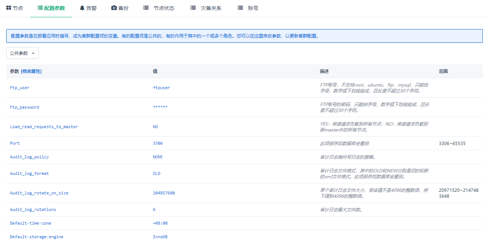

---
---

# QingCloud MySQL Plus 用户手册

## 描述

「QingCloud MySQL Plus」是一款具备金融级强一致性、主从秒级切换，集 InnoDB + TokuDB 双存储引擎支持的增强型 MySQL 集群应用。

- 多副本同步复制，确保金融级强一致性

「QingCloud MySQL Plus」采用一主两从的初始节点架构设计，并通过 MySQL 5.7 版本中的 semi-sync 特性实现数据的多副本同步复制，确保至少一个从节点与主节点始终保持数据的完全一致，提供金融级数据强一致性。多个从节点的设置将极大的屏蔽掉单点故障带来的影响，确保集群内始终有从节点保有全量数据。

- 主从秒级切换，确保业务高可用

节点之间使用 Raft 协议进行管理，当主节点出现故障不可用时，集群会秒级响应并选出新的主节点（与主节点数据完全同步的从节点），立即接管读写请求，确保业务的连续高可用。这一过程，用户完全无需关心后端集群中各节点的角色如何设置，一切由系统自动管理。


集群中最多可以添加 4 个从节点，主节点可读可写，从节点设置为只读。 同时，集群提供两个高可用读写 IP， 分别对应数据的读和写。 读 IP 可将请求在所有节点之间进行负载分担，也可以只在所有从节点进行负载分担。提供读取性能的同时，也消除了单点故障的影响，提供业务可靠性。写 IP 则始终指向主节点 （master）。


- 支持双存储引擎，优化存储成本

在支持原有 InnoDB 引擎的同时，「QingCloud MySQL Plus」同时支持 TokuDB 存储引擎。TokuDB 采用更先进的索引算法（Fractal Tree Indexing），实现更高的压缩比，帮助用户提升存储空间的利用率，从而降低存储成本。同样规模的数据量如果采用 TokuDB，相比 InnoDB，存储空间将降低大约一半。TokuDB 更适合用于需要大规模存储空间，但没有超大规模并发读取压力的使用场景，如大数据分析等。


- 系统自动运维，优化系统空间使用效率

用户可以对 binlog 日志的保留周期进行1到14天的自由配置。同时，主节点会自动定期清理掉不再使用的 binlog 日志(其他从节点已复制完毕)，提高系统的空间利用率。

**注解**：当前系统默认的日志保留时间为 7 天，可在**参数配置**页面通过`expire_logs_days`来修改


## 创建步骤

### 基本设置

这里可以填写集群的描述等信息。


计费方式可选小时和合约。若开启自动备份，则在每天指定时间段都会创建一次备份。

多可用区域将节点分散部署在不同区，可用性高。单可用区域将节点部署在同一个区，网络延迟最低。

**注解**：只有选择部署在『region』（比如北京三区）时，才可以选择部署方式。如果您选择『多可用区部署』，则集群所有节点将分散部署在当前region中的所有zone，反之，如果选择『单可用区部署』，则集群所有节点将部署在当前region中的某一个zone中。

### 节点设置

  可以选择基础型或者企业型 e2 主机的数据库，以及数据库的配置、磁盘大小。磁盘大小决定了数据库最大容量，您的数据和日志会共享这块磁盘。


**注解**：当节点总数为2时，将采用异步复制，而节点总数大于2时，将采用Semi-Sync复制，数据安全性更高。可支持的数据存储最大容量为 5T。

### 网络设置

数据库集群服务只能加入已连接路由器的私有网络，并确保该私有网络的 DHCP 处于『打开』状态。 使用一个数据库独享的私有网络的好处是方便您对其做『过滤控制』，同时也不影响其它私有网络的设置。

**注解**：此处展示的私有网络，其部署方式与[基本设置](###-基本设置)中选择的部署方式是一致的。也就是说，如果您选择的集群部署方式是多可用区部署，则只能看到多可用区的私有网络。关于如何在region创建VPC、私有网络，请参考[区域(region)与可用区(zone)](https://docs.qingcloud.com/product/region)。


### 服务环境参数设置

设置数据库服务的配置参数。


### 用户协议

阅读并同意青云AppCenter用户协议之后即可开始部署应用。

## 集群信息

### 基本属性

这里显示了集群的基本信息。


### 服务端口信息

集群提供两个高可用的读写IP，分别对应于数据的读和写。

- 读IP：可将请求在所有节点之间进行负载分担，提高读取性能，消除单点故障。

- 写IP：始终指向master节点。


**注解**: 务必使用读IP执行读请求，以将所有读请求按轮询方式分摊到所有节点；务必使用写IP执行写请求，以保证切主后不影响业务。

### 服务功能

点开基本属性旁边的下拉按钮，可以看到提供的服务功能。


### 节点列表

这里列出节点及其IP，可以使用这里列出的IP来下载同步的日志。同时显示了每个节点的服务状态。


**注解**：这里的IP仅供查询和下载同步的日志使用，不能做写入使用。


### 配置参数

这里列出了可以修改并持久化的配置参数。没有标注会重启服务的参数，都可以运行时修改，对服务没有影响。



**注解**：会自动重启服务的参数已经在描述中说明，请在业务低峰时进行修改。

**部分参数说明**：
> 1. `Ftp_user` 和 `Ftp_password`，点击同步日志后，需使用该账号下载节点上的日志，`Ftp_user` 在集群创建后不支持修改。
> 2. `Load_read_requests_to_master`，决定是否将读请求负载到 master 节点，默认为 `NO`，此时读请求只负载到 slave 节点。
> 3. `Audit_log_policy`，写审计日志的策略，提供 `ALL`、`LOGINS`、`QUERIES` 和 `NONE` 四种策略，默认为 `NONE`，此时不会记录审计日志。
> 4. `Audit_log_format`，审计日志文件格式，提供 `OLD`、`NEW` 和 `JSON` 三种格式，其中 `OLD` 和 `NEW` 分别为旧的和新的 XML 格式，注意修改该参数会自动重启服务。
> 5. `Audit_log_rotate_on_size`，单个审计日志文件大小，默认为 `100 MB`，范围为 `20 MB` ~ `2 GB`。
> 6. `Audit_log_rotations`，保留审计日志文件数量，默认为 `6`，在集群创建时和创建后均不支持修改。


### 监控告警

可以对集群节点配置告警策略，及时掌握集群的资源和服务状况。


### 备份恢复

可以对集群进行手动备份，也可以在集群列表页面右键选择备份时间进行自动备份。


如果需要从备份创建出一个独立于原有数据库服务的新数据库服务， 可以在详情页的『备份』标签下右键相应的备份点，再选择『从备份创建集群』即可。


**注解**：恢复集群时会保留原集群的数据库账号密码。

### 节点状态

展示节点角色信息。


### 灾备关系

展示灾备集群信息。


### 账号列表

展示已有账号信息。


## 服务功能概述

### 添加账号

要创建新账号时，需要指定账号密码和授权访问的数据库，创建成功后可查看 [账号列表](#账号列表)。


**注解**：

1. 系统保留 root 、qc_check 、 repl 账号来进行自动化运维和数据同步，请勿删除这三个账号，以免破坏系统的运行。
2. 如果加密认证选项为 `YES` 则需要开启 [SSL传输加密](#ssl传输加密) 后该用户才可以用于连接数据库。
3. 支持添加`高级权限`账户，但是，仅能创建一个。

### 删除账号

这里填写要删除的账号名。


### SSL传输加密

可选择是否开启 SSL传输加密，默认关闭。更多详细信息参考 [MySQL SSL](https://dev.mysql.com/doc/refman/5.7/en/creating-ssl-rsa-files.html)


**注解**：开启该服务后，需要在同 vxnet 主机获取证书。下载命令如下：
```
wget ftp://master_ip/ca.pem ftp://master_ip/client-cert.pem ftp://master_ip/client-key.pem --ftp-user=ftpuser --ftp-password=ftppassword
```

### 指定 Master 节点

需要填写指定为 Master 的节点ID。


**注解**：若指定节点非当前集群主节点，则先将当前主节点会设置为只读（时长秒级别），再进行切换。

### 增删节点

可以根据需要增加集群节点，如果是三节点集群，增加的节点数必须为偶数；如果是两节点集群可以增加一个节点变成三节点集群。添加节点的任务执行时间跟集群的数据量有关系，数据量大时，任务执行时间会久一些，添加节点不影响集群的读写。三节点集群可以删除一个非主节点，二节点集群不可以删除任意一个节点。


**注解**：删除节点时，如果当前节点是master节点则不能删除，需要重新选择节点删除。


### 扩容集群

可以对一个运行中的数据库服务进行在线扩容，调整CPU/内存/磁盘空间大小。


**注解**：扩容需要在开机状态下进行，扩容时链接会有短暂中断，请在业务低峰时进行。


### 同步日志

同步日志支持选择同步日志个数（保留六个日志文件），将 mysql-slow.log、mysql-error.log 和 mysql-audit.log 拷贝到系统的FTP目录，可以在内网下载到本地进行分析。


### 在线迁移

迁移服务可以将远端 MySQL 数据库的数据平滑迁移到 MySQL Plus 集群中。目前支持迁移的 MySQL 版本为 5.6~5.7。

**迁移说明：**

> 1. `在线迁移可将远端集群的数据迁移到当前集群。`
> 2. 在线迁移时，会去远端 MySQL 复制全量数据。
> 3. 需要提供远端 MySQL 具有 super 权限 和 复制权限 的账户，并且要求远端 MySQL 开启 GTID 模式。
> 4. 远端 MySQL 版本在 5.6 以下，可以参考[数据迁移方案](#数据迁移)进行迁移。
> 5. 迁移期间，可通过 高可用写 IP 查看同步状态。
> 6. 为了保护集群运维账户，该服务不会同步远端 MySQL 的用户，需要使用者迁移完成后添加远端 MySQL 用户信息到本集群中。
> 7. 迁移前在远端集群设置 `connect_timeout=30`；远端集群和本集群均设置 `max_allowed_packets=1G`、`slave_pending_jobs_size_max=1G`、`interactive_timeout=3600`、`wait_timeout=3600`、`net_read_timeout=1800`、`net_write_timeout=1800`。
> 8. 迁移期间远端集群不要执行 DDL 语句。
> 9. 迁移期间不要在本集群控制台执行任何操作，「 重启集群 」和「 更新参数 」功能会暂时禁用。其中，「 重启集群 」会执行失败，「 更新参数 」会延迟生效。
> 10. 迁移期间本集群主节点高可用功能会暂时失效，即若主节点发生故障则不会自动切换。
> 11. 第 9 和 10 条中暂时失效或禁用的功能，在「 结束迁移 」或关闭再启动集群后会自动生效或恢复。

**迁移步骤：**

> 1. 若原库与当前集群不在同一 VPC 下，使用 边界路由器（vpc board） 或 VPN ，打通原库与当前集群的网络。
> 2. 点击「 在线迁移 」，将原库 MySQL 账户名（要有 super 权限 和 复制权限）、密码、端口、IP 地址填入下图所示文本框，点击「 提交 」即开始迁移。
> 3. 等待「 在线迁移 」服务完成。服务执行完成后，当前集群就成功获取了原库的全量数据并与原库配置了主从关系，如此则可以持续同步原库增量数据到当前集群。
> 4. 选择合适时段，切换业务到当前集群（切换时，远端 MySQL 必须要停写以保证数据一致性）：
>
> ```
>   a) 停止原库的业务。
>
>   b) 校验当前集群与原库数据是否一致，若一致，则继续下一步。
>
>   c) 点击 「 结束迁移 」，会自动重启 MySQL 集群。
>
>   d) 将业务所连IP改为当前集群的VIP，恢复业务。
>
> ```


### 异地灾备

异地灾备功能支持将 MySQL Plus 集群作为另一个可用区的 MySQL Plus 集群的灾备集群，并且支持设置源集群永久只读或可写、灾备集群提升、数据回迁到源集群、停止灾备以及灾备集群上展示[灾备关系](#灾备关系)等功能。

**注意事项：**

> 1、关于「 启动灾备 」：
>
> ```
>   a) 「 启动灾备 」执行成功前，源集群不要执行 DDL 语句。
>     
>   b) 「 启动灾备 」执行成功后，灾备集群的主节点高可用功能会暂时失效，即主节点发生故障不会自动切换。
>
>   c) 「 启动灾备 」执行成功后，灾备集群的「 重启集群 」和「 更新参数 」功能会暂时禁用。（「 重启集群 」会执行失败，「 更新参数 」会延迟生效）
> ```
>
> 2、以上「 启动灾备 」后暂时失效或禁用的功能，在`灾备集群`「 停止灾备 」、「 提升灾备 」或关闭再启动集群后会自动生效或恢复。
>
> 3、「 停止灾备 」、「 提升灾备 」、关闭再启动集群都会使`灾备集群`不再从`源集群`同步数据。
>
> 4、`源集群`需提供具有 super 权限和复制权限的账户用于`灾备集群`「 启动灾备 」。
>
> 5、若想将数据从`灾备集群`回迁到`源集群`，则`源集群`需升级到 `1.5.6` 及以上版本。
>
> 6、若`源集群`非 QingCloud MySQL Plus 集群，需确保其 MySQL 内核版本为 `5.6` 或 `5.7`，且开启了 GTID 模式。
>
> 7、「 启动灾备 」前两个集群均设置 `connect_timeout=30`、`max_allowed_packets=1G`、`slave_pending_jobs_size_max=1G`、`interactive_timeout=3600`、`wait_timeout=3600`、`net_read_timeout=1800`、`net_write_timeout=1800`。

**操作步骤：**

> 1、若`源集群`与当前集群不在同一 VPC 下，可使用边界路由器（vpc board）或 VPN 等方式打通`源集群`与当前集群的网络。
>
> 2、在当前集群点击「 启动灾备 」，选择数据同步方式，填写如下图所示的`源集群`信息并提交，执行成功后当前集群即为`灾备集群`。
>
> ```
>   a) 若选择 全量+增量 同步方式，该集群会去源集群复制全量数据，并作为备库从源集群同步增量数据。
> 
>   b) 若选择 增量 同步方式，需确保该集群已有源集群的全量数据，例如该集群是基于源集群的最新备份创建的集群。
> ```
>
> 3、若在执行「 启动灾备 」后不想再作为`灾备集群`，或极端情况下想将业务强制切换到该集群，则在`灾备集群`上执行「 停止灾备 」即可。
>
> 4、若需将业务切换到`灾备集群`：
>
> ```
>   a) 先在源集群点击「 开关只读 」选择 ON 开启源集群永久只读。
> 
>   b) 在灾备集群上点击「 提升灾备 」。若检测到数据与源集群一致，会自动停止灾备并使该集群可写，反之则报错。
> 
>   c) 将业务连接数据库的地址改为灾备集群的 VIP，业务切换到灾备集群。
> ```
>
> 5、若`源集群`恢复后，想将业务切回去，需先回迁数据（将`源集群`作为`灾备集群`的灾备）：
>
> ```
>   a) 在源集群执行「 启动灾备 」，填写灾备集群信息。
> 
>   b) 在灾备集群执行「 开关只读 」选择 ON 开启灾备集群永久只读。
> 
>   c) 在源集群执行「 提升灾备 」，若检测到数据与灾备集群一致，会自动停止灾备并使该集群可写，反之则报错。
> 
>   d) 在源集群执行「 开关只读 」选择 OFF 关闭源集群永久只读以保证业务可写。
>   
>   e) 将业务连接数据库的地址改为源集群的 VIP，业务切换到源集群。
> ```


### 启动 Zabbix 客户端服务

提供了zabbix agent服务（zabbix 3.4），当启动该服务后，用户只需要直接在Zabbix Server的web界面添加主机即可。为了实现多维监控数据库，我们提供了[监控模板](https://releases-qs.pek3a.qingstor.com/zabbix/zbx_export_templates.xml?response-content-disposition=attachment)(点击即可下载到本地)。用户只需要将该模板导入到Zabbix Server即可正常使用。


### 监控

这里提供了每台主机的资源监控和服务监控。服务监控统计了SHOW GLOBAL STATUS中的信息，可用于定位分析数据库的性能。资源监控统计了主机的资源信息，如CPU使用率、硬盘IOPS情况等，可用于查看系统性能是否到达瓶颈。


## 数据迁移

「QingCloud MySQL Plus」的MySQL版本为5.7.20，且开启了 GTID 复制模式，因此从其他MySQL迁移数据时，需要通过导数据或者 MySQL Plus 支持的数据导入服务的方式来进行。

### 在线数据迁移

QingCloud MySQL Plus 1.4.4 - MySQL-5.7.20-18 以及以上版本可以支持[在线迁移服务](#在线迁移)。

### 数据导出

在源数据库端使用 mysqldump 将需要的内容导出到 dump.sql 文件，导出数据需要排除 mysql.user 表，且不导出 GTID 标识。
这里假设源数据库的IP地址为 192.168.0.100，导出语句为：

```bash
mysqldump --all-databases --single-transaction --triggers --routines --events  --host=192.168.0.100 --port=3306 --user=mysql_dev -p --ignore-table=mysql.user --ignore-table=mysql.db --ignore-table=mysql.tables_priv --set-gtid-purged=OFF > dump.sql
```

这里是导出了全部的数据，也可以选择导出部分数据库，更多详细使用方法请参考 [mysqldump](https://dev.mysql.com/doc/refman/5.7/en/mysqldump.html)。

### 数据导入

将上一步导出的 dump.sql 文件复制到一台能连接「QingCloud MySQL Plus」的主机后执行该 .sql 文件。
需要使用「QingCloud MySQL Plus」的高可用写IP来进行链接。假设高可用的写IP地址为 192.168.0.250，导入语句为：

```bash
mysql -umysql_dev -p -h192.168.0.250 < dump.sql
```

## 基准测试

为了模拟出产品环境真实的 OLTP 业务场景和压力， 我们采用了
[TPC-C](http://www.tpc.org/tpcc/)  这个专门针对 OLTP 系统的基准测试规范， 使用的 TPC-C 工具是
[Percona tpcc-mysql](https://www.percona.com/blog/2013/07/01/tpcc-mysql-simple-usage-steps-and-how-to-build-graphs-with-gnuplot/) ， 关于 TPC-C 规范的数据模型和测试运行方式可以参考
[TPC-C The OLTP Benchmark](http://www.tpc.org/information/sessions/sigmod/sld002.htm)

8核16G超高性能规格的数据库，50个 TPC-C 仓库，测试不同并发下的结果为：

| 100并发   | 200并发   | 300并发   | 400并发   |
|:---------:|:---------:|:---------:|:---------:|
| 27856.850 | 25413.051 | 23329.551 | 22488.449 |

其它规格数据库的基准测试建议您自己来做，以获得对测试数据最真实的第一手资料。

## RDB MySQL 文档

请访问[这里](../rdbs_mysql.html)


