---
---

# QingCloud PolonDB 用户手册


## PolonDB 简介

​    PolonDB 是基于 PostgreSQL 和 Citus 构建的一款 HTAP 分布式关系型数据库。

​	Citus 是 PostgreSQL 的扩展（not a fork），采用 shared nothing 架构，节点之间无共享数据，由协调器节点和 Work 节点构成一个数据库集群。相比单机 PostgreSQL，Citus 可以使用更多的 CPU 核心，更多的内存数量，保存更多的数据。通过向集群添加节点，可以轻松的扩展数据库。
​	Citus 支持新版本 PostgreSQL 的特性，并保持与现有工具的兼容 Citus 使用分片技术在多台机器上横向扩展 PostgreSQL。它的查询引擎将在这些服务器上执行 SQL 进行并行化查询，以便在大型数据集上实现实时的响应。


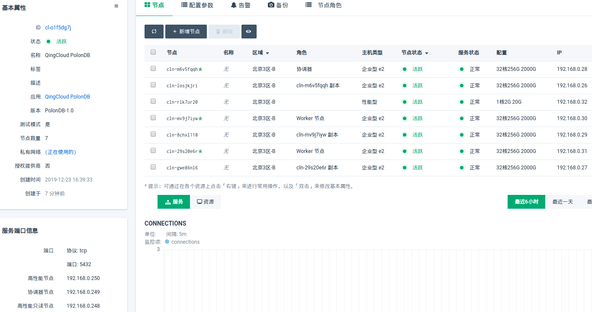


## PolonDB 快速入门

### PolonDB 节点介绍

PolonDB 在服务器端口信息栏，提供三个节点 IP

- 协调器节点

   可以执行任何 SQL 操作的节点

- 高性能节点

   不可以进行创建对象的操作，如： `create table/create view等 `

- 高性能只读节点

   不可以进行写入的操作

   > PolonDB 高阶使用，拥有更详细介绍


### PolonDB 业务编写

> 所有操作步骤均可以通过协调器节点执行

- 通过协调器节点创建一个普通表

   ```sql
   create table aa(id int)
   ```


- 通过协调器节点将普通表转换成分布式表

   ```sql
   select create_distributed_table('aa', 'id')
   ```


- 使用分布式表

   > 修改操作在协调器节点和高性能节点均可以执行，查询操作可以在高性能只读节点进行

   ```sql
   insert into aa select generate_series(1, 10000);
   select count(*) from aa;
   ```

   

- 使用视图

   > 在协调器节点执行

   ```sql
   create view view_aa as select * from aa;
   -- 只在协调器节点创建
   
   select run_command_on_workers($cmd$ create view view_aa as select * from aa $cmd$);
   -- 在所有节点创建
   ```

   > 可以通过任意节点查询视图

   ```sql
    qingcloud=> select count(*) from view_aa;
    count 
   -------
    10000
   (1 row)
   ```

- 使用函数

   > 在协调器节点执行

   ```sql
   CREATE FUNCTION func_aa(a int) RETURNS VOID LANGUAGE SQL AS $$ insert into aa values(1) $$;
   -- 只在协调器节点创建
   
   select run_command_on_workers($cmd$ CREATE FUNCTION func_aa(a int) RETURNS VOID LANGUAGE SQL AS $$ insert into aa values(1) $$ $cmd$);
   -- 在所有节点创建
   ```

   > 在非高性能只读节点执行

   ```sql
   select func_aa();
   ```

   > 在任意节点执行

   ```sql
   qingcloud=> select count(*) from aa;
    count 
   -------
    10001
   (1 row)
   ```

   

## PolonDB 详细介绍

### PolonDB 架构

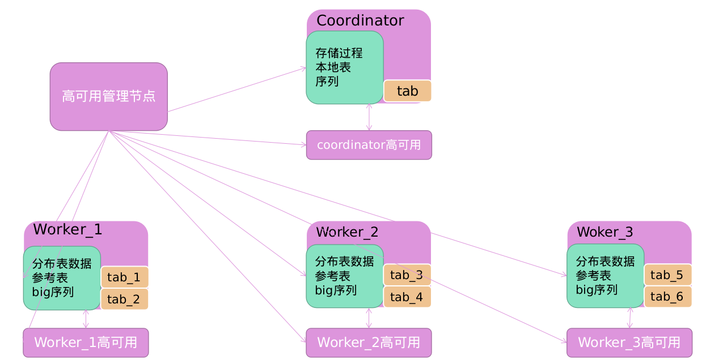


- 协调器和 Worker 节点均通过 PostgreSQL 流复制做了高可用

- 高可用管理节点负责高可用的管理和故障转移等功能

- 协调器将 `tab` 表进行分片，表的实际数据存储在 `tab_x` 中， `tab` 表不存储任何数据


### PolonDB 各项指标

#### PolonDB 性能指标

##### TPC-C 标准性能

测试环境：qingcloud 公有云[北京三区]

测试规格：企业型 e2

cpu：32 核心

内存：64G

存储类型：企业级存储

测试工具：benchmarkSQL 5.0

TPMC：每分钟事务处理数

仓库数量：5000

磁盘数据量：530G

测试时长：10 分钟

模拟环境：模拟实际生产环境的数据可用性（polondb 默认设置）

节点数量：1 协调器 + 4 Worker 节点 + 1 benchmarkSQL 节点

* TPMC 性能数据

| 连接数 | PolonDB | PostgreSQL 单机 |
| :---- | :------ | :------------- |
| 100 | 8.2万（82374.26） | 5.3万（53326.85） |
| 200 | 9.9万（98180.61） | 4.6万（46151.3） |
| 400 | 9.7万（97623.09） | 3.4万（34089.88） |
| 800 | 8.5万（85497.77） | 1.9万（19651.36） |

##### TPC-B 标准性能

测试环境：qingcloud 公有云[北京三区]

测试规格：企业型 e2

cpu：32 核心

内存：64G

存储类型：企业级存储

测试工具：pgbench (原始模式，未作任何提升性能的修改)

TPMC：每分钟事务处理数

QPM：每分钟查询数

数据量：30 亿条

磁盘数据量：400G

测试时长：10 分钟

模拟环境：模拟实际生产环境的数据可用性（polondb 默认设置）

节点数量：1 协调器 + 8 Worker 节点 + 1 pgbench 节点

* TPMC 性能数据

| 连接数 | PolonDB          | PostgreSQL 单机   |
| ------ | ---------------- | ---------------- |
| 200    | 52.0 万（520440） | 12.4 万（124680） |
| 400    | 54.7 万（547020） | 14.0 万（140160） |
| 800    | 61.4 万（614160） | 13.8 万（138360） |
| 1000   | 59.7 万（597120） | 9.2 万（92100）   |

* QPM 性能数据

| 连接数 | PolonDB （只读节点可以充分发挥硬件加倍查询性能） | PostgreSQL 单机   |
| ------ | ----------------------------------------------- | ---------------- |
| 200    | 351.7 万（3517320） + 只读节点 = 703.4 万         | 15.8 万（158940） |
| 400    | 386.9 万（3869700） + 只读节点 = 773.3 万         | 16.2 万（162720） |
| 800    | 355.2 万（3552060） + 只读节点 = 710.4 万         | 16.5 万（165300） |
| 1000   | 339.5 万（3395460） + 只读节点 = 679.0 万         | 16.3 万（163860） |

* 4 个 Worker 节点数据

| 测试项          | PolonDB          |
| --------------- | ---------------- |
| 800 连接（TPMC） | 32.3 万（323340） |
| 800 连接（QPM）  | 94.2 万（942600） |


#### PolonDB 弹性数据

* 节点数量

  2 - 64 个节点区间可供选择

* 内存数据

  最大支持 16T 内存

* CPU 数据

  最大支持 4096 个 CPU

* 存储数据

  最大支持 3.2PB 存储

* 数据库连接数

  - 协调器节点

     max_connections 参数值为最大支持的连接数

  - 高性能节点/高性能只读节点

     max_connections × 节点数量 / 2 = 最大支持连接数（估算值）

     > 连接数的可用性与业务特征有关，例如较为复杂的查询业务，会消耗更多的连接给 PolonDB 内部使用
     >
     > 纵向扩容增加内存可以自动提升连接数

### PolonDB 高可用

* PolonDB 默认采用半同步模式

  当集群正常时，采用同步模式运行。当备机出现异常时，会自动转换成异步模式。当备机恢复正常时，再次自动转换为同步模式。

* 使用异步模式

  设置参数 `synchronous_commit = local` 可以变成异步模式。

  > 异步模式的数据安全性比较低，有数据丢失风险

### PolonDB 修改参数

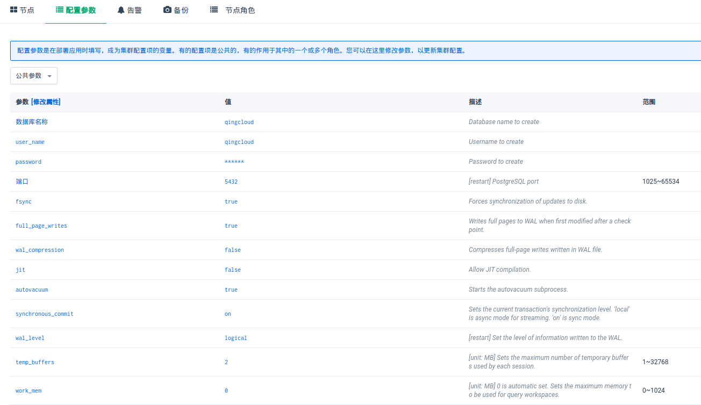

* 需重启的参数

  需重启生效的参数由 `[restart]` 进行标识

* 参数单位

  参数单位由 `[unit: MB]` 进行标识

* 自动设置的参数

  自动进行最优设置的参数由 `[0 is automatic set.]` 进行标识

### PolonDB 分布式表

* 本地表

  在协调器节点由 `create table ` 创建的普通表

* 分布式表

  在协调器节点经 `create_distributed_table('table', 'column')` 处理过的本地表， `table` 需要转换成分布式的表， `column` 根据该列进行hash运算并进行分片

  > 分布式表的数据通过分布式列的 hash 进行计算，将数据存储到不同的分片表中
  >
  > 业务应使用此种表类型

* 参考表

  在协调器节点经 `create_reference_table` 处理过的本地表

  > 参考表在所有 Worker 上拥有相同的数据

### PolonDB 扩容缩容

#### PolonDB 纵向扩容缩容

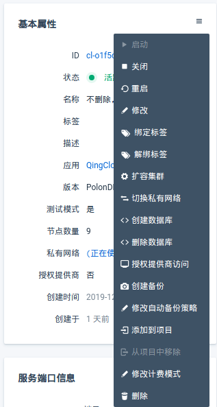

* 点击 `扩容集群` ，并根据提示进行扩容

#### PolonDB 横向扩容缩容

##### 前提条件

- `wal_level` 需设置为 `logical` （默认 `replica` ）。
- `logical_replication_polondb` 需设置为 `true` （默认 `true` ）

##### 扩容方法

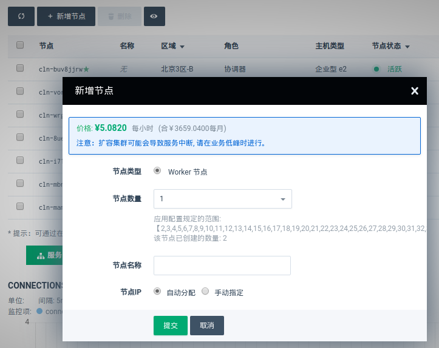

点击 `新增节点` ，输入需要新增加的节点数量即可新增 Worker 节点。

##### 缩容方法

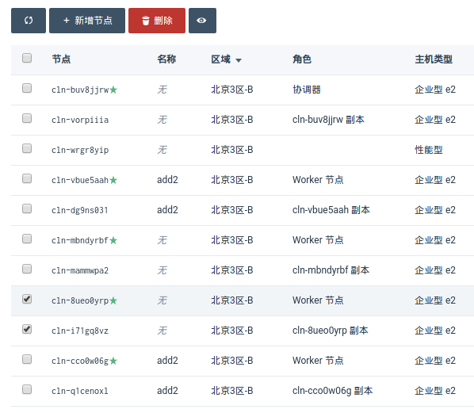

选择需要删除的节点，点击 `删除` 即可，主节点与副本节点需同时选中，只能删除 Worker 节点。

##### 扩容缩容的影响
在扩容缩容运行的期间会对业务造成极其微小的影响，以提供其最大可用性，具体如下:

- 极其微短的时间会提示表不存在的错误。
- 可能会提示连接异常断开的错误。

##### 特殊操作说明
###### 配置组

PolonDB 会逐表进行处理，因此表的处理都是独立的

- 当需要将两个业务相关表同时处理，以降低最小影响时。

```sql
-- 在协调器节点 postgres 库操作

insert into qc_rebalance_params(dbname, group_table) values ('qctest', '1-public.a, 1-public.b, 2-public.c, 2-public.d')
insert into qc_rebalance_params(dbname, group_table) values ('qctest', '3-public.e, 3-public.f, 3-public.g')

-- 我们在 qctest 库下配置了'1' '2' '3'三个组，‘1’组由 public.a 和 public.b 组成，'2'组由 public.c 和 pulic.d 组成，‘3’组由 public.e 和 public.f 和 public.g 组成
```


###### 处理顺序优先级

PolonDB 会逐表进行处理，因此表的处理顺序会有先后之分

- 当需要优先处理重要的表，以降低最小影响时，可以配置优先级

```sql
-- 在协调器节点 postgres 库操作
insert into qc_rebalance_params(dbname, priority_table) values ('qctest', '1-public.a, 1-public.b, 2-public.c, 3-public.d)

-- 我们在 qctest 库下配置了‘1‘ ’2‘ ’3‘个优先级（1的优先级最高，以此类推），同样优先级的情况下前表的优先级高于后表（ public.a 的优先级高于 public.b )
```

### PolonDB 监控

#### 数据库指标监控

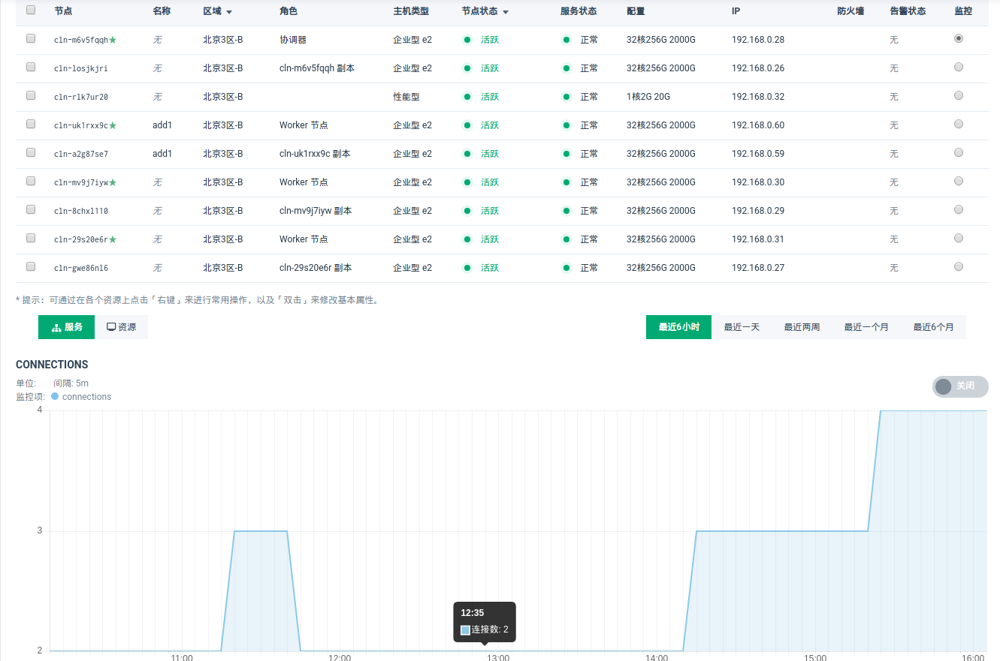

* 在 `监控` 栏选择需要监控的节点，点击中间 `服务` 按钮即可查看连接数和事务提交数

#### 数据库主机资源监控

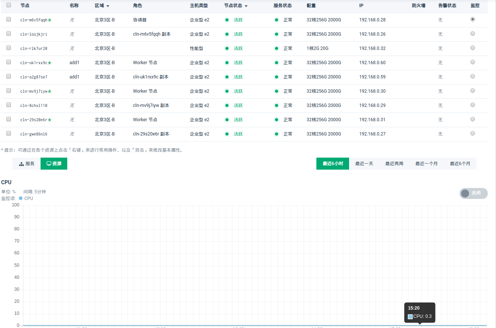

* 在 `监控` 栏选择需要监控的节点，点击中间 `资源` 按钮即可查看 CPU/内存等计算机资源

### PolonDB 日常操作

#### 启动


* 点击 `启动` 按钮

#### 关闭


* 点击 `关闭` 按钮

#### 重启


* 点击 `重启` 按钮

#### 切换私有网络


* 点击 `切换私有网络` 按钮，根据提示进行

  > 切换私有网络会重启集群

### PolonDB 节点角色

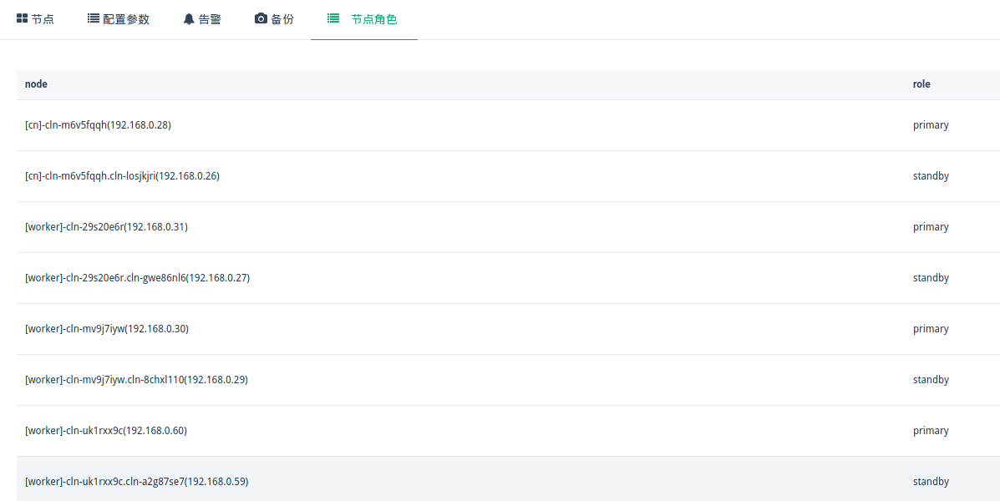

* 点击 `节点角色` 即可查看，通过 `node` 列可以查看到集群的从属关系，通过 `role` 列可以查看到角色状态。

* 角色状态

  -  `primary` ：主节点
  -  `standby` ：备节点
  -  `unknown` ：获取节点状态失败

> 带有 `副本` 标识的节点并不代表 PolonDB 集群的备节点，仅代表节点是一个组

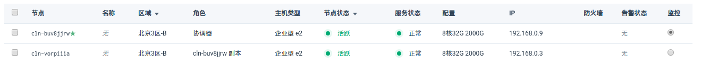

### PolonDB 备份恢复

#### 自动备份集群

* 在集群创建的时候指定自动备份策略。

* 在集群创建后，点击 `修改自动备份策略` 后，选择合适的时间即可。

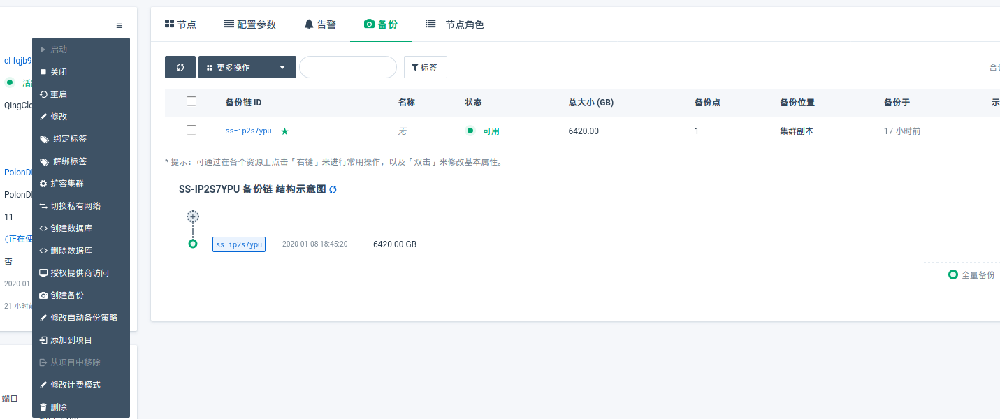

#### 手动备份集群

查看上图，点击 `创建备份` ，即可弹出备份窗口

> 当集群节点变化，或是增量备份链达到 30 个后，会自动进行全量备份（创建新备份链），增量备份可以节省很多磁盘
>
> PolonDB 在备份的时候，可能会对业务的写入产生短暂的阻塞影响，建议在业务低峰期进行

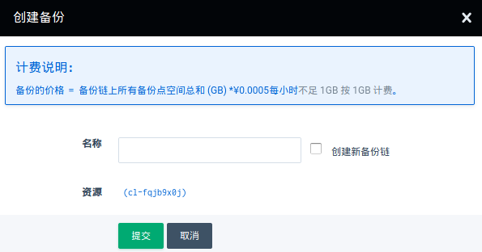

#### 恢复集群

选择所需恢复的备份，点击 `从备份创建集群` 即可

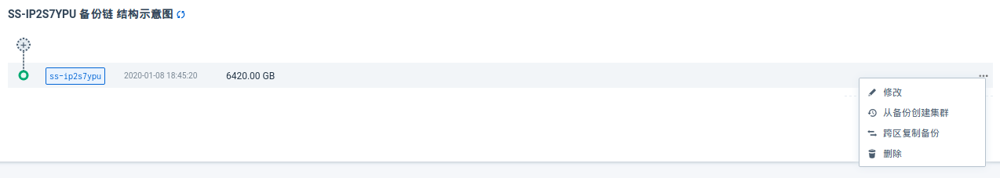


### PolonDB 数据库用户

* 初始化用户

  创建集群时默认创建 `qingcloud` 用户（配置参数 `user_name` 可以配置用户），该用户具有 `create user ` 权限，没有 `DBA` 权限（ 在分布式数据库中 `DBA` 权限可以修改集群间的关系，导致集群不能自动进行云服务化）。

* 新建数据库用户

  可以通过初始化用户创建新的用户。

  > 在协调器创建用户的同时，注意使用 run_command_on_workers 为 Worker 创建用户

### PolonDB 创建数据库


* 点击 `创建数据库` 按钮，根据提示输入数据库的所有者和要创建的数据库名即可
  - 数据库所有者必须在所有节点已经存在
  - 所需创建的数据库在任何节点均不存在

### PolonDB 删除数据库


* 点击 `删除数据库` 按钮，输入需要删除的数据库即可


### PolonDB 数据库日志

PolonDB 提供最近 7 天的数据库日志

* 连接所要查看节点的 `postgres` 库，通过查询表的方式即可。

```sql
postgres=> \d
                 List of relations
 Schema |      Name      |
--------+----------------+
 public | postgresql_fri
 public | postgresql_mon
 public | postgresql_sat
 public | postgresql_sun
 public | postgresql_thu
 public | postgresql_tue 
 public | postgresql_wed 

```

### PolonDB 误操作数据找回

PolonDB可以找回 `update` `delete` `drop column` `rollback` 的数据。

- 准备数据

  ```sql
  -- 创建测试表
  test=# create table qc(id int, id1 int);
  CREATE TABLE
  test=# select create_distributed_table('qc', 'id');
   create_distributed_table 
  --------------------------
   
  (1 row)
  
  -- 创建误操作数据找回表，找回的数据将存储到该表中，该表不需要创建主键外键等等，只需要最基础的表结构保持一致。
  test=# create table recovery_qc as select * from qc with no data;
  CREATE TABLE AS
  test=# select create_distributed_table('recovery_qc', 'id');
   create_distributed_table 
  --------------------------
   
  (1 row)
  
  -- 确认两个表是共址表：colocationid的数值一致。
  test=# select colocationid from pg_dist_partition where logicalrelid='qc'::regclass or logicalrelid='recovery_qc'::regclass;
   colocationid 
  --------------
              1
              1
  (2 rows)
  
  ```

  

- 找回 `update` `delete` `rollback`的数据

  ```sql
  ----------------------
  -- 找回 delete 的数据，update/rollback 的恢复操作与 delete 一样，这里不再演示
  ----------------------
  -- 准备测试数据
  test=# truncate qc, recovery_qc;
  TRUNCATE TABLE
  
  test=# insert into qc(id) values(1), (2), (3), (4);
  INSERT 0 4
  
  test=# select * from qc;
   id | id1 
  ----+-----
    1 |    
    3 |    
    4 |    
    2 |    
  (4 rows)
  
  test=# delete from qc;
  DELETE 4
  
  test=# insert into qc values(5);
  INSERT 0 1
  
  test=# select * from qc;
   id | id1 
  ----+-----
    5 |    
  (1 row)
  
  test=# select * from recovery_qc;
   id | id1 
  ----+-----
  (0 rows)
  
  -- 开始恢复操作，需要将表的结构 “id int, id1 int” 填写到 pg_recoverydata 后边
  -- recovery_qc 表中只会存储
  test=# SELECT run_command_on_colocated_placements(
    'recovery_qc',
    'qc',
    $cmd$
      insert into %s select * from pg_recoverydata('%s') as t(id int, id1 int)
    $cmd$
  )
  ;
  
  -- qc 表的数据已经被 delete 操作删除掉了，新插入的 5 依然存在
  test=# select * from qc;
   id | id1 
  ----+-----
    5 |    
  (1 row)
  
  -- recovery_qc 表恢复出来了 qc 表原来删除的数据
  -- pg_recoverydata('%s'， recoveryrow => false) 可以将 qc 表的现有数据（例如 5 ）也还原到recovery_qc中
  -- pg_recoverydata('%s'， recoveryrow => false) as t(id int, id1 int，recoveryrow bool )，会增加一个recoveryrow列用于标识哪些数据是恢复出来，同样recover_qc 表也要增加 recoveryrow bool类型的结构。
  test=# select * from recovery_qc;
   id | id1 
  ----+-----
    1 |    
    4 |    
    3 |    
    2 |    
  (4 rows)
  ```

  

- 找回 `drop column` 的数据

  ```sql
  -- 清空测试数据
  test=# truncate table qc, recovery_qc;
  TRUNCATE TABLE
  test=# insert into qc(id, id1) values(1,11), (2,22), (3,33), (4,44);
  INSERT 0 4
  test=# alter table qc drop column id1;
  ALTER TABLE
  
  -- 在 drop column 后插入一个 5 的数据
  test=# insert into qc values('5');
  INSERT 0 1
  test=# select * from qc;
   id 
  ----
    1
    5
    4
    3
    2
  (5 rows)
  
  -- 我们需要恢复 id1 列的数据，因此 recovery_qc 中存在 id1 的列
  test=# select * from recovery_qc;
   id | id1 
  ----+-----
  (0 rows)
  
  -- 开始恢复数据， 通过系统表可知 attnum 为 2 的列被删除了
  test=# select attnum from pg_attribute, pg_class where attrelid = pg_class.oid and pg_class.relname='qc' and attname ~ 'dropped';
   attnum 
  --------
        2
  (1 row)
  
  -- 开始恢复数据， pg_recoverydata后的数据 id int, dropped_attnum_2 int 中，dropped_attnum_2 代表恢复attnum是2的数据。
  test=# SELECT run_command_on_colocated_placements(
    'recovery_qc',
    'qc',
    $cmd$
      insert into %s select * from pg_recoverydata('%s') as t(id int, dropped_attnum_2 int)
    $cmd$
  );
  
  -- 查看恢复后的数据
  test=# select * from qc;
   id 
  ----
    1
    5
    4
    3
    2
  (5 rows)
  
  -- 恢复列的时候会将原表的所有数据都向恢复表中存储一份，例如 5 的数据
  test=# select * from recovery_qc;
   id | id1 
  ----+-----
    1 |  11
    5 |    
    4 |  44
    3 |  33
    2 |  22
  (5 rows)
  
  ```

  

PolonDB默认可以找回最近至少 `10000` 个事务内的数据，可以通过修改参数进行控制找回数据数据的多少。


## PolonDB 高阶使用

PolonDB 基于 Citus 构建，因此参阅 Citus 相关文档可以更快速的了解 PolonDB 的使用

### PolonDB 登录节点选择

- 协调器节点

   协调器节点可以当作运维节点，创建用户/视图/函数的操作。当然也可以作为业务节点使用，但是性能不如高性能节点，适合业务较小的场景。

   - 创建视图示例：

   ```sql
   -- psql -h 协调器节点
   create view v_aa as select * from aa;
   select run_command_on_workers($cmd$ create view v_aa as select * from aa $cmd$);
   ```

   > 大对象相关内容需使用此节点
   >

- 高性能节点

   不可以进行创建对象的操作，拥有超高连接数/超高性能的节点，适合较大并对数据性能要求较高的业务。

   > 业务较大时，青云建议使用此节点

- 高性能只读节点

   可以充分发挥 PolonDB 硬件资源的利用率，可以做查询分析使用


### run_command_on_workers

在所有 worker 节点执行该指令

```sql
select run_command_on_workers($cmd$ create view v_aa as select * from aa $cmd$);
```

> 例如创建视图的 sql 不会自动传输到 Worker 节点，因此需要使用该指令在 Woker 进行创建

### run_command_on_shards

在所有分片上执行

```sql
select run_command_on_shards('aa', 'vacuum %s');
```

> 在 `aa` 表的所有分片上执行vacuum， `%s` 将会替换成 `aa` 的分片表


## PolonDB 迁移

### 小型 PostgreSQL 数据库迁移

对于可以容忍一点停机时间的小型环境，请使用简单的 pg_dump / pg_restore。

* 创建数据库用户

  > 参见上一章节

* 创建数据库

  > 参见上一章节

- 从旧数据库中保存数据库结构

```shell
pg_dump \ 
   --format = plain \ 
   --schema-only \ 
   --file = schema.sql \ 
   --schema = target_schema \ (可选)
   postgres：// user：pass @ host ：5432 / db
```

- 使用 psql 连接到 PolonDB 集群并创建结构：

```
\ i  schema.sql
```

- 运行 `create_distributed_table` 和 `create_reference_table` 语句。如果您收到有关外键的错误，通常是由于操作顺序。可以先删除外键，然后重新添加它们。
- 将应用程序置于维护模式，并禁用对旧数据库的任何其他写入。
- 使用 pg_dump 将原始生产数据库中的数据保存到磁盘：

```shell
pg_dump \ 
   --format = custom \ 
   --data-only \ 
   --file = data.dump \ 
   --schema = target_schema \ （可选）
   postgres：// user：pass @ host ：5432 / db
```

- 使用 pg_restore 导入 PolonDB：

```shell
pg_restore   \ 
   --host = host \ 
   --dbname = dbname \ 
   --username = username \
   data.dump
```

- 测试应用。

- 迁移完成，启动应用

### 大型 PostgreSQL 数据库迁移

大型数据库迁移，**可以不间断原旧数据库的中应用**，平滑的迁移到 PolonDB 集群中。

- 参考 `小型数据库迁移` 的 `create_distributed_table` 内容部分创建数据库对象。

  - 在迁移过程中旧数据库不可以进行 DDL 操作，只可以进行 DML 和 TRUNCATE 操作。


  - 建议需要迁移的表拥有主键。


  - 无主键的表在旧数据中执行 `alter table xx replica identity full ` 语句。

- 连通旧数据库与 PolonDB 集群之间的网络，确保 PolonDB 集群可以连接到旧数据库。

- 通过工单或销售人员与我们联系获取 qingcloud_decoding.so 的动态库并存储到 PostgreSQL 的 lib 目录中，我们会适配您当前的环境，提供一个相应版本的动态库，同时也会生成您的唯一标记，该库仅供您使用不可提供给他人。

- 设置旧数据库参数并重启数据库

   ```sql
   -- postgresql.conf
   wal_level=logical
   -- pg_hba.conf
   host	all		all		0.0.0.0/0		md5
   host	replication	all		0.0.0.0/0		md5
   ```

- 启动 PostgreSQL 迁移

   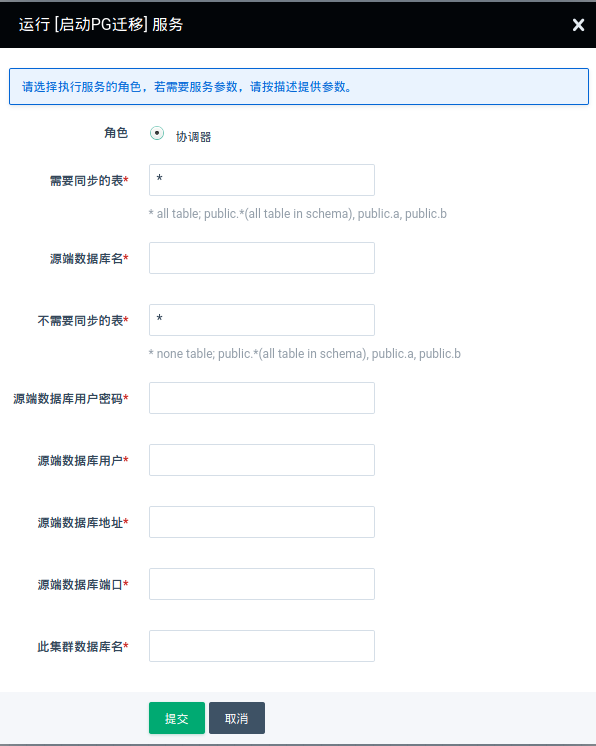

   - 需要同步的表

      `*` 代表同步该库下所有的表。 `public.*` 代表同步 public 模式下所有的表。 `public.aa, public.bb` 代表同步这两个表。

   - 源端数据库名

      从源端该库进行迁移

   - 不需要同步的表

      `*` 代表没有不需要同步的表。 `public.*` 代表不同步 public 模式下所有的表。 `public.aa, public.bb` 代表不同步这两个表。

   - 源端数据库用户

      此用户需是超级用户或是拥有 replica 角色权限的用户。**超级用户更方便些**

   - 源端数据库用户密码

   - 源端数据库地址

   - 源端数据库端口

   - 此集群数据库名

     迁移到 PolonDB 的该库中。
  
- 检验数据正确性

- 根据应用特征手动设置序列值

- 测试应用

- 迁移完成，迁移应用，启动应用。

- 停止 PostgreSQL 迁移

  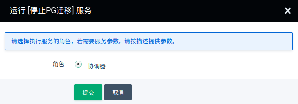

> 大型数据库迁移仅针对旧数据库是 PostgreSQL 10 及以上版本，或是 PostgreSQL 9.4 以上版本并安装 logical_decode 插件。
>

### PostgreSQL 大对象迁移

含有大对象表的迁移，参考 `小型数据库迁移` 方法进行。

 

