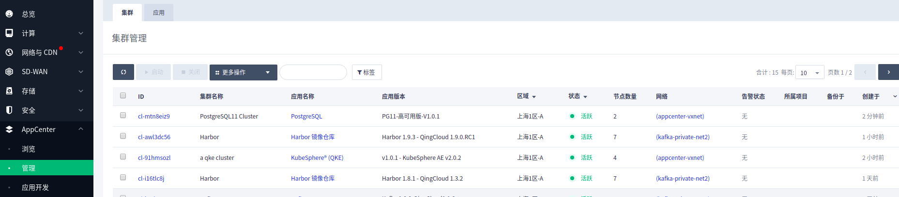
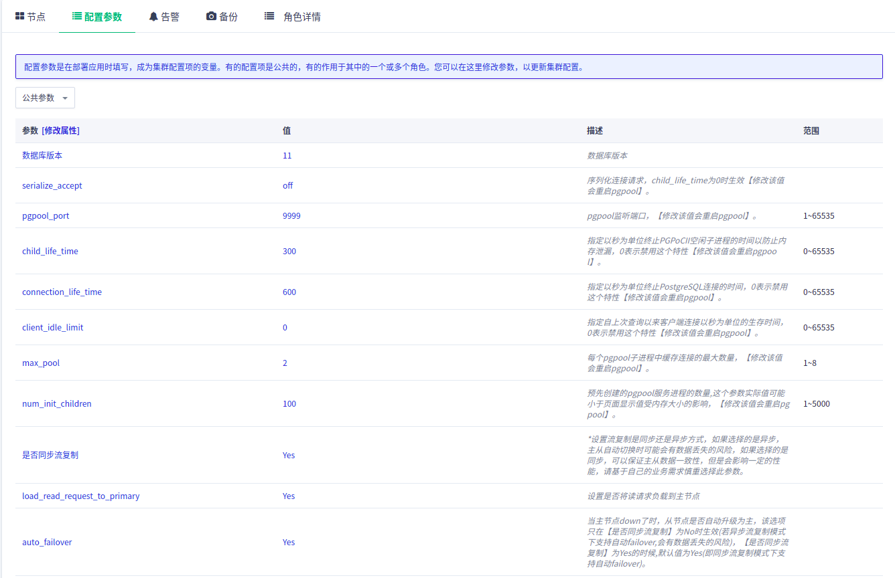

---
---

# PostgreSQL on QingCloud AppCenter  用户手册

## 描述

`PostgreSQL on QingCloud AppCenter` 将 PostgreSQL 通过云应用的形式在 QingCloud AppCenter 部署，具有如下特性：

- 目前提供基础版和高可用版服务，分别满足开发测试和生产环境下的数据库服务需求。
- 高可用版可在主实例主从架构的基础上创建读写分离实例和最多5个只读实例。
- 主实例的从节点以及只读实例都可以提供读服务，可以通过高可用读IP或者读写分离Proxy IP将读请求轮询负载到这些节点。
- 高可用版服务支持自动 Failover ，提供HA功能。
- 提供 PostgreSQL 大部分常用参数修改接口，方便调整参数。
- 支持 PostGIS 插件，为 PostgreSQL 提供了存储、查询和修改空间关系的能力。
- 提供实时监控、健康检查、日志自动清理等功能，方便用户运维。
- 一键部署，开箱即用。


## 简介

[PostgreSQL](https://www.postgresql.org/) 是业界最先进的开源数据库系统。经过长达 15 年以上的积极开发和不断改进，PostgreSQL 已在可靠性、稳定性、数据一致性等获得了业内极高的声誉。作为一种企业级数据库，PostgreSQL 以它所具有的各种高级功能而自豪，像多版本并发控制 (MVCC)、按时间点恢复 (PITR)、表空间、异步复制、嵌套事务、在线热备、复杂查询的规划和优化以及为容错而进行的预写日志等。它支持国际字符集、多字节编码并支持使用当地语言进行排序、大小写处理和格式化等操作。它也在所能管理的大数据量和所允许的大用户量并发访问时间具有完全的高伸缩性。

## 版本描述

目前提供基础版和高可用版 2 个版本服务：

- 基础版：提供单节点数据库服务（PostgreSQL 11 不提供基础版）。
- 高可用版：采用一主一从的经典高可用架构，提供数据库高可用保障服务。主从节点可以通过修改配置参数设置同步流复制或者异步流复制模式。

适用场景：

- 基础版适用于个人研究学习、开发测试场景。
- 高可用版面向企业生产环境，适用于大中型企业核心生产库。

PostgreSQL on QingCloud AppCenter 支持如下版本:

- PostgreSQL 9.6.3 版本，PostGIS 插件的版本是 PostGIS 2.3
- PostgreSQL 10.1 版本，PostGIS 插件的版本是 PostGIS 2.4
- PostgreSQL 11.1 版本，PostGIS 插件的版本是 PostGIS 2.5

## `PostgreSQL on QingCloud AppCenter` 的具体使用

### 创建步骤

基础版和高可用版的创建步骤类似，以下以 `PG11-高可用版-V1.0.1` 为例说明创建步骤。

#### 基本设置  


根据自己的需求填写 `应用名称` 和 `应用描述`，选择 `版本` 为 `PG11-高可用版-V1.0.1` ，可以选择不同的资源配置类型和计费方式。

#### 网络设置


出于安全考虑，所有的集群都需要部署在私有网络中，选择自己创建的网络中。

#### 参数设置


界面提供的参数大部分和 PostgreSQL 性能相关，如果需要调整相关参数，可以按照自己的实际需求配置和调整相关参数，修改部分参数会导致 PostgreSQL 服务重启，具体可以参考参数说明。

在配置高可用版本参数时，会比单节点版本的设置多出如下一个参数。
该参数用于设置主从复制模式是同步流复制还是异步流复制，默认是同步流复制。


 >注意：
 `PostgreSQL on QingCloud AppCenter` 在初始化的时候，会根据服务器参数中用户输入的数据库名称，数据库用户，和数据库密码创建数据库账户。同时，为了方便用户维护，会自动创建数据库超级用户 (superuser) root，密码和用户在服务器参数中设置的数据库密码相同。

#### 用户协议  

阅读并同意青云 AppCenter 用户协议之后即可开始部署应用。


### 集群操作  

#### 查看集群信息  

在集群创建完毕后，可以在控制台 `Appcenter -> 管理` 标签下看到目前已经创建的集群信息。

 集群列表


 点击集群 ID 可以查看该集群的详细信息


 集群基础资源监控信息


 集群节点监控信息


#### 修改配置参数

  点击`配置参数`可以修改 `PostgreSQL 参数` ，修改部分参数会导致 PostgreSQL 服务重启，具体可以参考参数说明。
  

#### 查看当前主节点

  点开集群的`角色详情` tab 页即可查看。
  

#### 扩容集群

  可以在集群性能不足时提高集群的配置：

  点击集群自定义服务-->扩容集群。
  

  

#### 创建只读实例

  点击新增节点-->选中 `只读实例` 。
  

#### 创建读写分离 Proxy 实例

  点击新增节点-->选中 `proxy 实例` 。
  

#### 重建从节点

  当出现从节点复制异常的情况下，可以通过重建从节点修复：

  点击集群自定义服务-->重建从节点。
  

#### 切换私有网络 

  当需要改变集群节点 IP 或者改变私有网络时，可以通过 `切换私有网络` 服务来操作：

  点击集群自定义服务-->切换私有网络。
  

#### 服务端口信息

集群提供三个高可用 IP ：

- 高可用写 IP ：始终指向 Primary 节点。

- 高可用读 IP ：可将请求在所有节点之间进行负载分担，提高读取性能，消除单点故障。

- 高可用 Proxy IP ：始终指向 Proxy 实例的 Primary 节点。

     

#### 启动 Zabbix 客户端服务

  提供了zabbix agent服务（zabbix 4.2.8），当启动该服务后，用户只需要直接在Zabbix Server的web界面添加主机即可。请前往zabbix官方下载[监控模板](https://git.zabbix.com/projects/ZBX/repos/zabbix/browse/templates/db/postgresql)。

  

### 数据库基本操作

#### 登录 PostgreSQL DB

通过 psql 命令行客户端 ，用新建集群步骤中定义的数据库用户名和密码，连接到新创建的自定义的 PostgreSQL database 。
输入命令：`psql -U qingcloud -h 192.168.100.246 -d qingcloud`
>-U 参数值是上图的服务器参数：数据库用户名，  
-h 参数值是postgresql节点的IP或者是双节点集群的VIP，  
-d 参数值可以是上图服务器参数:数据库名称。    
然后输入的密码是上图服务器参数：数据库密码。  

输入命令：`\l`， 可以查看当前 PostgreSQL server 上的数据库信息。  
    

除了用 psql 命令行客户端连接数据库之外，还可以使用自己熟悉的其他图形化的数据库客户端连接到 PostgreSQL DB 上，方便做数据库操作以及数据库开发等工作。  
例如：pgAdmin 、DbVisualizer 、DBeaver 等。

#### PostgreSQL 数据导出和导入  

##### 数据导出

命令：  
`pg_dump -U root -h 需要导出数据的 DB 的 IP  (-t 表名)  数据库名(缺省时同用户名)  > 路径/文件名.sql`  
例如：`pg_dump -U qingcloud -h 192.168.100.246 qingcloud  > /tmp/pgdatabk.sql`
  

##### 数据导入

###### 方式一：从文件导入数据

命令：
`psql -d databaename(数据库名) -U username(用户名) (-h 需要导入数据的DB的IP) -f < 路径/文件名.sql`   
>注意这里导入的时候请使用root用户，以防止权限不够导入数据有问题,数据库root用户的密码与新建数据库时的用户命名相同。     
如果有需要，导入数据时先创建数据库再用psql导入：
`createdb newdatabase;`
这里直接导入用户在创建集群时创建的数据库名称为qingcloud

例如：
`psql -d qingcloud -U root -h 192.168.100.6 -f /tmp/pgdatabk.sql`


###### 方式二：在线导入数据

pg_dump 和 psql 读写管道的能力使得直接从一个服务器转储一个数据库到另一个服务器成为可能。
命令：  
`pg_dump -h host1 dbname | psql -h host2 dbname`
例如：

```bash
export PGPASSWORD=qingcloud1234
#PGPASSWORD为用户新建集群设置的数据库密码
pg_dump -U qingcloud -h 192.168.100.246 qingcloud -w | psql -d qingcloud -U root -h 192.168.100.6 -W
```


##### 数据 check

导入完成后可以使用 select 语句进行检查。   
例如：`select * from t_user; `


#### 查看 PostgreSQL 运行日志   

为了方便用户获取 PostgreSQL 的运行日志， `PostgreSQL on QingCloud AppCenter` 默认开启了 FTP 服务，您可以通过 FTP 来获取 PostgreSQL 的日志，用户名为 ftp_pg ，默认密码为 Pa88word。  
在任何一台装有 ftp 客户端的 host 上，通过以下 ftp 命令可以获取到日志，其中 IP 对应 PostgreSQL 节点所在的 IP 地址。

```bash
ftp 192.168.100.13
ls
exit
wget ftp://192.168.100.13/postgresqllog_24.csv --ftp-user=ftp_pg --ftp-password=Pa88word
```


>注意:    
>PostgreSQL 的日志默认保存30天，每天会自动保存一个日志文件,系统会自动清理。日志的命名规则为postgresqllog_30.csv，数字表示当前日期在当月的第多少天。

#### PostGIS 插件的使用

##### 查看 PostGIS 插件信息

登录 PostgreSQL DB后，输入以下命令即可查看 PostGIS 插件信息。

```sql
SELECT name, default_version,installed_version
FROM pg_available_extensions WHERE name LIKE 'postgis%' or name LIKE 'address%';
```


##### 新建 PostGIS Database

以数据库的 root 用户和新建 PostgreSQL DB 时设置的密码登录数据库服务器上的 PostgreSQL 数据库，可以采用任意的 PostgreSQL 客户端登录到数据库服务器。
之后，根据以下脚本创建属于自己的 PostGIS database 。

例如：登录数据库
`psql -U root -h 192.168.100.246 -d postgres`
其中-h参数值的 ip 地址为 PostgreSQL DB 主节点服务器地址或者是高可用版本集群的 VIP 地址。
连接 DB 之后，执行以下 sql 创建自己的 PostGIS Database，数据库名为 demo 。

```sql
create database demo;
\c demo
CREATE EXTENSION postgis;
CREATE EXTENSION postgis_topology;
CREATE EXTENSION postgis_sfcgal;
CREATE EXTENSION fuzzystrmatch;
CREATE EXTENSION address_standardizer;
CREATE EXTENSION address_standardizer_data_us;
CREATE EXTENSION postgis_tiger_geocoder;
CREATE  EXTENSION pgrouting;
```

>注意：
启用 PostGIS 必须使用超级用户 root 才有权限执行。

##### 查看 PostGIS 的版本信息

连接到新建好的PostGis数据库demo之后，执行以下sql查看版本信息。

```sql
select postgis_full_version();
```


#### 数据备份和恢复功能

提供数据备份和恢复功能，可选手工备份和自动备份。

##### 手工备份


##### 自动备份


##### 恢复数据

从备份中选择要恢复的版本恢复数据。


#### 基准测试

测试模型：TPC-C

我们采用满足 TPC-C 基准测试规范的 PostgreSQL 测试工具 BenchmarkSQL 做了基准测试， 在2核4G规格的数据库下，5个仓库，每个仓库10个销售端，tpmC 测试结果为44184
，详情见下图：


关于 `PostgreSQL on QingCloud AppCenter` 的介绍就到这里
，希望您在 Qingcloud 上使用愉快！

## PostgreSQL PaaS 服务文档

请访问[这里](../rdbs_postgresql.html)
