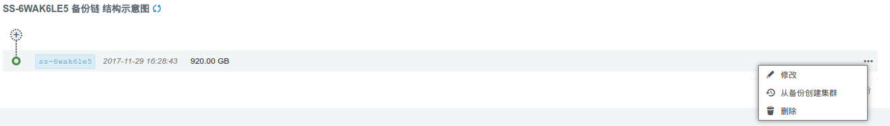

---
---

# RadonDB 用户手册

## 描述

RadonDB 是一款基于 MySQL 研发的新一代分布式关系型数据库 (MyNewSQL)。旨在向用户提供具备金融级高可用、强一致、超大容量的数据库服务，RadonDB 高度兼容 MySQL 语法，自动水平分表，智能化扩容。

**RadonDB 的优势:**

* 自动水平分表，一键即可开启智能化扩容，扩容过程业务不中断。
* 数据多副本，率先使用 GTID 并行复制和 Raft 一致性协议确保副本间数据强一致、零丢失。
* 主副本故障自动秒级切换，实现自动化运维，无需人工干预。
* 存储副本使用 MySQL(5.7.29) 存储，稳定可靠的存储能力与强大的计算能力并存。
* 提供分布式事务能力，保证跨节点操作的数据一致性。
* 同时支持 OLTP (高并发事务需求)和 OLAP (复杂分析需求)。
* 高度兼容 MySQL 语法，数据可快速导入、导出，简单易用。
* 多可用区部署，提供 SQL 审计和 IP 白名单功能，安全可靠。

## 创建步骤

### 1. 基本设置

这里可以填写新集群的基本信息。


计费方式可选小时、月、年。若开启自动备份，则在每天指定时间段都会创建一次备份。

多可用区域将节点分散部署在不同区，可用性高。单可用区域将节点部署在同一个区，网络延迟最低。

**注解**：如果您选择『多可用区部署』，则集群所有节点将分散部署在当前 region 中的所有 zone，反之，如果选择『单可用区部署』，则集群所有节点将部署在当前 region 中的某一个 zone 中。

### 2. 节点设置

RadonDB 包含两种类型的节点： SQL 节点、存储节点。SQL 节点的数量固定为 1，存储节点数量可选，每个节点都有副本节点。具体说明如下表：

| 节点类型 | 节点数量范围 | 副本节点数量范围 |
| - | :-: | -: |
| SQL 节点 | 1        | 1-4，默认为 1 |
| 存储节点   | 2-60，默认为 2 | 2 |

每种类型的节点都可设置 CPU、内存、资源类型、存储类型、磁盘大小。资源类型可选择基础型或企业型 e2，存储类型可选择基础型、SSD 企业级或 NeonSAN。磁盘大小决定了数据库最大容量，您的数据和日志会共享这块磁盘。


**注解**：按上述设置，集群会有 8 个主机，包括：SQL 节点 1 组，每组包括 1 主 1 副本；存储节点 2 组，每组包含 1 主 2 副本。

### 3. 网络设置

为安全起见，数据库集群服务需加入已连接路由器的私有网络，并确保该私有网络的 DHCP 处于『打开』状态 (默认已打开)。 使用一个数据库独享的私有网络的好处是方便您对其做『过滤控制』，同时也不影响其它私有网络的设置。


**注解**：如果您选择的集群部署方式是多可用区部署，则只能看到多可用区的私有网络。关于如何在 region 创建 VPC、私有网络，请参考[区域 (region) 与可用区 (zone)](https://docs.qingcloud.com/product/region)。

### 4. 服务环境参数设置

在这一步可以设置数据库服务的配置参数。


## 集群信息

### 基本属性

这里显示了集群的基本信息。


### 服务端口信息

集群提供两个高可用的读写 IP，分别对应于数据的读和写。

* 高可用读 IP：可将请求在 SQL 节点及其副本之间进行负载分担，提高读取性能，消除单点故障。

* 高可用写 IP：始终指向 SQL 主节点。


**注解**: 必须使用高可用的读写 IP 来访问集群。由于连接到读 IP 的请求会在所有 SQL 节点及其副本（包括当前的 SQL 主节点）之间负载，所以，当某个连接请求被分配到当前主节点时，也是可写的，反之，若分配到非主节点，则必然是只读的。

### 存储节点信息

展示各个存储节点的节点 ID、节点名、节点 IP 和角色。


### 账号列表

展示已有账号信息。


### 服务功能

点开基本属性旁边的下拉按钮，可以看到提供的服务功能。


### 节点列表

这里列出节点相关信息，可以选择展示 IP，并使用列出的 IP 来下载同步的日志。同时显示了每个节点的服务状态。


**注解**：这里的 IP 仅供查询和下载同步的日志使用，不能做写入使用。


### 配置参数

这里列出了可以修改并持久化的配置参数。没有标注会重启服务的那些参数，都可以在服务运行时修改，对服务没有影响。


**注解**：会自动重启服务的参数已经在描述中说明，请在业务低峰时进行修改。

**部分参数说明**：
> 1. `Ftp_user` 和 `Ftp_password`，点击同步日志后，需使用该账号下载节点上的日志，`Ftp_user` 在集群创建后不支持修改。
> 2. `audit-mode` 写审计日志的策略，提供 `None`、`Audit-Read`、`Audit-Write` 和 `Audit-Read-Write` 四种策略，默认为 `NONE`，此时不会记录审计日志。
> 3. `twopc-enable` 分布式事务开关，默认开启。
> 4. `load-balance` 存储节点读写分离开关。默认开启，读请求会路由到存储节点的高可用读 vip。
> 5. `shard-count` 默认 hash 分表数，可选择 8、16、32、64，默认 16。

### 监控告警

可以对集群节点配置告警策略，及时掌握集群的资源和服务状况。


### 备份恢复

可以对集群进行手动备份，也可以在集群列表页面右键选择备份时间进行自动备份。


如果需要从备份创建出一个独立于原有数据库服务的新数据库服务， 可以在详情页的『备份』标签下右键相应的备份点，再选择『从备份创建集群』即可。



**注解**：恢复集群时会保留原集群的数据库账号密码，恢复时需要指定新的账户密码，也可以在创建后修改。


## 服务功能概述

### 切换私网

您可以在 「基础属性」 栏选择切换私网，之后选择对应的 VPC 网络和私有网络，点击提交即可。


### 更改主机类型

可以更改主机类型，选择相应的节点，选中类型，点击提交。


### 添加账号

要创建新账号时，需要指定账号密码，支持 database 级别的租户隔离。


### 删除账号

这里填写要删除的账号名。


### 修改账号

这里填写要修改的账号名及新密码。


### 增删节点

可以根据需要增加 SQL 节点的副本、存储节点。增加存储节点则会增加 1 主和 2 副本的主机。


### 数据重分布

当几个存储节点的数据分布存在不均衡或者添加存储节点后，可以使用该服务对数据进行在线重分布。


**注解**：清理原数据为 false 时，需要用户在命令行自行执行 `radon cleanup` 清理旧数据。

### 扩容集群

可以对一个运行中的数据库服务进行在线扩容，调整 CPU/内存/磁盘空间大小。每次扩容只能选择一种角色。


**注解**：扩容需要在开机状态下进行，扩容 SQL 节点时链接会有短暂中断，请在业务低峰时进行。

### 同步日志

同步日志可以将审计日志拷贝到 SQL 节点的 FTP 目录，可以在内网将 SQL 节点的审计日志下载到本地进行分析。操作指令为：

```bash
wget ftp:// SQL 节点 IP 地址/audit --ftp-user=ftpuser --ftp-password=ftppassword
```


**注解**：审计日志只记录最近一个小时的 SQL 记录。默认情况下不开启审计日志，可在初始化集群时或配置参数里设置开启。

### 自动伸缩

RadonDB 支持自动扩容应用存储空间，详细请参考[自动伸缩](https://docs.qingcloud.com/product/operation/autoscaling)。


### 监控

这里为每个节点都提供了资源监控和服务监控。 SQL 节点的服务监控统计了当前连接数、慢查询数、查询数量和写入查询，存储节点的服务监控统计了 SHOW GLOBAL STATUS 中的信息，可用于定位分析数据库的性能。部分监控项示例如下：


## 性能测试

### 硬件环境

```plain
RadonDB:
1 组 SQL 节点 (16C64G 超高性能主机)
4 组存储节点 (16C64G 超高性能主机)
sync_binlog=1
innodb_flush_log_at_trx_commit=1

RDB:
RDB (16C64G 超高性能主机)
sync_binlog=1
innodb_flush_log_at_trx_commit=1
```

### 测试模型

  sysbench: 16 表, 512 线程，随机写，5000 万条数据。

### 测试结果

| Item      |    Transaction Per Second (TPS) | Response Time(ms) |
| :-------- | --------:| :--: |
| RadonDB (4 组存储节点)  | 26589 |  20   |
| 单机 MySQL (QingCloud RDB)    |  9346 |  73  |

可以看到 RadonDB 的延迟是单机 MySQL 的 1/3，但性能几乎是单机的 3 倍，这要得益于 RadonDB 对大表进行切分后，用户的写操作在这些小表上可并发式执行。

### 如何压测 RadonDB

RadonDB 支持 [sysbench](https://github.com/akopytov/sysbench) 和 [benchyou](http://github.com/XeLabs/benchyou) 性能压测软件。

## 数据导入导出

关于数据的导入导出，详见：[数据导入导出](./data_import_and_export.html)

## 支持的 SQL 集

正如前文所述，RadonDB 高度兼容 MySQL 语法，但也略有不同，详见：[支持的 SQL 集](./supported_sql.html)

