---
---

# 数据库服务

您仅需数十秒即可获得一个完整的基于 MySQL 或 PostgreSQL 的关系型数据库服务， 包括主从节点、高可用服务、读写分离、自动备份、在线扩容以及监控告警等各种管理功能。 青云QingCloud 数据库服务运行于私有网络内，结合青云QingCloud 提供的高性能硬盘和实时副本， 您的数据安全将会得到最大限度的保护。

## MySQL 数据库

**安全性**


青云QingCloud 会在您的 MySQL 数据库中保留三个有限权限的账号， 分别是具有 **REPLICATION SLAVE** 和 **REPLICATION CLIENT** 权限的 **qc_repl**， 从节点 (slave) 会使用该账号从主节点 (master) 同步数据； 另一个是具有 **SUPER** 和 **RELOAD** 权限的 **qc_master** 账号，用作监控和维护整个数据库服务； 第三个是操作系统用以维护数据库状态的 debian-sys-maint 账号。 并且以上账号在创建时使用随机密码生成，也就是在不同的数据库服务间， 以上账号的密码并不相同，以尽可能的保证您的数据库安全性。

>警告
请不要删除或修改 **qc_repl** 和 **qc_master** 这两个账号的权限、密码及其它任何信息，否则会造成相关功能不可用。


>警告
由于青云QingCloud 没有保留具有 **ALL** 和 **GRANT OPTION** 权限的账号，所以请务必牢记的用户名和密码，如果一旦忘记的话，只能由青云QingCloud 帮你停机重置。

重置方式是使用 “skip-grant-tables” 参数启动 MySQL server， 修改完密码后再去掉 “skip-grant-tables” 启动 MySQL server。 除了非常明确地知道必须使用 root 账号的场景，否则无论何时都应该使用普通用户连接数据库。

**MySQL 存储引擎**

基于性能和数据安全的考量，青云QingCloud 专门针对 InnoDB 存储引擎做了配置优化和调整， 未来也会对 InnoDB 进行更多更深入的增强；再加上 MyISAM 本身存在的局限性， 我们建议您始终只使用 InnoDB 存储引擎。

**主从架构**:

青云QingCloud RDS服务采用了主从架构，主从节点部署在不同的服务器上，数据自动实现同步。青云QingCloud RDS服务的MySQL5.5版本是两个节点做主从，同时提供了主从节点的 IP 以方便您的使用，但请不要停止主从同步或直接连上从节点进行写操作。
青云QingCloud RDS服务的MySQL5.6版本提了一主多从的功能，一个主节点最多可以带4个从节点，主节点可读可写，从节点是只读实例，只支持读操作。


**高可用**:

青云QingCloud RDS服务的MySQL5.6版本默认开启了读写的高可用功能。新增了两个高可用的读写IP，分别对应于数据的读和写。 读IP可将请求在多个从节点之间进行负载分担，提高读取性能，消除单点故障。 写IP可以在主库发生故障时自动切换到新的备选主库上，减少故障时间。 在故障切换时，主从节点的IP地址会变化，高可用的读写IP地址不会变化。

>注解
在没有关闭该高可用功能时，请使用高可用的读写IP来连接数据库。

**读写分离**:

青云QingCloud RDS服务的MySQL5.6版本新增了读写分离功能。 通过读写分离的代理节点访问数据库，能自动将读写请求分发到高可用的读写IP上。 读写分离支持事务操作，目前不支持自动分库分表的功能。

### 新建

在控制台导航中点击『数据库』- 『关系型数据库』进入列表页面，然后点击『创建』按钮开始创建。

**资源设置**

在资源设置页中可以选择性能型或者超高性能型数据库，以及数据库的配置、磁盘大小以及自动备份的时间。 数据库配置决定了 MySQL 的最大连接数、InnoDB 缓存池大小等值； 磁盘大小则决定了数据库最大容量，您的数据和日志会共享这块磁盘； 请谨慎选择是否关闭自动备份；

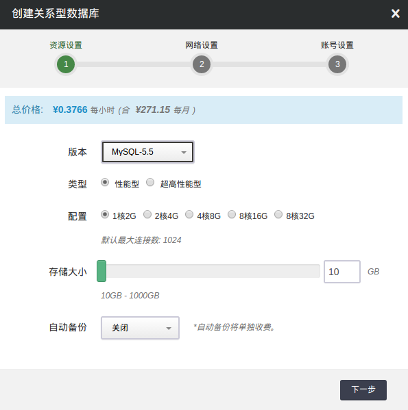

选择青云QingCloud RDS服务的MySQL5.6时，可以指定节点的数量，默认是2个节点，最多可以配置5个节点, 新建时可以选择是否开启读写分离功能，也可以后续有需要时添加读写分离节点来开启该功能。

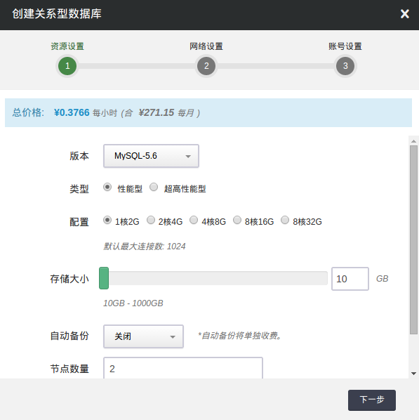

**网络设置**

数据库服务只能加入已连接路由器的私有网络，并确保该私有网络的 DHCP 处于『打开』状态。 使用一个数据库独享的私有网络的好处是方便您对其做『过滤控制』，同时也不影响其它私有网络的设置。

选择青云QingCloud RDS服务的MySQL5.5版本时，可以手动设置主从节点的IP。

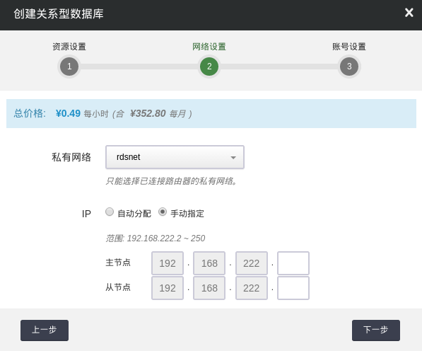

选择青云QingCloud RDS服务的MySQL5.6版本时，还可以手动设置高可用的读写IP。如果开启了读写分离功能，也可以手动设置读写分离节点的代理IP。


**账号设置**

在这一步中设置数据库服务的名称，默认的用户名和密码。

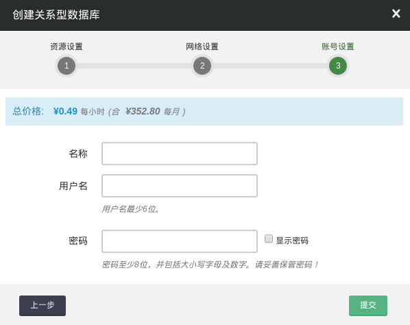

点击『提交』按钮后数据库服务便创建完成了，如果之后需要修改或调整，都可在数据库详情页中进行相应操作。

### 扩容

可以对一个运行中的数据库服务进行在线扩容，右键点击您需要扩容的数据库服务再选择『扩容』即可。 读写分离节点可以单独进行扩容，该节点无需硬盘，扩容时选择CPU和内存即可。


>警告
请对数据库的磁盘配置监控告警，当磁盘空间不足时要以及时扩容。在线扩容期间，会有一小段时间数据库处于只读状态，这是正常现象，通常只需要几秒钟时间即可恢复。所以如果希望减少对线上业务的影响，可以选择在业务低峰时段进行在线扩容。

### 增删节点

选择青云QingCloud RDS服务的MySQL5.6版本时，可以根据业务需要，增加或删除从节点来调节数据库集群的读取性能，增加或删除从节点期间对业务的读取操作没有影响。 也可以根据需要选择增加或删除读写分离节点。


### 同步帐号

选择MySQL5.6版本时，如果创建时没有开启读写分离的功能，后续开启该功能时，需要将使用的数据库帐号信息同步更新到读写分离节点中。 如果数据库帐号信息有变化，也要同步更新到读写分离节点中，目前最多可以同步20个帐号。创建rdb时指定的账户和root账户默认已经同步。 右键点击读写分离节点可以弹出同步界面，同步帐号时代理服务会重启。

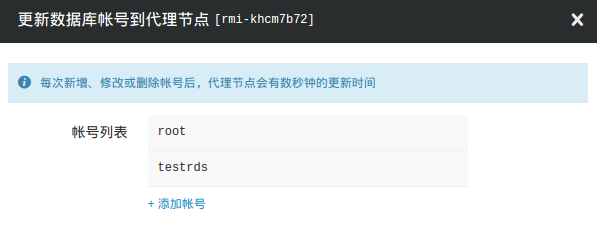

### 关闭主从切换

选择青云QingCloud RDS服务的MySQL5.6版本时，默认开启了主从的故障切换功能。高可用的写IP可以在主库发生故障时自动切换到新的备选主库上。 也可以根据自身需求选择关闭这个故障时自动切换的功能，等待主库恢复。在基本属性中可以修改主从切换模式。


### 备份

**自动备份**

默认情况下，数据库服务会每日备份。 在数据库服务被彻底销毁前，您都可以选择从这些备份创建出全新的数据库服务，或者临时性维护节点。

从备份创建出的新数据库服务完全独立于原数据库服务运行， 临时性维护节点则给予您自由处置数据又不影响线上业务的能力。

**手动备份**

如果需要手动备份，可以在数据库列表点击“备份”图标或者数据库详情页的『备份』标签下点击『创建备份』实现。

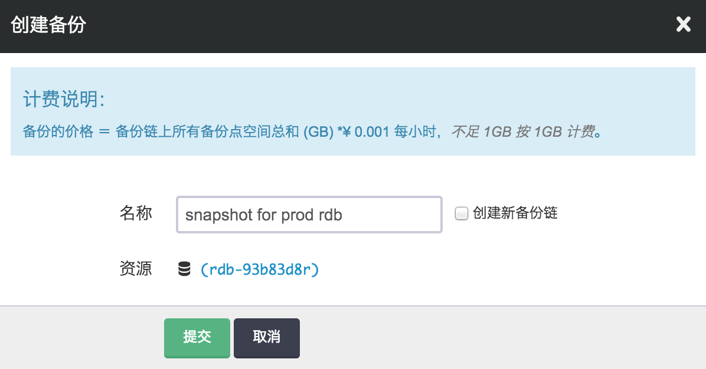

**创建新数据库服务**

如果需要从备份创建出一个独立于原有数据库服务的新数据库服务， 可以在数据库详情页的『备份』标签下右键相应的备份点，再选择『新建关系型数据库』即可。

**创建临时实例**

也可以从备份创建出一个临时实例，该实例在原有的数据库服务下运行。 您可以在该临时实例上做任意的数据处理，而不用担心影响到线上业务的运行。 比如将数据同步到一个特定的时间点，找回某条被误操作的重要数据； 又或者得到一套完整的产品环境的数据子集，供离线计算或测试之用。

> 注解
临时实例是默认只读的，如果你的测试操作需要执行写查询的话，需要用 root 账号连上临时实例并执行 “SET @@GLOBAL.READ_ONLY=0” 来禁用『只读』。

### 监控

**主机监控**

*   CPU 使用率
*   内存使用率
*   硬盘使用率

**数据库服务监控**

以下监控项的数据均采集自 MySQL “SHOW STATUS” 的结果。

*   QUERY 请求：呈现了一段时间内 Questions 的累计值

*   事务：包括提交的事务数和回滚的事务数，分别呈现了一段时间内 Com_commit 和 Com_rollback 的累计值。

*   InnoDB 缓冲池可用空间：以 MB 为单位呈现了 InnoDB 缓冲池的平均可用空间，计算公式为:

    ```
    16 * Innodb_buffer_pool_pages_free / 1024
    ```

*   命中率

    *   InnoDB 缓冲池命中率：计算公式为:

        ```
        (1 - (Innodb_buffer_pool_reads / Innodb_buffer_pool_read_requests)) * 100%
        ```

    *   查询缓存命中率：计算公式为:

        ```
        (Qcache_hits / (Qcache_hits + Qcache_inserts)) * 100%
        ```

    *   连接缓存命中率：计算公式为:

        ```
        (1 - Threads_created / Connections) * 100%
        ```

*   线程连接

    *   当前连接数：呈现了一段时间内 Threads_connected 的累计值。
    *   活跃连接数：呈现了一段时间内 Threads_running 的累计值。
*   全表扫描次数：呈现了一段时间内 Select_scan 的累计值。

*   读写分离连接数：呈现了一段时间内读写分离节点跟高可用IP之间保持的长连接的数量。连接销毁时间依赖数据库的配置参数wait_timeout。

### 操作

**连接数据库**

数据库创建成功之后，就可以通过提供的 IP 地址来访问。

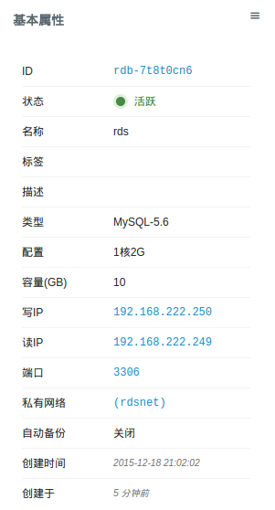

比如针对上图中的数据库，就可以通过主节点 IP 192.168.222.6 和从节点 IP 192.168.222.7 这两个 IP 地址来访问； 区别是主节点同时提供了读、写的能力，而从节点是只读节点。

下面创建了两台主机 app-server-1 和 app-server-2， 并将它们都放入数据库所在的私有网络 user-vxnet 中。


>注解
如果主机是从基础网络或者其他私有网络离开，并重新加入这个网络时，可能需要手工重启一下网络或者主机，以便让网络变更生效（比如上图中的 app-server-2），下面列出了几种主流操作系统的重启方式：

RHEL/CentOS

```
# service NetworkManager restart
```

Fedora

```
# systemctl restart NetworkManager
```

Debian

```
# service network-manager restart
```

Ubuntu

```
# restart network-manager
```

下图展示了如何通过 [mysql](http://dev.mysql.com/doc/refman/5.5/en/mysql.html) 这个官方命令行工具连接 Shire 数据库。

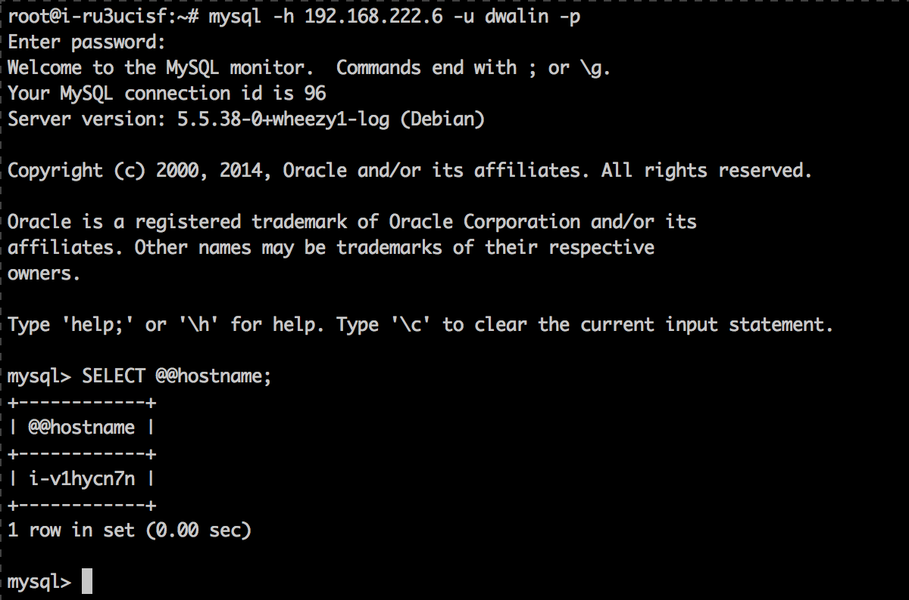

**创建新账号**

可以使用 root 账号连接到 MySQL server，然后执行 [GRANT](http://dev.mysql.com/doc/refman/5.5/en/grant.html) 命令创建新账号，最后执行 FLUSH PRIVILEGES 刷新权限；比如：


 ```
 mysql> GRANT SELECT, INSERT, UPDATE, DELETE
     -> ON foobar.*
     -> TO 'app_user'@'%'
     -> IDENTIFIED BY 'P@s5w0rLd';
 Query OK, 0 rows affected (0.00 sec)

 mysql> FLUSH PRIVILEGES;
 Query OK, 0 rows affected (0.03 sec)
 ```

> 警告
请不要给普通账号分配 SUPER 或 ALL 权限，也不要使用具有 SUPER 权限的账号读写数据库，因为这有可能和系统维护性操作发生冲突。

```
 ERROR 1045 (28000): Access denied for user 'root'%'%' (using password: YES)
```

如果执行 GRANT 命令时出现形如上面的提示， 说明 root 账号尚不具备 GRANT OPTIONS 权限， 可以先执行下面的命令后退出 MySQL server 连接， 重新连接进入后再执行 GRANT 创建新账号。

```
 mysql> UPDATE mysql.user SET Grant_priv='Y' WHERE User='root';
 Query OK, 0 rows affected (0.00 sec)
 mysql> FLUSH PRIVILEGES;
 Query OK, 0 rows affected (0.03 sec)
```


**修改密码**

root 账号的密码和创建 RDB 时指定的密码完全相同， 如果需要，同样可以用 root 账号连接到 MySQL server， 然后使用 [SET PASSWORD](http://dev.mysql.com/doc/refman/5.5/en/set-password.html) 命令来修改。

```
 mysql> SET PASSWORD FOR 'root'@'%' = PASSWORD('new-root-passwd');
 Query OK, 0 rows affected (0.00 sec)
 ```

**导入数据**

如果需要向 MySQL 数据库导入数据，可用参考下面的操作。

1.  在源数据库端使用 mysqldump 将需要的内容导出到 dump.sql 文件；比如下面就导出了整个 tpcc1 数据库中的 schema 和数据。

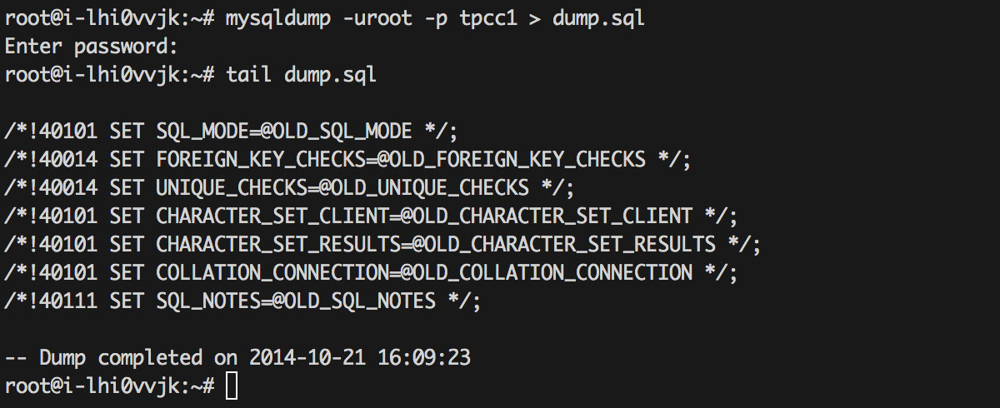

2.  将上一步导出的 dump.sql 文件复制到一台能连接 RDB 的主机后执行该 .sql 文件，将表和数据导入指定的 tpcc_new 数据库中。

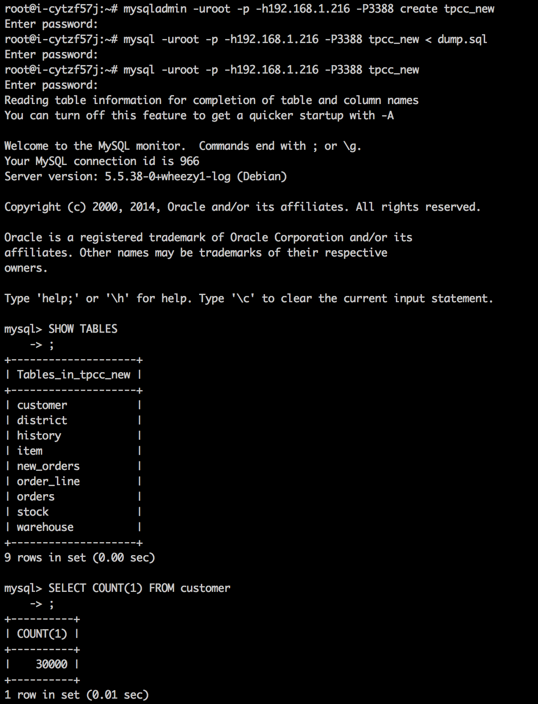

### 基准测试

**TPC-C**

由于 sysbench 无法模拟出产品环境真实的 OLTP 业务场景和压力， 所以我们采用了 [TPC-C](http://www.tpc.org/tpcc/) 这个专门针对 OLTP 系统的基准测试规范， 使用的 TPC-C 工具是 [Percona tpcc-mysql](http://www.percona.com/blog/2013/07/01/tpcc-mysql-simple-usage-steps-and-how-to-build-graphs-with-gnuplot/) ， 关于 TPC-C 规范的数据模型和测试运行方式可以参考 [TPC-C The OLTP Benchmark](http://www.tpc.org/information/sessions/sigmod/sld002.htm)

**MySQL5.5**

在2核4G规格的数据库下，50个 TPC-C 仓库，暖机10分钟，运行测试1小时的结果是 6545.250 TpmC， 而8核32G规格的数据库，50个 TPC-C 仓库，同样暖机10分钟，运行测试1小时的结果是 10362.050 TpmC， 可以从 [c2m4](../_static/syncbinlog5trx0w50c32r600l3600.O_DIRECT.log) 和 [c8m32](../_static/syncbinlog5trx0w50c64r600l3600.c8m32.O_DIRECT.bpi8.log) 下载到这两个测试的详细测试报告。

下面两张截图的阴影部分则展示了测试运行期间 CPU 和内存的状态。

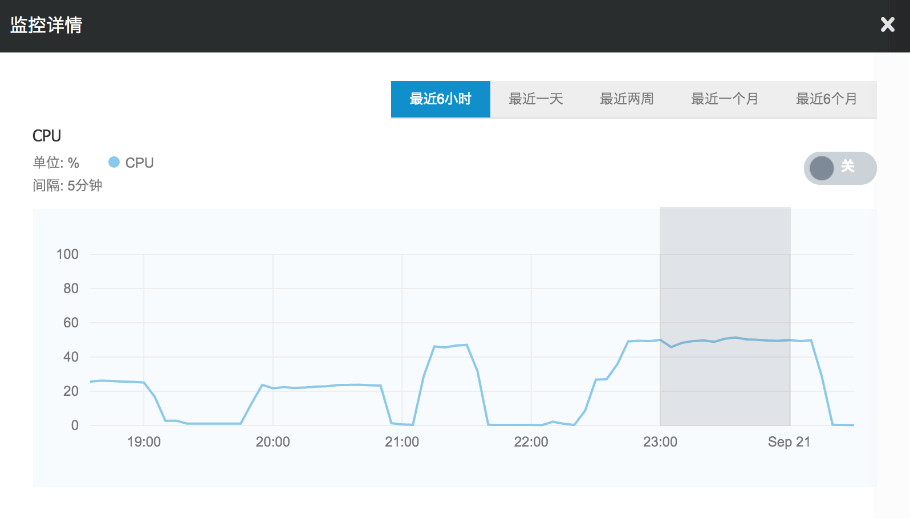


**SysBench**

如果您想参考 sysbench 测试结果的话， 也可以从 [这里](_static/sysbench.log) 下载到其测试报告； 在表行数800万的情况下，sysbench 的结果显示读写比例 3:1 的话，QPS 在 22000 左右； 需要注意的是 sysbench 实际上并不能压完一个数据库的全部性能，所以该 QPS 值仅供参考。

**MySQL5.6**

在2核4G规格的数据库下，50个 TPC-C 仓库，暖机10分钟，运行测试1小时的结果是,性能型:10798.884 TpmC，超高性能型:12927.684 TpmC。 而8核32G规格的数据库，50个 TPC-C 仓库，同样暖机10分钟，运行测试1小时的结果是,性能型:18537.750 TpmC，超高性能型:26134.883 TpmC。 可以从 [性能型c2m4](_static/syncbinlog5.6.5trx0w50c32r600l3600.O_DIRECT.log) [超高性能型c2m4](_static/syncbinlog5.6.hi5trx0w50c32r600l3600.O_DIRECT.log) [性能型c8m32](_static/syncbinlog5.6.5trx0w50c32r600l3600.c8m32.O_DIRECT.bpi8.log) [超高性能型c8m32](_static/syncbinlog5.6.hi5trx0w50c32r600l3600.c8m32.O_DIRECT.bpi8.log) 下载到这些测试的详细测试报告。

下面两张截图的阴影部分则展示了性能型2核4G规格的数据库在测试运行期间 CPU 和内存的状态。


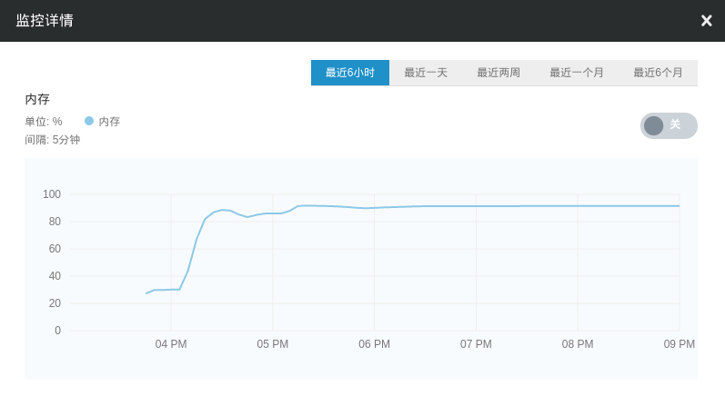

**读IP测试**

在2核4G规格的数据库下，主从两个节点，使用超高性能配置分别测试通过高可用的读IP和从库IP进行读取时的性能。 在表行数800万的情况下，通过高可用的 [读IP](../_static/rds5.6-rvip-sysbench.hi2c4m.log) 访问数据库的QPS为51594.39 per sec 。 通过 [从库IP](../_static/rds5.6-slaveip-sysbench.hi2c4m.log) 访问数据库的QPS为27541.42 per sec。可见读IP的QPS是线性增长的。
