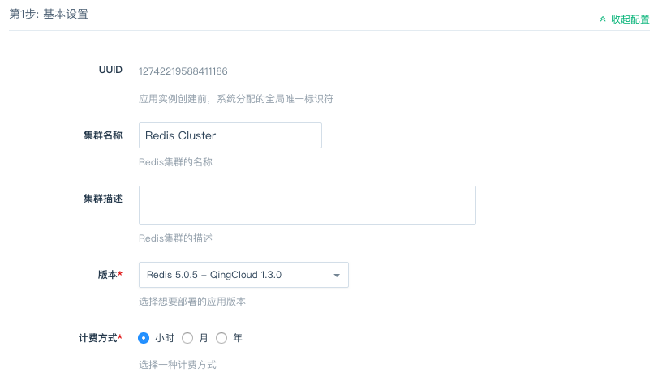
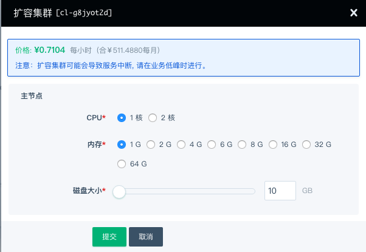
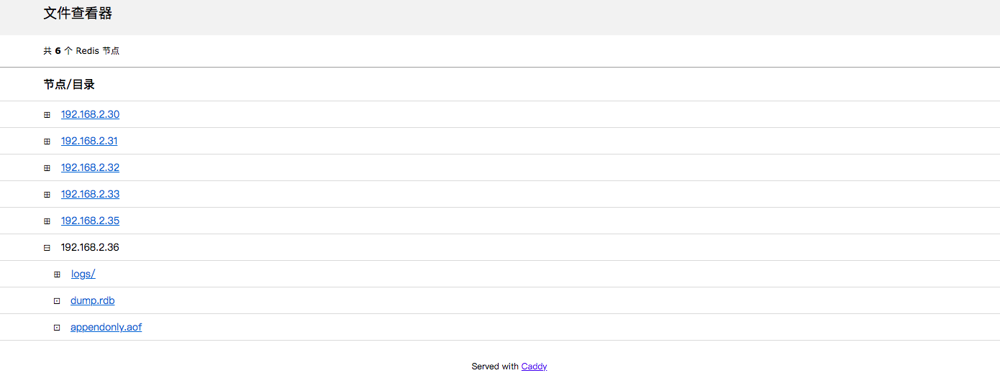

---
---

# Redis Cluster on QingCloud AppCenter

Redis 是一个使用ANSI C编写的开源、支持网络、基于内存、可选持久性的键值对存储数据库。

Redis cluster on QingCloud AppCenter 基于原生的 Redis 提供了 Redis cluster 的 App，能够在 AppCenter 进行一键部署，有如下特性：

- 支持一主多从以及多主多从，每个主所在分片 (shard) 平均分摊 16384 个 slots， 增加或删除主节点系统会自动平衡 slots 
- 集群支持 HA，即当某个主节点异常，它的从节点会自动切换成主节点
- 支持集群的横向及纵向伸缩
- 一键部署
- 基于最新的 Redis 4.0.6 稳定版构建
- Redis 5.0.3 - QingCloud 1.2.1 添加了同城多活，实现业务容灾
- Redis 5.0.5 - QingCloud 1.3.0 添加了内存限制，防止删除节点时出现 OOM
- Redis 5.0.5 - QingCloud 2.0.0 添加了 Caddy 服务，支持通过浏览器自助查看和下载 Redis 文件

## 创建 Redis cluster App

### 准备

在部署 App 之前，您需要创建一个 VPC 网络和关联一个 Vxnet 私有网络，详情见 ([VPC 指南](https://docs.qingcloud.com/product/network/vpc))

### 1) 选择基本配置

填写集群的名称，描述，选择应用的版本。



在 `北京3区` 的用户可以根据实际需求选择「多可用区部署」和「单可用区部署」


### 2) 节点配置

配置 Redis 节点，包括内存、主节点数量、实例类型等信息。


### 3) 网络配置

选择服务部署的私有网络，可以选择之前创建的任意网络。

>`北京3区` 的用户需要注意：被选择私网的部署方式应与集群的部署方式保持一致，即都为 「多可用区部署」或者都为「单可用区部署」


### 4) 环境参数配置

- 禁用 FLUSH 命令：为兼容 Redis 5.0.3 - QingCloud 1.2.1 之前的版本，自 Redis 5.0.3 - QingCloud 1.2.1 起添加了此项，默认是不禁用的，但我们强烈建议您禁用它，FLUSHALL 和 FLUSHDB 命令的误操作会造成数据不可恢复的丢失。


### 创建成功

当 Redis cluster 服务创建完成之后，我们可以查看 Redis cluster 中各节点的运行状态。 


### 配置参数

可以在此修改环境参数，参数修改完成保存后，集群将重启以应用新的参数配置，所以请在服务压力相对较小的时候修改参数。


### 监控告警

可以在此为节点配置告警信息，随时监控您的服务。


### 节点角色

可以在此实时查看集群的节点状态和主从关系。


## 测试

当缓存服务创建完成之后，我们可以进行连接测试。


### 1）redis 客户端操作 redis cluster

在同一私网下创建一台 Linux 主机，下载与集群 redis 版本相同的 redis，这里以 [redis 5.0.5](http://download.redis.io/releases/redis-5.0.5.tar.gz) 版本为例，编译，进入 src 目录执行下面的命令


```shell
./redis-cli -c -a <密码> -h <目标节点> <command>
```
如：

- 在 192.168.0.6 所在的集群中设置 key 为 a，value 为 b 的字符串。

```shell
./redis-cli -c -h 192.168.0.6 set a b
```

- 在 192.168.0.6 所在的集群中获取 key 为 a 的 value 值。


```shell
./redis-cli -c -h 192.168.0.6 get a
```


### 2）检查集群状态

在同一私网中创建一台 Linux 主机，您可能需要先装一些依赖包 (如 Ubuntu 下 apt-get install tcl ruby　和　gem install redis)， 然后请 [下载 Redis 4.x](http://download.redis.io/releases/redis-4.0.6.tar.gz)或者[下载 Redis 5.x](http://download.redis.io/releases/redis-5.0.3.tar.gz)（根据版本需求来定），解压后进入 Redis src 目录，执行以下命令　（假设 Redis cluster 其中一个节点的 IP 为 192.168.100.13，端口为 6379)。

Redis 4.x 执行以下命令

```shell
./redis-trib.rb check 192.168.100.13:6379
```
Redis 5.x 执行以下命令

```shell
./redis-cli --cluster check 192.168.100.13:6379
```

然后您能看到如下的集群信息

```shell
Connecting to node 192.168.100.13:6379: OK
Connecting to node 192.168.100.11:6379: OK
Connecting to node 192.168.100.10:6379: OK
Connecting to node 192.168.100.14:6379: OK
Connecting to node 192.168.100.12:6379: OK
Connecting to node 192.168.100.15:6379: OK
>>> Performing Cluster Check (using node 192.168.100.13:6379)
S: f6092dbdb25b6d80416232e50ccd2022860086b0 192.168.100.13:6379
   slots: (0 slots) slave
   replicates b2d75900b6427f6fbf8ec1a61ee301a2c8f73a6d
M: d3377079e01391b9d16ea699c79453e15f5aa132 192.168.100.11:6379
   slots:0-5460 (5461 slots) master
   1 additional replica(s)
M: b2d75900b6427f6fbf8ec1a61ee301a2c8f73a6d 192.168.100.10:6379
   slots:5461-10922 (5462 slots) master
   1 additional replica(s)
S: 9774f5ff6477eaecb6794395ed726d0f06257c60 192.168.100.14:6379
   slots: (0 slots) slave
   replicates d3377079e01391b9d16ea699c79453e15f5aa132
M: 704514eb7fa135dd003533568ae9f7babda9464e 192.168.100.12:6379
   slots:10923-16383 (5461 slots) master
   1 additional replica(s)
S: 22b3f49a6b87403faeeb1219881e63096802eb6a 192.168.100.15:6379
   slots: (0 slots) slave
   replicates 704514eb7fa135dd003533568ae9f7babda9464e
[OK] All nodes agree about slots configuration.
>>> Check for open slots...
>>> Check slots coverage...
[OK] All 16384 slots covered.
```

如果发现集群出现异常，比如出现 [ERR] Nodes don’t agree about configuration! 可以尝试用如下命令修复

Redis 4.x 执行以下命令

```shell
./redis-trib.rb fix 192.168.100.13:6379
```

Redis 5.x 执行以下命令

```shell
./redis-cli --cluster fix 192.168.100.13:6379
```

如果发现各分片的 slots 分配不平均，也可以用如下命令平衡一下 (从两个分片迁移 1000 个 slots 到第三个分片里)

Redis 4.x 执行以下命令

```shell
./redis-trib.rb reshard --from d3377079e01391b9d16ea699c79453e15f5aa132,b2d75900b6427f6fbf8ec1a61ee301a2c8f73a6d
--to 704514eb7fa135dd003533568ae9f7babda9464e --slots 1000 --yes 192.168.100.13:6379
```


Redis 5.x 执行以下命令

```shell
./redis-cli --cluster reshard --cluster-from d3377079e01391b9d16ea699c79453e15f5aa132,b2d75900b6427f6fbf8ec1a61ee301a2c8f73a6d
--cluter-to 704514eb7fa135dd003533568ae9f7babda9464e --cluster-slots 1000 --cluster-yes
```

### 3）Java 客户端读写数据示例

首先 [下载 Jedis 库和 Apache Commons Pool 依赖库](https://github.com/xetorthio/jedis/wiki/Getting-started)，需要下载 [commons-pool2 的 2.5.0 版本](https://search.maven.org/remotecontent?filepath=org/apache/commons/commons-pool2/2.5.0/commons-pool2-2.5.0.jar)和 [jedis 的 2.9.2 版本](https://search.maven.org/remotecontent?filepath=redis/clients/jedis/2.9.2/jedis-2.9.2.jar)。 把下载下来的 commons-pool2-2.5.0.jar 和 jedis-2.9.2.jar 放到同一目录下如 lib/， 创建 TestRedisCluster.java，内容如下，然后编译、执行该 Java 程序（假设一个分片的主从节点分别是 192.168.100.10， 192.168.100.13， 端口均为 6379）。

```shell
javac -cp :./lib/* TestRedisCluster.java
java -cp :./lib/* TestRedisCluster 192.168.100.10 192.168.100.13 6379
```

```java
import java.util.Set;
import java.util.HashSet;
import redis.clients.jedis.JedisCluster;
import redis.clients.jedis.HostAndPort;

public class TestRedisCluster {
    public static void main(String[] args) throws Exception {
        Set<HostAndPort> jedisClusterNodes = new HashSet<HostAndPort>();
        //Jedis Cluster will attempt to discover cluster nodes automatically
        jedisClusterNodes.add(new HostAndPort(args[0], Integer.valueOf(args[2])));
        jedisClusterNodes.add(new HostAndPort(args[1], Integer.valueOf(args[2])));
        JedisCluster jc = new JedisCluster(jedisClusterNodes);

        String str = "abcdefghijklmnopqrstuvwxyzABCDEFGHIJKLMNOPQRSTUVWXYZ1234567890";
        int len = str.length();
        int loop = 0;
        while (loop <= 100) {
            loop += 1;
            for (int i = 1; i < len; i++) {
                int end = len - i;
                for (int j = 0; j < end; j++) {
                    for (int k = j+1; k < end; k++) {
                        String key = str.substring(j, j+1) +
                                     str.substring(k, k+i) + "_" +
                                     str.substring(i, i+1);
                        String value = key + "_value";
                        jc.set(key, value);
                        String v = jc.get(key);
                        if (!value.equals(v)) {
                            System.out.println("Not equal: key[" + key + "], value[" +
                                               value + "], v[" + v + "]");
                        }
                        System.out.println(key + "," + value);
                    }
                }
            }
        }

        jc.close();
    }
}
```

>这是示例代码，不承担任何责任。更多的 Redis 客户端请见 [Redis 官方网站](http://redis.io/clients)。

### 4） Hash Tags Keys

Redis 集群采用 CRC16 算法对 key 值哈希到 16384 个 slots 中的一个，因此不同的 key 可能分散到不同的节点中，对于想固定一类 key 值到某一个节点，如按业务分类，可以采用 Hash Tags，下面是从 [Redis 文档](https://redis.io/topics/cluster-spec#keys-hash-tags) 摘录的解释。


In order to implement hash tags, the hash slot is computed in a different way. Basically if the key contains a “{...}” pattern only the substring between { and } is hashed in order to obtain the hash slot. However since it is possible that there are multiple occurrences of { or } the algorithm is well specified by the following rules:

- If the key contains a **{** character
- There is a **}** character on the right of **{**
- There are one or more characters between the first occurrence of **{** and the first occurrence of **}** after the first occurrence of **{**.

Then instead of hashing the key, only what is between the first occurrence of **{** and the first occurrence of **}** on its right are hashed.

Examples:

- The two keys **{user1000}.following** and **{user1000}.followers** will hash to the same hash slot since only the substring **user1000** will be hashed in order to compute the hash slot.
- For the key **foo{}{bar}** the whole key will be hashed as usually since the first occurrence of **{** is followed by **}** on the right without characters in the middle.
- For the key **foo{{bar}}zap** the substring **{bar** will be hashed, because it is the substring between the first occurrence of **{** and the first occurrence of **}** on its right.
- For the key **foo{bar}{zap}** the substring bar will be hashed, since the algorithm stops at the first valid or invalid (without bytes inside) match of **{** and **}**.
- What follows from the algorithm is that if the key starts with **{}**, it is guaranteed to be hashes as a whole. This is useful when using binary data as key names.

## 在线伸缩

在缓存服务运行过程中，会出现服务能力不足或者容量不够的情况，可以通过扩容来解决，或者服务能力过剩时可以删除节点。在纵向扩容中， 服务需要重启，所以这个时候业务需要停止。在横向伸缩中，数据会发生迁移，但并不影响业务的正常运行。

### 1）增加集群分片 (shard)

Redis 集群服务每个主节点写的能力与容量都有上限，当写的能力不满足业务需求或达到容量上限时，您可以通过增加节点组即缓存分片来提升写性能以及容量。 每增加一个节点组时将创建一个主节点和其它主节点同样的从节点数。Redis 集群会自动平衡各分片之间的 slots，即会发生 数据迁移，因此增加节点组的时间会有点长。如果事先知道需要增加的分片数建议一次性完成，这样比一次只加一个分片效率更高。 


### 2）增加集群从节点

Redis 集群服务每个主节点可以支持多个从节点。当读的能力不足时，您可以通过增加缓存从节点来提升读性能。 


### 3）删除集群分片 (shard)

如果写服务能力或容量过剩，也可以删除多余的节点组，即删除主节点和它的所有从节点，删除的过程中系统会自动迁移数据到其它节点中，因此时间会稍长一点。

> **注意 Redis 5.0.5 - QingCloud 1.3.0 及之后的版本在删除 master 节点时添加了限制，以下情况是不允许节点被删除的：**

> 1、集群存在节点状态异常

> 2、存在单节点的 redis 内存使用率大于 95% 

> 3、删除后的平均 redis 内存使用率大于 95% 

### 4）删除集群从节点

如果读服务能力过剩，您也可以删除多余的从节点。删除的时候需要从每个主节点下选择同样数目的从节点，从而保证整个集群不会是一个“畸形”。

> **注意 Redis 5.0.5 - QingCloud 1.3.0 在删除 master-replica 节点时添加了限制，以下情况是不允许节点被删除的：**

> 集群待删除从节点中包含 redis 角色为主节点

### 5）增加缓存容量

当缓存容量不足时，您可以通过纵向扩容来提升缓存容量，右键点击集群，选择扩容。



>硬盘存储容量只能扩容，不支持减少存储容量。在线扩容期间，缓存服务会被重启。

## 切换私网

您可以在 「基础属性」栏选择切换私网，之后选择对应的 VPC 网络和私有网络，点击提交即可。


## 文件下载

`Redis 5.0.5 - QingCloud 2.0.0` 在「配置参数」栏添加了 WebConsole 的服务，您可以通过该服务下载日志、RDB 数据文件和 AOF 文件，该服务默认没有密码，建议在使用时配置密码


您可以通过浏览器访问 http://[ip]:80 来访问下载页面



您也可以在虚机中使用以下链接来下载需要的文件

> 设置了用户名和密码的用户，需要将链接中的 \[username\]、\[password\]、\[ip\] 分别替换为您的用户名、密码和目标 ip 

> 未设置用户名和密码的用户可以删除 _\[username\]:\[password\]@_ 部分，并将 \[ip\] 替换为目标 ip 即可

```shell
# 下载 RDB 文件
wget http://[username]:[password]@[ip]/redis/dump.rdb

# 下载 AOF 文件
wget http://[username]:[password]@[ip]/redis/appendonly.aof

# 下载日志文件
wget http://[username]:[password]@[ip]/redis/redis-server.log

```

## 禁用命令的执行

为了您的数据安全，我们禁用了部分命令，并在前端开启了常用的命令操作：


- 清空数据
    
    - 你可以根据需求来选择不同的执行命令：
    
        - FLUSHALL: 清空所有的数据
        
        - FLUSHDB: 清空指定数据库的数据
        
- RDB 文件下载

    - 先执行 BGSAVE 命令，该命令会在主节点生成最新的 RDB 文件
    
    - 根据 [文件下载](https://docs.qingcloud.com/product/database_cache/redis-cluster/index#%E6%96%87%E4%BB%B6%E4%B8%8B%E8%BD%BD) 的说明下载主节点的 RDB 文件使用

## 迁移

迁移数据既包括 Redis standalone 之间也包括从 Redis Standalone 到 Redis Cluster。

### 从 Redis standalone 迁移数据到 Redis cluster

Redis 4.x　提供了一个从 Redis standalone (包括旧版本 2.8.17) 迁移数据到 Redis cluster　的工具 redis-trib.rb， 请 下载 [Redis 4.x](http://download.redis.io/releases/redis-4.0.6.tar.gz)，解压后进入 Redis src目录， 执行以下命令:　
(假设 Redis standalone 的主节点 IP 为 192.168.100.11，端口为 6379，Redis cluster 其中一个节点的 IP 为 192.168.100.20，端口为 6379)。

```shell
./redis-trib.rb import --from 192.168.100.11:6379　192.168.100.20:6379 --copy
```

redis 5.x 对 shell 命令行做了些修改，需要先下载 [Redis 5.x](http://download.redis.io/releases/redis-5.0.3.tar.gz)，解压后进入 Redis src目录，执行以下命令

```shell
./redis-cli --cluster import 192.168.100.20:6379 --cluster-from 192.168.100.11:6379 --cluster-copy
```

> 运行上述命令务必添加 --copy 或者 --cluster-copy 参数，否则会导致仅迁移数据而不是复制数据

### 从 Redis cluster 迁移数据到 Redis cluster

假设您有两个 Redis cluster：

Redis cluster A：主节点为 192.168.2.31:6379,192.168.2.32:6379,192.168.2.35:6379

Redis cluster B：主节点为 192.168.2.14:6379,192.168.2.17:6379,192.168.2.19:6379

您需要将数据从 Redis cluster A 迁移到 Redis cluster B

- 迁移方式

步骤一：迁移 slots，在选择 redis-port 迁移时，该过程是必要的

通过以下[命令](https://redis.io/commands/cluster-nodes)检查 Redis cluster A 和 Redis cluster B 的 slots 分布是否一致，在不一致的情况下，可以使用 [migrateSlots.sh](https://github.com/QingCloudAppcenter/redis/tree/master/operations) 将 Redis cluster B 的 slots 分布迁移至与 Redis cluster A 一致

```shell
./redis-cli -h 192.168.2.31 cluster nodes

./redis-cli -h 192.168.2.14 cluster nodes
```

步骤二：做数据迁移
  
- 4.x 的用户可以使用 redis-port 来迁移

使用 [redis-port](https://github.com/CodisLabs/redis-port/releases) 来迁移，下载程序后，执行 ./redis-sync -m [源地址:端口号] -t [目标地址:端口号]，提示完成\[100%\]，即可终止程序，此工具也支持 rdb 文件导入，比较灵活，详细说明参见 https://github.com/CodisLabs/redis-port

> 注意：「源地址」与「目标地址」的 slots 分布需要一致

- 4.x 和 5.x 的用户可以通过 RDB 文件来迁移数据

    - 通过 [禁用命令的执行](https://docs.qingcloud.com/product/database_cache/redis-cluster/index#%E7%A6%81%E7%94%A8%E5%91%BD%E4%BB%A4%E7%9A%84%E6%89%A7%E8%A1%8C) 一栏 `RDB 文件下载` 下载源集群各主节点的 RDB 文件，并保存至网络与目标集群相通的虚机中
    
    - 在虚机中下载并创建 redis-server 实例，先关闭 redis-server 实例，复制欲迁移的 RDB 文件到 redis-server 的数据目录，并重启该虚机的 redis-server 实例
    
    - 参考 [从 Redis standalone 迁移数据到 Redis cluster](https://docs.qingcloud.com/product/database_cache/redis-cluster/index#%E4%BB%8E-redis-standalone-%E8%BF%81%E7%A7%BB%E6%95%B0%E6%8D%AE%E5%88%B0-redis-cluster) 中的描述，将虚机的 redis-server 中的数据迁移至目标集群
    
    - 对其余的 RDB 文件依次按照上述步骤迁移至目标集群即可


## 同城多活测试
### 背景

- [青云QingCloud 升级区域（Region）架构 轻松实现同城多活](https://log.qingcloud.com/archives/3981)

### 测试结果

redis 节点的同城多活测试可参考 [Redis standalone 同城多活测试](https://docs.qingcloud.com/product/database_cache/redis-standalone/index.html#多可用区同城多活测试)，针对于 redis cluster 的集群需要考虑到分片的影响，多区部署的网络和集群内部的 MOVED 重定向会影响到集群的平均 QPS，为了消除重定向对 QPS 的影响，建议选择可以缓存 slot 分布的客户端。


## 其他

为了更好的管理 Redis 服务，我们默认禁用一些 Redis 的命令，禁用的命令列表如下：

- BGREWRITEAOF
- BGSAVE
- DEBUG
- CONFIG
- SAVE
- SHUTDOWN
- SLAVEOF
- KEYS

为兼容 Redis 5.0.3 - QingCloud 1.2.1 之前的版本，自 Redis 5.0.3 - QingCloud 1.2.1 起默认开启了如下命令，升级集群的用户依旧保持开启该命令，我们强烈建议新建集群的用户禁用掉该命令，该命令的误操作，会对数据造成不可恢复的丢失：

- FLUSHDB
- FLUSHALL

您可以通过参数配置页打开 CONFIG 和 SAVE 命令，但我们强烈不推荐您这么做。错误地使用 CONFIG 命令可能会导致服务的不可用，我们建议您在生产环境上使用默认设置来禁用这两个命令。 当您需要打开命令时，设置'打开config和save命令'为１，保存配置，服务会自动重启以生效。


## Redis cluster Paas文档

请访问[这里](../cache_redis_cluster.html)