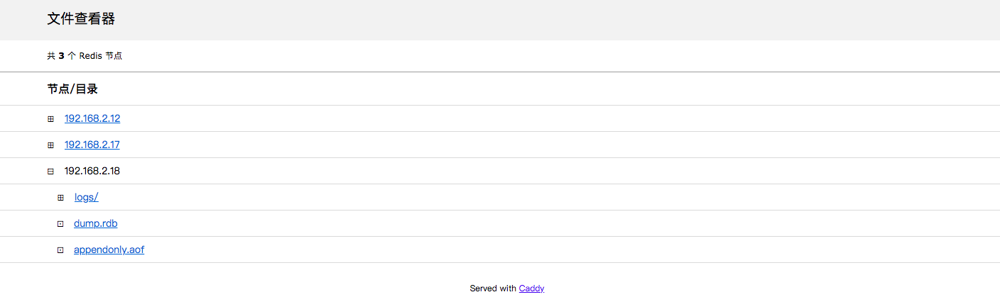
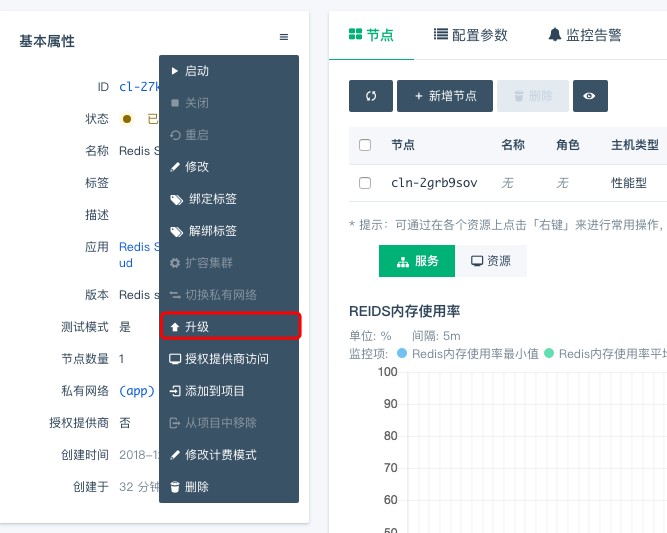

---
---

# Redis standalone on QingCloud AppCenter 用户手册

## 描述

   [Redis](https://redis.io/) 是一个使用ANSI C编写的开源、支持网络、基于内存、可选持久性的键值对存储数据库。

**Redis standalone on QingCloud** 将 **Redis** 封装成 App，采用 **Redis** 最近的稳定版本 3.2.9 构建，支持在 AppCenter 上一键部署，在原生 **Redis** 的基础上增加了其易用性、高可用的特性，免去您维护的烦恼。细致说来，具有如下特性：

- 高可用性。

  **Redis standalone on QingCloud** 集成 **[Redis Sentinel](https://redis.io/topics/sentinel)** 机制，支持秒级主从切换，并提供一个对外的读写 vip，在保证高可用性的同时，无需手动切换主节点 IP 地址。
  
  **目前，各节点数支持的高可用数：**
  
    1、单节点应用不支持高可用，仅限在测试环境下使用
    
    2、三节点应用支持高可用，最高允许一个节点出现异常
    
    3、多节点（大于三节点）的应用支持高可用，「节点实时角色」中前三个节点最高允许一个节点出现异常，其他节点对出现异常的情况没有限制

- 支持节点的纵向和横向扩容。

  **Redis standalone on QingCloud** 线上版本支持单节点和三节点部署方式，只有三节点部署形式包含主从自动切换的功能。可以从单节点增加节点到三节点，而无需暂停当前 **Redis** 服务。也可以从三节点缩小到单节点，禁止删除主节点（部分已下线版本会由于删除主节点导致服务的短暂不可用）。
 
  **目前，各个版本支持的节点伸缩数：**
    
    1、Redis 5.0.3 - QingCloud 1.2.2 版本支持单节点、双节点和三节点的节点伸缩[已下线]
    
    2、Redis 5.0.8 - QingCloud 3.0.0 版本支持单节点、三节点以及最高支持九节点的节点伸缩，可以满足您大量读的需求

    3、其他版本支持单节点和三节点的节点伸缩。
  
- 一键部署。 

  无需额外配置，可以立即部署一个 **Redis** 服务
  
- 同城多活

   `Redis 5.0.6 - QingCloud 2.1.1` 和 `Redis 5.0.7 - QingCloud 2.2.0` 版本支持同城多活，在 `北京3区` 部署 app 的用户可以选择同城多活，来实现业务容灾
  


## 部署 **Redis standalone** 服务

> 为了您的数据安全，目前 **Redis standalone on QingCloud** 需要部署在私有网络内。请您在部署服务之前，先创建一个私有网络。


### 一. 选择基本配置

​      填写集群的名称，描述，选择应用的版本 _Redis 5.0.7 - QingCloud 2.2.0_ （也可以根据需求选择其他版本，这里以该版本为例），计费方式及自动备份时间您可以根据需求选择，自动备份时间默认关闭。


  在 `北京3区` 的用户可以按照需求选择「多可用区部署」或「单可用区部署」
  


### 二. 配置节点

​        配置节点，根据业务需要选择节点类型、核数、内存、磁盘大小和数量（后续可以随时调整），单节点集群仅供测试使用，正式环境建议使用三节点保证高可用。

 

### 三. 选择私有网络

​     在此选择您在开始创建好的私有网络。
​ 
> **1、对于 `北京3区` 创建集群的用户需要注意，集群的部署方式应与私网的部署方式保持一致，需要同时为 「多可用区部署」或者同时为「单可用区部署」** 
​  
> **2、对于 _Redis 5.0.3 - QingCloud 1.2.1_ 节点之间的防火墙必须放行 TCP/22 和 TCP/6379 这两个端口，否则会导致服务异常。**

> **3、对于其他版本的必须放行 TCP/26379 和 TCP/6379 这两个端口，否则会导致服务异常**


### 四. 配置 Redis 环境参数

​       **Redis Standalone on QingCloud** 提供了 **Redis** 大部分配置参数，您可以在此根据需要修改相应的参数。

 


- _requirepass_ : 如果您想为您的 **Redis** 服务设置密码，请在此填写，注意密码长度以保证安全， `Redis 5.0.3 - QingCloud 1.2.2` 及之后的版本添加了对密码的限定，可由数字、字母或 `!@#$%^&*()./;` 组成，且最少6位。

- _禁用 FLUSH 命令_ : 为了兼容之前版本的 app ，默认是不禁用 FLUSHALL 和 FLUSHDB 命令的，但是我们强烈建议您在生产环境下禁用该命令，该命令的误操作会对数据造成不可恢复的丢失。


### 五. 部署

​       阅读并同意青云 AppCenter 用户协议之后即可马上部署您的应用。


## 应用详情

​	部署完成后您将看到如下信息


- 服务端口信息

  **Redis standalone on QingCloud** 提供一个读写IP，此IP始终指向主节点。当发生主从切换时，此IP将指向新的主节点，无需手动更改主节点IP
  
  
### 节点实时角色

您可以从 `节点实时角色` 一栏，非常方便且实时的获取集群中节点的主从状态


您也可以从服务监控项 `节点角色` 中，查看 redis 角色的状态变化，方便更好的定位问题


### 伸缩节点

- 删除节点

​	您可以从三个节点减少到一个节点，需要注意的是：

**仅 `Redis 5.0.3 - QingCloud 1.2.2` 支持单节点、双节点、三节点之间的伸缩**

**包括 `Redis 5.0.3 - QingCloud 1.2.2` 以及该版本以前的版本由于您可能删除主节点，会造成服务的短暂不可用，所以请在服务压力较小的情况下减少节点，剩下的节点就会以主节点继续提供服务。**

**`Redis 5.0.3 - QingCloud 1.2.2` 版本的用户可以先根据 `节点实时角色` 判断集群的节点角色，防止删掉主节点，造成集群服务的短暂不可用。**

**`Redis 5.0.5 - QingCloud 2.0.0` 及其之后的版本对待删除节点增加了限制：禁止删除主节点，防止造成服务的短时间不可用**

**`Redis 5.0.8 - QingCloud 3.0.0` 允许删除的节点可以从「节点实时角色」获取**

​

​
   


​
​


- 增加节点

​	您可以从单节点增加到三节点，增加节点的过程中服务不会停止。从单节点增加到三节点后，集群将自动拥有主从切换的能力，无需任何额外操作。

> `Redis 5.0.8 - QingCloud 3.0.0` 允许单节点增加至三节点​或多节点，最高支持九节点，可以满足您大量读的需求
	
​

​    


### 切换私网

如果您有切换私网的需求，也可以在控制台实现

> 该操作会重启集群，请在集群压力较小时操作。

- 步骤一

在 `基本属性` 中选择「切换私有网络」


- 步骤二

选择您要切换的 VPC 网络和私有网络，点击提交即可


### 扩容集群
如果集群的配置不满足现在的需求，可以在控制台实现集群的扩/缩容。

> 该操作会重启集群，请在集群压力较小时操作。

> 单独扩容磁盘大小不会重启集群


- 步骤一

​
​

- 步骤二

​操作完上面的步骤，就会出现下面的选项，按照自己的需求选择相应的内存和磁盘大小，确认无误后点击提交即可
​
​

### 测试服务

​	集群创建完成后，您可以使用 redis-cli 来测试服务是否正常运行

在同一私网下创建一台 Linux 主机，下载与集群 redis 版本相同的 redis，这里以 [redis 5.0.7](http://download.redis.io/releases/redis-5.0.7.tar.gz) 版本为例，编译，进入 src 目录执行下面的命令

- 查询主节点的角色

```shell
$~: ./redis-cli -h 192.168.2.247 info replication
# Replication
role:master
connected_slaves:2
slave0:ip=192.168.2.47,port=6379,state=online,offset=436236,lag=1
slave1:ip=192.168.2.46,port=6379,state=online,offset=436236,lag=1
master_replid:9582e5f0afd04a972fc5c01014a4767bc1efb225
master_replid2:0000000000000000000000000000000000000000
master_repl_offset:436373
second_repl_offset:-1
repl_backlog_active:1
repl_backlog_size:1048576
repl_backlog_first_byte_offset:1
repl_backlog_histlen:436373

```

- 插入一个 key value 对

```shell
$~: ./redis-cli -h 192.168.2.247 set a b
OK
```
- 获取 key 的 value

```shell
$~: ./redis-cli -h 192.168.2.247 get a
"b"
```


### 参数修改

​	可以在此修改环境参数，参数修改完成保存后，集群将重启以应用新的参数配置，所以请在服务压力相对较小的时候修改参数。
​	
> ​**如果修改了 port 参数，则需要打开集群网络防火墙中的对应的端口号。如修改 port 参数为 6378 ，此时需要打开防火墙的 6378 端口。**
​
​ ​	

 


### 监控告警

​	可以在此为节点配置告警信息，随时监控您的服务


### 同步日志

`Redis 5.0.3 - QingCloud 1.2.2` 添加了「同步日志」的功能，您可以打开「同步日志」，下载 redis-server.log，也可以通过浏览器来查看日志信息，默认的用户名为 caddy，密码为 caddy，您可以在「配置参数」中修改为您自己的用户名和密码。


### 文件下载

`Redis 5.0.5 - QingCloud 2.0.0` 及其之后的版本在「配置参数」栏添加了 WebConsole 的服务，您可以通过该服务下载日志、RDB 数据文件和 AOF 文件，该服务默认没有密码，建议在使用时配置密码


您可以通过浏览器访问 http://[ip]:80 来访问下载页面




### 禁用命令的执行

为了您的数据安全，我们禁用了部分命令，并在前端开启了常用的命令操作：


- 清空数据

    - 您可以根据需求来选择不同的执行命令

        - FLUSHALL: 清空所有的数据

        - FLUSHDB: 清空指定数据库的数据

- RDB 文件下载

    - 先执行 BGSAVE 命令，该命令会在主节点生成最新的 RDB 文件
    
    - 根据 [文件下载](https://docs.qingcloud.com/product/database_cache/redis-standalone/index#%E6%96%87%E4%BB%B6%E4%B8%8B%E8%BD%BD) 的说明下载主节点的 RDB 文件使用


### 迁移现有数据

#### redis-port

​	如果您目前有 **Redis(2.6.0 <= version < 5.0.0)** 数据库数据想迁移到 **Redis on QingCloud** 上来，可以使用下列的方式来迁移:

- **redis-port** 您也可以使用 [redis_port](https://github.com/CodisLabs/redis-port/releases) 来迁移， 下载程序后，执行 `./redis-sync -m [源地址:端口号] -t [目标地址:端口号] `，如下图，提示完成[100%]，即可终止程序。此工具也支持rdb文件导入，比较灵活，详细说明请参见 https://github.com/CodisLabs/redis-port


#### 从 RDB 文件恢复数据

   _Redis 5.0.7 - QingCloud 2.2.0_ 新增了「从RDB文件恢复数据」的操作
   
> 注意：
> 1. 为方便迁移，该功能仅限目标集群为单节点时使用，多节点集群操作会报错
> 2. 该操作会完全删除目标集群的所有数据，且不可恢复，对于需要保留目标集群数据的，请自行备份
> 3. 目标集群的内存配置需要跟源集群一致或者更大，否则容易造成数据丢失
> 4. 数据量较大的情况下，恢复的时间可能会较长，请耐心等待，在这期间不要做任何操作，防止干扰数据加载

- 先打开 WebConsole，如图，将「配置参数」项的 「开启文件查看控制台」 设置为 `true`


- 使用下面的命令将您生成的 RDB 文件上传至集群节点

```bash
curl -T <源 RDB 文件路径> http://<username>:<password>@<目标节点ip>:80/upload/dump.rdb
```

- 点击 「从 RDB 文件恢复数据」，等待过程执行完毕


- 检查数据迁移完毕

### 备份恢复

可以对集群进行手动备份，也可以在集群列表页面右键选择备份时间进行自动备份。


如果需要从备份创建出一个独立于原有数据库服务的新数据库服务，可以在详情页的『备份』标签下右键相应的备份点，再选择『从备份创建集群』即可。


### 升级版本
> 如果在您集群的基本属性中存在如下图所示的『有新版本可用，关闭集群后升级』，便可升级版本。


操作步骤：

- 步骤一，先关闭集群，点击如图所示的『升级』，就会出现步骤二中的界面


- 步骤二，选择需要升级的版本，点击升级即可


### 其他

为了更好的管理 Redis 服务，我们默认禁用一些 Redis 的命令，禁用的命令列表如下：

- **BGREWRITEAOF**
- **BGSAVE**
- **DEBUG**
- **CONFIG**
- **SAVE**
- **SHUTDOWN**
- **SLAVEOF**
- **REPLICAOF**
- **KEYS**

为兼容 Redis 5.0.3 - QingCloud 1.2.2 之前的版本，该版本默认开启了如下命令，升级集群的用户依旧保持开启该命令，我们强烈建议新建集群的用户禁用掉该命令，该命令的误操作，会对数据造成不可恢复的丢失：

- **FLUSHDB**
- **FLUSHALL**

您可以通过参数配置页打开 _CONFIG_ 、 _SAVE_ 、 _KEYS_ 命令，但我们强烈不推荐您这么做。错误地使用 _CONFIG_ 命令可能会导致服务的不可用，我们建议您在生产环境上使用默认设置来禁用这三个命令。 当您需要打开命令时，在配置参数页取消勾选 DISABLE_ALL 选项，并勾选您需要打开的命令，保存配置，服务会自动重启以生效。


## 多可用区（同城多活）测试

### 测试方法

本次测试的集群版本为 _Redis standalone v4.0.9_ ，下载对应的 [redis 版本](http://download.redis.io/releases/redis-4.0.9.tar.gz) 解压，并编译安装，使用 src 目录下的 redis-benchmark 对 Redis standalone 集群做测试，命令如下

`./redis-benchmark -h <目标节点ip> -n 200000 -c 100 -q`

因为 redis 的读写操作均在主节点进行，所以本次的测试的「目标节点ip」为主节点ip

### 测试环境

集群|CPU|内存|区|主节点所在区
:-----------: | :-----------: | :-----------: | :-----------: | :-----------: |
测试vm|2|4G|pek3b|无
单可用区集群|2|2G|pek3b|pek3b|
多可用区集群|2|2G|pek3b/3c/3d|pek3d|


### 测试结果

命令|单可用区QPS平均值|多可用区QPS平均值|比值|
:-----------: | :-----------: | :-----------: | :-----------: |
INCR|42887|31806|1.35|
LPUSH (needed to benchmark LRANGE)|43465|31602|1.38|
PING_INLINE|43347|32143|1.35|
SPOP|43167|32749|1.32|
SET|42888|31387|1.37|
PING_BULK|42746|32543|1.31|
MSET (10 keys)|36024|27601|1.31|
GET|43106|32560|1.32|
RPOP|43370|31323|1.38|
HSET|41941|30592|1.37|
LPOP|42403|31475|1.35|
RPUSH|43177|31293|1.38|
SADD|43476|32611|1.33|
LPUSH|43224|31373|1.38|
LRANGE_100 (first 100 elements)|27299|24763|1.1|
LRANGE_300 (first 300 elements)|13265|12879|1.03|
LRANGE_500 (first 450 elements)|10316|10274|1|
LRANGE_600 (first 600 elements)|8332|8458|0.99|
ping值|0.25|2.85|11.61|

