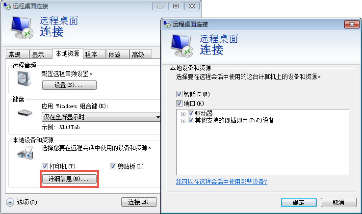
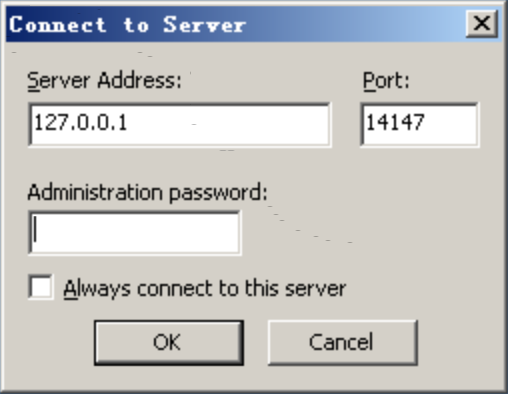
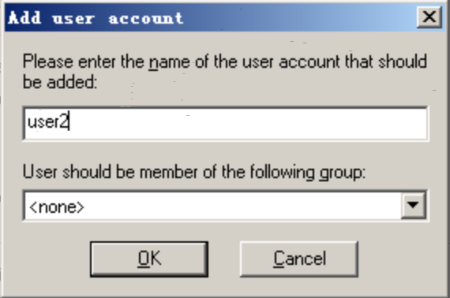
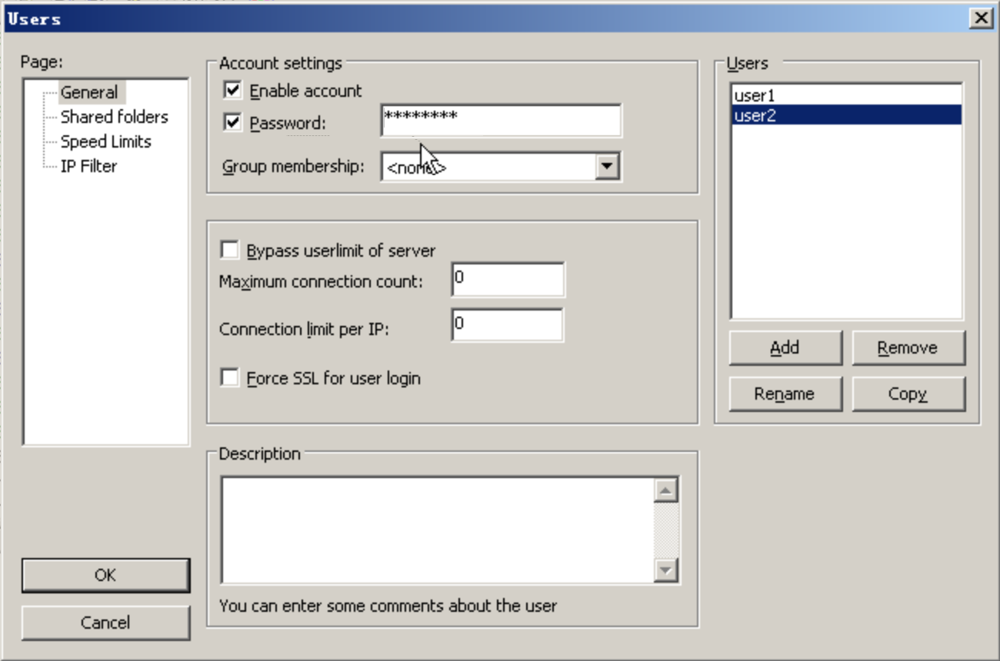
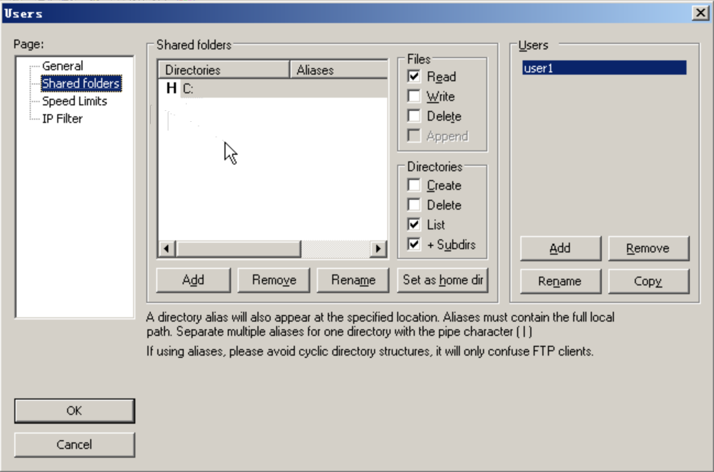
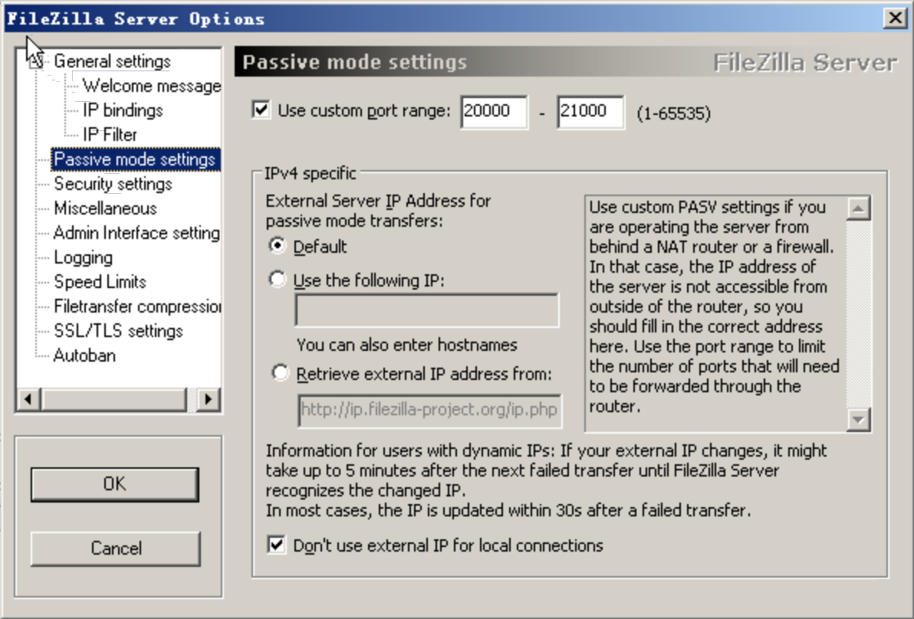

---
---

#### 为什么我的主机不能访问外网？ {#id2}

只有绑定了公网 IP 的主机才可以访问外网。

#### 主机绑定了公网 IP 之后，为什么我无法通过 IP SSH 登录，也不能 ping 通该 IP？ {#ip-ip-ssh-ping-ip}

为了加强位于基础网络 vxnet-0 中的主机的安全性， 青云在主机之前放置了一个防火墙（Security Group）。 初始状态下，每个防火墙都不包含任何规则，即，全部端口都是封闭的， 您需要建立规则以打开相应的端口。

>注解
如果你的主机使用的是默认防火墙，那么 ping 和 ssh 的端口都是默认打开的，你无需再进行操作。

例如您需要访问主机的22号端口，需要手动为主机的防火墙添加一条 接受 tcp 22 端口 的下行规则，然后再点击 更新规则 使其应用到主机。

同理，如果你想开启 ping 功能， 需要在防火墙里头添加 接受 ICMP echo request 的下行规则。

#### 如果我有多台主机需要访问外网，是不是每台主机都需要绑定一个公网 IP？ {#ip}

当然不是这样。您可以将需要访问外网的主机加入到您的某个受管私有网络中， 再将该受管私有网络连接到您创建的路由器上， 然后再给路由器上绑定一个公网 IP。这样， 位于受管私有网络中的所有主机都可以连接互联网了，既节省钱，也节约 IP 地址。

#### 主机关机后还收费吗？ {#id3}

当主机关机后，只收取系统盘的费用，按照系统盘的占用空间收费，收费标准同硬盘，CPU / 内存则不再收费。

除此以外，再说明下青云其他资源的收费规则:

*   公网 IP 是从申请后就开始收费，不论是否处于使用状态。因为这个 IP 一旦被申请，别人就不能再占用。
*   硬盘、自有镜像都是从创建时起开始收费，直到删除。
*   路由器、负载均衡器只在“启动”后收费，关闭后便停止计费。
*   防火墙、密钥、私有网络都是免费的。

#### 连接青云远程终端时的默认登录用户名和密码是什么？

您可以在主机对应的映像详情页中找到默认的用户名和密码。

#### 为什么我的主机无法获取 IP 地址？

青云官方提供的 Linux 映像使用 NetworkManager 来自动化主机的网络配置， 其默认配置是通过 DHCP 方式来获取 IP 地址，你需要保证 NetworkManager 相关的 daemon 正常运行。 如果工作不正常，你可以手动重启：

RHEL/CentOS

```
# service NetworkManager restart
```

Fedora

```
# systemctl restart NetworkManager
```

Debian

```
# service network-manager restart
```

Ubuntu

```
# service network-manager restart
```

必要时，你可能需要重启 messagebus daemon 后才能正常启动 NetworkManager：

RHEL/CentOS

```
# service messagebus restart
# service NetworkManager restart
```

Fedora

```
# systemctl restart messagebus
# systemctl restart NetworkManager
```

Debian

```
# service messagebus restart
# service network-manager restart
```

Ubuntu

```
# service dbus restart
# service network-manager restart
```

#### 何种情况下我需要手动配置网络？

青云提供了两种网络配置模式，一种是全自动化的， 您的主机的所有网络配置与管理都交给青云系统完成， 称之为受管模式（Managed），另一种是手动的， 您必须自己关心主机的网络配置与管理，比如 IP 地址、路由等， 称之为自管模式（Unmanaged）。 显然，当您使用自管模式时，需要手动配置网络。 而当受管网络所连接的路由器上关闭了 DHCP 功能时，也需要手动配置网络。

对于如何为处于自管网络的主机手动配置静态 IP 地址，请参考以下两条问答。

#### 如何为 Linux 主机配置静态 IP 地址？

请注意，只有当主机位于自管私有网络之中，或者受管私有网络的路由器关闭了 DHCP 时，您才需要自行配置 IP 地址。

>注解
请勿手动配置基础网络中主机的 IP，否则会造成网络无法连接。

青云官方提供的 Linux 映像使用 NetworkManager 来自动化主机的网络配置， 其默认配置是通过 DHCP 方式来获取 IP 地址。以下步骤描述了如何配置静态地址：

第一步，用指令 ``ip link`` 或者 ``ifconfig -a`` 找到网卡在主机中的设备名， 通常名为 ``eth0``、``eth1`` 等，以下以 ``eth0`` 名字为例。

第二步，配置网卡

RHEL/CentOS/Fedora

```
# vi /etc/sysconfig/network-scripts/ifcfg-eth0
DEVICE=eth0
BOOTPROTO=static
ONBOOT=yes
TYPE=Ethernet
NM_CONTROLLED=no
IPADDR=192.168.100.11
NETMASK=255.255.255.0
GATEWAY=192.168.100.1
NETWORK=192.168.100.0
BROADCAST=192.168.100.255
```

对于 CentoOS 系统，手动配置网卡可能会和 NetworkManager 的管理有冲突，所以我们建议在手动配置网卡前先将 NetworkManager 禁用，禁用方法为：

```
# service NetworkManager stop
# chkconfig NetworkManager off
```

Debian/Ubuntu

```
# vi /etc/network/interfaces
auto eth0
iface eth0 inet static
address 192.168.100.11
netmask 255.255.255.0
gateway 192.168.100.1
network 192.168.100.0
broadcast 192.168.100.255
```

第三步，重启 NetworkManager 使之生效

如果之前已经将 NetworkManager 禁用，那么请忽略此步操作。

RHEL/CentOS

```
# service NetworkManager restart
```

Fedora

```
# systemctl restart NetworkManager
```

Debian

```
# service network-manager restart
```

Ubuntu

```
# restart network-manager
```

#### 如何为 Windows 主机配置静态 IP 地址？ {#windows-ip}

请注意，只有当主机位于自管私有网络之中时，您才需要自行配置 IP 地址。

依次 开始 –> 控制面板 –> 网络，右键点击 本地连接，选择 属性， 在弹出的对话框中，选中 Internet 协议版本4，然后点击 属性 按钮， 在弹出的对话框中即可设置静态 IP 地址。

#### 如何启用 SSH 密码登录 Linux 主机？ {#ssh-linux}

为了安全方面的考量，青云官方提供的 Linux 映像都禁用了 SSH 密码登录。 当然，您完全可以自行启用密码登录， 但请一定记得修改操作系统用户密码为复杂字串，否则极不安全。

以下步骤启用 SSH 密码登录

```
# vi /etc/ssh/sshd_config
PasswordAuthentication yes
```

重启 ssh daemon 使之生效

RHEL/CentOS

```
# service sshd restart
```

Fedora

```
# systemctl restart sshd
```

Debian/Ubuntu

```
# service ssh restart
```

> 警告
强烈建议不要使用密码方式 SSH 登录！

#### 如何使用 SSH 密钥来访问主机？ {#ssh}

你需要在控制台的“计算” -> “SSH 密钥”里面创建一个 SSH 密钥， 然后加载到你的主机上并下载私钥文件（例如 ``kp-1234abcd`` ）。

>注解
在进行 SSH 连接之前，请确保在主机对应的防火墙下行规则中打开 TCP 22 号端口的访问。

**Linux下，使用下面的命令登录**

```
# chmod 600 /path/to/kp-1234abcd
# ssh -i /path/to/kp-1234abcd root@ip_address
```

**Windows 下用 putty**

很多 Windows 桌面用户都会使用著名的 PuTTY 作为 SSH 客户端来登录远程的 Linux 主机，但是 PuTTY 不支持 OpenSSH 的密钥格式，而是使用它自己的密钥格式。因此，PuTTY 提供了一个名为``puttygen``的密钥格式转换工具。

*   首先下载 putty 和 puttygen：

    [http://www.chiark.greenend.org.uk/~sgtatham/putty/download.html](http://www.chiark.greenend.org.uk/~sgtatham/putty/download.html)

*   转换密钥格式

    启动 puttygen，点击 ``Conversions -> Import key``，选中您在青云中创建并下载的 SSH 密钥，文件名形如``kp-1234abcd``。然后点击 ``Save private key``，您将得到 PuTTY 格式的私钥，如kp-1234abcd.ppk

*   配置登录

    打开 putty。

    点击 putty 左边导航的 connection -> data, auto-login username 处填入登录名：root

    点击 putty 左边导航的 connection -> ssh -> auth, 最下面有 private key file for authantication 字样，点击旁边的 browse，选择之前生成的 kp-1234abcd.ppk 文件，确定。

    点击 putty 左边导航的 session，host name 中填写主机的 公网IP 地址，例如1.2.3.4。

    最后点击下面的 open 进行连接即可。

    如果想下次登录方便，可以点击 putty 左边导航的 session，在 save sessions 中填入名称并保存，将当前配置保存下来。

**Windows 下使用 SecureCRT**

>注解
推荐使用 SecureCRT 6.5 及以上版本，低版本会出现私钥无法导入的情况

*   在青云控制台的“安全” -> “SSH 密钥”里创建 SSH 密钥，将这个密钥加载到主机上并下载私钥文件，例如 kp-12345678；
*   在 SecureCRT 上创建一个新连接，protocol 是 SSH2，hostname 是 公网IP 地址，username 为 root；
*   右键选中这个 session，选择 Properties，在 Connection -> SSH2 的 Authentication 面板里面，选中 PublicKey，点击右边的上箭头，将这个选项排到第一位；
*   继续选中 PublicKey，点击右边的 Properties，选择 Use session public key setting，在下面的 Use identity or certificate file，导入下载的私钥文件 kp-12345678；
*   连接即可。

较低版本的 SecureCRT 可能会遇到无法导入私钥的问题，因为低版本的 SecureCRT 会严格要求私钥需要和公钥共同存在，这种情况下，操作步骤如下：

*   在青云控制台创建 SSH 密钥，将这个密钥加载到主机上并下载私钥文件，例如放置于 /path/to/kp-1234abcd ；
*   在路径 /path/to/ 下创建新文件 kp-1234abcd.pub；
*   在 SSH 密钥 kp-1234abcd 的详情页中找到公钥的字符串，并拷贝下来放入 kp-1234abcd.pub 文件中，并且在公钥内容前面加上加密方式，最终文件内容为：ssh-rsa AAAAB3NzaC1yc2EAAAADAQABAAABAQC90PM9PT........；
*   在 SecureCRT 上创建一个新连接，protocol 是 SSH2，hostname 是公网 IP 地址，username 为 root；
*   右键选中这个 session，选择 Properties，在 Connection -> SSH2 的 Authentication 面板里面，选中 PublicKey，点击右边的上箭头，将这个选项排到第一位；
*   继续选中 PublicKey，点击右边的 Properties，选择 Use session public key setting，在下面的 Use identity or certificate file，导入下载的私钥文件 kp-12345678；
*   连接即可。

**Windows 下使用 Xshell**

注解

推荐使用 Xshell 5 及以上版本

*   在青云控制台的“安全” -> “SSH 密钥”里创建 SSH 密钥，将这个密钥加载到主机上并下载私钥文件，例如 kp-12345678；
*   在 Xshell 上 创建(New) 一个新 会话(Session) ，协议(Protocol) 是 SSH，主机(Host) 是公网 IP 地址；
*   左侧标签中切换到 用户身份验证(Authentication)，右侧表单中 方法(Method) 选择 Public Key ，用户名(Username) 为 root ，点击 用户密钥(User Key) 左侧 浏览(Browse) 按钮；
*   选择并 导入(Import) 刚才下载的私钥文件 kp-12345678；
*   连接即可。

#### SSH 客户端连接 timeout 问题 {#ssh-timeout}

ssh 的默认配置为了安全考虑，当发现客户端一段时间内没有输入，就会断开这个 session， 这给使用者带来些许不便。解决这个问题有两种办法：

*修改 ssh server 端配置，添加

```
# vi /etc/ssh/sshd_config
ClientAliveInterval 60
ClientAliveCountMax 3
```

修改后记得重启 ssh server

*修改 ssh client 端配置，添加

```
# vi /etc/ssh/ssh_config
ServerAliveInterval 60
ServerAliveCountMax 3
```

#### 主机密码忘记了怎么办？ {#id7}

**Linux 主机**

对于 Linux 主机，你可以通过 SSH 密钥登录来获取 root 权限，然后通过 passwd 命令来修改密码。 关于 SSH 密钥登录可以参见 FAQ 的 [如何使用 SSH 密钥来访问主机](#ssh)

**Windows 主机**

对于 Windows 主机，你可以提交工单，由管理员帮你重置密码。

#### 为什么我的主机的私有 IP 会发生变化？ {#id8}

注：仅在SDN1.0的区中，基础网络（vxnet-0）的IP可能会发生变化。在SDN2.0的区中，在主机运行期间，基础网络的IP不会变化。

如果您的主机位于基础网络 vxnet-0 中，那么私有 IP 是有可能发生变化的。 因为青云系统在 vxnet-0 网络里面内置了一个 DHCP 服务器， 网内主机的内网IP都是通过 DHCP 方式获取的。 一般而言，持续运行中的主机的内网 IP 很少会发生 IP 改变（当然不能保证不变）。 如果主机停机了再启动，则由于 DHCP lease 时间已过，一般变化可能性就比较大。 你可以使用我们提供的内网域名解析服务来规避这个问题，例如主机 ID 是 i-12345678 ，则 i-12345678.pek3.qingcloud.com 解析的就是内网 IP 。 也就是说，虽然主机 IP 有可能变化，但是域名是不变的。

如果您的主机位于自己创建的私有网络中，并且该私有网络是受管私有网络， 则主机的私有 IP 也是通过 DHCP 服务器分配的，且是固定 IP 。

如果您的主机位于自己创建的私有网络中，并且该私有网络是自管私有网络。 在这种情况下，由于私有 IP 都是您自己管理的，所以私有 IP 也是不会发生变化的。

#### 为什么我的 Windows 主机远程桌面连接不上？ {#windows}

首先， 在 Windows 主机里打开RDP服务：

*  使用“虚拟终端”登录 Windows 主机，“虚拟终端”就是主机 ID 旁边的 显示器形状的小图标，点击即可以弹出 Windows 桌面;
*  右键点击“我的电脑” -> “属性” -> “远程” -> 选择”启用这台机器上的远程桌面”。

然后您需要在青云控制台的 “安全” -> “防火墙” 中手动为主机的防火墙添加一条 接受 tcp 3389 端口 的下行规则， 点击 更新规则 使其应用到主机。

如果希望在 Windows 本地电脑与远程服务器之间复制粘贴，你需要确认如下设置：

*  打开本机的远程桌面连接时，按照下图所示勾选要远程使用的资源。



*  在服务器上打开任务管理器，查看进程，看是否有 rdpclip.exe 进程。 通常，只要存在该进程，就可以在本机和远程服务器之间粘贴文本了。 如果没有此进程则需要手动启动，开始->运行->rdpclip.exe

> 注意： 请确认关闭了主机内部防火墙或者主机内部防火墙放行了相应的端口。

#### 如何开启 Windows 的共享功能 {#id9}

警告

Windows SMB (Server Message Block) 很容易感染病毒和被黑客袭击，请谨慎使用。 推荐使用 FTP 方式传文件，如果一定要用共享，建议复制完文件就关闭共享。

修改注册表:

```
HKEY_LOCAL_MACHINE\SYSTEM\CurrentControlSet\Services\lanmanserver\parameters
Dword: AutoShareServer 1

HKEY_LOCAL_MACHINE\System\CurrentControlSet\Services\NetBT\Parameters
Dword: SMBDeviceEnabled 1
```

如果是 window 2008，还需要:

*   打开 控制面板 –> 网络和Internet –> 网络和共享中心
*   点击左侧的 更改适配器设置 ，右键点击 网卡 ，并选择 属性
*   在弹出的对话框中勾中 Microsoft网络的文件和打印机共享 并确定
*   回到 控制面板 –> 网络和Internet –> 网络和共享中心
*   点击左侧的 更改高级共享设置 ，确保 公用（当前配置文件） 项下的各个与共享相关的选项都启用了，并确定

最后重启你的 Windows 即可。

#### 如何设置 Windows 磁盘自动挂载 {#id10}

Windows 主机挂载硬盘之后，如果主机发生重启，硬盘可能没法自动挂载，需要人工登录并进行手动 “联机” 操作， 以下方法可以帮助你设置硬盘自动挂载:

*   打开 Windows 命令行工具, 即 cmd
*   运行 diskpart
*   DISKPART> san policy=OnlineAll

#### 加载硬盘了之后如何使用？ {#id11}

**1\. 如何分区格式化？**

硬盘有 disk size 和 partition size 两个概念。

如果你的硬盘是第一次加载的硬盘，就需要进行分区、格式化，和 mount 操作。 如果是老硬盘，且没有扩容，就不用再分区、格式化了，直接 mount 就行。

警告

如果硬盘容量大于1TB，不要用 fdisk，可使用 parted 工具进行分区。

以 Ubuntu Linux 为例，以下操作需要 root 权限。

第一步我们先为磁盘分区

*   [使用 fdisk 分区](#fdisk)

    通过 fdisk -l 命令查看挂载的硬盘，假设为 /dev/sdc

    ```
    # fdisk -l
    ...
    Disk /dev/sdc: 10.7 GB, 10737418240 bytes
    64 heads, 32 sectors/track, 10240 cylinders, total 20971520 sectors
    Units = sectors of 1 * 512 = 512 bytes
    Sector size (logical/physical): 512 bytes / 512 bytes
    I/O size (minimum/optimal): 512 bytes / 512 bytes
    Disk identifier: 0x00000000

    Disk /dev/sdc doesn't contain a valid partition table
    ```

    对硬盘进行分区:

    ```
    # fdisk /dev/sdc
    ```

    然后根据提示，依次输入 **n**, **p**, **1**, 以及 **两次回车**，然后是 **wq**，完成保存。 这样再次通过 fdisk -l 查看时，你可以看到新建的分区 /dev/sdc1

    ```
    # fdisk -l
    ...
    Disk /dev/sdc: 10.7 GB, 10737418240 bytes
    64 heads, 32 sectors/track, 10240 cylinders, total 20971520 sectors
    Units = sectors of 1 * 512 = 512 bytes
    Sector size (logical/physical): 512 bytes / 512 bytes
    I/O size (minimum/optimal): 512 bytes / 512 bytes
    Disk identifier: 0x17adb4cb

    Device Boot      Start         End      Blocks   Id  System
    /dev/sdc1            2048    20971519    10484736   83  Linux
    ```

*   [使用 parted 分区](#parted)

    通过 parted -l 命令查看新挂载的硬盘，假设为 /dev/sdc

    ```
    # parted -l
    ...

    错误: /dev/sdc: unrecognised disk label
    ```

    对硬盘进行分区:

    ```
    # parted /dev/sdc
    ```

    然后创建新分区

    ```
    (parted) mklabel gpt
    (parted) mkpart primary 1049K -1
    (parted) quit
    ```

    这时再查看硬盘信息时会看到 /dev/sdc1

    ```
    # parted -l
    ...
    Model: QEMU QEMU HARDDISK (scsi)
    Disk /dev/sdc: 10.7GB
    Sector size (logical/physical): 512B/512B
    Partition Table: gpt

    Number  Start   End     Size    File system  Name     标志
     1      1049kB  10.7GB  10.7GB               primary
    ```

第二步分区后要进行格式化，例如格式化为 ext4 格式

```
# mkfs -t ext4 /dev/sdc1
```

最后一步是挂载硬盘:

```
# mkdir -p /mnt/sdc && mount -t ext4 /dev/sdc1 /mnt/sdc
```

警告

为了防止宿主机在突然断电时可能对数据带来的风险，如果文件系统是ext3， 则需要在mount的时候显式的指定”barrier=1”选项，例如”mount -t ext3 -o barrier=1 /dev/sdc1 /mnt/point”

**2\. 如何自动挂载？**

如果你需要在系统启动时自动挂载，不要在 /etc/fstab 直接指定 /dev/sdc1 这样的写法， 因为在云中设备的顺序编码在关机、开机过程中可能发生改变，推荐使用 UUID 或者 LABEL 的方式来指定:

如果使用 UUID，则先通过 “blkid /dev/sdc1” 命令，得到磁盘的 UUID，例如：

```
/dev/sdc1: UUID="185dc58b-3f12-4e90-952e-7acfa3e0b6fb" TYPE="ext4"
```

然后在 /etc/fstab 里面，加入:

```
UUID=185dc58b-3f12-4e90-952e-7acfa3e0b6fb /mnt/sdc ext4 defaults 0 2
```

如果使用 LABEL，则在格式化硬盘时，需要指定 LABEL，例如:

```
mkfs -t ext4 -L MY_DISK_LABEL /dev/sdc1
```

然后在 /etc/fstab 里面，加入:

```
LABEL=MY_DISK_LABEL /mnt/sdc ext4 defaults 0 2
```

警告

修改完 fstab 请使用 “mount -a” 先检查下是否有问题。

#### 如何对硬盘进行扩容？ {#id12}

硬盘有 disk size 和 partition size 两个概念。通过青云控制台或 API 扩容只是扩大了硬盘的物理空间，即 disk size 。 在加载到主机后还需要手动扩大 partition size。

有很多工具可以做到调整分区大小、而不损坏数据，比如 Windows 上有 pqmagic， Linux 上也有这样的工具，如 parted，fdisk，图形界面下可以用 gparted， 命令行下，得看您的分区是什么文件系统，如果是 ext2/ext3/ext4 的话，就用 resize2fs 来扩容。

警告

建议在扩容前先对硬盘做一次备份，万一操作失误还可以回滚。 如果硬盘容量大于1TB，不要用 fdisk，可使用 parted 工具进行分区。

下面以 CentOS Linux 为例，假设主机上已挂载一块 10GB 的硬盘，分区为 “/dev/sdc1” （有些磁盘的分区可能是 /dev/vd*），文件系统格式为 “ext3”，挂载位置是 “/mnt/sdc”，现在需要扩容到 20GB 。步骤如下 (需要 root 权限)：

**[第一步]** 先在主机内部卸载硬盘：

```
umount /mnt/sdc
```

**[第二步]** 在控制台将硬盘从主机解绑，点右键将硬盘进行扩容后再重新绑定到主机。

**[第三步]** 开始扩大分区:

*   [使用 fdisk 扩大分区](#id13)

    通过 “fdisk -l” 查看硬盘分区号，假设还是 “/dev/sdc1”，你的显示内容可能有些区别，比如units是sector而不是下面显示的cylinder。

    ```
    # fdisk -l
    ...
    Disk /dev/sdc: 21.5 GB, 21474836480 bytes
    64 heads, 32 sectors/track, 20480 cylinders
    Units = cylinders of 2048 * 512 = 1048576 bytes
    Sector size (logical/physical): 512 bytes / 512 bytes
    I/O size (minimum/optimal): 512 bytes / 512 bytes
    Disk identifier: 0x56250342

       Device Boot      Start         End      Blocks   Id  System
    /dev/sdc1            1024       10240     9438208   83  Linux
    ```

    这时可以看到 Disk /dev/sdc 的物理容量已是 20GB，不过 sdc1 还是原来的大小， 磁柱是从 1024 到 10240。

    警告

    其中的起始磁柱位置（Start 对应的数字，此例中是 1024）要牢记， 后面重新分区时要用到。

    我们开始对 sdc 重新分区（不会损失数据）：

    ```
    # fdisk /dev/sdc
    ```

    输入 **d** 删除 sdc1 分区，之后依次输入 **n**, **p**, **1** 建立新分区。在输入新分区起始磁柱（First cylinder）或者是起始扇区(First sector)时，依然选择之前的数字 1024 ，这样可以防止数据丢失。设定好后输入 **wq** 使分区表生效。

*   [使用 parted 扩大分区](#id14)

    通过 “parted -l” 查看硬盘分区号，假设还是 “/dev/sdc1”，

    ```
    # parted -l
    ...
    Model: QEMU QEMU HARDDISK (scsi)
    Disk /dev/sdc: 21.5GB
    Sector size (logical/physical): 512B/512B
    Partition Table: gpt

    Number  Start   End     Size    File system  Name     标志
     1      1049kB  10.7GB  10.7GB  ext3         primary
    ```

    这时可以看到 Disk /dev/sdc 的物理容量已扩大，不过 sdc1 还是原来的大小， 磁柱是从 1049k 到 10.7GB。

    警告

    其中的起始位置（Start 对应的值，此例中是 1049k）要牢记， 后面重新分区时要用到。

    我们开始对 sdc 重新分区（不会损失数据）：

    ```
    # parted /dev/sdc
    ```

    先删除 sdc1 分区

    ```
    (parted) rm 1
    ```

    建立新分区。起始位置（Start）依然选择之前的值: 1049k

    ```
    (parted) mkpart primary 1049k -1
    (parted) quit
    ```

**[第四步]** 分区扩大后我们还要通过 resize2fs 调整 sdc1 的文件系统大小

```
e2fsck -f /dev/sdc1
resize2fs /dev/sdc1
```

**[最后一步]** 重新挂载硬盘：

```
mount -t ext3 -o barrier=1 /dev/sdc1 /mnt/sdc
```

这时通过 “df -h” 指令即可查看扩容后的分区大小

#### 如何搭建 FTP 服务 {#ftp}

**Linux 主机**

首先创建一个 Linux 主机(以 Ubuntu 为例)，并在青云防火墙中打开 tcp 21 下行，并“更新规则”。 如果此主机是在私有网络中，除了防火墙规则，还需要在私网所连接的路由器中将所需端口转发给这个主机。

下面简单介绍下安装 vsftpd 和 proftpd 的注意事项：

*   vsftpd 安装

    ```
    apt-get install vsftpd
    ```

    修改配置文件 /etc/vsftpd.conf 后，重启生效

    ```
    service vsftpd restart
    ```

    如果你的 ftp client 位于 NAT 之后，ftp server 必须启用 passive mode ，编辑 /etc/vsftpd.conf

    ```
    pasv_enable=Yes
    pasv_max_port=21000
    pasv_min_port=20000
    pasv_address=your.ftp.server.public.ip
    ```

    安全起见，vsftpd 默认配置是不允许 root 登录的。如果确实需要，可以在 /etc/vsftpd/user_list 文件中把 root 那一行删除或者注释掉， 同样把 /etc/vsftpd/ftpusers 文件中的 root 也注释掉。然后重启 vsftpd 就可以了。

*   proftpd 安装

    ```
    apt-get install proftpd
    ```

    修改配置文件 /etc/proftpd/proftpd.conf 后，重启生效

    ```
    service proftpd restart
    ```

    如果你的 ftp client 位于 NAT 之后，proftpd server 必须启用 passive mode ， 在 /etc/proftpd/proftpd.conf 中打开 PassivePorts 和 MasqueradeAddress ：

    ```
    PassivePorts 20000 21000
    MasqueradeAddress ftp.server.public.ip
    ```

注解

被动模式的端口范围可以任意指定，不过请记得打开青云防火墙中对应的端口范围， 如果 FTP 服务器是在私有网络内，还要留意路由器内是否正确转发了所需端口。 还有修改配置文件后记得重启 FTP 服务使之生效。

**Windows 主机**

首先创建一台 Windows 主机，以 Windows Server 2003例，在青云防火墙中打开 TCP 21 下行规则，并“应用修改”。 如果此主机是在私有网络中，除了防火墙规则，还需要在私有网络所连接的路由器中将所需端口转发给这个主机。

下面简单介绍下 FTP 服务器的安装步骤和注意事项，以 FileZilla 为例：

*   安装

    点击 [这里](http://sourceforge.net/projects/filezilla/files/FileZilla%20Server/0.9.43/) 下载安装包。解压并双击 .exe 文件进行安装。 若无特殊需求，按照提示选择默认选项安装即可。到最后一步时，点击“OK”完成安装。

    [](_images/setup_filezilla_ok.png)
*   添加用户

    点击菜单中的“编辑 Edit” - “用户 Users”，在弹出的对话框中点击 “用户 Users” 区域中的 “添加 Add” 按钮，输入用户名，确认后可以设置用户密码，以及可访问的文件路径。

    [](_images/filezilla_add_user.png)
     [](_images/filezilla_set_passwd.png) [](_images/filezilla_set_file.png)

    用户添加设置完成后点击左下角的“确认 OK” 按钮完成操作。

*   设置服务器

    如果你的 ftp client 位于 NAT 之后，则需要启用 FTP 服务的“被动模式 Passive Mode”， 具体设置步骤是：选择菜单中的“编辑 Edit” - “设置 Settings”，在弹出的对话框中点击“被动模式设置 Passive mode settings”。 并勾选“自定义端口范围 Use Custom Port Range”，并输入端口范围，例如：20000 - 21000。

    [](_images/filezilla_set_passive_mode.png)

    设置完成后点击左下角的“确认 OK” 按钮完成操作。

注解

被动模式的端口范围可以任意指定，不过请记得打开青云防火墙中对应的端口范围， 如果 FTP 服务器是在私有网络内，还要留意路由器内是否正确转发了所需端口。

完成以上操作后则完成了 FTP 服务器的搭建，可以开始连接服务器进行文件的传输操作。

**通过 SFTP 方式传输文件（通过 SSH 的方式传输文件）**

如果主机开启了 SSH 服务，则无需在主机上建立 FTP 服务，客户端直接利用 SSH 传输文件。

以 FileZilla 为例：

**[第一步]** 菜单栏依次打开【文件】-【站点管理器】，打开站点管理器

**[第二步]** 点击新站点按钮建立新的站点连接

**[第三步]** 在该站点的右边配置项依次填入主机相关信息

*   通过密钥连接（推荐）

    *   主机：主机 IP 及 SSH 端口
    *   协议：SFTP - SSH File Transfer
    *   登陆类型：密钥文件
    *   用户：SSH 登陆的用户名
    *   密钥文件：选择你的私钥文件，通常为 ~/.ssh/id_rsa

    点击【连接】，会弹出把 sshkey 转换成 FileZilla 所接受的 key 的格式的窗口，确认即可。然后再密钥文件里选择生成的 key 文件，点击【连接】即可连接成功。

*   通过密码连接

    *   主机：主机 IP 及 SSH 端口
    *   协议：SFTP - SSH File Transfer
    *   登陆类型：询问密码
    *   用户：SSH 登陆的用户名

    点击【连接】，会弹出窗口，然后输入正确的服务器 ssh 登陆的密码即可连接成功。

#### 青云主机之间的网络带宽是多少？ {#id16}

为了保证用户之间的公平，青云对主机之间的网络带宽限制为：

>
>
> *   广东一区/北京一区/北京二区/亚太一区 平均限制为 512Mbps，峰值限制为 1Gbps
> *   北京三区/上海一区/广东二区/亚太二区 平均和峰值限制均为 2Gbps
>
>

#### 青云的公网带宽上下行速率是对称相等的吗？ {#id17}

为了提高用户在青云中的下载体验，对于公网IP的带宽小于 10Mbps 的，上行速率等同带宽，下载带宽自动提高到10Mbps; 带宽大于 10Mbps 的，上下行带宽保持和申请带宽相同。

#### 青云主机的 IO 限制是多少？ {#io}

为了保证用户之间的公平，青云对主机硬盘 IO 限制是128MB/s。 如果您的测试结果偏高，可能是操作系统的 cache 导致的，如果在 Linux 系统下， 请在 dd 命令里面使用 conv=fdatasync 参数避免操作系统 cache 对结果的影响。

#### 我的主机由于误操作不小心销毁了，还可以恢复吗？ {#id18}

对于某些收费资源，例如主机、硬盘和映像，被删除后可以在2个小时之内恢复。 对于其他收费资源，例如公网IP和路由器，销毁后不可以被恢复。

不收费的资源，一旦删除，都不可以被恢复。

#### 我的资源配置发生更改后，收费是如何变更的？ {#id19}

由于我们是按秒计费，配置变更成功后，价格会随之实时改变。

#### 我的资源因为欠费被暂停使用了，充值之后系统会帮我自动恢复吗？ {#id20}

会，系统会尝试自动恢复欠费的资源。但由于资源间的依赖关系，有可能自动恢复失败，请在充值后再检查下资源状态。

#### 欠费后我的资源会被如何处理？ {#id21}

所有收费资源在欠费后，我们都会将其保留 10 天时间，并发出欠费提醒邮件。 这里，对于没有备案或者备案信息不正确的公网 IP 来说处理有些区别，请参见下一条。

#### 欠费后的公网 IP 会被如何处理？ {#id22}

对于通过青云备案信息验证的公网 IP，我们会在欠费之后为用户保留 10 天， 并发出欠费提醒的邮件；对于不需要备案或备案信息没有通过验证的公网 IP， 一旦欠费就会被系统释放回资源池。

#### 为什么会收取 IP 地址附加费? {#addition}

IP 地址附加费是 IP 地址的占用费。每个主账户名下都有免费的 IP 地址额度，当申请的 IP 地址个数超过免费额度时，我们会按照 IP 地址的成本收取 IP 地址附加费，并且该费用记在主账户名下。

#### 公网 IP 流量计费的具体统计方法是什么？ {#id23}

如果公网 IP 的计费模式是按流量计费，则除了固定的 IP 地址价格外， 流量数据会每小时自动统计一次，统计方法是： 在即将扣费的时间范围内，分别对进、出数据量求和，然后取其中较大的值作为扣费依据。

为了保持跟带宽计费一致的优惠策略（请见： [青云的公网带宽上下行速率是对称相等的吗](#id17) ) ，只有当下行速率超出 10Mbps 时才会对其扣费。例如：

一个按流量计费的、带宽上限是 20Mbps 的公网IP，在一个扣费周期内有 30 分钟其下行速率一直保持在 18Mbps ，有 10 分钟其上行速率一直保持在 10Mbps ， 则在即将扣费的时间范围内对进、出数据量求和结果如下（这里为了方便举例， 上下行速率假设一直稳定在一个固定值，而实际计算时使用的是采样间隔为1分钟的速率数据）：

>
>
> 进数据量之和 ＝ 8Mbps（18 Mbps 减去优惠的 10 Mbps） * 1800（秒数） / 8 = 1800 MB (megabyte)
>
> 出数据量之和 ＝ 10Mbps * 600（秒数） / 8 = 750 MB (megabyte)
>
>

因为进数据量之和大于出数据量之和，所以此1小时的实际扣费是 1800 MB / 1024 * 流量单价（每GB ** 元）

警告

公网 IP 计费模式不能频繁切换，24小时内只能改一次。

#### 什么情况下我需要备案，如何备案？ {#id24}

详情请见: [青云备案管理系统](https://www.qingcloud.com/icp/intro) 。

#### 为什么 80 端口被禁用 {#id26}

根据上级网管要求，对于一些对备案要求较为严格的区域，用户需要完成备案才能使用 80 端口提供服务，在完成备案之前，80端口将被禁用。 在完成备案流程之后，用户需要将申请到的备案号填入公网 IP 对应的 “ICP备案” 信息字段中 (具体操作在公网 IP 的右键菜单 “设置 ICP 备案信息” 中)， 待管理员审核通过之后，才能正常使用 80 端口的服务。

#### 注册的时候，应该选择什么币种？ {#id27}

注册新用户的时候，需要选择一个币种，在充值、资源计费以及退款的时候都使用该币种。 目前支持的币种有人民币、港币和美元。资源的价格在不同币种下有所不同。

人民币账户充值时使用支付宝和多种银行的网络银行支付，港币和美元账户使用 paypal 支付。paypal 支付时可以关联 VISA、MasterCard 等国际结算的银行卡，选择币种时，需要考虑您用于支付的账户是否开通了该种货币支付的功能。

注册完成之后，用户的币种不能修改，因此请确认您的支付方式后选择。

#### 青云系统有欠费通知吗？ {#id28}

有的。我们会实时监控用户的消费情况，当发现用户的余额满足不了未来的消费需求时， 我们会提前15天开始邮件通知用户进行充值。另外， 当有资源因为欠费而被暂停使用时，我们也会有邮件对用户进行通知。

#### 青云默认的资源配额限制满足不了我的使用需求，我该如何提交申请？ {#id29}

您可以通过 [工单系统](https://console.qingcloud.com/tickets/) 来提交您的申请，并告知您申请提高配额的理由。 在通过我们的审理之后，我们会更新您的配额并进行通知。

#### 在青云数据库中存储中文字符需要修改哪些配置？ {#id31}

可以在不修改任何数据库配置的情况下存储中文字符， 具体方法可以参考 [_数据库服务指南_](../database_cache) 『指定编码』一节。

#### 我应该如何选择缓存服务？ {#id32}

我们的缓存服务支持 Redis 和 Memcached。Redis 支持数据持久化，并且支持更加丰富的数据类型; Memcached 不支持数据持久化。如何选择取决于用户的业务需求，如果没有特殊要求，我们推荐使用 Redis。 如果你希望简单，可以使用 Memcached。

#### 为何我的 Windows 主机无法向外发起 远程桌面连接 或 SQL Server连接 {#windows-sql-server}

青云系统判定了一些高危端口，默认将其加入了【青云防火墙】并禁止。 对于加入到【基础网络】的 Windows 主机，青云系统默认限制了几个“上行防火墙”规则：

>
>
> 协议tcp，端口3389,1433,445,135,139;
>
> 协议udp，端口1434,445,135,137,138。
>
>

Windows 主机向外发起 远程桌面连接，您需要在【青云防火墙】放行规则 tcp 上行 3389端口;

Windows 主机向外发起 SQL Server连接，您需要在【青云防火墙】放行规则 tcp 上行 1433端口。

#### 除了密码之外，我如何保护账号的安全 {#id33}

您可以在青云系统的 [账号安全中心](https://console.qingcloud.com/account/security/center/) 根据您的需求和使用习惯，开启账号安全相关的选项，以强化账号的安全。

账号安全中心的详细介绍，您可以参考 [_账号安全指南_](../quick_start/account/user_security.html#guide-user-security)

#### 网卡多队列 Nic Multi Queue 功能如何使用 {#nic-multi-queue}

青云的主机支持开启网卡多队列功能。您可以在创建主机的向导第 4 步 - 基本信息展开高级选项，选择启用网卡多队列。对于已经创建的主机，您可以在详情页 - 配置，找到网卡多队列的当前设置。如果想要启用或禁用该服务，可以关机之后点击相应的操作按钮。

网卡多队列是利用 hash 算法，将网络流量分散到多个网卡队列中，交由多个 CPU 同时处理请求，利用CPU多核特性提高网络处理能力。 开启这个功能后，虚拟机挂载的网卡会有多队列功能，但是 Linux 系统还需要做相关配置，才能使用到这一特性，包括：

*  设置网卡队列数，数值应等于 cpu 数量
*  给网卡接收队列绑定 cpu
*  给网卡发送队列绑定 cpu

为了方便使用，我们提供了 [网卡队列配置脚本](../_downloads/nic_mq.sh) 配置这些参数，请把脚本放到/etc/rc.local中，开机自动配置。 详情请参考 [linux network scaling](https://www.kernel.org/doc/Documentation/networking/scaling.txt)

系统要求：

Linux:

*   kernel >= 3.8
*   安装了 ethtool 工具

Windows Server：

*   版本>= 2012

#### 青云BGP多线资源是如何分布的？ {#bgp}

北京一区：BGP多线，包括：电信、联通、移动（铁通）、教育网、鹏博士（长宽、电信通等）、歌华等。

北京二区：BGP多线，包括：电信、联通、移动（铁通）、教育网、科技网。

北京三区：BGP多线，包括：联通、电信、移动、铁通、其他中小运营商（鹏博士、宽带通、长宽、电信通、歌华、方宽、世纪互联等），以及30个左右的小型运营商。

上海一区：BGP多线，包括：联通、电信、移动、铁通、其他中小运营商（鹏博士、宽带通、长宽、电信通、歌华、方宽、世纪互联等），以及30个左右的小型运营商。

广东一区：BGP四线，包括：电信、联通、移动、铁通。

广东二区：BGP多线，包括：联通、电信、移动、铁通、其他中小运营商（鹏博士、宽带通、长宽、电信通、歌华、方宽、世纪互联等），以及30个左右的小型运营商。

亚太一区：国际线路，国内BGP四线：电信、联通、移动（铁通）、教育网。

亚太2区：国际线路直连多家运营商：Telstra/Apple/ChinaCache/BIH/AnChang/xTom/Telekomunikasi/PCCW/EQUINIx等，国内BGP四线：电信、联通、移动（铁通）、教育网。

#### 关于同数据中心多副本与同数据中心单副本的差异体现在什么地方呢？ {#id35}

（1）价格差异

同数据中心的多副本与单副本只在块存储上有体现。运行时的主机操作系统盘是不收费的，所以单副本与多副本只有在主机关机时价格才有区别;硬盘的单副本与多副本价格是有区别的。

（2）使用场景说明

单副本不会跨网络传输，性能和 IO 延迟会更好，适合于已经做过副本策略的业务场景，例如 hadoop 等。
青云提供的主机和硬盘默认都是至少多个实时副本，这些副本保存在不同的硬件上，可以确保某台硬件出现故障时，数据可以通过实时副本来恢复。
