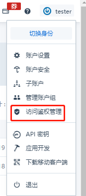

---
---

# 访问鉴权管理

**访问鉴权管理（Identity and Access Management，IAM）**是一款在 QingCloud 平台上提供身份识别和访问控制的 Web 服务。通过使用 IAM 来统一管理和控制接入实体的认证和授权，能更安全地自主管控本账户下的任意资源访问权限。

使用者将需要自行通过 IAM 来定义 **Who** （谁可以接入访问）、**How**（如何接入访问）、**What**（接入访问后能干什么），其中 `Who` 和 `How` 将由 **IAM 身份**来定义，`What` 将取决于 **IAM 策略**的配置。

## IAM 名词解释

### 策略

**策略**是一系列 QingCloud 云服务自定义权限的集合。

当您通过 IAM 策略定义某个服务或资源的权限范围后，可以将该策略附加到指定的身份上，则身份将获得此策略所定义的访问权限。

QingCloud 为您提供了一系列系统预置策略以满足日常管理需要，您也可以通过 IAM 管理控制台可视化配置策略以满足您的特定权限管理需求。

如何创建策略，请参阅：[IAM 策略](policies.html)

### 身份

**身份**用于管理本账户的临时接入访问。

通过身份您可以授权其他青云账户访问自己的 QingCloud 资源，也可以授权 QingCloud 平台设备或应用访问自己其他 QingCloud 资源而无需借助账号密码或密钥。

身份需要附加策略后使用，当身份被附加了一定权限范围的策略后，则该身份将具备此策略定义的访问权限。

QingCloud 为 IAM 身份接入提供专属 SDK ，以辅助提高您的云平台应用开发效率。

如何创建和使用身份，请参阅：[IAM 身份](roles.html)

### 信任载体

只有被身份信任，才可以使用对应的身份，因此在使用身份之前，需要建立信任关系。这个因已与身份建立了信任关系而可以代入该身份使用的实体被称为**信任载体**。

您在创建身份时，需要指定信任载体。身份创建成功后，便已成功将该身份和某一类实体建立了信任关系。

> 注：若您在创建身份时指定的信任载体为产品资源，您需要继续在身份上关联指定具体的载体资源它才能代入使用此身份。

更多“信任载体”相关信息，请参阅：[信任载体](trustworthy.html)

### 会话有效期

为了保证您的平台账户及资源安全，每个身份在被代入使用时系统将会为该身份生成一个临时凭证。此凭证将有别于现有的账号密码或 API 密钥，过一段时间就会自动失效。身份每次被使用时的凭证自动失效时长即称之为身份的**会话有效期**。

创建身份时，选择不同的信任载体类型我们将会提供相应的默认会话有效期，您可以在身份创建成功后通过编辑身份属性来修改该身份的会话有效期。

> 凭证失效前 QingCloud 系统会自动为此身份更新凭证，因此您无需担心身份的使用问题。
>
> 您可以参考身份对账户可操作的敏感程度来定义身份的安全级别，我们推荐您为更高安全级别的身份使用更短的会话有效期。

更多“会话有效期”相关信息，请参阅：[IAM 身份](roles.html)

### 服务类别

**服务类别**指的是 QingCloud 平台为客户提供的一系列云服务，如弹性云主机服务、虚拟专用网服务等。

若您决定针对性的创建策略以定义某些操作或资源的访问权限，您需要先选择对应的服务类别，然后勾选需要限定的操作，最后根据操作来指定权限范围。

如何创建策略，请参阅：[IAM 策略](policies.html)

> 只有经过 IAM 集成的服务才可以创建自定义策略，暂未集成的服务将会默认被 IAM 评估拒绝。
>
> 目前并非所有的 QingCloud 服务都可以通过 IAM 来控制访问权限。

QingCloud IAM 已支持的服务列表，请参阅：[IAM 支持的服务列表](services.html)

### QRN（资源标识符）

当您通过 IAM 策略来指定特定资源的被访问权限时，该特定资源需要被一个全平台唯一的编号所标识，它就是**资源标识符（QingCloud Resource Name，QRN）**。

我们为整个 QingCloud 平台统一了所有不同类别的资源标识方法，在 IAM 策略使用过程中均需遵循此方法。

请参阅：[QRN（资源标识符）](qrn.html)

为了帮助 QingCloud 客户更快的理解和上手使用 QRN ，我们在每个需要输入 QRN 的地方提供了`QRN 生成器`小工具。

如何使用 QRN 生成器，请参阅：[QRN 生成器](qrn.html#QRN生成器)

## IAM 的作用与特点

### 共享访问

您可以通过配置 IAM ，向您的 QingCloud 资源或其他 QingCloud 账户授予权限来管理和使用您账户中的资源，而不必共享您的账户密码或 API Access Key。

例如，您可以允许您的主机中创建的应用通过集成 QingCloud 官方 SDK 获取身份凭证信息，随后即可在应用中直接调用 QingCloud API/CLI 以访问其他资源。

请参阅：[场景演练①：免密钥应用开发](scenes.html#场景演练①：免密钥应用开发)

### 精细权限

您可以通过配置 IAM ，向不同的身份实体授予不同的资源访问权限。

例如，您可以允许您的子账户 A 通过代入您赋予的身份完全访问您账户中的弹性云主机服务（支持创建、启停或销毁主机等），而同时允许 QingCloud 系统中的另一个账户 B 通过代入您赋予的身份仅具备查看某个特定主机信息的权限。

请参阅：[场景演练②：跨账号管理协作](scenes.html#场景演练②：跨账号管理协作)

## IAM 登陆入口

当您需要使用 QingCloud IAM 来控制您的服务资源访问时，您可以登陆到 QingCloud 控制台后，点击账户头像下方的“访问鉴权管理”即可进入 QingCloud IAM 配置页面：

