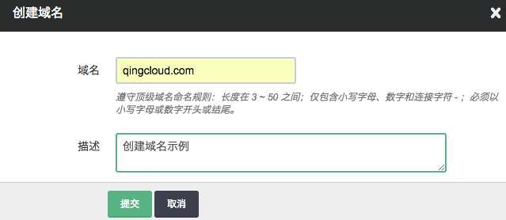

---
---

# CDN 加速

CDN 的全称是 Content Delivery Network，即内容分发网络。 通过在网络各处放置节点服务器所构成的在现有的互联网基础之上的一层智能虚拟网络， CDN 系统能够实时地根据网络流量和各节点的连接、 负载状况以及到用户的距离和响应时间等综合信息将用户的请求重新导向离用户最近的服务节点上。 其目的是使用户可就近取得所需内容，解决 Internet 网络拥挤的状况，提高用户访问网站的响应速度。

## CDN 原理图

*   **缓存服务器:** 用户直接获取资源的节点，如果用户访问资源在缓存服务器中不存在，则缓存服务器会向源站请求资源并缓存，然后返回给用户，下次用户访问时，缓存服务器可直接返回资源，不需要请求源站。
*   **源站:** 源站指发布内容的原始站点。添加、删除和更改网站的文件，都是在源站上进行的。缓存服务器所缓存的全部数据均是从源站获取。（图中的 web 站点）
*   **智能DNS:** 他的作用是根据用户的网络状况，把用户的请求指向最适合用户的缓存服务器。

## 创建

注解

从创建 CDN 到可以使用大致需要 30 分钟左右，您要使用 CDN 的域名必须进行备案。本指南中要加速的域名为 cdnexample.qingcloud.com

**第一步：创建域名(domain)**

点击域名服务中的 CDN 进入如下界面

点击创建进入如下界面

在创建的对话框中，点击添加域名，输入自己的主域名。

注解

该域名是主域名 如：我们要为 cdnexample.qingcloud.com 加速，他的主域名是 qingcloud.com 。

**第二步：创建域名记录(子域名)**

填写你要加速的子域名

注解

该域名是子域名 如：指除去主域名的部分 如: cdnexample.qingcloud.com 中的 cdnexample

填写回源地址

回源地址就是您源站的地址，您静态资源的所在站点， 当 CDN 中不存在请求的内容时，会去源站请求资源返回给用户并且缓存在 CDN 缓存服务器中。回源的方式有两种， IP 回源和域名回源:

*   使用 IP 回源时只能填写一个IP
*   如果使用域名回源则只能使用一个域名 如 resource.qingcache.com

开启 HTTPS (可选)

如需开启 HTTPS 则点击 “同时支持 HTTP/HTTPS 服务” 或 “只支持 HTTPS 服务”，在证书列表选择一个要使用的证书， 点击创建证书可上传自己网站的证书和秘钥， 注意使用HTTPS只支持网页类型加速，不支持下载和点播。另外，使用 “只支持 HTTPS 服务” 会让 HTTP 访问的用户跳转成 HTTPS 访问。

**第三步：选择节点类型**

不同类型的节点背后对应不同的资源池，通常情况下，选择网页即可。点击确定后即可创建成功。

**缓存规则**

在 CDN 列表页点击域名记录进入 CDN 详情页，在缓存策略一栏点击创建

常见的缓存规则书写

*   如果要缓存 cdnexample.qingcloud.com/image 下的png jpg gif 可以使用/image/.*\(png\|jpg\|gif\)
*   如果要缓存 cdnexample.qingcloud.com 下的所有 mp4 js png jpg html 可以使用 /.*\(png\|jpg\|gif\|mp4\|js\|html\)
*   只允许一个 最多只允许一个 *

*   **名称:** 名称是用帮助记忆该条规则的
*   **路径:** 对哪些路径下的哪些文件应用该缓存规则
*   **缓存时间:** 对路径中的文件的缓存时间单位是秒
*   **优先级:** 如果有多条缓存规则，路径可能存在冲突，优先级高的规则优先生效，优先级数字越小优先级越高。
*   **忽略 Cache Control:** 如果 header 中的 Cache Control 是 private ，CDN 默认不缓存该文件。但如果此参数设置为 “是” ，则 CDN 会忽略 Cache Control 头强制缓存
*   **忽略查询字符串:** 如果带有查询串默认情况下 CDN 是不会缓存该资源，如果该选项为 “是” 则会强制缓存。

**访问控制:**

在 CDN 列表页点击域名记录进入 CDN 详情页，在访问控制一栏点击创建

注解

黑名单

以下图为例 该条规则的含义是 referer 主域名为 baidu.com ，google.com 以及 www.example.com 发起的请求，都无法访问 png jpg gif 文件。

*   **名称:** 名称是用帮助记忆该条规则的
*   **路径:** 对哪些路径下的哪些文件应用该访问控制
*   **优先级:** 如果有多条访问控制规则，路径可能存在冲突，优先级高的规则优先生效，优先级数字越小优先级越高。
*   **Referers:** 从一个页面请求资源或跳转 会存在一个 referer 信息表示从哪个页面发起的请求 可以只用*表示所有子域名如 *.baiud.com *.google.com
*   **行为:** 使用黑名单还是白名单控制访问，黑名单表示列表中的 referer 禁止访问；白名单表示只允许 referer 列表中的站点访问

注解

白名单

以下图为例 该条规则表示 referer 中主域名 qingcloud.com 或 www.qingcache.com 者空 referer 可以访问该文件

*   **名称:** 名称是用帮助记忆该条规则的
*   **路径:** 对哪些路径下的哪些文件应用该访问控制
*   **优先级:** 如果有多条访问控制规则，路径可能存在冲突，优先级高的规则优先生效，优先级数字越小优先级越高。
*   **Referers:** 从一个页面请求资源或跳转 会存在一个 referer 信息表示从哪个页面发起的请求 可以只用 “*” 表示所有子域名如 *.baiud.com *.google.com
*   **允许空 Referer:** 当用户直接在访问该路径时 referer 为空，是否允许访问
*   **行为:** 使用黑名单还是白名单控制访问，黑名单表示列表中的 referer 禁止访问 白名单表示 “只” 允许列表中的 referer 的站点访问

**第四步：使用 CDN 为站点进行加速**

在自己的使用的 DNS 服务商处配置 CNAME 以本域名为例，需要将 cdnexample.qingcloud.com CNAME 配置为 c6ae6ff50806c.cname.qingcache.com 至此您的域名就已经可以使用 CDN 进行加速了。

**修改加速节点类型**

在 CDN 详情页基本属性的右上角可以点击修改节点类型

警告

修改加速节点类型可能会造成大量回源，请谨慎使用。

**HTTPS/HTTP切换**

警告

修改协议可能会造成大量回源，请谨慎使用。

如果想切换当前的协议到另外一种协议可以使在 CDN 详情页点击域名图中的为 qingcloud.com 切换到域名记录列表页进行操作

可以选择解绑

**监控**

为用户提供各类数据报表业务，包括流量，访问次数，带宽，热门访问地区，热门访问资源等

注解

各项统信息会有10分钟左右的延时 * 流量 单位MB * 带宽 单位Mbps 该带宽为五分钟为粒度的平均带宽 * 访问次数 用户请求CDN的次数 * 热门访问地区 统计各地区的请求次数 * 热门访问资源 统计用户该记录下访问次数最多的文件

带宽监控

流量监控

访问次数监控

访问地区监控

热门访问资源监控

**日志**

该日志是从 CDN 缓存服务器中得到的原始访问数据，默认提供的分析维度比较少，可以下载原始日志进行更多维度的分析。默认保存10天的日志

**清除 CDN 缓存**

当您更新了文件但是该文件的旧的版本可能已经被 CDN 缓存需要手动清除 CDN 的缓存重新回源去拿最新的文件。 点击清除 CDN 缓存

点击创建

填写需要刷新的文件或者目录的url 需要以 [http://](http://) 或 [https://](https://) 开头

**CDN 预取**

当您有较大的文件需要提前缓存到 CDN 的节点上的时候可以使用预取功能，该功能会模拟用户请求使文件提前缓存到 CDN 中。

点击创建

填写需要预取的文件 url 需要以 [http://](http://) 或 [https://](https://) 开头

## 价格

CDN 目前使用按流量实行阶梯价格，累计统计每月初清零，每天计算并扣除前一天的费用。 具体价格参照下表:

| 流量阶梯 | HTTP/HTTPS 价格 |
| --- | --- |
| 0-3TB | 0.23元/GB |
| 3-10TB | 0.22元/GB |
| 10-50TB | 0.21元/GB |
| 50-100TB | 0.19元/GB |
| 100-1000TB | 0.17元/GB |
| >1000TB | 0.15元/GB |

## FAQ

**创建CDN服务后用户在DNS服务器设置CNAME不生效:**

确认下该域名记录客户是否在DNS服务器配置其他记录如MX等，部分DNS厂商不支持CNAME和其他记录共存，这种情况建议跟DNS厂商反馈

**创建CDN时提示余额不足:**

创建CDN服务时，需要有10元以上的余额

**没有域名配额:**

一般是用户没有实名认证，建议先进行实名认证

**创建CDN 服务是否需要备案**

创建cdn服务需要备案，但是可以不用在青云进行备案，只要域名已经备案即可

**CDN节点类型无法修改**

建议用户可以先删除cdn服务，等一个小时再创建cdn服务，重新选择节点类型

**使用 CDN 后无法访问:**

查看创建的域名记录，dig该域名，是否cname到我们的域名后缀qingcache.com，之后查看该域名的源站，指定源站访问是否正常。若用户配置的是域名回源，指定源站访问时host填回源域名是否可以正常访问，若正常访问，建议修改cdn的origin host为回源域名

**无法删除域名记录:**

确认域名记录是否绑定证书，如果绑定证书后，需要先解除绑定才能删除域名记录

**多个帐号添加相同的主域名:**

暂时不支持多个帐号添加相同的主域名

**创建cdn服务后没有监控数据:**

确认域名记录是否cname过来，并且已经被访问，一般需要等十分钟后才有监控数据

**创建 CDN 需要多久生效:**

一般十分钟以内

**使用 CDN 后如何获取用户真实 IP:**

用户可以尝试获取 header 中的X-Forwarded-For和cdn-src-ip获取真实IP

**开启 HTTPS 后如何让通过 HTTP 访问的用户跳转到 HTTPS:**

在创建域名记录时，选择 “只支持 HTTPS 服务”

**如果我改变了协议类型如何计费:**

我们的计费会在每天凌晨进行扣费，扣去昨天的消费，会按照 0 时的协议类型进行扣费。比如在 23:50 从 HTTP 切换到了 HTTPS 该日也会按照 HTTPS 进行计费。

**为什么我无法改变服务/协议类型了:**

因为协议或者服务类型的切换，会设涉及到大量的资源调度，所以我们会限制该操作的频率，目前在24小时内只允许切换一次。

**如何理解加速域名与回源域名的关系:**

加速域名是您最终要直接暴露给用户访问的域名，回源域名仅用作 CDN 解析到服务器 IP 。如果使用 Nginx 作为 web 服务器 server_name 应该是”加速域名”而不是”回源域名”

**CDN 创建完成后我该如何使用:**

去您域名的 DNS 服务商将加速域名做 CNAME 解析 将加速域名 CNAME 到青云 CDN 详情页提供的 CNAME 地址上即可完成

**域名回源与IP回源的区别是什么?**

域名回源通过解析出域名背后的 IP 然后通过 IP 进行回源，你可以在 DNS 处任意更改域名后的 A记录 来切换源站，而 IP 回源需要在青云切换 IP 源站。

**暂时不支持自助配置，需要提工单进行人工配置的功能有:**

1）设置回源鉴权策略
2）设置跨域规则
3）设置大文件切片

