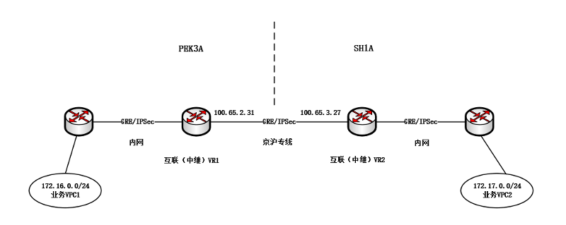
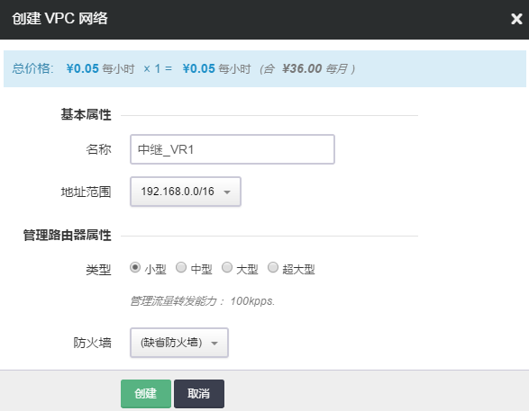
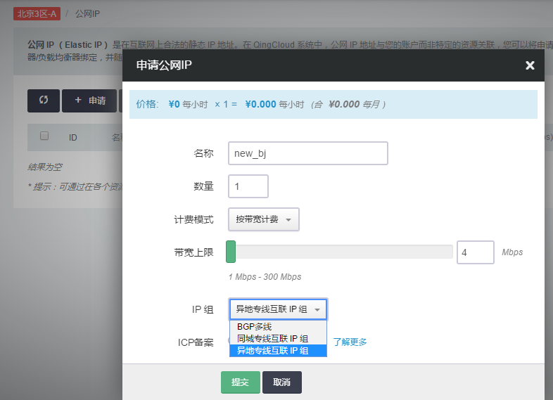
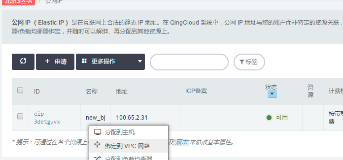
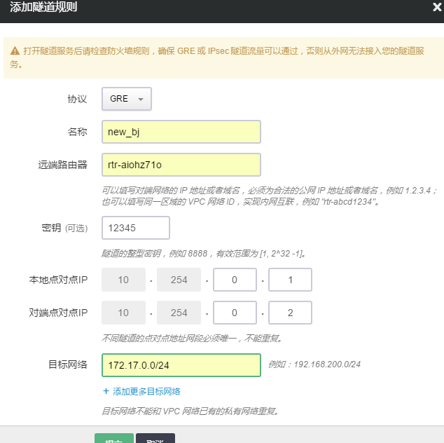
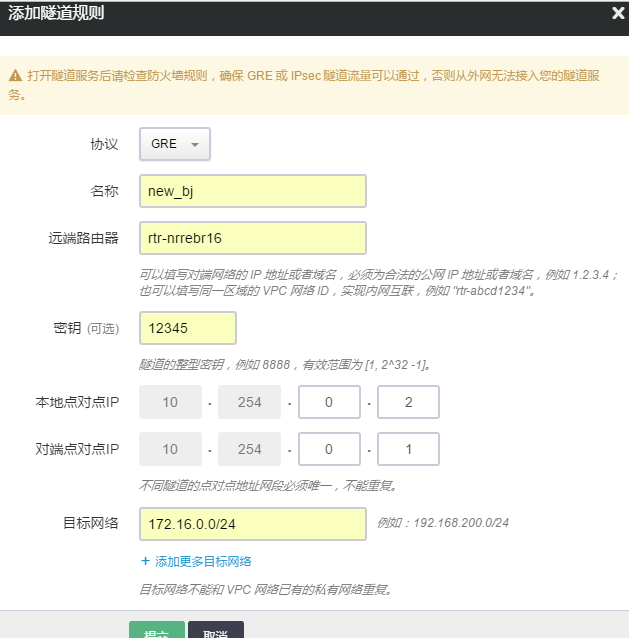
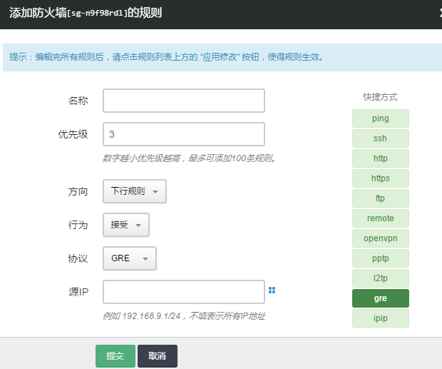
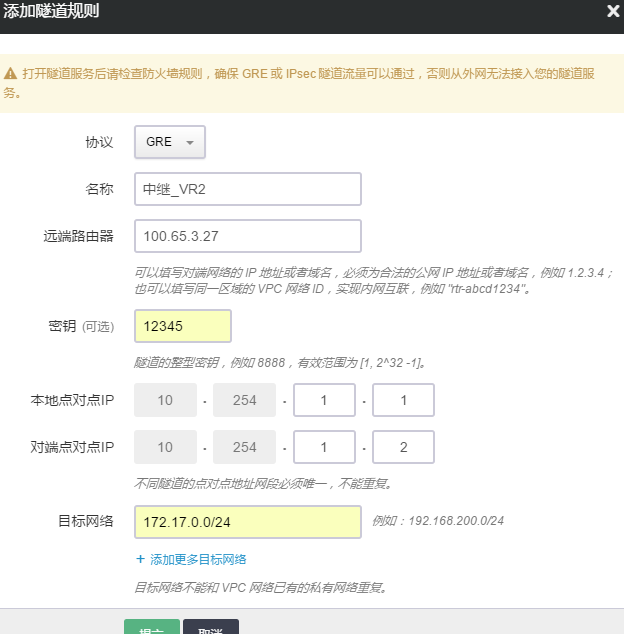
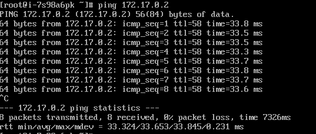

---
---

# 同城/异地专线配置指南

## 背景

客户的业务已部署在青云的公有云，随着客户业务不断发展，青云支撑客户在异地的公有云的部署，并且实现客户异地之间的 VPC 私有网络打通，依托于 QingCloud 动态多线 BGP 网络资源优势保证客户既能正常访问互联网又解决了客户与异地数据中心的实时通信。

如下图所示，假如您在青云已有的业务 VPC1 要与上海的已有业务 VPC2 网络进行实时通信，通过内网之间分别与动态 BGP 出口直连建立 GRE 隧道连接在一起，实现与 VPC2 的业务通信。

## 操作

登录 WEB 控制台，创建新中继_VR1

左边导航条中选择“公网IP”，创建公网IP且为“异地专线互联IP组”

注解

异地专线互联IP是指不在同一个城市，如京沪两地间互联IP。 同城专线互联IP是指在同一个城市，如PEK3 的不同数据中心间互联IP。

左边导航条中选择“公网IP”，选择新创建的公网IP，右键选择“公网IP绑定到VPC网络”，选择“中继_VR1”完成提交

左边导航条中选择“VPC网络”，点击当前业务VPC1，点击“管理配置”，点击“隧道服务”，点击“添加隧道规则”

在弹出的对话框里，填写以下项目:

> 
> 
> *   协议: 默认为 GRE 协议
> *   名称: 为该隧道起个名字，比如 new_bj
> *   远端路由器 IP: 在本角色中为中继_VR1的ID
> *   密钥: 一个两端共同使用的约定整型数字，比如 12345
> *   本地点对点 IP: 隧道在北京的地址，比如 10.254.0.1
> *   对端点对点 IP: 隧道在上海的地址，比如 10.254.0.2
> *   目标网络: 在本例中的私有网络172.17.0.0/24（上海）
> 
> 

确认无误后点击提交且点击页面上方的“应用修改”按钮

左边导航条中选择“VPC网络”，点击中继_VR1，点击“管理配置”，点击“隧道服务”，点击“添加隧道规则”

确认无误后点击提交且点击页面上方的“应用修改”按钮

左边导航条中选择“VPC网络”，点击右侧“防火墙”，点击创建，允许GRE协议且行为是“接受”

确认无误后点击提交且点击页面上方的“应用修改”按钮

到此为止，业务VPC1 与中继_VR1的GRE建立完成。

用相同的思路和方法在上海站点进行配置，完成业务VPC2与中继_VR2的GRE建立。

第二阶段完成VR1与VR2 之间的GRE建立。

左边导航条中选择“VPC网络”，选择中继_VR1，点击“管理配置”，点击“隧道服务”，点击“添加隧道规则”

在弹出的对话框里，填写以下项目:

> 
> 
> *   协议: 默认为 GRE 协议
> *   名称: 为该隧道起个名字，比如 new_sha_repeater
> *   远端路由器 IP: 在本角色中，为对端中继_VR2的公网IP 100.65.3.27
> *   密钥: 一个两端共同使用的约定整型数字，比如 12345
> *   本地点对点 IP: 隧道在VR1的地址，比如 10.254.1.1
> *   对端点对点 IP: 隧道在VR2的地址，比如 10.254.2.2
> *   目标网络: 在本例中的私有网络172.17.0.0/24（上海）
> 
> 

确认无误后点击提交且点击页面上方的“应用修改”按钮

用相同的思路和方法在上海站点进行配置。 形成VR1与VR2的GRE建立。

最后，测试从北京主机172.16.0.2到上海主机172.17.0.2

IPSec隧道的配置方法类似，请参考IPSec指南: [IPSec指南](ipsec.html#guide-ipsec)
