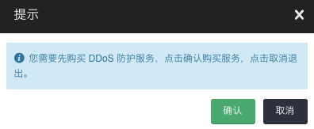

---
---

# 域名 

域名(Domain)指的是顶级域名。用户可以在这里管理顶级域名、为其创建域名记录、为域名记录添加各种服务，如：证书服务、CDN、DDoS 防护等，顶级域名必须备案。

## 创建

**第一步：创建域名**

点击 **CDN／防D服务** 中的 **域名** 进入如下界面

点击 **添加** 跳出如下界面

在域名框里输入顶级域名，顶级域名命名规则遵守：长度在 3 ~ 50 之间；仅包含小写字母、数字和连接字符 - ；必须以小写字母或数字开头或结尾。

**第二步：配置服务**

**创建域名记录**

点击您的 **域名** 进入域名服务详细页面进行配置，进入界面如下

在“域名记录”中可以创建和管理自己的域名记录，如创建二级域名，点击创建，跳出如下界面：

输入域名记录名称，回源地址，选择 HTTPS 服务(支持多选)。

> 注解：

> 名称必填项，格式必须以英文字母或数字开头，不能以 . 结尾，只能含有英文字母、数字或者 - . ，支持多级域名。如果名称是 @，表示支持主域名。

> 回源地址如果是公网 IP 地址 ，格式为 122.22.22.22；如果是域名，格式为 xxx.example.com；

> 注意：绑定 DDoS 防护的域名记录其回源地址只能是公网 IP 地址。
 
选择HTTPS服务(支持多选)

如果不支持 HTTPS 服务，点击 **不开启** ；如果同时支持 HTTPS/HTTP 服务，点击 **同时支持HTTPS/HTTP** ；如果支持HTTPS服务，点击 **只支持HTTPS服务** 。当点击“同时支持 HTTPS/HTTP ”或“只支持 HTTPS 服务”，跳出如下界面

点击确认，进入如下界面

输入证书名称，证书和私钥。

> 注解：证书和私钥格式可参考“样例”

**配置域名记录**

选择域名记录点击更多操作或鼠标右击域名记录，跳出如下界面：

支持操作：

* 修改，修改会员域名和 HTTPS，跳出如下界面

* 更新证书，跳出如下界面

点击 **创建证书**。

* 启用 HTTPS，跳出如下界面

点击 **确认**。

* 启用 CDN，跳出如下界面

输入 Origin Host，选择节点类型和服务区域。

> 注意： Origin Host 仅支持域名，可以不填；HTTPS 服务只能选择网页类型。

* 启用 DDoS 防护，跳出如下界面

点击 **购买** ，进入“购买 DDoS 攻击防护服务”页面，具体参考 DDoS 攻击防护页面操作。

* 删除

**第三步：配置 DNS 解析**

请你的域名服务供应商处修改你的域名解析，此处以 DNSPod 为例。

登录 DNSPod，可查看到原来的域名记录，www 记录已在添加到青云中，因此删除（或暂停）www 的 A 记录。

如下图，www 的 A 记录已经暂停：

在 DNSPod 重新配置 www 的 CNAME 记录，记录值则指向青云提供的 CNAME 值。如下图：

保存，并耐心等待生效。CNAME修改生效一般需要1-2个小时。

## FAQ

**域名为什么需要备案**

法律规定：未经备案，不得在中华人民共和国境内从事非经营性互联网信息服务。
