---
---

# 入门教程

## 添加域名

登录 QingCloud 控制台，点击左侧导航条中的 **网络与 CDN / DNS**，进入如下界面：

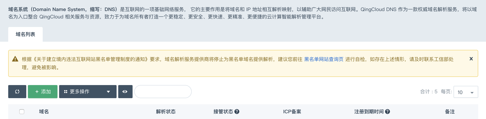

点击 **添加** ，在下方弹窗中输入您在注册商处申请的域名。

> 请注意：您的域名必须真实有效且未被纳入工信部备案黑名单。
>
> QingCloud DNS 将定期同步[IANA 域名后缀列表](https://www.iana.org/domains/root/db)，若您发现新的域名后缀无法添加，请及时与我们联系。

### 域名列表

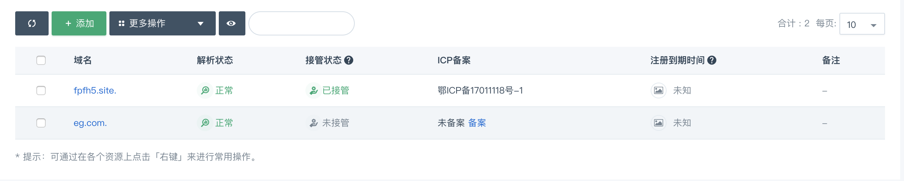

我们将定时刷新域名的解析状态、接管状态、备案信息及注册信息，如果您发现信息不一致可以点击列表刷新按钮以重新获取状态。

> 请注意：备案信息及注册信息仅供参考，QingCloud DNS 不保证该信息的准确性，请以注册商或工信部备案系统为准。

## 创建解析记录

点击需要解析的域名，进入 **解析记录** 页面：

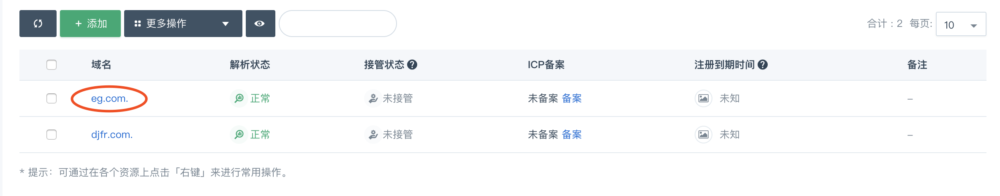

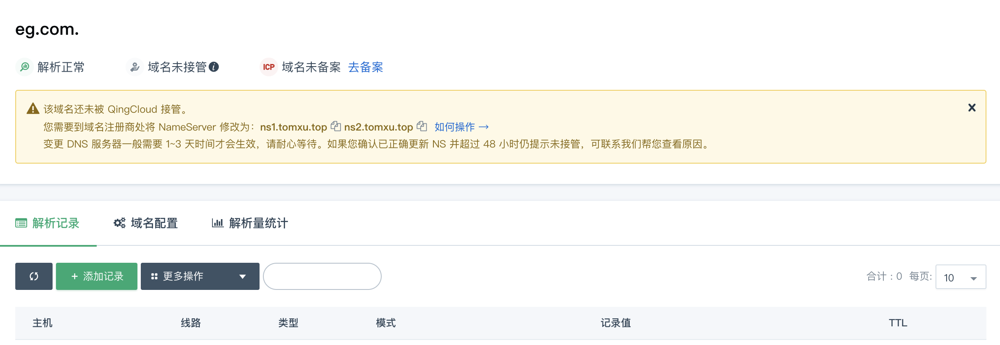

点击 **添加记录** 按钮，显示添加记录输入框。

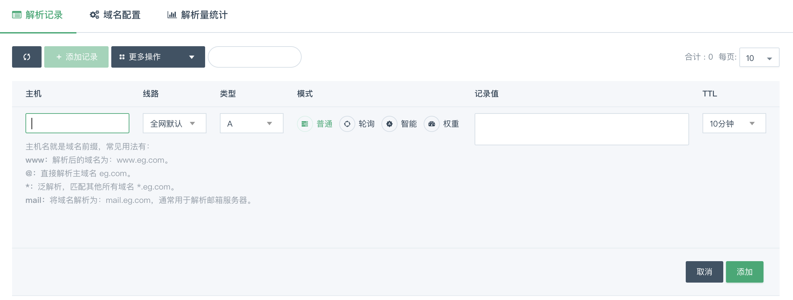

也可以在对应的主机名中右键 **添加记录** ：

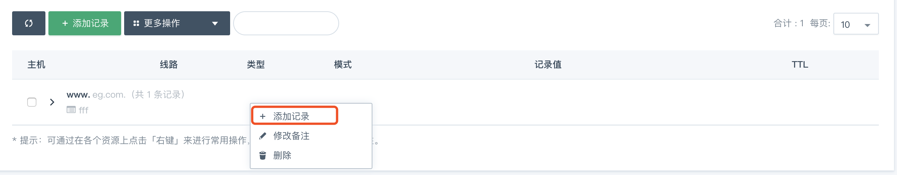

按对话框指引，填写主机名和记录值，选择线路、记录类型、模式和 TTL 后提交即可。

* 示例：将 www.eg.com 默认解析指向网站服务器 IP 地址 1.1.1.1 。

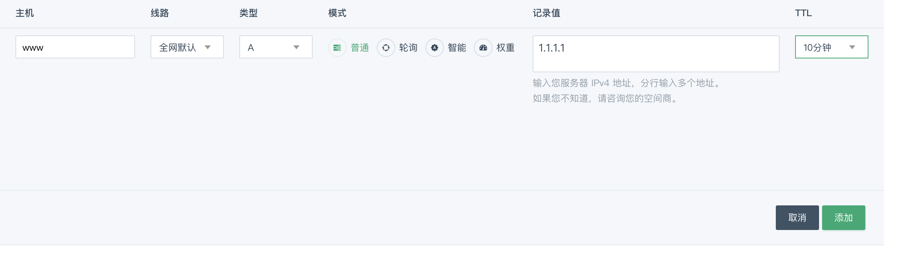

> 注：QingCloud DNS 默认为您提供 5 条解析线路：**全网默认、中国电信、中国联通、中国移动、港澳台及海外** ，若您需要使用更多其他解析线路，需要自行配置。
>
> 请参阅：[如何配置自定义解析线路？](dns_view)

## 修改域名 DNS 服务器

若您的域名 DNS 服务器不是 QingCloud 提供的 DNS 服务器，则您在 QingCloud DNS 面板上所做的解析管理操作将不会真实有效。

如果您考虑使用 QingCloud DNS 为您的域名管理解析，您需要参照以下方法修改您的域名 DNS 服务器。

1. 登录控制台查看并复制 QingCloud DNS 服务器

    > 注：QingCloud DNS 会采取一定的规则将域名划分到不同的 NameServer 平台，具体服务器地址请以对应域名解析页面的提示为准，如下图所示。

    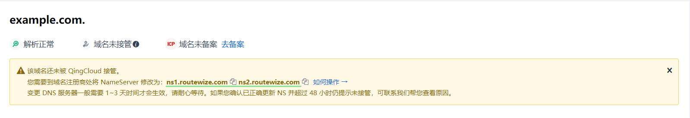

    上图可见，当前域名需要将 DNS 服务器修改为 `ns1.routewize.com` 和 `ns2.routewize.com` ，QingCloud DNS 才会接管。

2. 登录您的域名注册商后台，找到对应域名的 NameServer 填写处

    * 国内注册商以阿里云为例：

        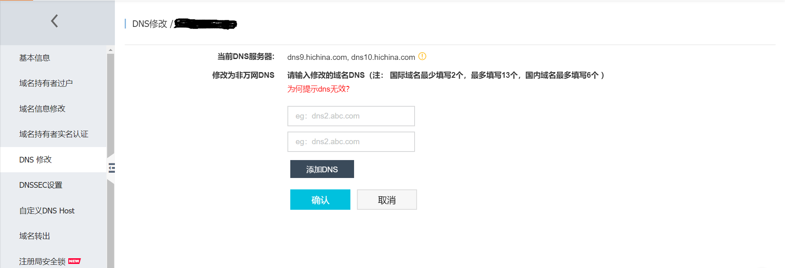

    * 海外注册商以 Godaddy 为例：

        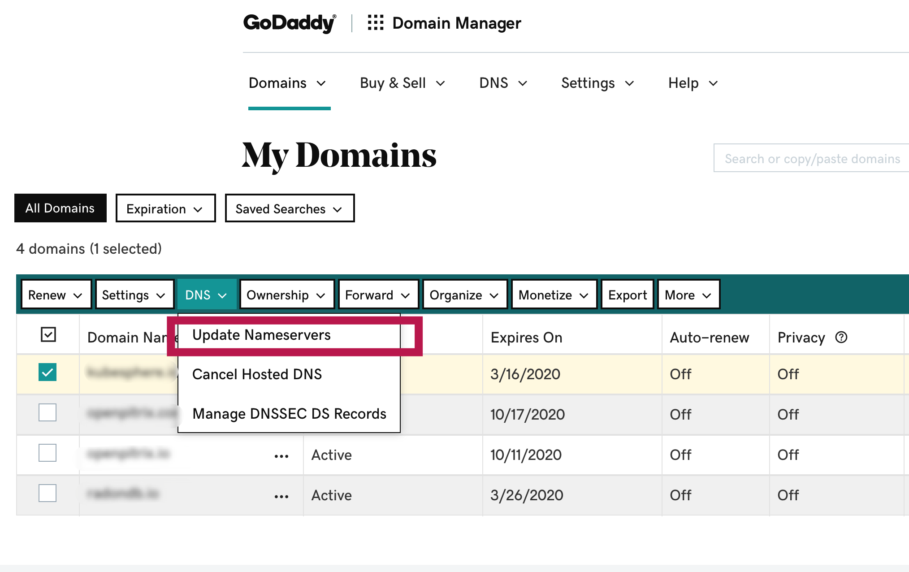

    * 附：子域托管方法请参考：[管理子域名](dns_subzone#配置域名服务器)

3. 修改 DNS 服务器

    一般注册商的 NameServer 填写处会提示域名正在使用其默认的 DNS 服务器地址，需要您切换到其他 NameServer 并填入前面已复制好的 `ns1.routewize.com`和`ns2.routewize.com` 后保存。

    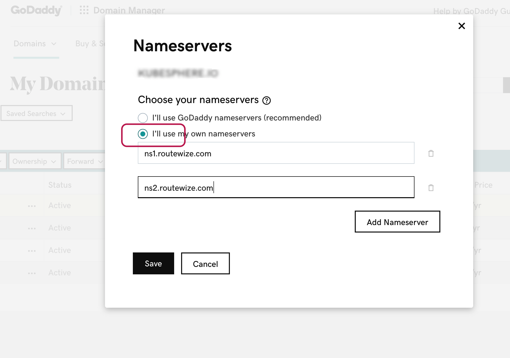

4. 静候佳音，最长不超过 72 小时您的域名将被 QingCloud 接管。

> 请注意：为了保证您的域名在变换 DNS 服务器过程中的解析完整，**修改 DNS 前**您需要确保本系统中的域名解析配置正确有效。
>
> 请参考：[如何验证解析是否生效？](dns_check)

## 修改解析记录

鼠标移至记录值会出现暂停按钮，可暂停单个解析值：

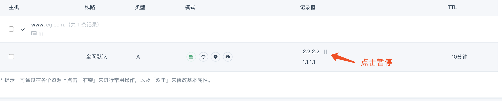

操作后该记录值会更新为暂停状态，再次移动鼠标到记录值则会出现启用按钮，点击可启用解析：

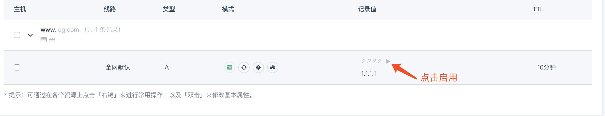

解析记录模式列支持直接点击不同模式按钮以实时切换解析模式，请参阅：[四种解析模式](dns_mode)。

在解析记录上双击，或单击右键选择 **修改** 按钮，可修改该条解析：

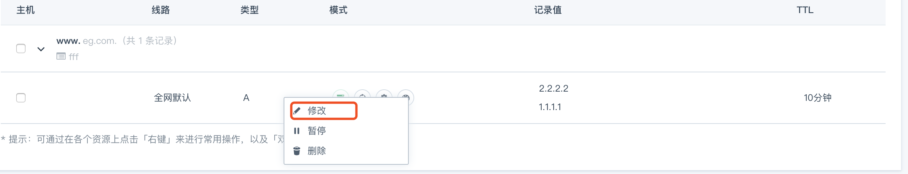

单击右键选择 **暂停** （或 **启用** ）按钮，还可按组暂停或启用整组解析。

## 删除解析记录

### 删除整个子域名解析

在选定主机名上单击右键，选择 **删除** 按钮，将删除该子域名的全部解析：

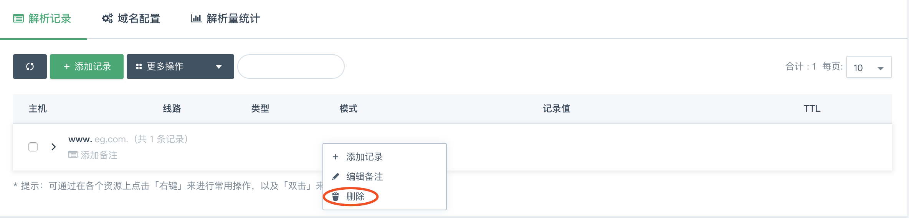

> 请注意：子域名解析全部删除则无法恢复，为了保证您的解析数据安全，将需要您确认该子域名数据已备份。

点击 **我已备份，确认删除**，将删除成功：

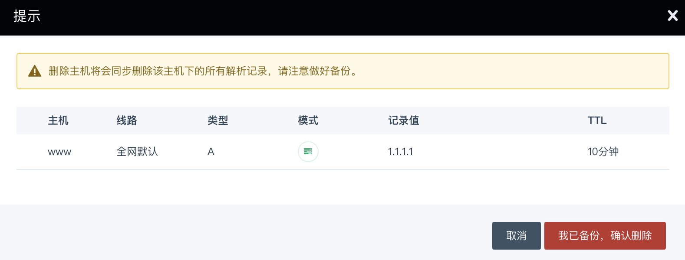

### 删除单组解析记录

点击主机名，将展开该子域名下的全部解析记录：

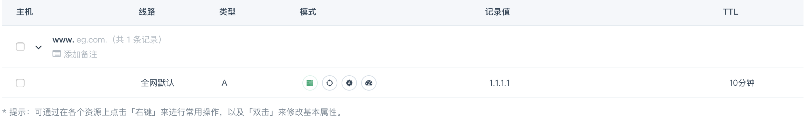

在选定解析记录上单击右键，选择 **删除** 按钮：

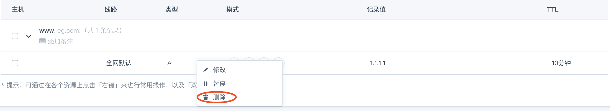

删除确认框点击 **删除** 按钮，将删除成功：

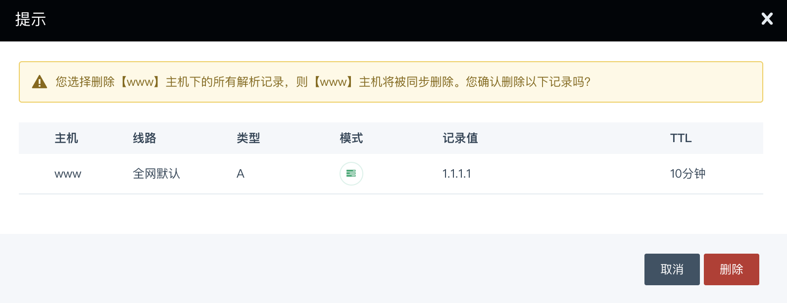

您也可以点击左侧复选框多选以批量操作。

## 域名备注

### 主域名备注

添加域名时，我们提供了一个可选的备注填写框。如果您此前并未填写或者需要修改，可回到域名列表页，将鼠标移至需要修改备注的域名后单击右键，选择 **修改备注** 即可。

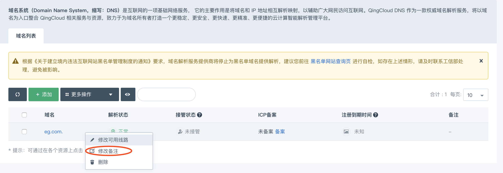

或者在域名配置页点击 **修改** 链接完成修改。

### 子域名备注

进入域名解析列表，在需要添加或者修改备注的主机记录点击右键，选择 **添加备注** 即可添加/修改子域名备注。

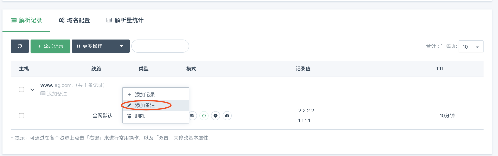

## 解析量统计

您可以按照不同的时间跨度查看总解析量数据，也可以对比昨日、对比前一个月的域名解析量。

* 进入 **解析记录** 页面，点击 **解析量统计**，可以看到今日每小时解析量统计的数据。

    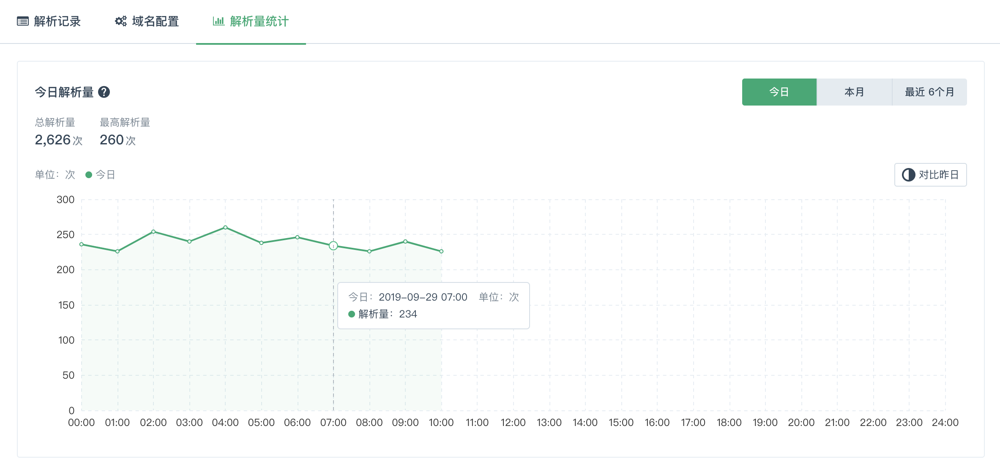

    左侧会提供今日截至当前时间的总解析量以及按小时统计的最高解析量数据。

    右侧点击 **对比昨日**， 可按每小时分别对比昨日和今日的解析量变化：

    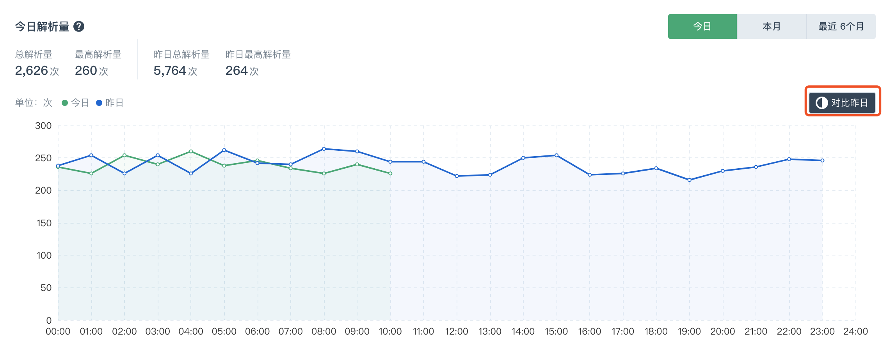

    也会看到昨日和今日的总解析量和最高解析量。

* 右侧选项卡切换到 **本月**，查看截至今日的本月每日解析量数据。

    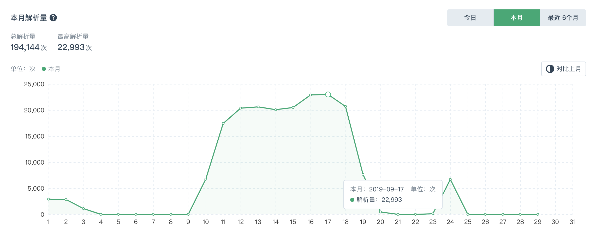

    同样也提供按月汇总的解析量及按日最高解析量数据。

    也可点击 **对比上月** 以按日查看上月和本月的解析量变化趋势：

    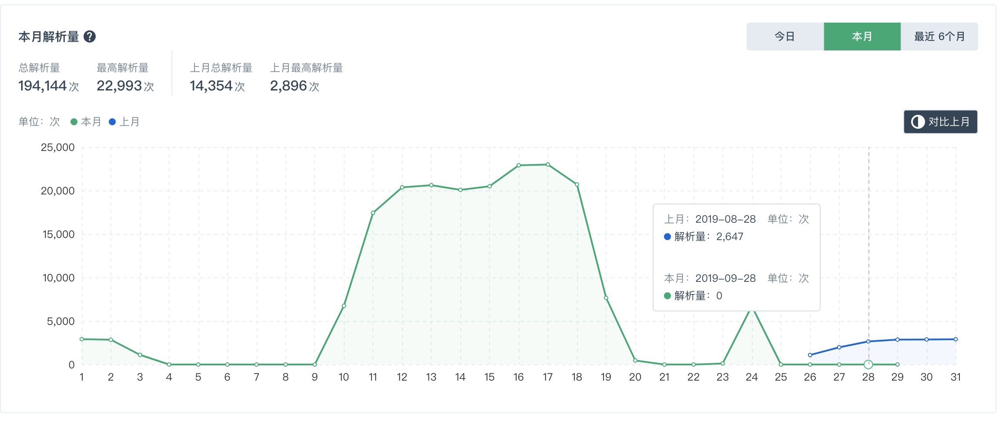

* 右侧选项卡切换到 **最近6个月** ，将展示截至本月的每月总解析量数据。

    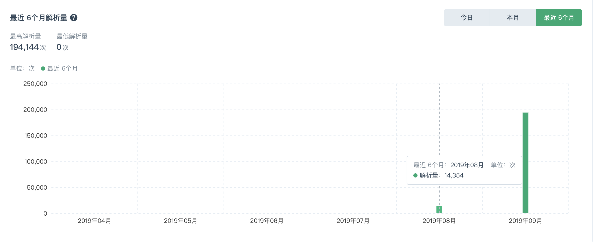

    同时左侧将提供最近 6 个月中按月汇总的最高解析量和最低解析量以供参考。

## 删除域名

> 为了保证您的域名解析安全，我们需确认您删除域名的操作，因此将要求您先清空域名解析记录后才能删除域名。

在域名列表页，鼠标移至需要删除的域名上右键单击，选择 **删除** ：

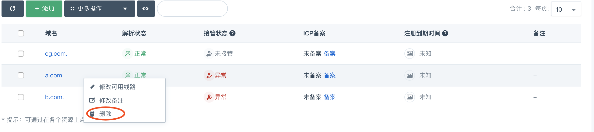

确认框点击 **删除** ，如果该域名下已无有效解析记录即可立即成功删除。

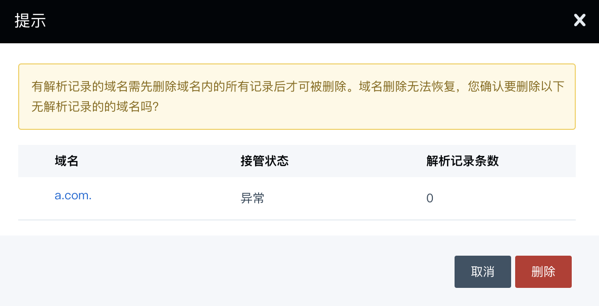
