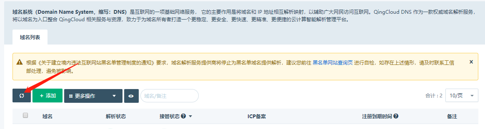

---
---

# FAQ

## QingCloud DNS 支持的常见解析记录类型介绍

QingCloud DNS 支持 7 种标准解析类型：A、CNAME、AAAA、MX、NS、TXT 和 PTR

1. A 记录：将域名指向一个或多个 IPv4 地址（例如：100.100.100.100）。
2. CNAME 记录：将域名指向另一个域名，常用于域名需要使用第三方CDN业务、第三方企业邮箱服务等。
3. AAAA 记录：将域名指向一个或多个 IPv6 地址（例如：ff03:0:0:0:0:0:0:c1）。
4. MX 记录：用于指定邮件服务器。MX 记录需要设置优先级，当有多个邮件服务器可用时，邮件服务会根据优先级决定使用哪个邮件服务器。
5. NS 记录：用于指定域名由哪个 DNS 服务器解析。
6. TXT 记录：指定域名的附加文本信息。TXT记录有多种用途，常用于验证域名所有权和创建 SPF 记录（反垃圾邮件）。
7. PTR 记录：反向地址解析记录，用于将 IP 指向一个或多个域名。

> 注：目前 QingCloud 平台上的 IP 配置 PTR 记录需要在后台提交工单。

另外，QingCloud DNS 以解析类型的方式扩展实现 301跳转、302跳转及隐性跳转功能。

1. 301跳转：将站点永久重定向到另一个站点上，HTTP 返回码 301 。全域跳转，站点子目录和路径保持不变。
2. 302跳转：将站点临时重定向到另一个站点上，HTTP 返回码 302 。全域跳转，站点子目录和路径保持不变。
3. 隐性跳转：在域名不变的情况下，将网站内容使用另一个站点替代，HTTP 返回码 200 。

> 注：只有已通过国家工信部备案的域名才可在 QingCloud DNS 控制面板使用跳转类型。

## 什么是解析记录 TTL ？

TTL（Time-To-Live）指解析记录的生命周期，用于指示解析记录在 DNS 服务器的缓存时间。

对于已经稳定运行的服务来说，TTL 值越大，理论平均 DNS 解析时延越小，服务访问越快。

QingCloud DNS 解析记录 TTL 可以选择 1 分钟、 10 分钟、 2 小时、 12 小时和 1 天。

## 为什么我的域名无法添加？

域名无法添加可能有以下几个原因：

1. 非法的域名格式

    QingCloud DNS 支持标准的域名格式，域名格式标准参考 [RFC1034](https://tools.ietf.org/html/rfc1034) 和 [RFC1035](https://tools.ietf.org/html/rfc1035) 。

2. 不支持的域名后缀

    QingCloud DNS 将不定期从 [Root Zone Database](https://www.iana.org/domains/root/db) 同步域名后缀列表，若您发现有新的域名后缀不支持可及时与我们联系。

3. 域名被列入黑名单

    根据《关于建立境内违法互联网站黑名单管理制度的通知》要求，域名解析服务提供商将停止为黑名单域名提供解析。

    当您添加域名时被提示黑名单，建议您先前往[黑名单网站查询页](http://www.beian.miit.gov.cn/icp/publish/query/icpBlacklistInfo_showPage.action) 进行自检并及时联系工信部处理。

4. 域名已存在

    若添加域名时提示域名已存在，表示域名可能已被其他用户添加，您可以提交工单并附上待添加域名的证书来找回域名。

5. 子域名未通过所有权验证

    若您直接添加子域名，我们需要先进行主域所有权验证，通过验证后方可添加。详情参见：[子域名管理](dns_subzone)

## 为什么 NameServer 已修改，但接管状态仍未变化？

请先确保您的域名 DNS 服务器地址已经修改为 QingCloud DNS 服务器：`ns1.routewize.com` 和 `ns2.routewize.com` 。

受限于域名注册商及全球 DNS 缓存时间，变更域名 DNS 服务器一般需要 1~3 天时间才会生效，请您耐心等待。

在您等待的过程中，您随时可参照此方法再次[验证服务端解析](dns_check)。

如果您确认已正确更新域名 DNS 服务器并超过 24 小时仍提示未接管，可以尝试点击域名列表进行刷新。如下图所示：

若刷新后接管状态还未发生变化，请与我们联系。

## 我的域名未备案，可以在 QingCloud 解析吗？

根据国家工信部的监管要求，域名未备案将不允许提供主机托管等 http 服务业务，但并不会影响您的域名解析。

您可以在 QingCloud 解析暂未备案的域名，不过若您一旦出现违规操作我们将有权停止为您提供服务，建议您尽快完成备案。

> 注：由于 QingCloud DNS 的三种跳转类型是提供的 http 服务，因此使用前会要求您的域名先通过备案。

## 为什么我的域名备案信息和注册信息显示与实际不符？会有什么问题吗？

QingCloud DNS 管理面板上提供的备案信息和注册信息仅供您管理参考，不会成为实际业务处理依据。

若您发现信息不符，请您以工信部和注册商处为准。

## 域名解析记录填写后，多久能生效？

QingCloud DNS 的解析服务是即时生效的，您配置好域名解析后可以随时验证解析的生效情况。操作方式请参考：[如何验证解析是否生效？](dns_check)

因此，**当您的域名已经托管在 QingCloud DNS 时**，新增的域名解析记录可以立即使用。但由于本地 DNS 解析服务存在缓存，您对原有的解析记录修改可能不会立即体现在用户浏览器访问结果上，**您需要至少等待旧解析的一个 TTL 时间后才可访问到新地址**。

> 注：有时候，用户本地运营商 DNS 不按 DNS 标准协议来刷新缓存，导致用户端等待了超过一个 TTL 时间依然未生效。这种情况在国内比较常见，如有遇到，建议您让用户投诉本地运营商。
