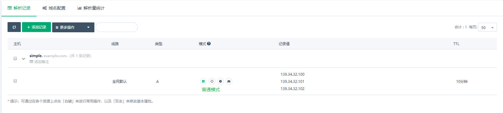
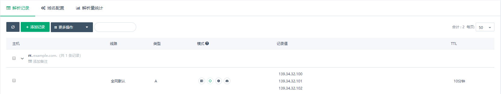
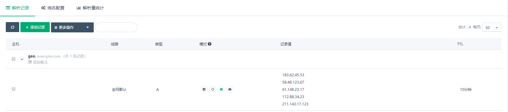
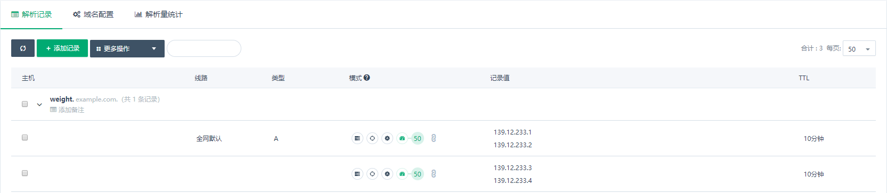
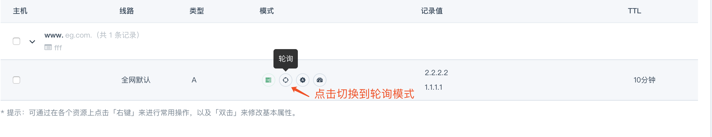
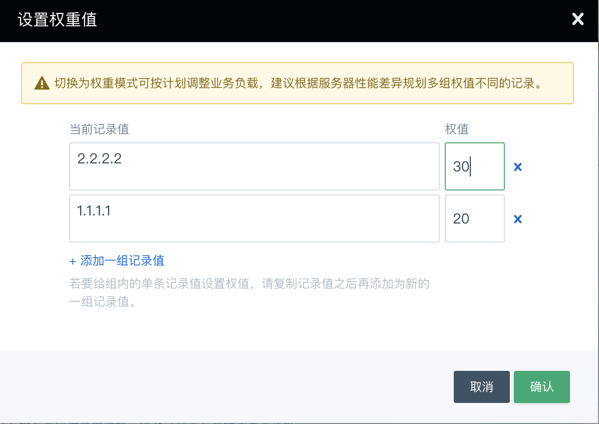
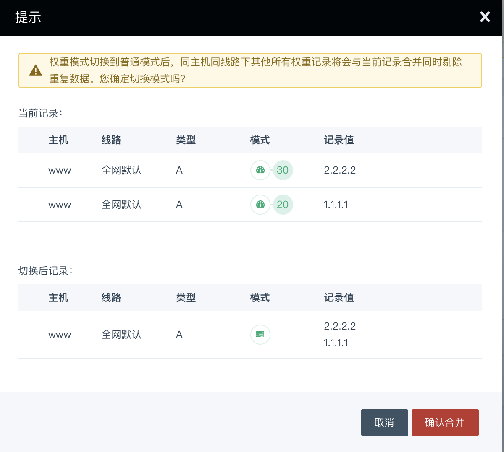

---
---

# 四种解析模式

QingCloud DNS 为客户提供 4 种解析模式：**普通模式、轮询模式、权重模式和智能模式**，以应对不同业务场景的负载均衡需求。

>
> 注：这四种模式将都会出现在 A 类型的解析记录上；CNAME 类型由于其本身具备排他性，则只有普通模式和权重模式。
>

## 模式介绍

### 普通模式

同时配置多条记录值，每次查询时返回的解析顺序保持不变。

如图所示配置：



```
    1. 第一次请求，返回 139.34.32.100 139.34.32.101 139.34.32.102
    2. 第二次请求，返回 139.34.32.100 139.34.32.101 139.34.32.102
    ...
    每次请求的解析结果都不变。
```

> 该模式解析效率比较高。
>
> 若您的业务针对同一线路只有一个主要的解析地址（没有其他地址或其他地址只用来做灾备），我们推荐使用**普通模式**即可。
>

### 轮询模式

同时配置多条记录值，每次查询时会根据上一次查询顺序重新排序后返回。例如：



```
    1. 第一次请求， 返回 139.34.32.100 139.34.32.101 139.34.32.102
    2. 第二次请求， 返回 139.34.32.101 139.34.32.102 139.34.32.100
    3. 第三次请求， 返回 139.34.32.102 139.34.32.100 139.34.32.101
    4. 第四次请求， 返回 139.34.32.100 139.34.32.101 139.34.32.102
```
>
> 该模式解析结果较为均衡。
>
> 若您的业务针对同一线路有多个主要的解析地址，并且希望每个解析地址的承载量都差不多，推荐选择**轮询模式**。
>

### 智能模式

同时配置多条记录值，每次查询时会根据用户来源对记录值进行排序返回最优结果，可减少您对精细化线路配置的烦恼。例如：



上图的配置中，IP 属性如下：

```
    183.62.45.53 （广东电信）
    58.48.123.67 （湖北电信）
    61.148.23.17 （北京联通）
    112.88.34.23 （广东联通）
    211.143.17.123 （湖南移动）
```

当 IP 为 119.98.169.89 （湖北电信）的用户访问 `geo.example.com` 时，排序后的解析结果是：

```
    58.183.123.67
    183.62.45.53
    211.143.17.123
    112.88.34.23
    61.148.23.17
```

当 IP 为 114.240.23.12 （北京联通）的用户访问时，解析结果则为：

```
    61.148.23.17
    112.88.34.23
    58.48.123.67
    211.143.17.123
    183.62.45.53
```

当 IP 为 211.143.3.3 （湖南移动）的用户访问时，排序将又会有变化：

```
    211.143.17.123
    58.48.123.67
    112.88.34.23
    183.62.45.53
    61.148.23.17
```

>
> 注：智能模式与解析线路配置不冲突，非默认线路的解析也可以使用智能模式。
>
> 若您的业务较为庞大（用户覆盖面广、解析地址非常多、访问频次高），同一个域名的配置过于复杂，您可以使用**智能模式**搭配较粗粒度的分线解析以获得最优配置。
>

### 权重模式

同时配置**多组**记录值和对应权重，每次查询时按权重比值返回其中的一组，可实现不同服务器集群业务承载量的任意比值分配。例如：



```
    1. 第一次请求， 返回 139.12.233.1 139.12.233.2
    2. 第二次请求， 返回 139.12.233.3 139.12.233.4
    3. 第三次请求， 返回 139.12.233.3 139.12.233.4
    4. 第三次请求， 返回 139.12.233.1 139.12.233.2
    ...

    多次请求后，两组解析结果出现的比例满足权重值 50:50 ，即 1:1
```
>
> 权重模式旨在随心所欲的流量调度。
>
> 若您的业务针对同一线路有多个解析地址，但不同的地址对应服务器的业务承载能力各有不同（例如服务器性能差距过大），您可以使用**权重模式**按不同地址的承载能力为其设计不同的权重值。
>

## 模式切换

当您编辑解析记录时或针对已保存的解析记录，您都可以随意的切换解析模式。

### 普通、轮询、智能模式相互切换

普通模式、轮询模式和智能模式由于都是单组设计，它们之间可任意相互切换。

如图所示：



### 从普通模式（或轮询、智能模式）切换到权重模式

权重模式是多组设计，针对已保存的其他模式解析记录切换到权重模式时，将弹出设置框。



### 从权重模式切换到普通模式（或轮询、智能模式）

当多组设计的权重模式切换到其他模式时，则同主机同线路下其他所有权重记录将会与当前记录合并同时剔除重复数据。


