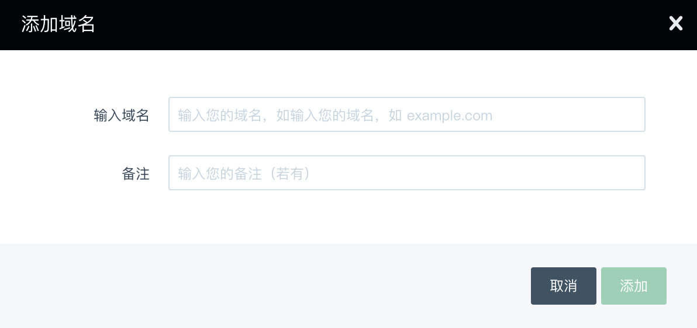
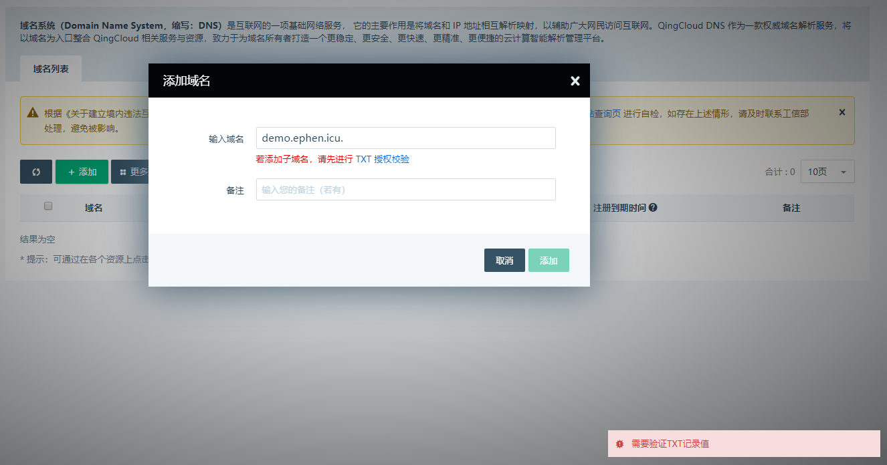
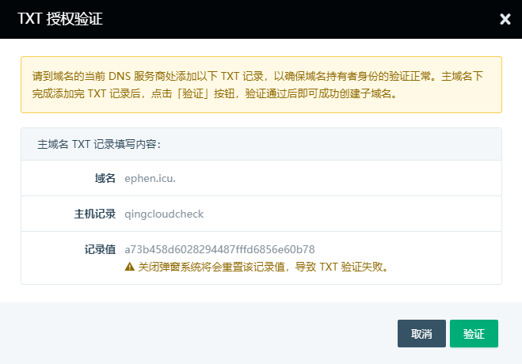
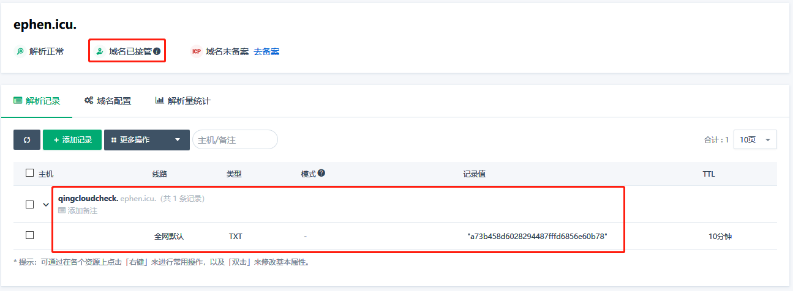
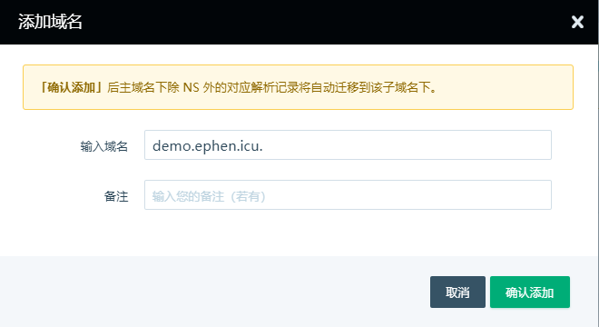
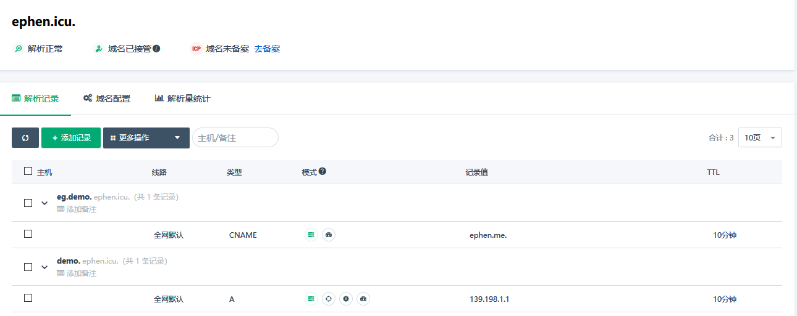
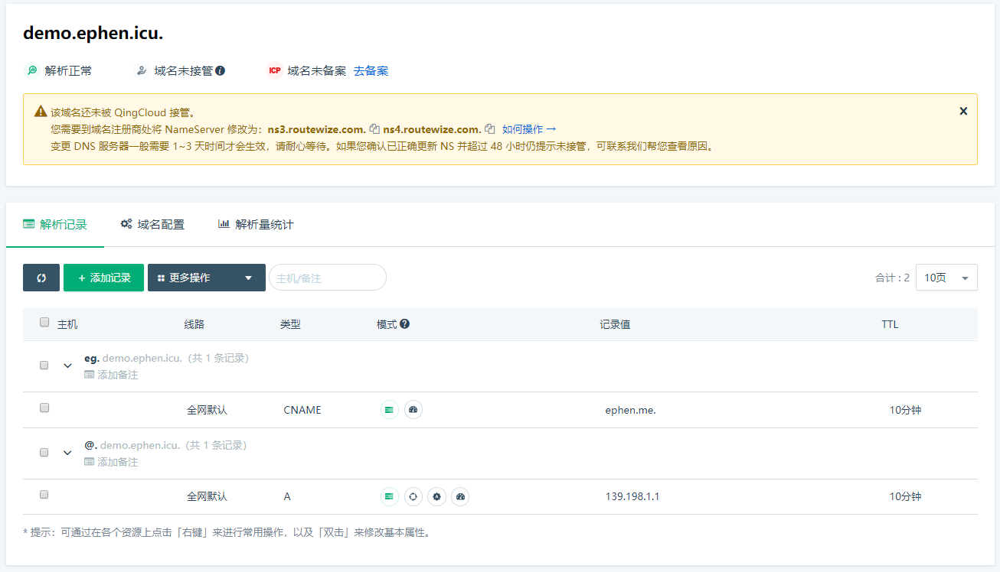
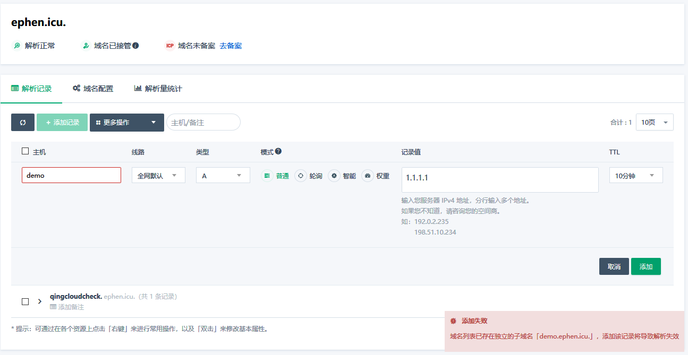
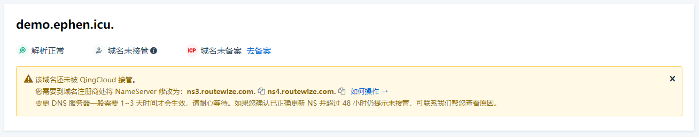
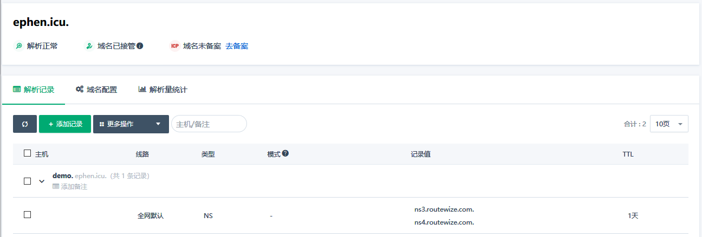

---
---

# 管理独立子域

QingCloud DNS 支持添加子域名来独立管理，它将有助于您拆分复杂的域名让不同的人来管理不同的业务子域名。

以下是子域名解析的操作示例。

## 添加子域名

与常规的域名添加方式一样，登录 QingCloud 控制台后点击左侧导航条中的 **网络与 CDN / DNS**，进入域名列表页。

点击列表上方的“添加”按钮：

输入您需要进行独立管理的子域名。

### 验证所有权

为了防止恶意测试，如果您的**主域名尚未被 QingCloud 接管或者主域名虽在 QingCloud 接管但并非在您名下管理**，我们需要您为添加子域名解析的操作验证所有权。

>
> 如果您的主域名已托管在 QingCloud 且使用相同的账户来添加子域名，则无需验证即可直接添加成功。
>

当您填好需要管理的子域名后，点击弹窗上的“添加”，需要您验证所有权时页面会出现提示：

点击“ TXT 授权校验”链接，弹窗上将指引您添加验证的方法：

接下来需要按照弹窗提示的要求到**该子域的上级域名**的权威解析处配置验证解析记录，因上图所示域名托管在 QingCloud DNS 的不同账户下管理，所以需要登陆到该管理账号去设置验证。

>
> 注：如果您的主域托管在别的解析商，则需要您登陆到该解析商管理后台添加该验证。
>

配置好后，回到验证提示窗口，点击“验证”按钮：

提示“验证通过”即可点击“确认添加”按钮，子域将会被成功添加：

>
> 由于验证域名时受限于不同解析商的生效速度，建议您在操作子域验证时，验证域名的浏览器窗口保持为等待验证状态直至验证通过。您可以使用不同的浏览器来分别执行解析配置和域名验证操作。
>

### 自动转移子域解析

当 QingCloud 系统中存在该子域的主域名，并且其解析记录中存在该子域解析记录时，在您成功添加独立管理的子域名后，系统将自动将这些解析记录（NS 类型除外）转移到子域名下，并且主域下方将不再允许添加此子域名解析。

例如，域名 `ephen.icu` 下有如下两条解析记录：

成功添加域名 `demo.ephen.icu` 后，上面的两条记录将会在提示后自动转移：

这时候，重新查看主域页面已没有之前截图的解析记录，并且禁止再添加该子域解析了：

> 注：NS 类型的解析记录将不会被转移，并且依然可以操作添加。

## 配置域名服务器

如果您添加好的子域名需要托管到 QingCloud ，可参考如下步骤：

1. 登录控制台查看并复制 QingCloud DNS 服务器

    > 注：QingCloud DNS 会采取一定的规则将域名划分到不同的 NameServer 平台，具体服务器地址请以对应域名解析页面的提示为准，如下图所示。

    

    上图可见，当前域名需要将 DNS 服务器修改为 `ns3.routewize.com` 和 `ns4.routewize.com` ，QingCloud DNS 才会接管。

2. 登陆到主域名的解析商管理控制台，为该子域添加 NS 类型解析记录，记录值填写为上方已复制的服务器地址。如下图所示：

    

3. 静候佳音，最长不超过 72 小时您的域名将被 QingCloud 接管。

> 请注意：为了保证您的域名在变换 DNS 服务器过程中的解析完整，**修改 NS 前**您需要确保本系统中的独立子域名解析配置正确有效。
>
> 请参考：[如何验证解析是否生效？](dns_check)
