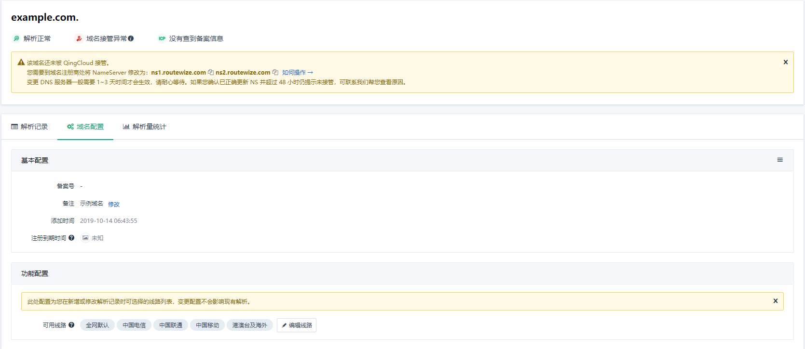
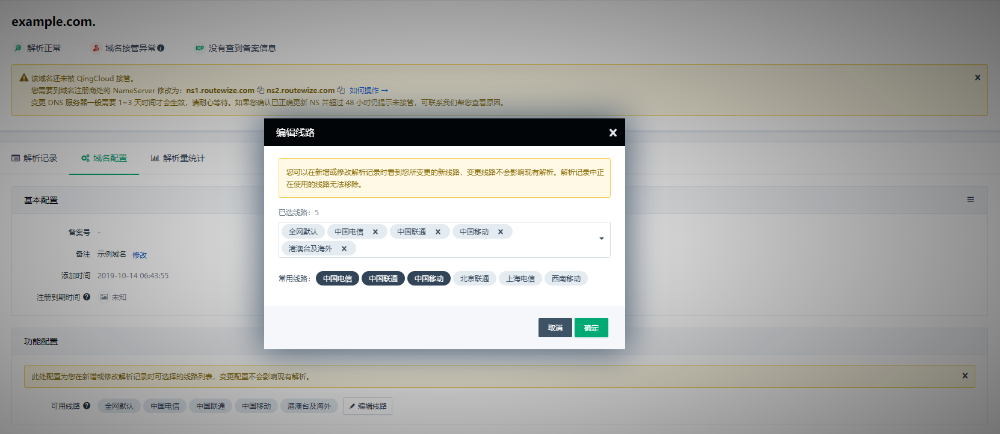

---
---

# 配置解析线路

QingCloud DNS 为客户提供逾 1600 条解析线路，国内精确到运营商、海外精确到国家。

当您使用 QingCloud DNS 时，我们默认为您提供 5 条线路：**全网默认、中国电信、中国联通、中国移动、港澳台及海外** ，它应该能满足您的绝大部分需求。

如果您需要使用更多的解析线路，可参照下文操作。

>
> 注：如果您对分线解析的要求比较高，为了您的域名管理更高效，建议您提前做好域名的有效线路规划。
>
> 若某条线路已在域名解析中使用，您可能无法将其从线路配置中移除。
>

## 编辑域名可用线路

进入域名解析记录页面后，点击“域名配置”选项卡：

在下方的功能配置区点击**编辑线路**：

您可以在此对话框中增加或减少任意非全网默认线路，提交保存后该域名在配置解析记录时线路下拉框列表将会与此处同步。

## 设计自定义线路

该功能尚在孵化中，敬请期待。
