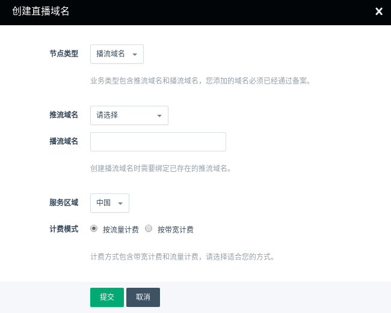
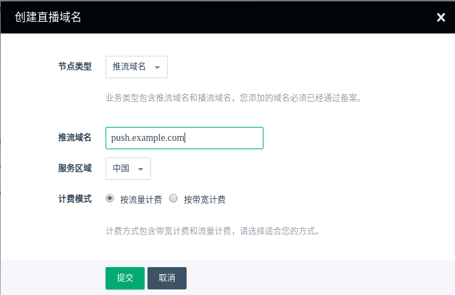
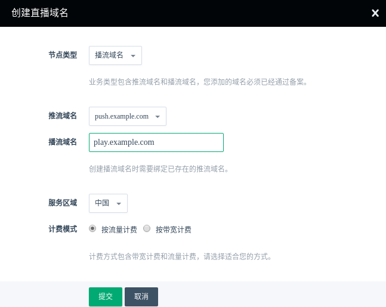
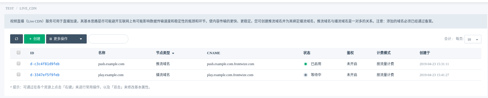
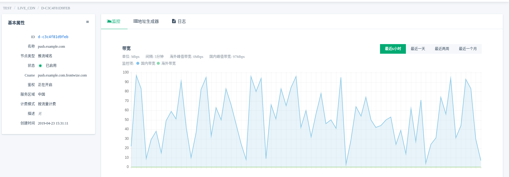
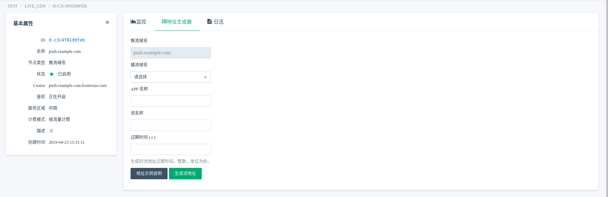
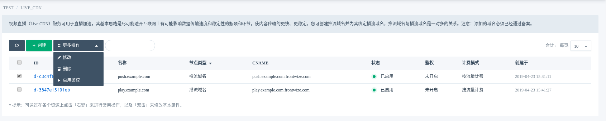
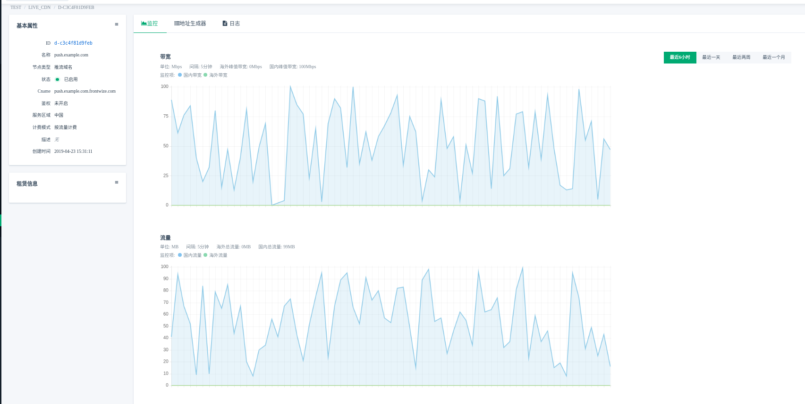
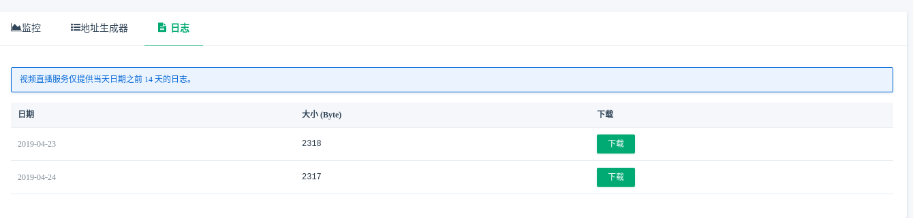

---
---

# 视频直播

## 创建

> 请使用已备案的域名来创建视频直播服务。本指南中要加速的域名为 push.example.com, play.example.com

点击创建进入如下界面

在创建的对话框中，选择对应的节点类型，填写对应的域名。

**创建推流域名**

**创建播流域名**

> 创建播流域名时需要绑定已存在的推流域名。

创建完成后，如下图所示

> 创建完域名后，服务仍在部署，请您耐心等待几分钟。待域名状态已启用后，直播服务方可使用。

## 地址生成器

> 创建完直播域名后，还需要使用推流域名和播流域名生成推流地址和播流地址。  

点击 `ID` 进入如下界面

点击右侧导航中的 `地址生成器`，进入如下界面

在地址生成器的对话框中，选择对应的域名，填写 APP 名，流名和过期时间。

## 开启鉴权

为了对推流、播流地址进行安全限制，您可以通过开启鉴权功能, 目前需要人工开通，大约一天左右，请您耐心等待。

勾选对应的域名，点击 `更多操作` ，`启用鉴权`，如下界面所示

## 监控

点击 `ID` 进入如下界面

从图中可以实时查看带宽和流量的使用情况。

## 日志下载

> 视频直播服务仅提供当天日期之前 14 天的日志。

您可以根据日期下载对应的日志。

## FAQ

**计费模式无法修改**

暂不支持修改计费模式，您可以提工单给我们，手动给您更改。
