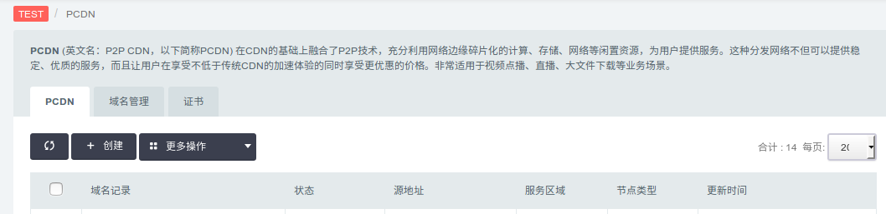
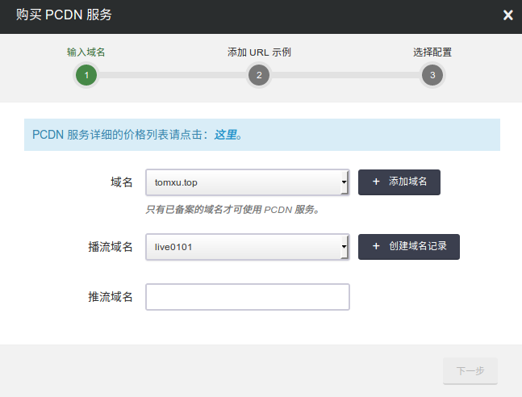
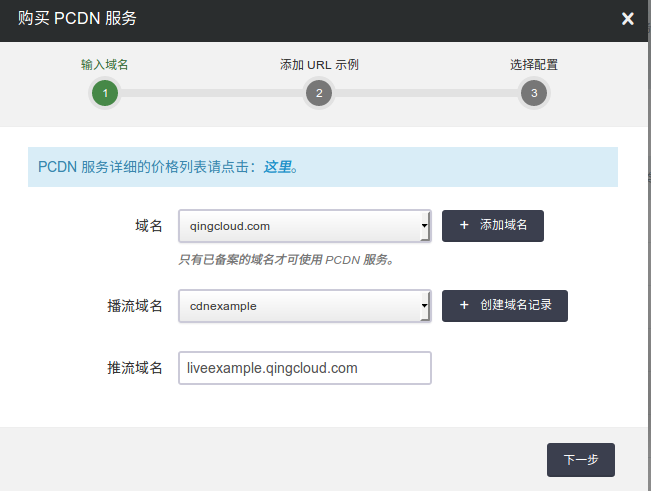
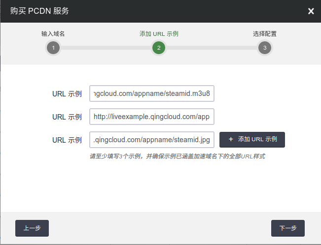
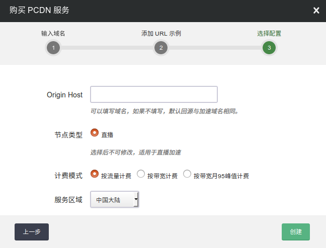
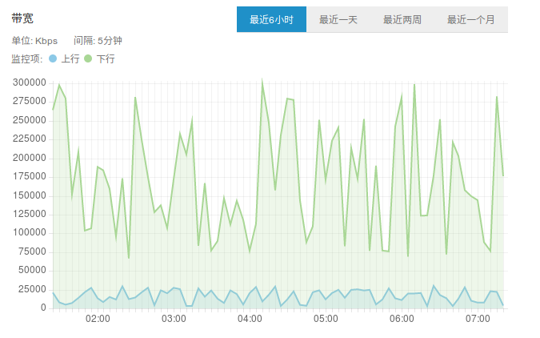
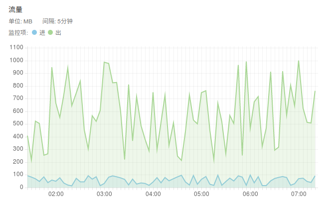
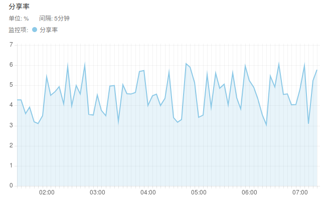
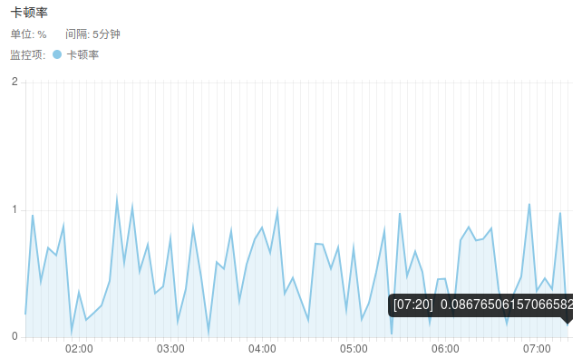
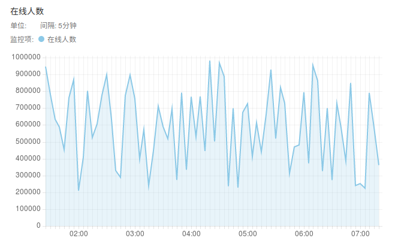

---
---

# PCDN 加速[¶](#cdn)

PCDN (英文名：P2P CDN，以下简称PCDN) 是在CDN的基础上融合了P2P技术，充分利用网络边缘碎片化的计算、存储、网络等闲置资源，为用户提供服务。这种分发网络不但可以提供稳定、优质的服务，而且让用户在享受不低于传统CDN的加速体验的同时享受更优惠的价格。非常适用于视频点播、直播、大文件下载等业务场景。

## 创建[¶](#create)

注解

从创建 PCDN 到可以使用需要人工审核，大致需要 1-2 天，您要使用 PCDN 的域名必须进行备案。本指南中要加速的域名为 pcdnexample.tomxu.top

**第一步：创建域名(domain)**

点击"网络与CDN"中的 PCDN 进入如下界面

点击创建进入如下界面

在创建的对话框中，点击添加域名，输入自己的主域名。

注解

该域名是主域名 如：我们要为 pcdnexample.qingcloud.com 加速，他的主域名是 qingcloud.com 。

**第二步：创建域名记录(子域名)**

填写你要加速的子域名

注解

该域名是子域名 如：指除去主域名的部分 如: pcdnexample.qingcloud.com 中的 pcdnexample

填写回源地址

回源地址就是您源站的地址，您静态资源的所在站点， 当 PCDN 中不存在请求的内容时，会去源站请求资源返回给用户并且缓存在 PCDN 缓存服务器中。回源的方式有两种， IP 回源和域名回源:

*   使用 IP 回源时只能填写一个IP
*   如果使用域名回源则只能使用一个域名 如 resource.qingcache.com

开启 HTTPS (可选)

如需开启 HTTPS 则点击 “同时支持 HTTP/HTTPS 服务” 或 “只支持 HTTPS 服务”，在证书列表选择一个要使用的证书， 点击创建证书可上传自己网站的证书和密钥， 注意使用HTTPS只支持网页类型加速，不支持下载和点播。另外，使用 “只支持 HTTPS 服务” 会让 HTTP 访问的用户跳转成 HTTPS 访问。

**第三步：创建推流域名**

填写推流域名，点击下一步。

**第四步：添加 url 示例**

填写 url 示例，需要涵盖加速域名下全部 url 样式，比如防盗链 url、不同媒资格式、不同文件路径类型等

**第五步：选择配置**
填写Origin Host、计费模式等，点击创建即可创建成功。

注解

创建PCDN服务需要人工审核，预计 1-2 个工作日完成审核。

**第六步：使用 PCDN 为站点进行加速**

在自己的使用的 DNS 服务商处配置 CNAME 以本域名为例，需要将 cdnexample.qingcloud.com CNAME 配置为 c11f0d02099a2.cname.qingcache.com 至此您的域名就已经可以使用 PCDN 进行加速了。

**监控**

为用户提供各类数据报表业务，包括带宽，流量，分享率，卡顿率，在线人数等

注解

各项统信息会有10分钟左右的延时 * 流量 单位MB * 带宽 单位Kbps 该带宽为五分钟为粒度的平均带宽 * 分享率 用户分享CDN资源的频率 * 卡顿率 用户使用CDN卡顿的频率 * 在线人数 统计同时在线的用户数

带宽监控

流量监控

分享率监控

卡顿率监控

在线人数监控

## 价格[¶](#price)

PCDN 目前支持使用按流量实行阶梯价格，累计统计每月初清零，每天计算并扣除前一天的费用。 具体价格参照下表:

| 流量阶梯 | 价格(元/GB) |
| --- | --- |
| 4-20TB(含) | 0.13 |
| 20-50TB(含) | 0.12 |
| 50-100TB(含) | 0.11 |
| >100TB | 0.1 |

| 峰值带宽阶梯 | 价格(元/Mbps/天) |
| --- | --- |
| 2~5Gbps(含) | 0.43 |
| 5~10Gbps(含) | 0.4 |
| 10~20Gbps(含) | 0.37 |
| >20Gbps | 0.33 |

## FAQ[¶](#faq)

**PCDN 服务适用的业务场景:**

PCDN 服务适用于视频点播、直播、大文件下载等业务场景，包括且不限于版权长视频点播、短视频点播、互动娱乐直播、晚会赛事直播、应用市场分发、音频点播等各类产品，广泛应用于娱乐、教育、体育、广电等多个行业。

**移动端是否必须上传流量才能使用 PCDN :**

不需要，P2P节点布局中有路由器、运营商接入层/汇聚层节点等二级节点可以为客户APP提供P2P带宽，不强制要求客户APP上传流量。

**使用PCDN后原有的端上服务质量监测是否仍适用:**

使用PCDN SDK后，客户APP业务主体逻辑无需改变，只是从原来向CDN地址请求改为向SDK提供的本地加速地址请求，客户端对http内容分发服务进行质量监测的逻辑无需修改。

