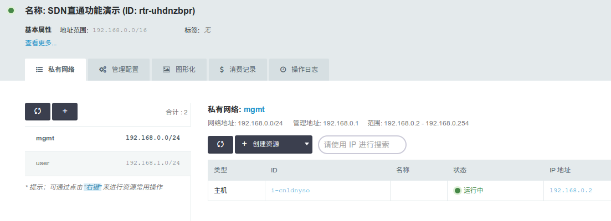
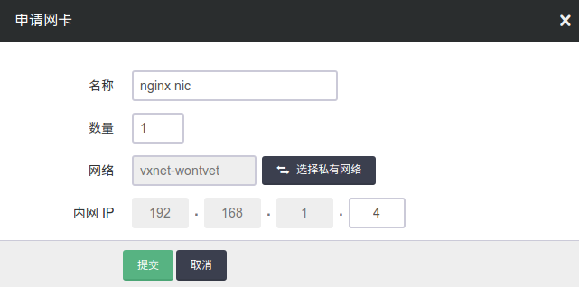
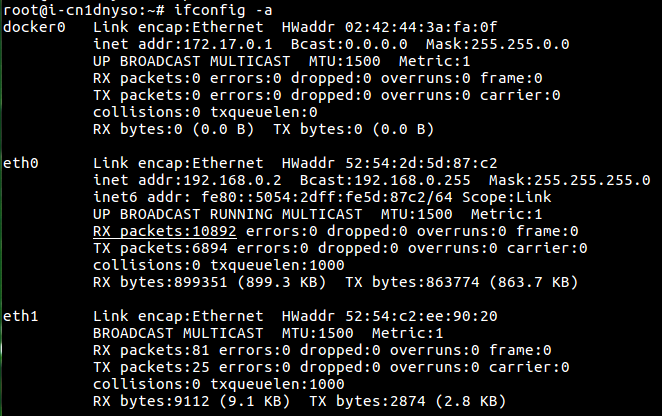
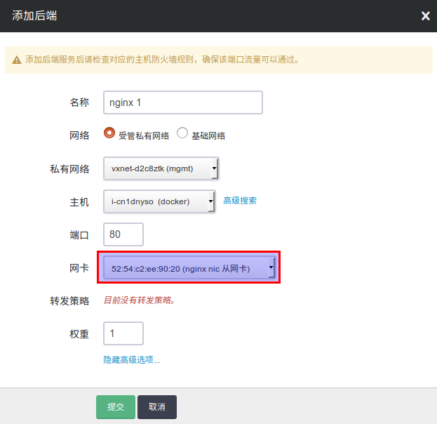
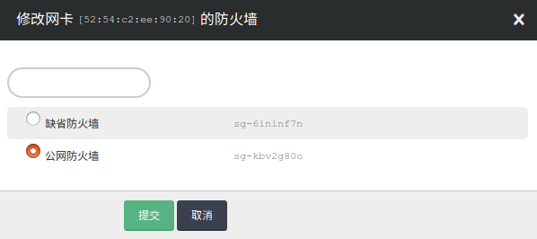
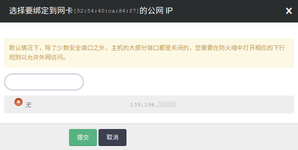

---
---

# SDN 网络直通

SDN 网络直通(SDN Passthrough)方案，为基于虚拟主机（VM）部署的容器应用提供一套简便易行的网络配置方案。相比于传统方案，SDN 网络直通将大幅提升容器应用的网络性能，并大幅降低配置与维护的操作难度。

## 传统方案的挑战

以基于虚拟主机部署 Docker 为例，在虚拟主机的网络之上，Docker 系统还需要自己实现如下两点：

1.  在虚拟主机内部实现虚拟网络，以联通各 Docker 实例。常用的实现方式是通过使用 Docker 提供的 bridge 和 overlay 网络插件，前者通过地址转换和路由连通私有网络，后者通过 vxlan 隧道方式，构建一层 overlay network。
2.  除了联通 Docker 实例，还需要向 Docker 实例提供公网 IP，负载均衡器和防火墙等功能，这些都需要自主实现，而无法复用云平台提供的相应功能。目前，Docker 管理平台如 K8S 等，都提供自己的实现方案。

通过以上这种方式部署 Docker，虽然可以实现基本的功能，但是存在两个重要挑战:

1.  网络性能差。网络虚拟化的本质是用软件实现物理网卡和交换机的功能，因此虚拟网络中的所有流量都会消耗 CPU 资源。在这个前提下，云平台提供的 SDN 网络，是第一层虚拟化， 已经会带来一定性能损失。但是可以通过利用物理网卡的硬卸载功能， 比如 vxlan offload，在这一层减少部分虚拟化带来的性能损失。而如果在第一层虚拟化的基础上，在虚拟主机内再搭建一层虚拟网络，将会带来第二次性能损失。同时，由于第二层虚拟化无法利用硬卸载功能，所以性能损失通常会高于第一层。两层网络虚拟化带来的性能损耗相叠加，将显著影响网络性能。在上海一区（SH1A），使用 iperf -c  命令进行的基本性能测试 (关闭云平台的网络限速)中：

    > 
    > 
    > 1.  虚拟主机之间: 带宽 9Gbps
    > 2.  虚拟主机内：使用Docker overlay 插件的 Docker 实例之间。带宽下降为2.3Gbps
    > 
    > 

    由此可见，这种使用 Docker overlay 的方案会带来近 3/4 的性能损耗。而如果算上对外提供服务所需要的地址转换带来的性能损失，整体性能损失将更为巨大。

2.  配置复杂。目前主流的 Docker 管理平台，比如 K8S, 为了实现负载均衡器和虚拟 IP， 需要使用 iptables nat 功能对 IP 地址做转换，提供业务对内网和外网的地址。但是要运行在云平台上并面向公网提供服务，还需要对云平台的 IP 做地址转换。本身 Docker 实现这些功能就比较复杂，而在此基础上，再做一层地址转换，会带来额外的复杂度。使用 Docker 管理平台的初衷是简化产品部署，而通过这样的方式跟云平台整合，却与这一方向背道而驰。同时，配置好完整的 Docker 系统并使其能基于云平台上顺利能运行并提供服务， 需要操作者精通 Linux 提供的各种高级网络功能，这也为用户设置了较高的技术门槛。特别是对专注于业务开发的 Docker 用户而言，这类操作往往显得过于复杂。

## SDN 网络直通方案

上述方案所面临的挑战，其根源在于云平台和 Docker 平台都有自己的虚拟化网络实现方案，二者功能重叠，使用时相互嵌套。相比之下，SDN 网络直通方案，能够实现 Docker 直接使用云平台的 SDN，避免两层网络的重叠，从而达到提高性能，和简化配置的效果。

SDN 网络直通方案包含两个方面:

1.  云平台「网卡」管理： 通过提供网卡接口，让虚拟主机能够挂载多个网卡。这些网卡可以属于相同或者不同的网络，同时每个网卡能够管理自己的私网 IP, 公网 IP，负载均衡器和防火墙等功能。
2.  「Hostnic」插件： 这是青云QingCloud 自主开发的一款 Docker 网络插件。在启动 Docker 实例的时候，通过该插件，可以将虚拟主机上的绑定的多个网卡一一挂载到 Docker 实例上, 并可以配置IP地址和路由。启动之后，Docker实例就加入了云平台 SDN 提供的网络，能够使用云平台所有的网络功能。

注解

「Hostnic」 插件已在 github 上开源， 详情请见 [docker-plugin-hostnic](https://github.com/yunify/docker-plugin-hostnic)

注解

除了青云自己开发的Hostnic, [希云cSphere](https://csphere.cn) 开源了一款基于青云SDN网络直通方案的插件，[qingcloud-docker-network](https://github.com/nicescale/qingcloud-docker-network)，相比Hostnic, 这款插件整合了青云API，可以在启动Docker的时候，自动创建并挂载网卡，使用起来更方便。

## 使用方法

如本文开头所说，SDN直通包含网卡管理和 Hostnic 插件。下面通过使用 Docker 部署 Nginx 为例，说明如何使用该功能。

1.  

    网络规划。对于一套基于 Docker 的业务系统，有两个网络需求: A. 管理网络, 用于部署和管理云主机；B. 用户网络，用于运行基于 Docker 的业务， 在青云QingCloud VPC 中，先创建这两个网络:

    1.  mgmt 192.168.0.0/24
    2.  user 192.168.1.0/24

注解

Docker 默认会创建一个叫做 docker0 的网桥, 并配置网络172.17.0.0/16。 请在 VPC 上使用跟 Docker 不同的网段，以避免IP和路由的冲突。

2.  启动一个基于 Ubuntu 14.04.5的 Linux 虚拟主机，并安装 Docker。在 VPC 详情页面，能看到创建的网络和主机:

> [](_images/vpc_networks.png)

注解

为了有较快的安装速度，可以使用国内 Docker 源进行安装，比如 curl -sSL https://get.daocloud.io/docker | sh。

3.  创建1个网卡， 并挂载到虚拟主机上。从控制台 （Console）右侧导航栏的“计算与网络->网卡”进入网卡视图， 创建一个网卡。创建时，除了选择网络，还可以指定IP地址，如果不指定，系统会自动分配一个IP地址。

> 

4.  挂载网卡。右击上一步创建的网卡，选择“分配到主机”，然后选择主机，并按确定，即可完成网卡的挂载。挂载之后，到主机里面，可以看到多了一个网卡。主机的网卡角色有两种：主网卡和从网卡。其中主网卡是主机的第一个受管网络网卡，它的公网IP和防火墙，跟主机相同，而且不可以被卸载。其余的网卡都是从网卡。从网卡可以有自己独立的公网IP和防火墙，并且可以被卸载。

> 

注解

当主机的多个网卡连到同一个二层网络时，由于 Linux 默认回复对本地所有 IP 地址的 ARP 解析请求，会造成网络中其他成员的 ARP 表发生错误。为了避免这个问题，请卸载 network manager (apt-get remove network-manager)， 避免新挂载的网卡自动获取IP地址， 并通过`sysctl -w net.ipv4.conf.lo.arp_ignore=1`修改Linux kernel arp_ignore参数, 只对网卡绑定的IP地址回复ARP解析请求。

5.  运行下面命令， 启用并配置 Hostnic 插件, 启动 Nginx 的 Docker 实例:

    ```
    docker pull qingcloud/docker-plugin-hostnic
    docker run -v /run/docker/plugins:/run/docker/plugins -v /etc/docker/hostnic:/etc/docker/hostnic --network host --privileged qingcloud/docker-plugin-hostnic docker-plugin-hostnic
    # 创建名为 "192.168.1" 的Docker 网络，其中网关和网段需要跟对应的VPC网络匹配
    docker network create -d hostnic --subnet=192.168.1.0/24 --gateway 192.168.1.1 192.168.1
    # 启动一个基于Nginx镜像的Docker实例，由于Docker并没有dhclient，需要传入
    # 挂载的网卡IP和Mac地址, 其中的network参数是上一步创建的Docker网络
    docker pull nginx
    docker run -d --ip 192.168.1.4 --mac-address 52:54:c2:ee:90:20 --network 192.168.1 nginx
    # 确认nginx启动成功
    curl -I 192.168.1.4
    ```

6.  添加 Docker 实例为负载均衡器后端。请参看 [负载均衡器指南](loadbalancer.html#guide-loadbalancer) 创建负载均衡器和80端口的 HTTP 模式监听器。在添加后端时，展开“高级选项”，可以选择主机已挂载的网卡。添加之后，应用负载均衡器修改，这个Nginx应用就开始对外提供服务了。

> 

7.  绑定防火墙。每个网卡可以有自己独立的防火墙策略，需要绑定防火墙时，从网卡视图，右击网卡，选择“修改防火墙”。为了使用方便，VPC主机和网卡默认都不绑定防护墙。当网卡绑定了公网 IP 时，系统会自动给网卡挂载防火墙，来保护业务安全，网卡按如下规则选择防火墙:

    ```
    1\. 如果主机有防火墙，会加载主机的防火墙
    2\. 如果主机没有防火墙，加载默认防火墙。
    ```

> 

8.  给网卡绑定公网 IP。在网卡视图，右击网卡，可以绑定公网 IP。解绑网卡，或者删除虚拟主机后，公网 IP 会自动解绑。

> 
