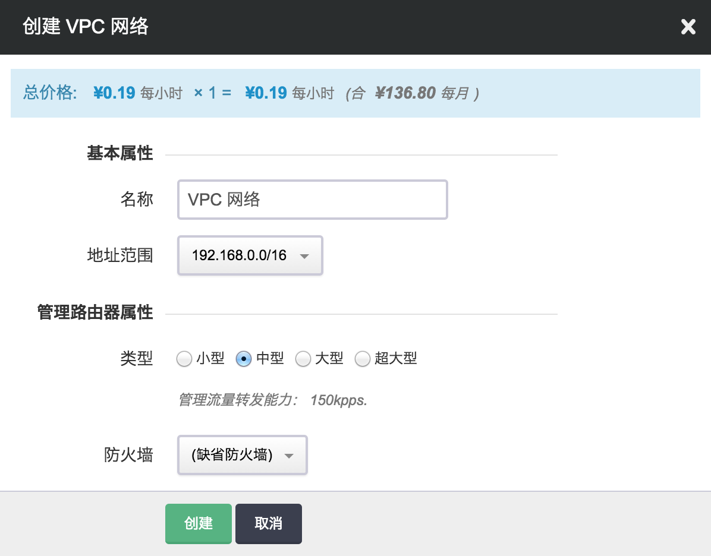

---
---

# VPC专属私有网络

VPC 网络是 QingCloud 环境内可以为用户预配置出的一个专属的大型网络。在 VPC 网络内，您可以自定义 IP 地址范围、创建子网，并在子网内创建主机/数据库/大数据等各种云资源。

一个 VPC 网络可以连接 254 个 子网（Vxnet），且最多可以容纳 60,000 台虚拟主机。通过分布式路由器和虚拟直连技术，QingCloud 的 VPC 网络可以在大规模部署的情况下，保障网络集群的高性能和高可用。VPC 网络也可以实现和公网 Internet 的高效互通，任意一台 VPC 网络管理的主机都可以直接绑定公网 IP；同时，负载均衡器也可以直接连接 VPC 网络内的主机。

在 VPC 网络里，管理路由器 只负责 VPN /隧道/ DNS /端口转发等管理功能，以及这些管理流量的转发和路由，不再处理子网之间的转发流量。VPC 网络内的主机可以绑定自己的公网 IP；设置专属的防火墙，这些 IP 、防火墙与管理路由器之间没有隶属关系。

注解

目前支持 VPC 网络的区域有 北京3区、广东2区、香港2区和上海1区。

其他区的网络指南请参看 [网络1.0](topology.html#guide-topology) 。

## 总览

本指南旨在介绍 VPC 网络的主要属性、以及如何创建和几个主要管理功能。

## 创建

如本文开头所说，在 VPC 网络内，您可以自定义 IP 地址范围，且由管理路由器来负责 VPN /隧道/ DNS /端口转发等管理功能，所以在创建 VPC 时，需要设置这两部分属性。

其中：

**地址范围**: VPC 网络的地址范围域，通常是一个 B 段地址；为 VPC 网络划分子网的时候，子网必须在这个地址范围内。

**类型**: VPC 网络的管理路由器类型，不同类型可支持的管理流量转发能力不同，可根据自己的业务特点及需求进行选择，对于已创建好的 VPC 网络来说，也可以在关闭 VPC 网络之后进行修改。

**防火墙**: VPC 网络的管理路由器的防火墙；每个 VPC 网络有一个管理路由器，这个路由器提供端口转发、隧道服务( [GRE 隧道](gre.html#guide-gre) 、[IPSec 隧道](ipsec.html#guide-ipsec) )、[VPN 服务](vpn.html#guide-vpn) 等管理服务。当访问这些服务时，需要经过这个防火墙。VPC 网络里面的主机缺省没有防火墙，如果需要，也可以为每台主机加载独立的防火墙。

设置完成后点击“提交”，创建完成的 VPC 网络属性显示如下：

## 管理路由器

除在创建时指定的管理路由器类型及防火墙之外，管理路由器还包含以下几个属性，分别是：

**公网IP**: 管理路由器的公网 IP 地址，用于从公网访问端口转发、隧道服务( [GRE 隧道](gre.html#guide-gre) 、[IPSec 隧道](ipsec.html#guide-ipsec) )、[VPN 服务](vpn.html#guide-vpn) 等管理服务。

**内网IP**: 管理路由器的内网 IP 地址，用于从青云内网访问管理服务。

**内网域名别名**: 管理路由器的内网域名别名。

**内网 DNS 服务**: 对 VPC 内部提供域名解析的服务，可以开启/关闭内网 DNS 服务。同时支持开启/关闭 PTR 解析类型-反向 DNS 解析。

可以通过点击每个属性旁边的图标进行添加、修改、删除等操作。针对 VPC 网络本身的基本操作，比如修改、开启、关闭、扩容和删除等则在“更多操作”的下拉菜单中可以找到。

## 功能管理

点击创建好的 VPC 网络进入其详情页面，在此可以对 VPC 网络的私有网络和管理配置做进一步修改和调整。

**私有网络**

VPC 网络的私有网络指的是一个二层子网网段，通常是一个 C 段地址；你可以根据需要将一个 VPC 网络划分成多个子网，主机必须加入到子网里面使用。

*   VPC 网络中的子网可以是当前主账户名下的私有网络，也可以是子帐户名下的私有网络。
*   在私有网络的资源列表中可以直接添加主机、数据库和大数据资源。

**管理配置**

VPC 网络管理路由器功能配置与网络1.0 中的路由器基本相同，主要包含端口转发、隧道服务( [GRE 隧道](gre.html#guide-gre) 、[IPSec 隧道](ipsec.html#guide-ipsec) )、[VPN 服务](vpn.html#guide-vpn) 、网关过滤控制(ACL)、DNS 服务以及边界路由器等。

* 网关过滤控制(ACL)
    功能介绍 : 用于配置隧道/VPN/NAT 网关 的 ACL 过滤规则，满足用户在不同网络间的访问控制需求。
    
    以GRE隧道为例，假设现有两个VPC 网络的GRE隧道配置如下：
    
    
    
    添加网关过滤控制规则：
   
    
    
    通过上述配置，可实现拒绝192.168.2.2这个IP地址对192.168.5.0/24这个子网内IP，1000-10000端口范围的访问。

    您可以在控制台上任意一个VPC 网络的详情页面，管理配置页签中，找到“网关过滤控制（ACL）”功能。 
    

## 主机

与网络1.0相比，VPC 网络所管理的主机增加了以下几点功能：

1.  可以直接绑定公网 IP。(**注意** ：当主机绑定公网 IP 时, VPC 网络上到此主机的端口转发规则自动失效。)
2.  可以直接绑定基础网络 IP。
3.  可以绑定/解绑防火墙规则。
4.  可以作为负载均衡器的后端服务器。 详情请参看 [负载均衡器使用指南](loadbalancer.html#guide-loadbalancer) 。
