---
---

# 监控告警

监控告警功能是基于资源层面的监控数据，设置告警条件和通知列表， 有助于及时了解资源使用情况和处理突发事件。

目前支持的监控项包括：

**[主机]**

*   CPU 使用百分比
*   内存使用百分比
*   磁盘空间使用百分比，检查范围包括主机中所有已挂载（mount）的分区
*   主机网卡的进流量，检查范围包括主机所有网卡
*   主机网卡的出流量，检查范围包括主机所有网卡

警告

其中内存和磁盘使用率监控暂不支持 Windows 和 CentOS 5.8

**[公网IP]**

*   公网进流量
*   公网出流量

**[路由器]**
>注：
路由器新增针对网络 PPS 和路由器 CPU / 内存的监控告警仅支持新的区域和可用区

*   路由器所连网络的进流量，检查范围包括所有与此路由器连接的私有网络
*   路由器所连网络的出流量，检查范围包括所有与此路由器连接的私有网络
*   路由器所连网络的入口 PPS，检查范围包括所有与此路由器连接的私有网络
*   路由器所连网络的出口 PPS，检查范围包括所有与此路由器连接的私有网络
*   路由器自身的 CPU 利用率
*   路由器自身的内存利用率

**[私有网络]**
>注：
私有网络监控告警仅支持新的区域和可用区

*   私有网络所有网卡的进流量，检查范围包括私有网络内的所有网卡
*   私有网络所有网卡的出流量，检查范围包括私有网络内的所有网卡
*   私有网络所有网卡的入口 PPS，检查范围包括私有网络内的所有网卡
*   私有网络所有网卡的出口 PPS，检查范围包括私有网络内的所有网卡

**[负载均衡器]**

1.  监听器 HTTP/HTTPS 协议

*   请求数：接收到的请求数
*   平均响应延迟时间：监听器下所有后端的响应时间
*   平均并发数：并发连接数
*   后端1xx/2xx/3xx/4xx/5xx响应数：监听器下所有后端返回的，对应状态码的响应数
*   后端服务器可用个数
*   后端服务器不可用个数

2.  监听器 TCP 协议

*   连接数：监听器下所有后端的 TCP 连接数
*   平均并发数：并发连接数
*   后端服务器可用个数
*   后端服务器不可用个数

3.  后端服务 HTTP 协议

*   平均响应延迟时间：监听器下所有后端的响应时间
*   服务状态：后端服务器是否异常
*   后端1xx/2xx/3xx/4xx/5xx响应数：此后端返回的，对应状态码的响应数

4.  后端服务 TCP 协议

*   连接数：此后端的 TCP 连接数
*   服务状态：后端服务器是否异常

**[关系型数据库]**

关系型数据库的监控告警只会监控 “主节点” ，包括如下监控项：

*   CPU：CPU 使用百分比
*   内存：内存使用百分比
*   磁盘使用率：磁盘空间使用百分比
*   活跃连接数：数据库的活跃连接数
*   查询请求：数据库执行的所有查询请求的次数
*   慢查询：根据数据库配置的慢查询标准，监控慢查询的次数
*   全表扫描次数：发生全表扫描的次数。 _(全表扫描是数据库服务器用来搜寻表的每一条记录的过程， 直到所有符合给定条件的记录返回为止，大多发生在对无索引的表进行查询)_

**[MongoDB]**

*   CPU：CPU 使用百分比
*   内存：内存使用百分比
*   磁盘使用率：磁盘空间使用百分比
*   连接数：数据库的连接数

**[Redis/Memcached]**

*   内存利用率：内存使用百分比
*   被拒绝 key 个数

**[Zookeeper]**

*   CPU：CPU 使用百分比
*   内存：内存使用百分比
*   集群服务是否可用

**[Kafka]**

*   CPU：CPU 使用百分比
*   内存：内存使用百分比
*   磁盘使用率：磁盘空间使用百分比
*   出现未复制分区或离线分区

**[Hadoop/Spark/Storm/ElasticSearch/HBase]**

*   CPU：CPU 使用百分比
*   内存：内存使用百分比
*   磁盘使用率：磁盘空间使用百分比

## 创建告警策略

首先我们需要创建一个告警策略，指定资源类型、检查周期、告警条件、通知列表等信息。 之后便可将其与资源关联，开始监控。下面以主机监控告警为例，介绍创建的步骤。

在控制台导航中点击『监控告警』进入告警页面，然后点击『创建』按钮开始创建。

**参数设置**

参数设置可输入名称，资源类型和监控周期。 其中资源类型决定了这个告警策略可支持哪些监控项，不同的资源支持不同的 [监控项](#support-meters) ， 在指定了资源类型后，这个告警策略只能关联同类型资源。 此例中我们选『主机』。

监控周期则表示检查频率，会直接影响价格。

注解

告警策略只有在绑定监控资源后才会计费: 总价＝单价 x 资源个数

[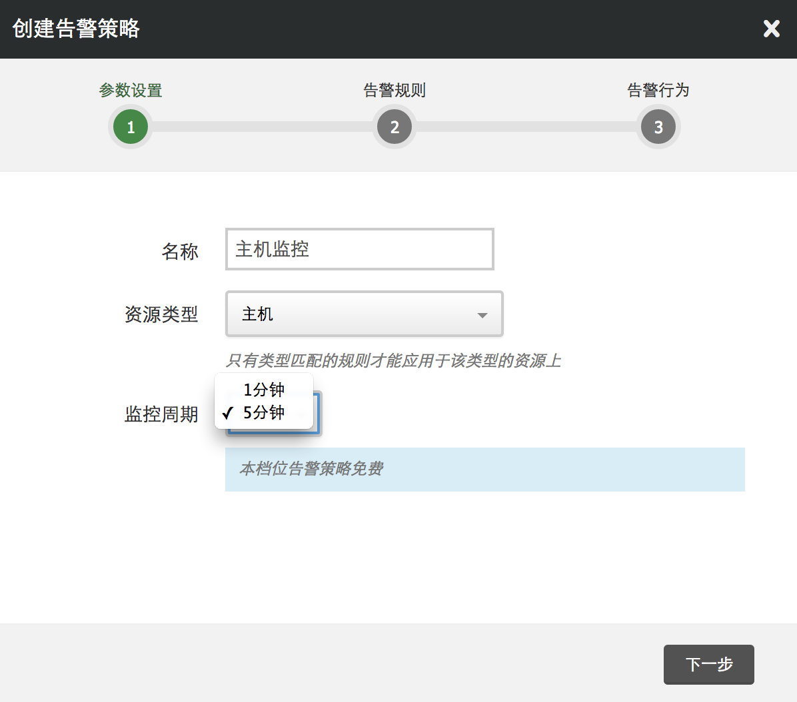](_images/create-alarm-policy-step1.png)

**告警规则**

这一步可对资源支持的监控项设置多条告警规则，任何一条满足条件都会触发告警。

[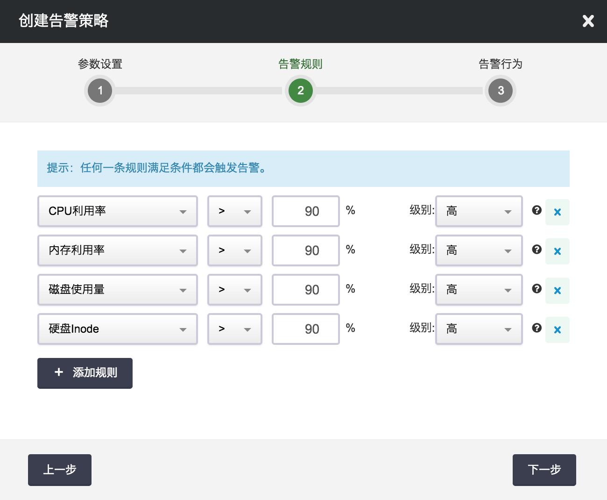](_images/create-alarm-policy-step2.png)

注解

监控数据采样间隔都是1分钟，所以在设置阈值时，可能需要考虑这个时间因素。

**告警行为**

最后一步作为可选项，可设置发送通知到 [通知列表](notification_list.html#guide-notificationlist) ， 在资源的告警状态发生变化时收到通知。

目前告警行为仅支持发送通知，以后还会支持更多操作。

[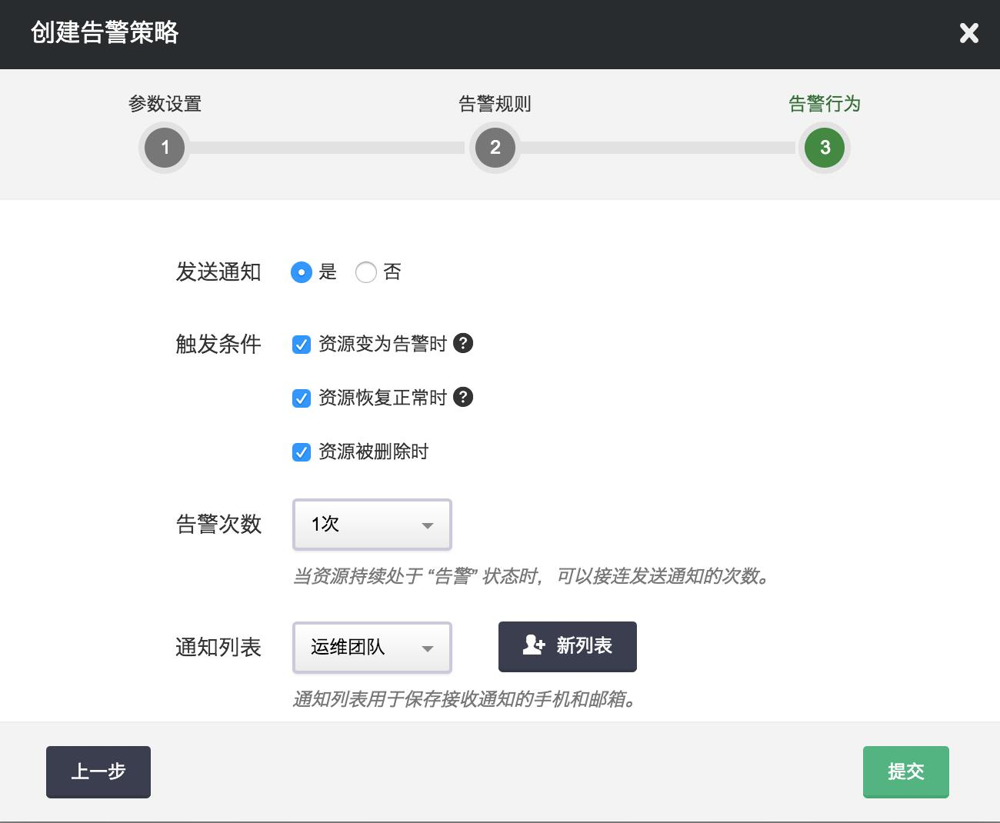](_images/create-alarm-policy-step3.png)

到此告警策略便创建完成了，如果之后需要修改或调整，都可在告警策略详情页中操作。 需要注意的是，告警策略一旦创建完成，其『资源类型』属性便不可改变了。 如果需要其他资源类型的告警，请另行创建相应的策略。

## 添加监控资源

告警策略创建完成后，便可给它添加监控资源。如下图所示，在告警策略详情页的基本属性菜单中点击 『添加监控资源』，之后在弹窗中选择要监控的资源即可。

[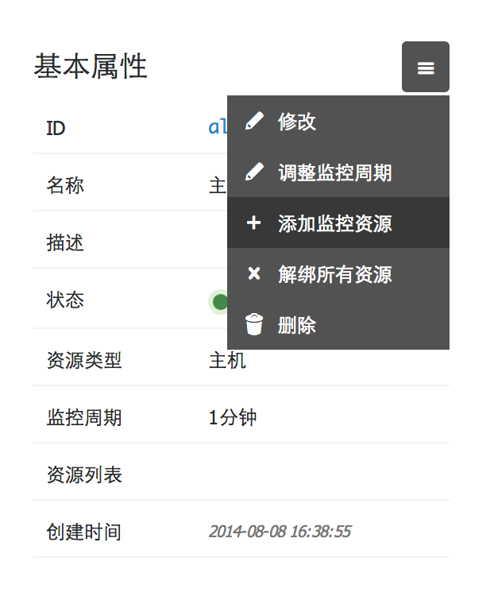](_images/associate-alarm-policy-1.png) [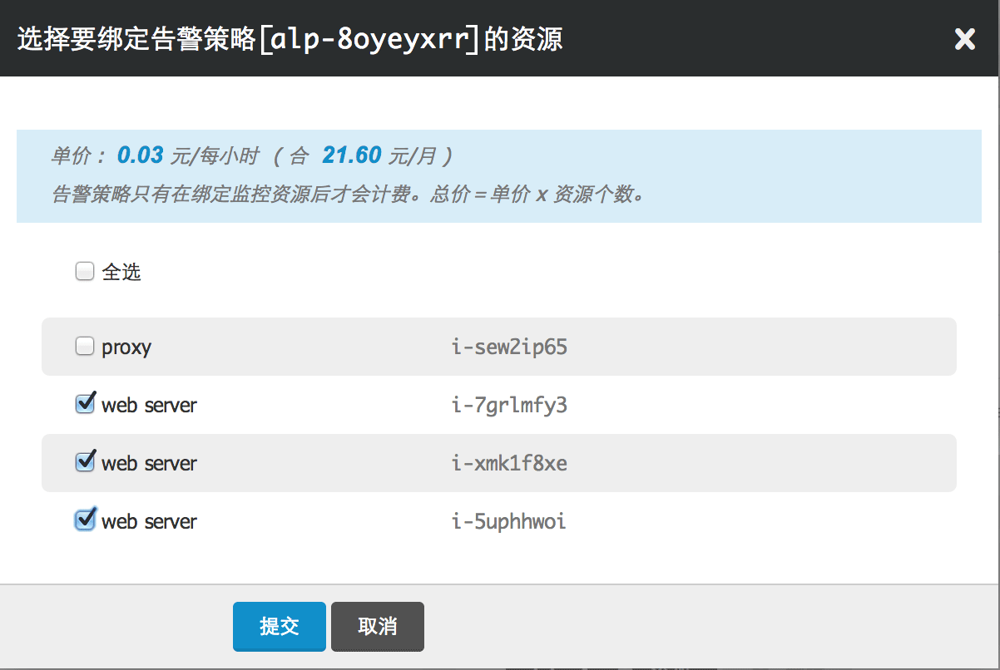](_images/associate-alarm-policy-2.png)

添加监控资源后，监控服务便会自动对资源开始监控。 如果资源被删除，其所关联的监控告警也会随之解除。

## 查看告警历史

资源监控过程中的重要事件都会记录在告警历史中。告警历史可在资源详情页中看到，历史记录包括：

*   当修改了告警策略，并应用修改后，历史中会有一条配置变化的记录。
*   当资源监控状态发生变化时，会有相应的记录，
*   当执行告警事件时，也会有相应的记录，

[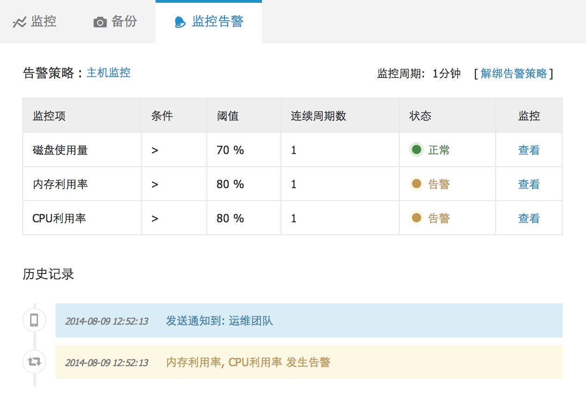](_images/alarm-history.png)

监控告警有三个状态：正常，告警，监控数据不足。其中监控数据不足是指没有取到监控数据， 这通常是因为资源已关闭，或公网 IP 已解绑导致。

负载均衡器监听器或后端服务的告警历史的查看需要鼠标点击『操作』或者右键某个后端服务，再选『监控告警』。 如图所示：

[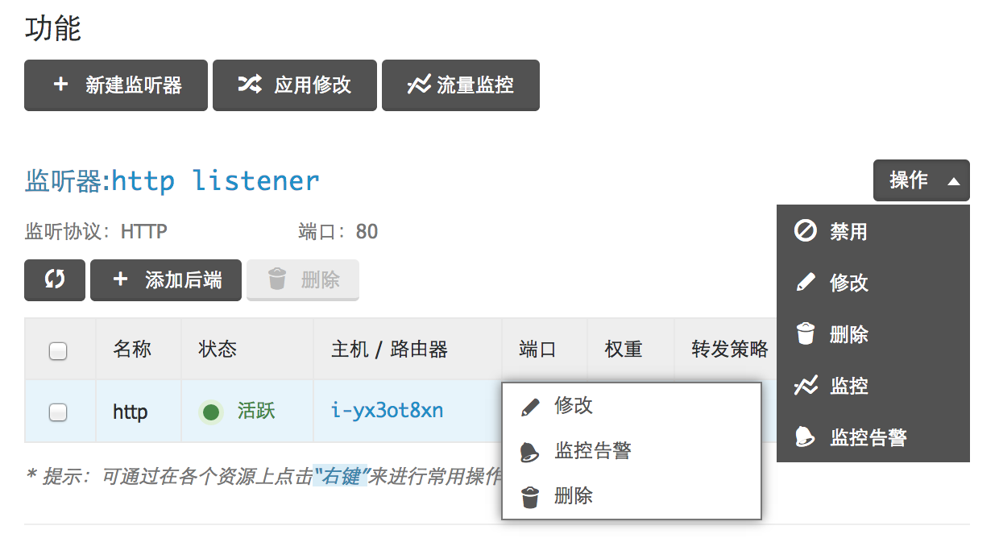](_images/alarm-history-lb.png)

监控历史会保留最近 50 条记录，更早的记录会定期删除。

## 通知列表

用户可以将一组手机号、邮箱和 webhook 保存到通知列表中，用以接收青云系统发送的通知。 目前监控告警功能使用了通知列表，在资源发生告警时第一时间将受监控的资源情况通知用户。

本指南将详细介绍如何新建和管理你的通知列表。

### 创建通知列表

每个青云账户（包括子账户）都可以创建、管理自己的通知列表。你可以在控制台左侧导 航拦中找到 “通知列表 (Notification Lists)”一项，点击即进入通知列表管理界面。

点击 “创建” 按钮，在弹出框中将需要添加的手机和邮箱逐项录入。通常可以按你的工作 人员组别列入不同的通知列表，例如建立开发团队、运维团队、产品团队等列表。如果在 创建告警策略时还没有一个通知列表，在添加告警行为时点击 “新列表”，也能弹出新建 通知列表的窗口完成创建。

注解

点击 “对勾” 图标添加一条手机号/邮箱后，会自动通过短信或邮件发出验证码。手机号和邮箱的验证可以后续完成，不影响通知列表的创建，但只有验证成功的手机号/邮箱才可以接受告警通知，相同的手机号/邮箱只需要验证一次，再次添加时无需验证。

[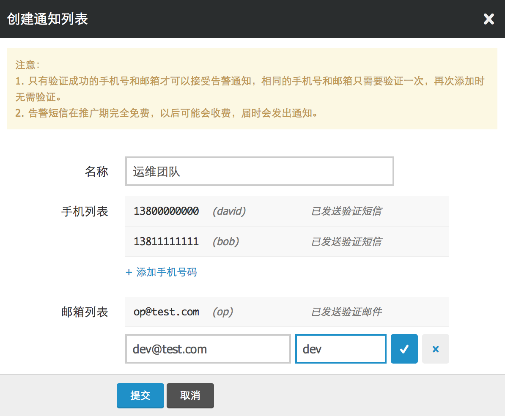](_images/create_notification_list.png)

每个通知列表的手机和邮箱数量总和上限是20个。点击 “提交” 按钮，即可完成通知列表 的创建。

目前短信和邮件通知都是完全免费的，由于短信发送有成本，未来不排除短信收费的可能。如果有计费变动，我们会提前通知到您。

### 修改通知列表

你可以在通知列表界面修改通知列表的内容，点击 ID 号或 “修改” 按钮都可以弹出修改框。 与创建时一样，如果还没有达到总和上限，你可以继续往列表中添加手机号/邮箱。也可以 将通知列表中的手机号/邮箱从列表中移除。

[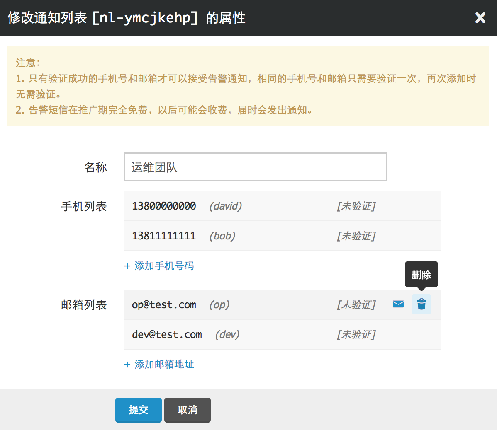](_images/modify_notification_list.png)

### 验证手机号和邮箱

每加入一条新手机/邮箱，系统会发送一条验证短信或验证邮件，以确保该工作人员同意加 入通知列表，并接收来自青云系统的通知短信。如果没有收到验证短信/邮件，或者过期未 验证，可以在修改通知列表时再次发送验证短信/邮件。

[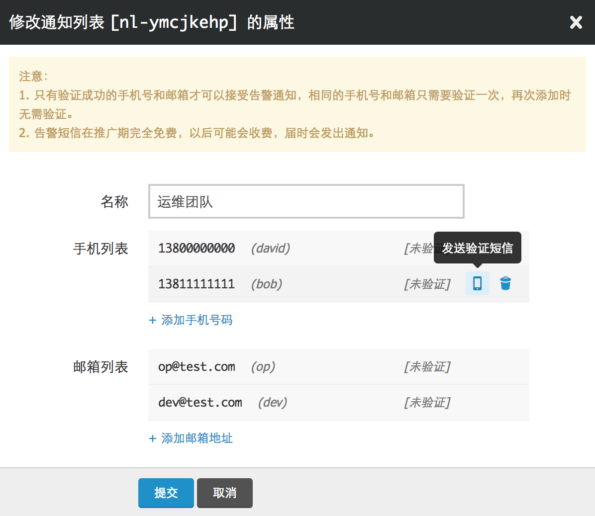](_images/verify_notification_item.png)

你可以在通知列表界面或修改弹出框中看到每个手机/邮箱是否已经验证，已经验证的手机 /邮箱，以后再加入本用户的通知列表，无需再次验证。

### 创建 Webhook

Webhook 可以让你的系统直接收到青云的通知。当监控告警发生时，青云系统会以 HTTP POST 的方式将通知信息发送到指定 URL ，你可以在这个 URL 的接收逻辑中自行处理通知信息。

每加入一条新的 Webhook URL 都需要先进行验证。验证方法是在 URL Response 中返回指定的 token ，一旦通过验证就无需再在 Response 中保留这个 token 。 每个 URL 对于同一个用户只需验证一次。

[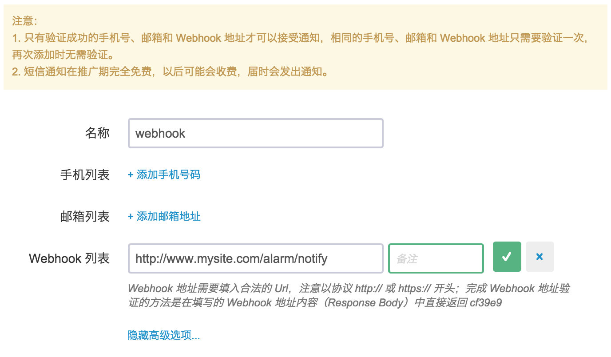](_images/add_notification_webhook.png)

添加完 URL 后会自动尝试验证一次，如果此时还没有修改好了对应 URL 的返回内容，那么可以在保存完通知列表后，再次展开并点击再次验证的按钮来触发验证。

[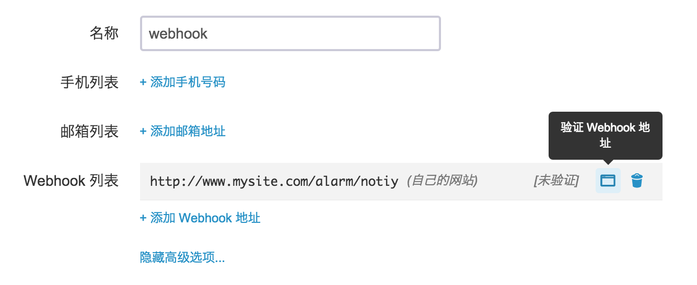](_images/verify_notification_webhook.png)

验证通过后，当监控告警发生时，URL 会收到来自青云主动推送的通知，推送方式是
POST ，POST form 携带的参数如下


```
  {
    "alarm_policy": "inst",                         # 监控告警策略名称
    "resource": {                                   # 资源信息
      "resource_id": "i-fsda5aiv",
      "resource_name": "",
      "resource_type": "instance"
    },
    "rules": {                                      # 监控告警规则列表
      "alpr-lr3gv19q": {
        "alarm_policy_id": "alp-7x97ldud",          # 监控告警策略 ID
        "alarm_policy_rule_id": "alpr-lr3gv19q",    # 告警规则 ID
        "alarm_policy_rule_name": "",               # 告警规则名称
        "condition_type": "gt",                     # 判断条件：gt (>), lt (<)
        "consecutive_periods": 1,                   # 连续周期数
        "create_time": "2015-06-05T16:28:55",
        "disabled": 0,                              # 是否禁用
        "meter": "disk-us",                         # 资源监控项
        "owner": "usr-qkMLt5Oo",
        "recent_monitor_data": {"/": [[1433771551, 6]]},
        "status": "ok",                             # 此监控项的状态：ok 正常，alarm 告警中，insufficient 无监控数据
        "data_processor": "raw",                    # 监控阈值类型：raw - 阈值即为监控数据值，percent - 阈值表示的是『百分比』(百分比目前只用于 IP 带宽告警)
        "thresholds": "90"                          # 监控阈值
      },
      "alpr-u8vue5g6": {
        "alarm_policy_id": "alp-7x97ldud",
        "alarm_policy_rule_id": "alpr-u8vue5g6",
        "alarm_policy_rule_name": "",
        "condition_type": "lt",
        "consecutive_periods": 1,
        "create_time": "2015-06-05T16:28:55",
        "data_processor": "raw",
        "disabled": 0,
        "meter": "memory",
        "owner": "usr-qkMLt5Oo",
        "recent_monitor_data": [[1433771500, 10.3],
         [1433771510, 10.4],
         [1433771520, 10.3],
         [1433771530, 10.4],
         [1433771540, 10.3]],
        "status": "alarm",
        "thresholds": "90"
      },
      "alpr-wkjaaqvh": {
        "alarm_policy_id": "alp-7x97ldud",
        "alarm_policy_rule_id": "alpr-wkjaaqvh",
        "alarm_policy_rule_name": "",
        "condition_type": "gt",
        "consecutive_periods": 1,
        "create_time": "2015-06-05T16:28:55",
        "data_processor": "raw",
        "disabled": 0,
        "meter": "cpu",
        "owner": "usr-qkMLt5Oo",
        "recent_monitor_data": [[1433771500, 0.2],
         [1433771510, 0.5],
         [1433771520, 0.2],
         [1433771530, 0.4],
         [1433771540, 0.2]],
        "status": "ok",
        "thresholds": "90"
      }
    },
    "trigger_status": "alarm",                      # 通知触发条件：ok，alarm，insufficient
    "zone": "beta"
  }

```

因为通知列表不仅用于监控告警，还可用于接收自动伸缩和定时器的通知， 而不同服务推送的 webhook 数据也不同，这里一并说明。

当自动伸缩触发通知时，webhook 携带的参数如下

```
{
  "zone": "beta",
  "autoscaling_rules": {                         # 自动伸缩规则属性
    "autoscaling_policy_rule_id": "aspr-96lss7vs",
    "history_type": "scale_success",             # 执行结果
    "description": "",
    "scale_direction": "decrease"                # increase: 上调, decrease: 下调
  },
  "autoscaling_policy": {                        # 自动伸缩策略属性
    "autoscaling_policy_id": "asp-36fcf6sb",
    "resource": {                                # 自动伸缩调整的资源
      "resource_name": "",
      "eip_addr": "192.168.7.88",
      "resource_type": "eip",
      "resource_id": "eip-5irjjfki"
    },
    "description": "",
    "autoscaling_policy_name": "",
    "scale_type": "eip_bandwidth"                # 自动伸缩策略类型
  }
}
```

当定时器触发通知时，webhook 携带的参数如下

```
{
  "tasks": [{                                    # 定时器任务属性
      "scheduler_task_id": "st-jtwx7hqt",
      "history_type": "task_fail",               # 任务执行结果
      "task_type": "start_instances",            # 任务类型
      "scheduler_task_name": ""
  }],
  "scheduler": {                                 # 定时器属性
    "scheduler_name": u"scheduler",
    "scheduler_id": "schd-x0v8l9x9"
  },
  "zone": "beta"
}
```
