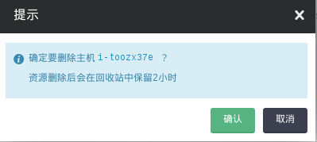
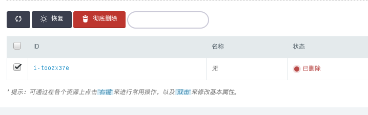
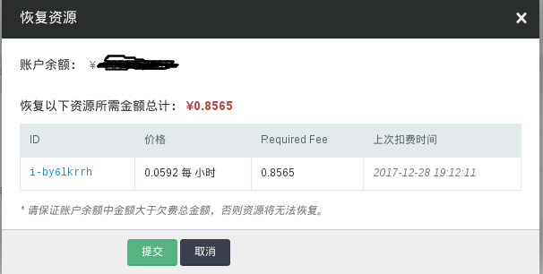

---
---

# 回收站

您删除的资源，包括主机、硬盘、备份、自有映像等，我们会为您在 回收站（Recycle Bin）中保留2个小时，这期间您可以进行恢复操作。2小时后，资源会被彻底销毁，不可恢复。

以下操作实例为删除一台主机，然后恢复的过程为例，展示回收站的功能。

## 删除一台主机

在青云的终端控制台，打开“计算”->“主机”页面，选中要删除的主机，然后点击删除：

## 后悔了，到回收站寻找

打开“管理”->“回收站”页面，查找刚刚删除的主机：

## 恢复为原貌
打开“管理”->“回收站”页面，选中刚刚删除的主机,然后点击“恢复”：

聪明的您，可以选择其它资源，但是一定要留意，青云QingCloud只会帮助你保留2个小时。
