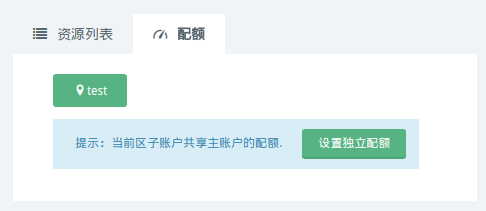
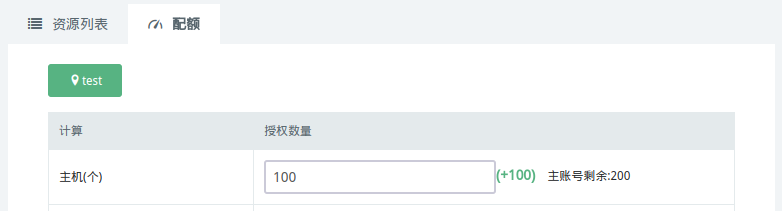

---
---

# 子账号配额管理

默认状态下，子账户共享主账户的配额。现在，主账户可以使用独立配额功能，给子账户做配额限制。

## 开启独立配额

登录青云 WEB 控制台，点击页面右上角“账户-子账户”，然后进入欲分配独立配额的子账户详情页。

进入详情页后，点击“配额”页签。当子账户还没有独立配额时，您会看到如下页面：

如您想给这个子账户分配独立配额，请点击“设置独立配额”按钮。 点击按钮之后，页面里出现一个分配表单，您可以在这里填写分配资源的数量。

注解

> 分配数量的上限，必须小于等于主账户可用资源数量。

注解

> 有一些资源是有依赖性的。比如，想要创建一台主机，需要主机，CPU，内存，硬盘这些资源。
>
> 当您填写完资源数量后，点击表单底部的“修改独立配额”按钮，就可以让此子账户拥有独立配额了。

注解

> 分配给子账户的资源配额，会立即从主账户的可用资源里扣除响应的数量。

## 修改独立配额

您可以随时调整子账户的独立配额。

登录青云 WEB 控制台，点击页面右上角“账户-子账户”，然后进入欲修改独立配额的子账户详情页。

进入详情页后，点击“配额”页签。您会看到分配表单。

您可以在这里修改资源的数量。

注解

> 如果您想分配更多的资源给子账户，请先确认主账户有足够的可用资源。

注解

> 如果修改后的资源数量小于子账户已经使用的资源数量，不会对您已用的资源有任何影响，但是该子账户不能再创建更多的资源。同时，这部分超过配额的资源用量，会计入主账户的已用资源用量里。

完成修改后，请点击表单底部的“修改独立配额”按钮。

## 回收独立配额

您可以回收子账户的独立配额。独立配额被回收后，不会影响您已经创建的资源。

登录青云 WEB 控制台，点击页面右上角“账户-子账户”，然后进入欲回收独立配额的子账户详情页。

进入详情页后，点击“配额”页签。您会看到分配表单。

滚动页面到表单底部，您会看到“回收独立配额”按钮。

点击这个按钮后，该子账户会回到共享主账户配额的状态。
