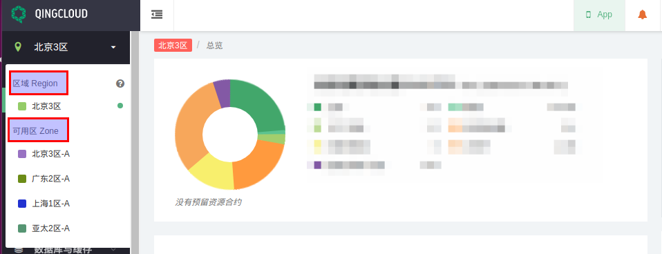
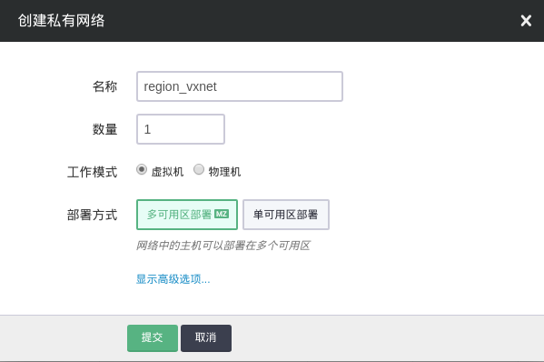
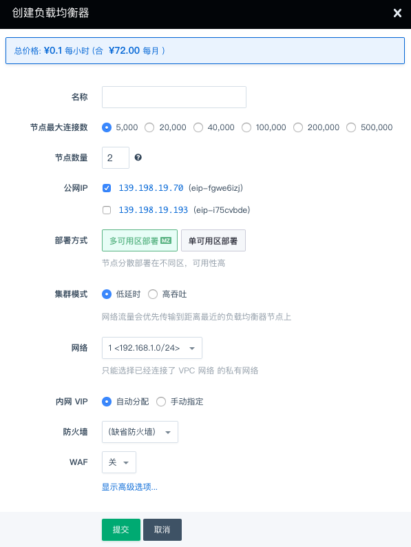
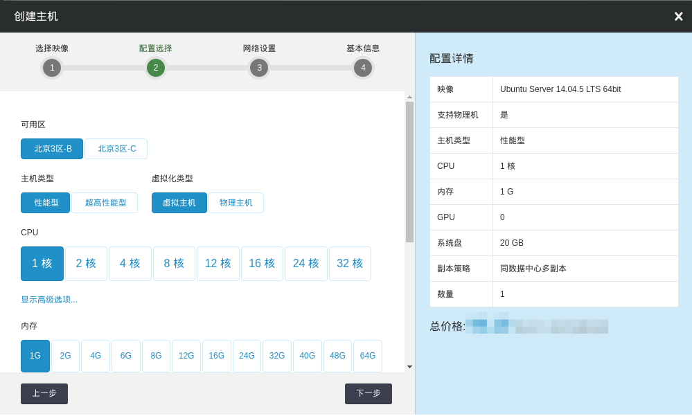
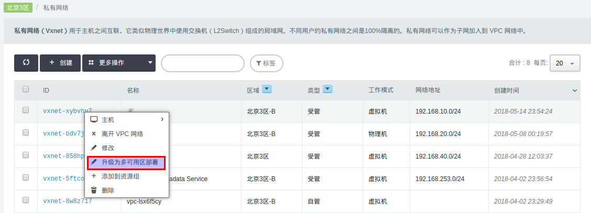
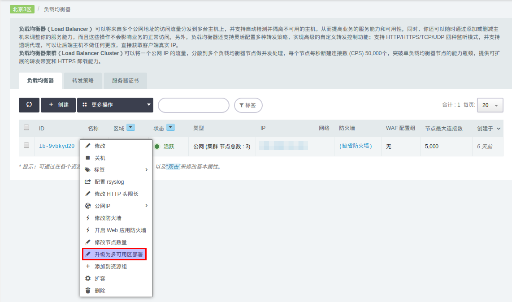

---
---

# 区域和可用区指南

青云平台的一个区域由多个可用区组成，每个可用区都是独立的数据中心，它们之间电力和网络设备互相独立，并且网络互通，适合部署同城多活的高可用业务， 同一可用区内的主机网络延时更小。

*   如果业务需要同城多活，建议您将主机部署在不同可用区内，通过同一个负载均衡器对外提供服务。
*   如果主机之间需要较低的网络时延，则建议您将它们部署在相同的可用区内。

部署业务时， 用户可利用多可用区部署来实现高可用方案，从而避免某个可用区的服务不可用而影响整个业务。

目前青云线上的区域情况如下表：

| 区域 | Region ID | 可用区 |
| --- | --- | --- |
| 北京3 | PEK3 | 北京3区-B 、北京3区-C 、北京3区-D |
| 广东2 | GD2 | 广东2区-A 、广东2区-B |
| 上海1 | SH1 | 上海1区-A 、上海1区-B |
| 亚太2 | AP2 | 亚太2区-A |
| 雅加达区 | AP3 | 雅加达区 |

在控制台的左侧可用区导航列表中也区分了区域和可用区：

> 注解
1. 线上其他各区现均显示为可用区， 用以区分由多可用区组成的区域。
2. 可用区北京3区-A 不属于北京3区。
3. 原北京3区-B 现已经合并到北京3区，原北京3区-B 的资源在导航选择北京3区后就能查看。
4. 原北京3区-B 的合约自动升级为北京3区合约，北京3区内支持“预留合约”计费模式的资源都能加入到北京3区的合约里。

## 区域资源
青云平台的VPC、VPC专属私有网络(VxNet)、公网负载均衡器 (Load Balancer) 和弹性公网EIP (Elastic IP) 均为区域资源，即能多可用区使用/部署， 在页面左侧导航处相应资源均带有“MZ” (Multiple Zone)标记。

### VPC
VPC可以连接位于不同可用区的私有网络， 私有网络之间网络互通，VPC和以前一样能为其下所有私网内的主机和服务提供管理路由器的功能。

### VPC专属私有网络

私有网络支持多可用区部署模式，可通过选择不同的部署方式来创建不同类型的私有网络：选择“多可用区部署”时，不同可用区内的主机/服务均能加入到此网络，该网络支持广播和组播，可以通过漂移虚IP(VIP)来部署同城多活业务。 选择“单可用区部署”时， 只有同可用区内的主机/服务才能加入此网络，主机之间的网络延迟最低。

### 负载均衡器
（公网和私网）负载均衡器支持多可用区部署，和上节的私有网络类似，选择“多可用区部署”创建的负载均衡器， 其集群节点(节点个数不小于2)在不同可用区内均衡分布，从而达到同城多活高可用目的。
选择“单可用区部署”创建的负载均衡器， 其集群节点分布在指定的可用区内， 网络延时最低。

### 弹性公网EIP

公网EIP为区域内资源，能将其绑定到位于同一区域内所有的主机、负载均衡器、VPC路由器。

## 可用区资源

青云平台的 主机，设备，硬盘，网络镜像流量，私网负载均衡器 均为单可用区内的资源。
当用户创建这些资源的时候，需要首先选择目标可用区， 比如北京3区-B 。如果用户没指定, 青云会自动选择用户在区域内的默认可用区。 选定某一可用区之后， 资源就只能和位于同一可用区的其他资源相关联。以创建主机为例，在选择了主机镜像之后需选择目标可用区：

选择好目标可用区之后， 可选硬盘以及私有网络均只会显示位于同一可用区相关资源列表。

> 注解
1. 安置策略组为可用区内的关系， 不同可用区的主机不能加入到同一个安置策略组。
2. 网卡由其私有网络所在可用区决定， 如果其私有网络为多可用区私有网络， 则该网卡能分配到区域内所有虚机， 否则就只能分配给位于同一可用区内的主机。
3. 内网域名别名在区域范围内能解析。

## 可用区资源升级为区域资源
原北京3区-B 现为区域北京3区的一个可用区，原北京3区-B 内的公网EIP自动升级为区域公网 EIP ，能在北京3区内使用： 某个EIP能从原北京3区-B 的主机上解绑， 然后绑定到北京3区-C 的主机/VPC路由器，或者用于部署多可用区公网负载均衡器。

原位于北京3区-B 的私有网络和公网负载均衡器的可用区属性不变， 用户能根据需求将私有网络和公网负载均衡器升级为区域资源（多可用区部署）， 具体步骤见下节。

### 私有网络升级

在私有网络页面，点击右键菜单中的“升级为多可用区部署”就能将可用区内私有网络升级为多可用区私有网络， 升级之后，位于不同可用区的虚机/服务均能加入该私有网络。

> 注解
物理主机网络是可用区内资源，只能服务于某个可用区内的物理主机。

### 公网负载均衡器升级
公网负载均衡器升级为多可用区负载均衡器步骤如下：
1. 在负载均衡器页面，选择右键菜单中的“升级为多可用区部署”， 之后负载均衡器详情页面会提示需要“应用修改”。
2. 点击应用修改更新负载均衡器，更新后负载均衡器集群节点会在区域内的不同可用区间重新均衡分布，达到同城多活高可用效果。 升级期间业务会有闪断，建议升级时间避开业务高峰。

## 运维与监控
自动伸缩、定时器、监控告警、资源协作、标签、回收站、操作日志、通知列表这些服务能管理整个区域内的资源。

> 注解
资源编排模板内的所有资源只能部署在同一可用区， 暂不支持多可用区资源的部署。 如有需求可以在成功应用模板之后升级具体的资源。

## AppCenter
青云支持部署多可用区的APP，前提是该APP集群能支持多可用区部署模式，并且创建APP集群时需要加入多可用区的私有网络， 具体配置方法见[AppCenter网络配置](../network/appcenter_network_config/create_vxnet.html)
