---
---

# 网络访问控制 用户指南

网络访问控制功能包括网络 ACL 和基础网络安全策略。网络 ACL 是私有网络（Vxnet）的进出流量控制表，您可以在这里创建和配置 ACL 规则， ACL 规则中声明了哪些流量可以进/出私有网络（Vxnet），所以可以通过 ACL 控制进出流量。基础网络安全策略则定义了在青云 QingCloud 环境中，用户自身的基础网络是否对其他用户开放，默认禁用也就是默认用户的基础网络内的资源只受防火墙限制。

网络 ACL 与防火墙的功能类似，但是网络 ACL 绑定给私有网络，防火墙一般直接绑定给主机或者负载均衡器。网络 ACL 中更适合配置私有网络 Vxnet 通用的安全规则，例如：数据库所在的网段绝对不对公网开放，可以先配置上行和下行优先级 255 （最低的优先级一般用于保底规则）拒绝 IPv4 的所有地址的规则和上行和下行优先级 255 拒绝 IPv6 的所有地址的规则。假如对内部网络（假设为 `192.168.0.0/16` ）默认全开放，则可以配置上行和下行优先级 100 允许 192.168.0.0/16 。

>注意：在创建网络 ACL 规则时，数字越小则优先级越高。

在所有流量进出的时候，会按照优先级由高到低检查数据包，假设匹配到了数据包就不再继续往下匹配。所以大的地址段（例如 `0.0.0.0/0` ）放到低优先级，小的地址段（例如 `192.168.10.2/32` ）放到高优先级，可以帮助您更好地管理私有网络的安全。

## 网络 ACL 页面基本操作

### 创建网络 ACL

点击`安全`中的`网络访问控制`进入网络 ACL 列表

[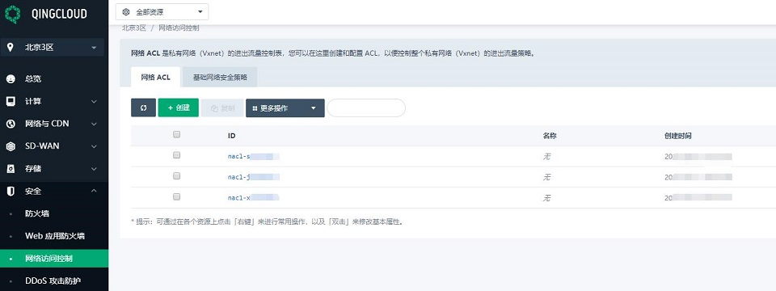](./_images/network_acl_list.jpg)

点击`创建`,弹出创建的页面，您可以自定义网络 ACL 的名称

[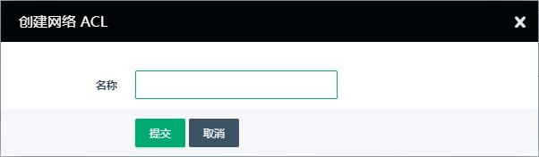](./_images/creat_network_acl.jpg)

点击提交，ACL 就创建成功了，页面自动转到新创建的网络 ACL 的详情页面，可以看到网络 ACL 的所有规则。为了避免网络 ACL 影响网络的连通，所以新创建的网络 ACL 默认对所有地址开放。您可以在网络 ACL 的详情页面查看、添加、修改、删除、禁用 ACL 规则、应用修改。在左上角`基础属性`栏，可以看到网络 ACL 的名称 / ID / 绑定的资源和创建时间。

[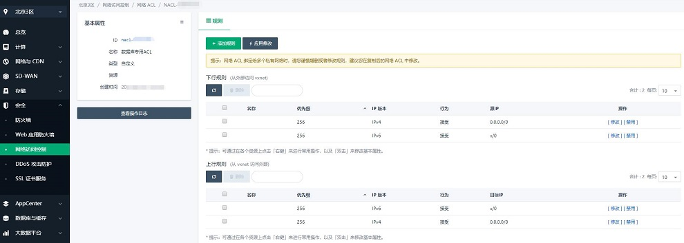](./_images/network_acl_details.jpg)

### 修改网络 ACL 配置

点击`添加规则`，用户可以定义要添加的规则。填写规则名称、优先级（数字越小优先级越高，最多可添加 100 条规则），选择方向（上行或者下行），行为(允许或者拒绝)、IP 版本( IPv4 / IPv6 )，源 IP (下行) / 目的 IP （上行）。

>IP 地址不填时，系统将默认为所有 IP 地址

[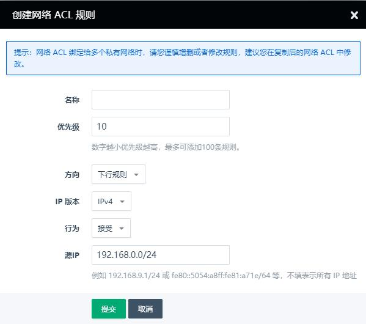](./_images/creat_network_acl_rule.jpg)

点击规则右侧的`修改`按钮可以修改现有的规则

[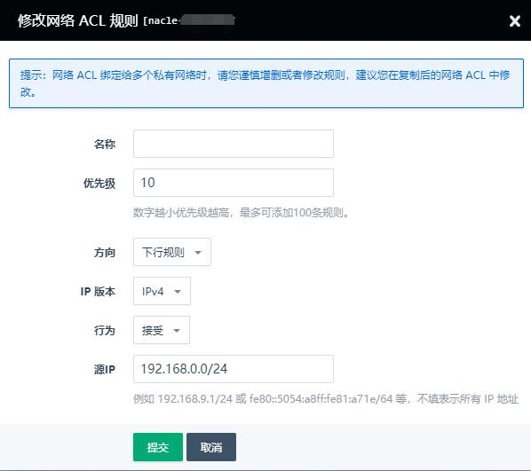](./_images/modify_network_acl_rule.jpg)

点击`禁用/启用`按钮可以将相应的规则禁用或启用。

[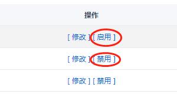](./_images/disable_network_acl_rule.jpg)

点击`应用修改`使配置修改生效

[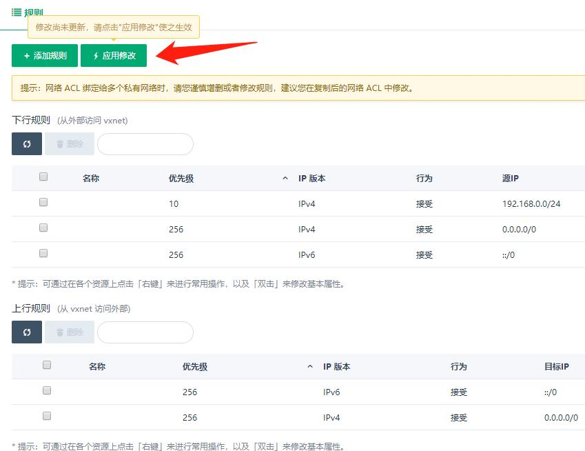](./_images/apply_network_acl_list.jpg)

### 网络 ACL 绑定到私有网络 Vxnet

在网络 ACL 列表页，可以右键 - 网络 - 绑定 / 解绑私有网络

[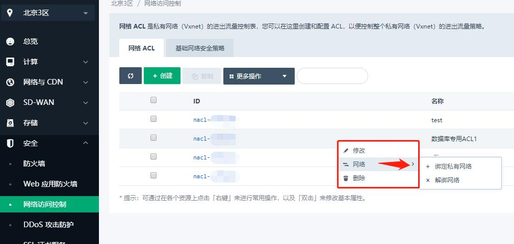](./_images/associate_network_acl_list.jpg)

先选择对应的 VPC ，然后选择私有网络 Vxnet

[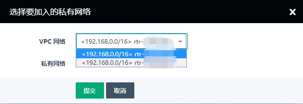](./_images/network_acl_choose-vpc.jpg)

[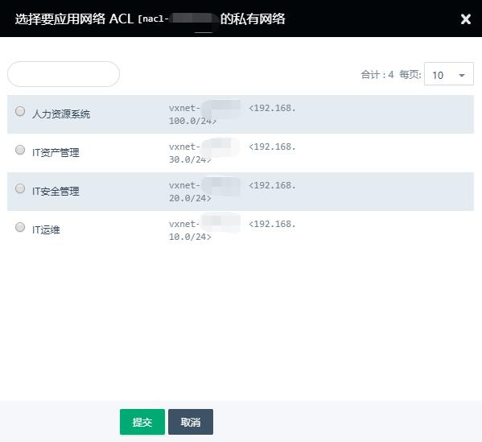](./_images/network_acl_choose-vxnet.jpg)

点击提交，网络 ACL 就成功绑定到私有网络 Vxnet

## VPC 和私有网络 Vxnet 相关的网络 ACL 配置和操作

为了方便用户使用，我们在 VPC 和私有网络 Vxnet 页面中也增加了网络 ACL ，您可以查看相关的网络 ACL 配置，并进行一定的操作。因为网络 ACL 可以绑定多个私有网络 Vxnet，所以在网络 ACL 绑定给多个私有网络时，请您谨慎增删或者修改规则，建议您在复制后的网络 ACL 中修改。

>网络 ACL 绑定多个私有网络时，网络 ACL 的应用修改会同步给所有绑定的私有网络。

### 在 VPC 下私有网络页面中配置和操作

在 VPC 的`私有网络`界面下，每个私有网络都新增了`网络 ACL `页面，您可以在资源列表中查看当前 ACL 中的全部资源。

[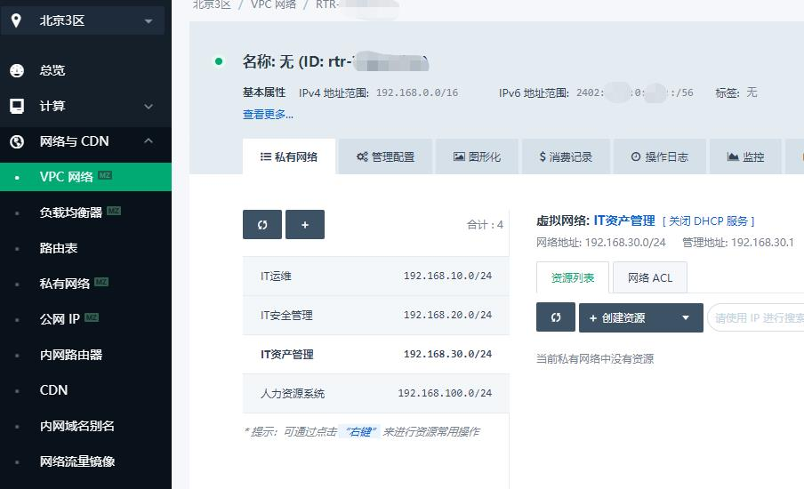](./_images/network_acl_vpc_vxnet.jpg)

点击`网络 ACL `，就进入私有网络的网络 ACL 页面，您可以查看、添加、修改、禁用、删除当前绑定的网络 ACL 中的规则。

[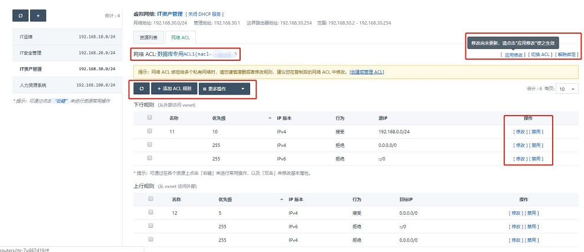](./_images/network_acl_vpc_vxnet_acldetails.jpg)

您还可以点击提示中的`创建或管理 ACL `快速跳转到网络 ACL 页面。

当有规则没有应用修改时，您可以点击`应用修改`将规则的修改应用到所有关联的 Vxnet。

### 在私有网络页面中绑定和解绑 网络 ACL

您可以在私有网络页面看到每个私有网络 Vxnet 绑定的网络 ACL

[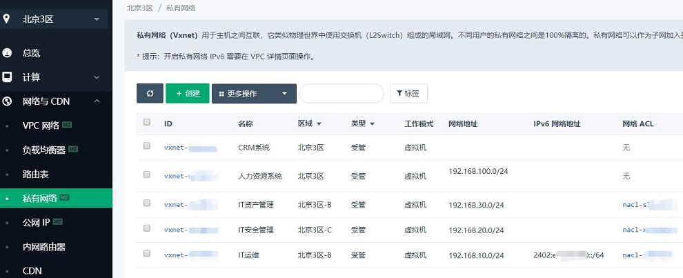](./_images/network_acl_vxnet.jpg)

您还可以通过私有网络右键 - 网络 ACL - 绑定 / 解绑来对私有网络的 ACL 进行操作

[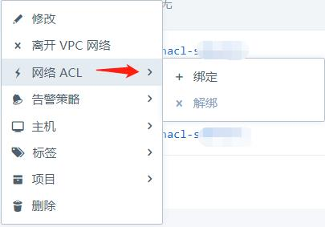](./_images/network_acl_vxnet_rightclick.jpg)

## 基础网络安全策略

网络访问控制下还支持用户修改基础网络安全策略，用户可以通过基础网络安全策略定义青云 QingCloud 环境内的您的基础网络是否开放给其他用户。

[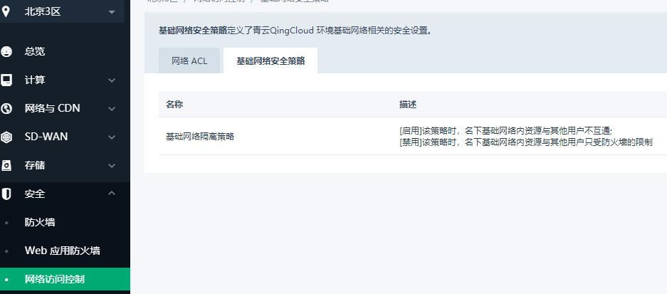](./_images/network_acl_vbc_security_policy.jpg)

您可以点击启用 / 禁用基础网咯的隔离。

[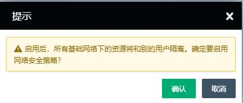](./_images/network_acl_vbc_security_policy_inuse.jpg)

[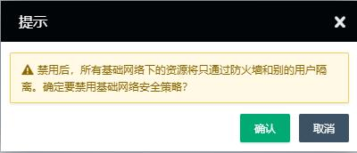](./_images/network_acl_vbc_security_policy_unuse.jpg)

>基础网络安全策略只作用于基础网络，不会影响 VPC 的隔离，VPC 仍然保证 100% 的二层隔离
