---
---

# SSL 产品概述 {#ssl}

QingCloud SSL 证书提供了安全套接层证书的一站式服务，包括证书申请,管理及部署功能,与 [亚洲诚信](https://www.trustasia.com/) 合作，提供完整的证书解决方案。

## 名词解释 {#id2}

**SSL 证书**

即安全套接层（SSL）数字证书，数字证书是一种用于电脑的身份识别机制。数字证书可以从身份认证机构获得。理论上任何人都可以颁发数字证书。颁发数字证书的个人或机构对公钥进行加签。一般国际可信的证书由 CA 机构制作颁发。

**HTTPS**

是一种网络安全传输协议。在计算机网络上，HTTPS 经由超文本传输协议进行通信，利用 SSL/TLS 来对数据包进行加密。HTTPS 开发的主要目的，是提供对网络服务器的身份认证，保护交换数据的隐私与完整性。

**CA机构**

数字证书授权机构 （Certificate Authority） 是负责发放和管理数字证书的权威机构。

## 证书类型 {#id3}

| 证书类型 | 域名型(DV)SSL证书 | 企业型(OV)SSL证书 | 企业增强型(EV)SSL证书 |
| --- | --- | --- | --- |
| 使用说明 | 信任等级一般，只需验证网站的真实性便可颁发证书保护网站，拥有域名的解析权即可。 | 信任等级强，须要验证企业的身份，审核严格，安全性更高。 | 信任等级最高，一般用于银行证券等金融机构，审核严格，安全性最高，同时可以激活绿色网址栏。 |
| 证书用途 | 个人 | 企业 | 金融行业 |
| 签发时间 | 数小时 | 5 个工作日 | 7 个工作日 |
| 浏览器行为 | [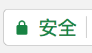](../../product/security/_images/ssl/11.png) |  | [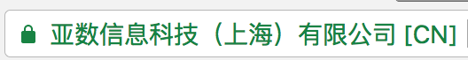](../../product/security/_images/ssl/31.png) |

## 购买流程 {#id5}

**第一步：创建订单**

注解

免费证书仅限使用在 QingCloud 的负载均衡中，禁止用户下载，公司和姓名信息仅支持中文，仅限国内企业用户购买。

点击控制台左侧的安全 - SSL 证书服务，进入如下界面：

[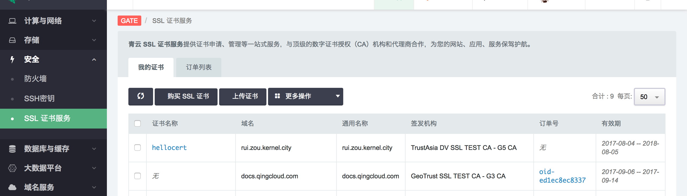](../../product/security/_images/ssl/step_1.png)

点击“购买 SSL 证书”

选择需要的 [_证书类型_](#id3) 和 [_证书品牌_](#brand) 点击“确定”

[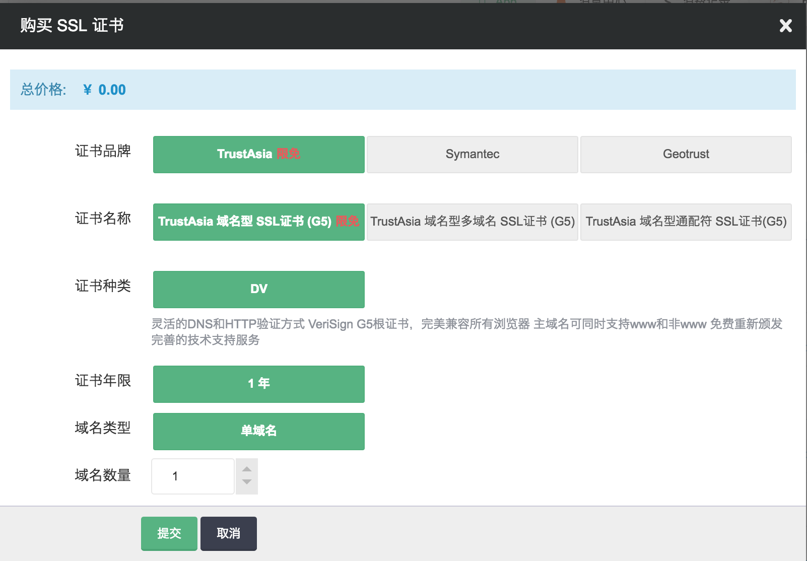](../../product/security/_images/ssl/step_2.png)

**第二步：补全域名信息**

DV 域名同时需要选择域名验证方式,建议使用 DNS 验证方式，如果没有网站 DNS 权限则使用文件验证。

点击“订单列表”选择订单，然后点击“补全域名”

[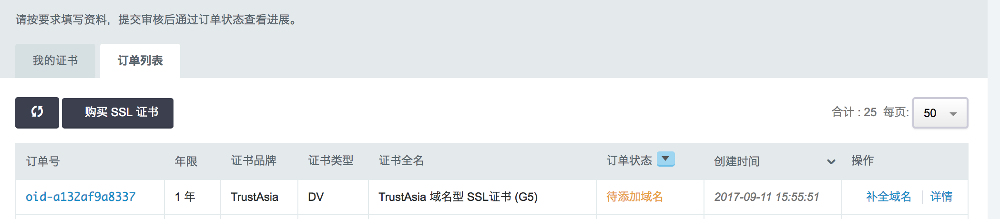](../../product/security/_images/ssl/step_3.png)

输入需要签发的域名并选择加密算法

DV 证书需要选择 [_域名验证方式_](#valid-domain)

注解

*   当通用域名为主域名时，如 qingcloud.com，默认会签发出www.qingcloud.com 和 qingcloud.com (免费赠送不计入数量)。
*   当通用域名为泛域名时，如 *.qingcloud.com， 默认会签发出 *.qingcloud.com 和 qingcloud.com (免费赠送不计入数量) 。
*   额外的域名：填写额外的子域名到多域名输入框中，即下图所示，提交签发出 qingcloud.com www.qingcloud.com api.qingcloud.com 和 docs.qingcloud.com 四个域名，同时建议多个子域名情况下直接购买泛域名证书。

[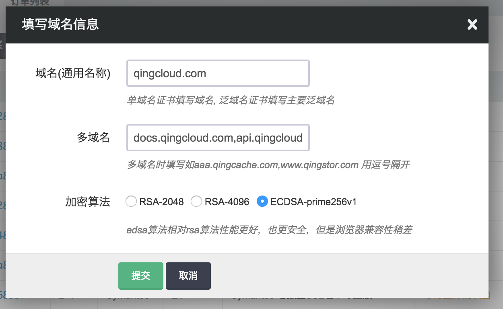](../../product/security/_images/ssl/step_4.png)

**第三步：支付**

在订单列表页，点击“支付”按钮弹出如下对话框，点击确认支付即可。

[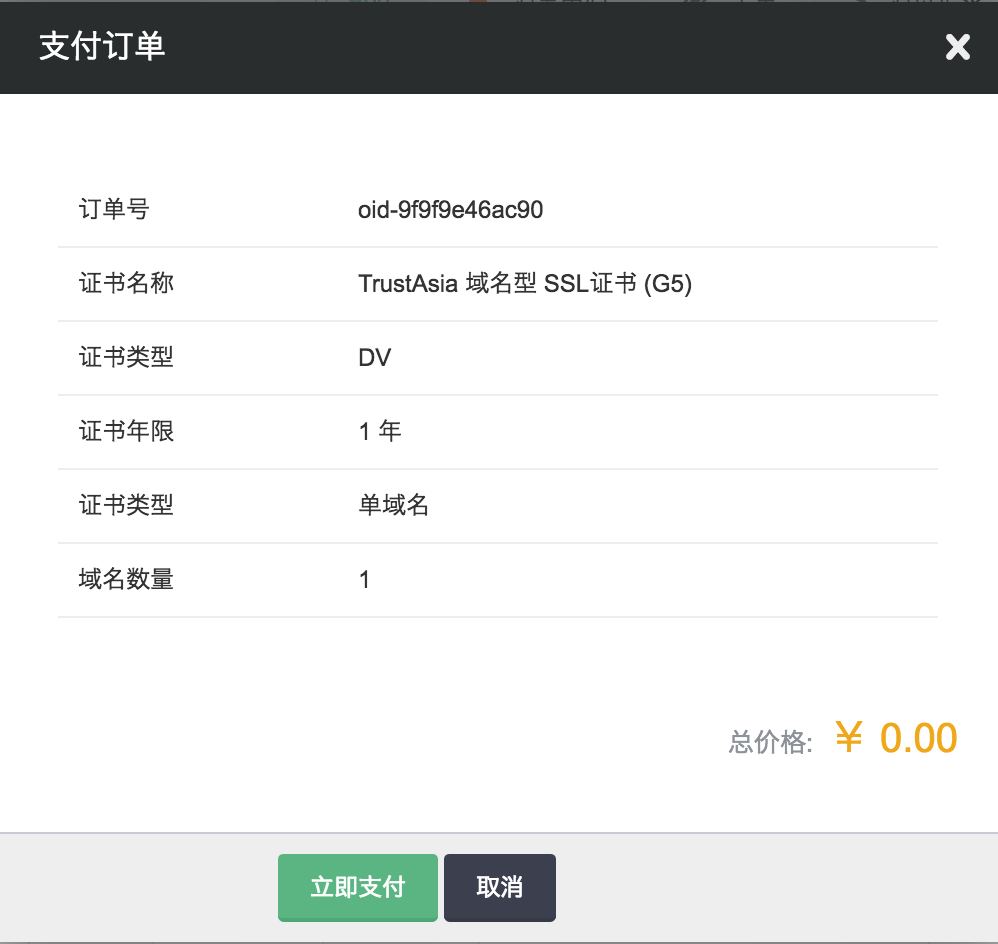](../../product/security/_images/ssl/step_5.png)

**第四步：补全公司信息**

公司信息和个人信息补全后，非签发失败情况下不退款，请核实签发域名和选择的品牌正确与否。

填写公司信息后点击”下一步“，填写个人信息，点击”提交“

[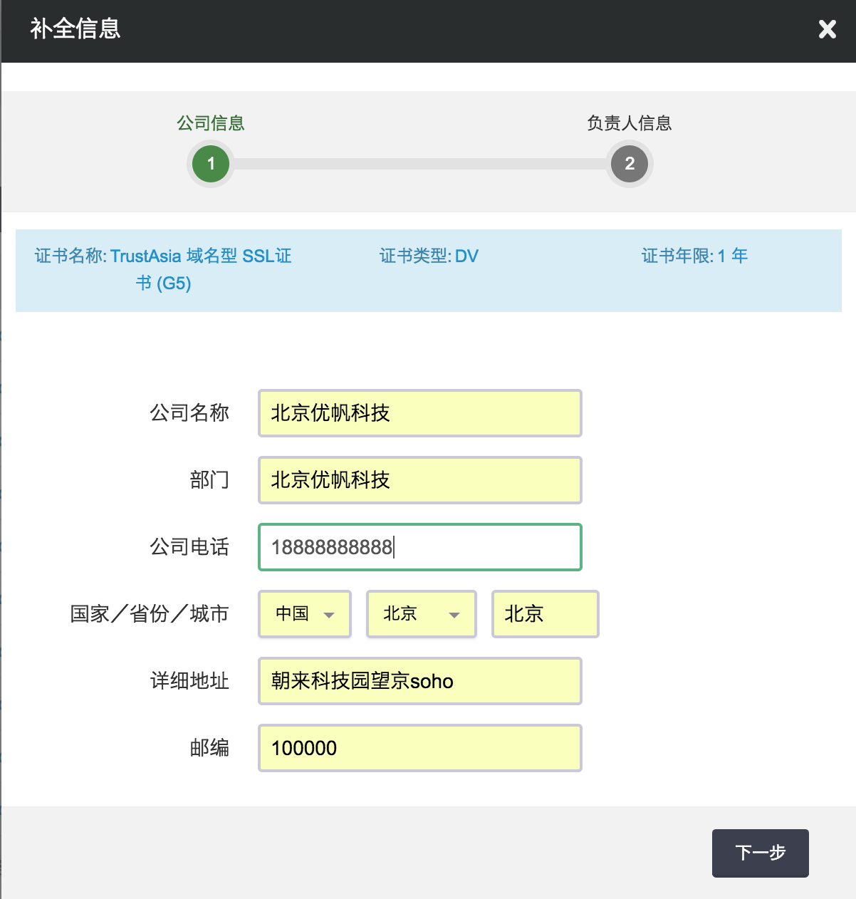](../../product/security/_images/ssl/step_6.png) [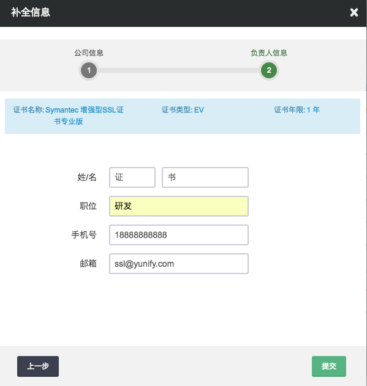](../../product/security/_images/ssl/step_7.png)

**第五步：域名确认/上传确认函**

DV 域名的验证通过 DNS 验证，或者文件验证即可，验证过程通常小于一天， OV/DV 证书的验证需要通过上传确认函的方式进行。

***DV 验证***

[_域名验证方式_](#valid-domain)

***OV,EV 验证***

[_确认函确认_](#confirm-letter)

**第六步:下载证书**

证书签发成功后进入订单完成状态，可以点击证书详情进行下载，也可以直接在负载均衡器中加载使用。

[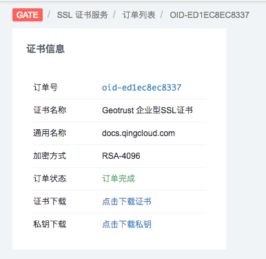](../../product/security/_images/ssl/download.png)

## 域名验证方式 {#valid-domain}

建议使用 DNS 验证方式，如果没有网站DNS权限，也可使用文件验证。

补全公司信息后点击”验证“：

[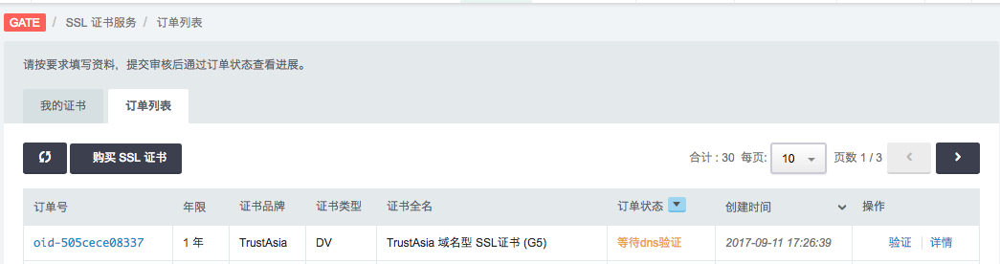](../../product/security/_images/ssl/domain_valid.png)

**DNS 验证**

通过配置 DNS 的方式确定域名的所属权，需要为签发的域名做 TXT 解析到

[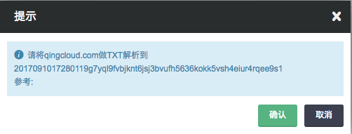](../../product/security/_images/ssl/domain_valid_dns.png)

根据提示需要把 qingcloud.com 做 TXT 解析到 2017091017280119g7yql9fvbjknt6jsj3bvufh5636kokk5vsh4eiur4rqee9s1

下图以 [DNSPOD](https://www.dnspod.cn) 为例做如下解析即可

[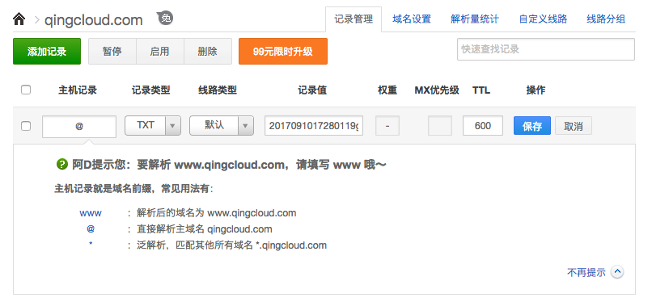](../../product/security/_images/ssl/dnspod_valid.png)

**文件验证**

在签发的域名下的服务器，添加指定内容的静态内容来确定域名的所属权。根据提示需要在网站下新建 /.well-known/pki-validation/fileauth.txt 文件，内容是 20170910172838365vi3ozp3er1qgxihlr53snf4of6ck5s1hrmduol7swsj068w 

保证 http(s)://qingcloud.com/.well-known/pki-validation/fileauth.txt 这个文件可以正常返回

[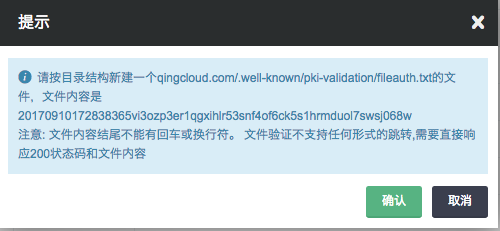](../../product/security/_images/ssl/domain_valid_file.png)

## 确认函确认 {#confirm-letter}

**下载确认函**

订单列表页点击”上传“，如下图显示，点击”下载确认函“

[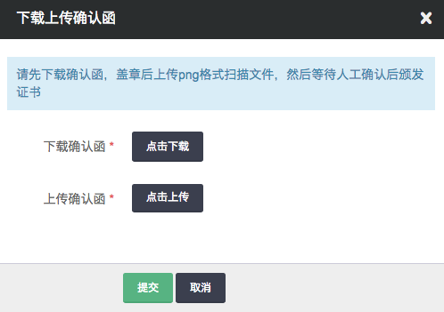](../../product/security/_images/ssl/confirm0.png)

确认函示例

[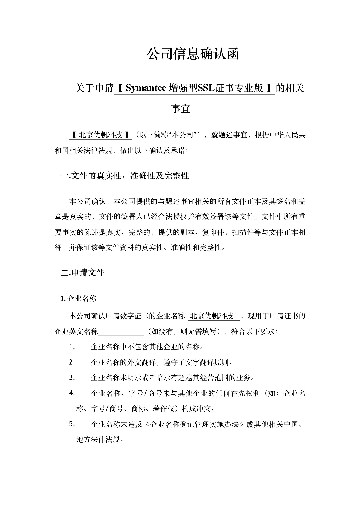](../../product/security/_images/ssl/confirm1.jpg) [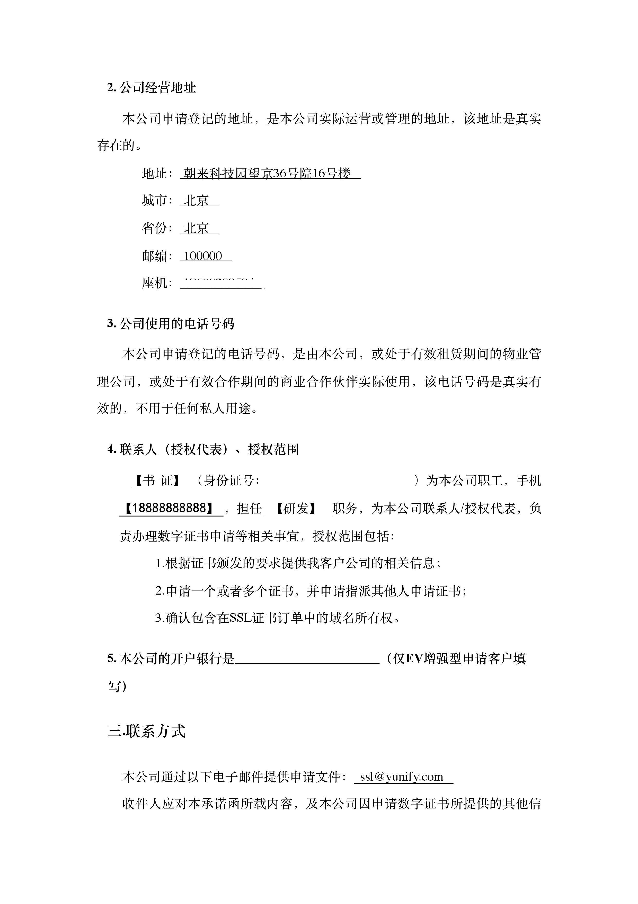](../../product/security/_images/ssl/confirm2.jpg) [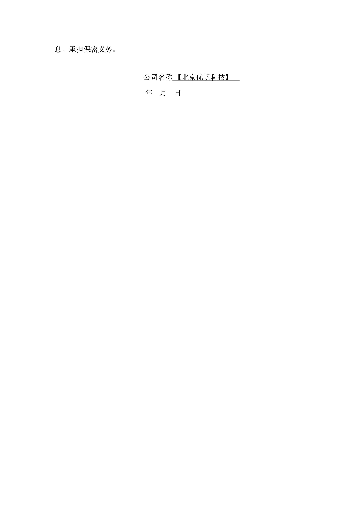](../../product/security/_images/ssl/confirm3.jpg)

填写后加盖公司公章，保存为一张 png 文件并上传，成功后等待工作人员联系并核实信息，确认后等待签发

## 价格 {#price}

注解

*   GeoTrust/TrustAsia 多域名证书价格 = (多证书价格(默认含五个域名) + 额外域名价格 * 额外域名数量) * 年
*   Symantec 多域名证书价格 = 单个域名价格 * 域名数量 * 年

具体价格参照下表:

| 品牌 | 产品名称 | 价格/年 |
| --- | --- | --- |
| Symantec | 企业型（OV）SSL证书 | 4850 |
| 企业型（OV）SSL证书专业版 | 7650 |
| 增强型（EV）SSL证书 | 7950 |
| 增强型（EV） SSL证书专业版 | 12650 |
| 企业型（OV）通配符SSL证书 | 38000 |
| GeoTrust | 企业型（OV）SSL证书 | 2850 |
| 企业型（OV）多域名SSL证书(默认5个单域名) | 5580 |
| 企业型（OV）多域名SSL证书 额外域名 | 650 |
| 增强型（EV）SSL证书 | 4850 |
| 增强型（EV）多域名SSL证书(默认5个单域名) | 9650 |
| 增强型（EV）多域名SSL证书额外域名 | 1450 |
| 企业型（OV）通配符SSL证书 | 6850 |
| TrustAsia | 域名型（DV）SSL证书 | 免费 |
| 域名型（DV）通配符SSL证书 | 1999 |
| 域名型（DV）多域名SSL证书(默认5个单域名) | 4900 |
| 域名型（DV）多域名SSL证书额外域名 | 950 |

## 证书品牌 {#brand}

| 品牌 | Symantec | GeoTrust | TrustAsia |
| --- | --- | --- | --- |
| 品牌地位 | 全球第一 | 全球第二 | 亚太区专业品牌 |
| 兼容性 | 最好 | 低于TrustAsia | 低于Symantec |
| CA安全性方面 | 最高 | 低于 Symantec | 约等于Symantec |
| 商业保险赔付保障 | 最高175万美元 | 最高150万美元 | 无赔付 |

## 共享证书 {#share}

已创建的证书除可用于当前账户下的证书绑定业务，也可共享给当前账户的子账户或者其他账户，用于其名下相应资源的证书绑定业务，具体操作方法如下：  

**第一步：共享证书**  

右键点击指定证书可以看到 “共享证书” 按钮，或者选中证书后再通过上方 “更多操作” 下的 “共享证书” 按钮  

[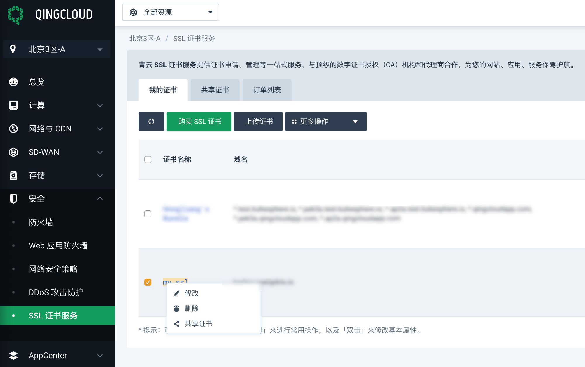](../../product/security/_images/ssl/share_ssl_menu.png)

在弹出的账户选择页面，选中指定账户，可以是当前账户下的子账户，也可以为指定账户(支持 id 和邮箱两种检索方式)  

[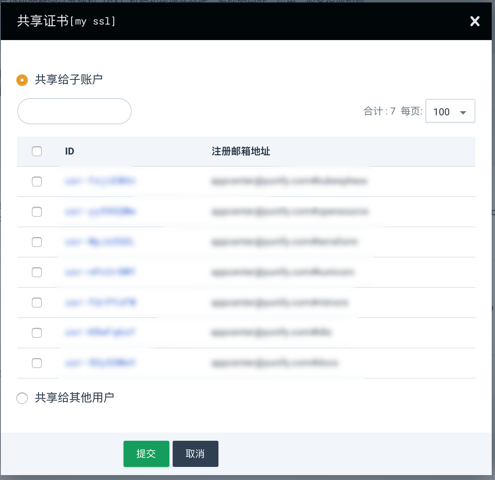](../../product/security/_images/ssl/share_ssl_select_user.png)

**第二步：使用共享证书**  

以被共享证书的账户登录控制台，访问控制台左侧的 安全 ->  SSL证书服务，切换上方标签至 “共享证书” 页面，可以看到共享的证书  

[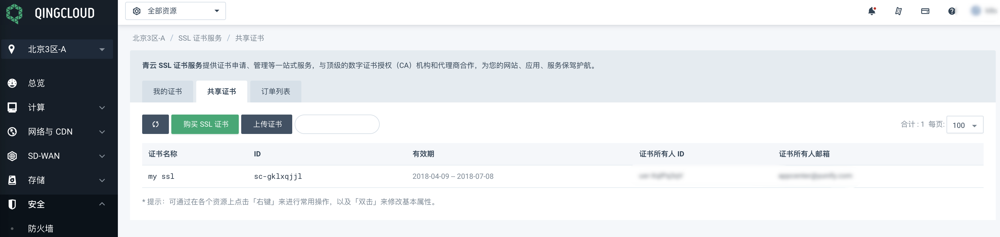](../../product/security/_images/ssl/share_ssl_list.png)

访问控制台左侧的 网络 -> 负载均衡器，切换上方标签至 “服务器证书 ”页面，可以看到共享的证书，其所有权为 “共享”   

[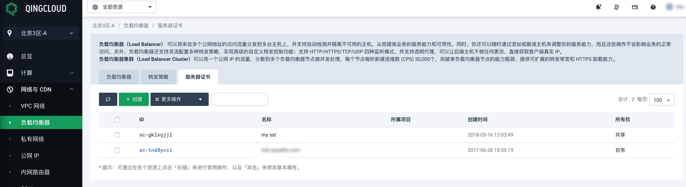](../../product/security/_images/ssl/share_ssl_list_lb.png)

创建或者选择某一负载均衡器，在其 HTTPS 监听器的编辑窗口中，选择 “添加服务器证书”，弹出选择证书的窗口，可以看到共享的证书，其所有权为 “共享”  

[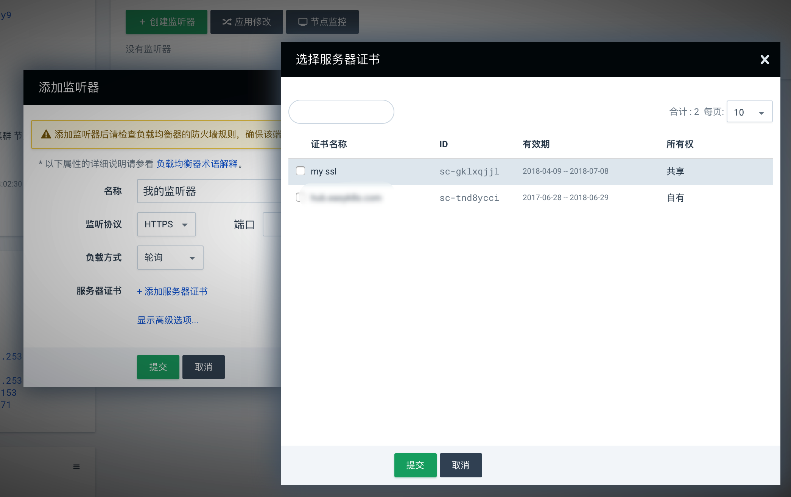](../../product/security/_images/ssl/share_ssl_listener.png)

**撤销证书共享**  

以证书拥有者的账户登录控制台，访问控制台左侧的 安全 ->  SSL证书服务，点击指定证书最后一列的 “查看共享成员” 链接，在弹出窗口中，撤销指定账户的证书共享  

[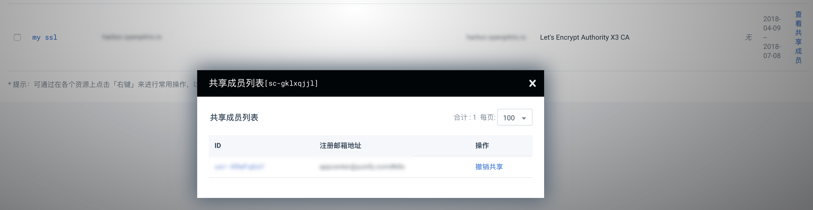](../../product/security/_images/ssl/share_ssl_cancel.png)

**注意：**  

* 某一证书被共享给用户 A，用户 A 无权共享此证书给其他账户  
* 已被共享的证书，在未撤销共享之前，无法被删除  

## FAQ {#faq}

**加密算法如何选择**

相同类型算法位数越多，性能消耗越严重，但安全性越高。 ECC 算法用较低的位数即可获取与 RSA 高位数的安全性，同时性能也比较高，但是要求客户端版本较高，旧版客户端可能不支持 ECC 算法。 具体的算法选择需要结合企业实际也许需求进行权衡。

**是否支持吊销**

支持吊销,提工单即可。

**证书过期预警**

通过 QingCloud 官方平台购买的正在，如证书即将过期，平台会提前30、15、7天，通过短信及邮件给用户发送提醒，如证书为用户自行上传的，则不会有过期提醒。

**Google 不信任 Symantec 是真是假**

该报道为误读具体参看: [《谷歌宣布Chrome不再信任所有赛门铁克SSL证书》误读新闻的澄清说明](https://www.trustasia.com/to-clarify-news-of-symantec-certificate)

**HTTPS 的性能损耗有多少**

这个取决于多方面因素，具体以实测为准，可以使用该工具测试： [HTTPS VS HTTP 测速](https://www.httpvshttps.cn/)

**如何检测证书的兼容性**

可选择使用测试工具进行测试，如 [https://myssl.com/](https://myssl.com/)

**如何选择一个合适的证书**

*   个人选择 DV 证书
*   企业选择 OV 或者 EV 证书
*   金融相关行业选择 EV 证书

以上建议仅供参考
