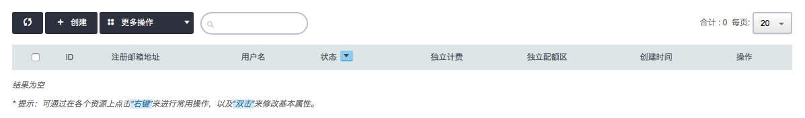
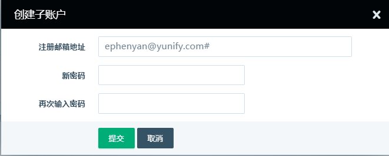
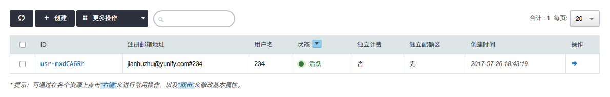
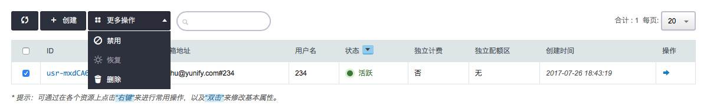
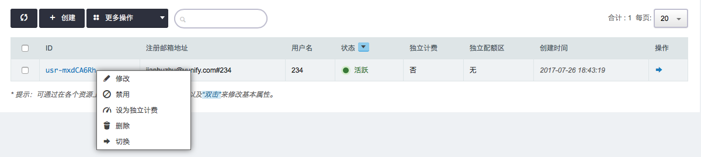
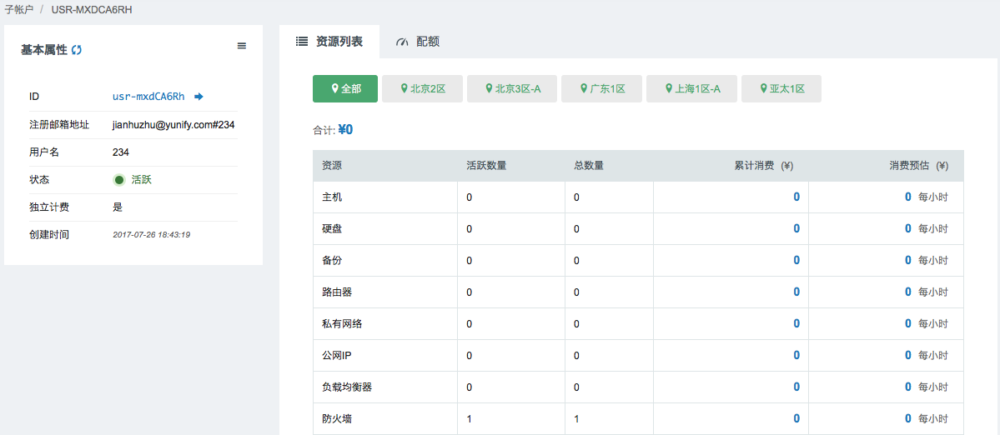
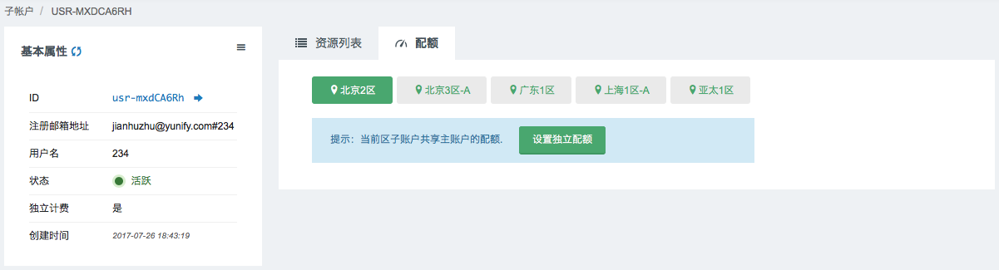
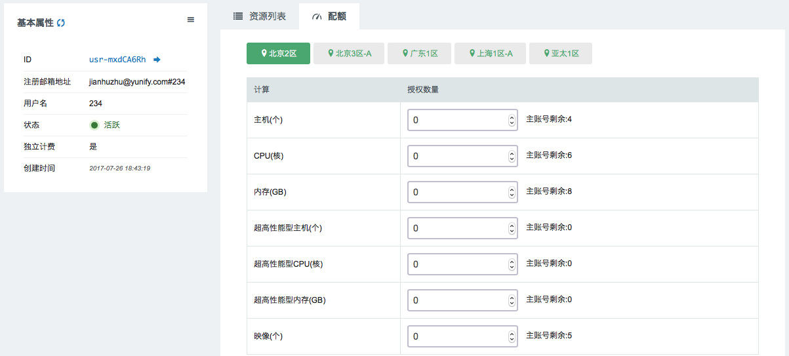
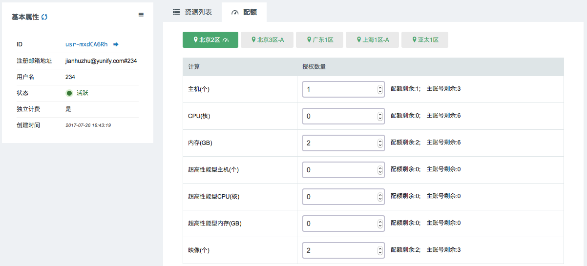

---
---

# 子账户

主账户可以创建多个子帐户(Sub User)，每个子帐户可自主管理和部署名下的资源。子帐户之间的资源是相互隔离的，同时所有子帐户会共享主账户的配额。默认子账户共享主账户的余额，主账户可以将子账户设为独立计费，使其有独立的余额，可自行充值，名下资源消费也从其余额中扣除。

## 创建子账户

点击页面右侧头像下方的 **子账户**，进入如下界面

点击页面上侧的 **创建** 按钮

在注册邮箱地址框里，主账户#后面输入子账户标识，密码框输入子账户密码。

> 注解：
>
> 子账户标识仅限于数字、大写字母、小写字母
>
> 用户密码最小长度为6,并且至少包括一个字母以及一个数字

点击 **提交** ，进入如下界面

## 配置服务

选中子账户条目，点击 **更多操作** ，提出如下界面

可以禁用、恢复、删除该子账号。

鼠标右击子账户条目，提出如下界面

支持修改、禁用、设为独立计费、删除、切换操作。

> 注解：
>
> 设为独立计费，则该子账户需自行充值，子账户内资源消费仅从该账户余额中扣除，不再共享主账号余额
>
> 切换，则从主账号进入子账号

鼠标左击子账号条目，进入如下界面

在该页面中可以看到该子账号下资源，点击上侧的 **全部和不同区域** 的按钮，可以看到该子账号下所有资源和各个分区的资源。

点击上侧 **配额** ，进入如下界面

点击上侧 **各个分区** 按钮，可以切换区域，点击 **设置独立配额** ，可以分配主账号的资源给该子账号，进入如下界面

配置界面中，可以分配主账号的计算、存储、网络、数据库与缓存的配置给子账户，配置完分区子账号资源配额，点击下方的 **修改独立配额** ，进入如下界面

点击 **回收独立配额** 可以收回分区下该子账号的全部资源配额。

## 子账户 IAM 身份

子账户名下的资源均由子账户自己所有，如果希望您的子账户参与主账户的运维管理工作，您需要为子账户创建 IAM 身份。

子账户 IAM 身份附加策略后，子账户使用者登陆后即可切换 IAM 身份帮您的主账户做策略中定义的管理或运维操作。

了解更多关于 QingCloud IAM 的介绍，请点击：[访问鉴权管理](https://docs.qingcloud.com/product/iam/index.html)

如何为子账户创建身份，操作步骤参见：[为子账户创建身份](https://docs.qingcloud.com/product/iam/roles.html#创建子账户同时创建身份)
