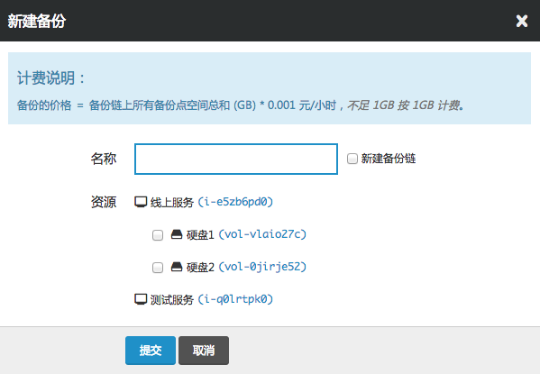
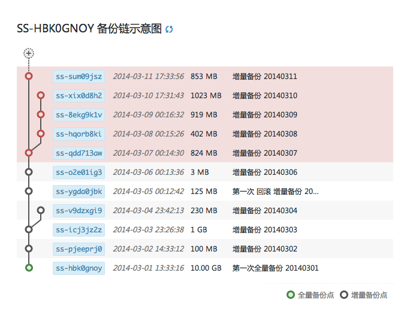
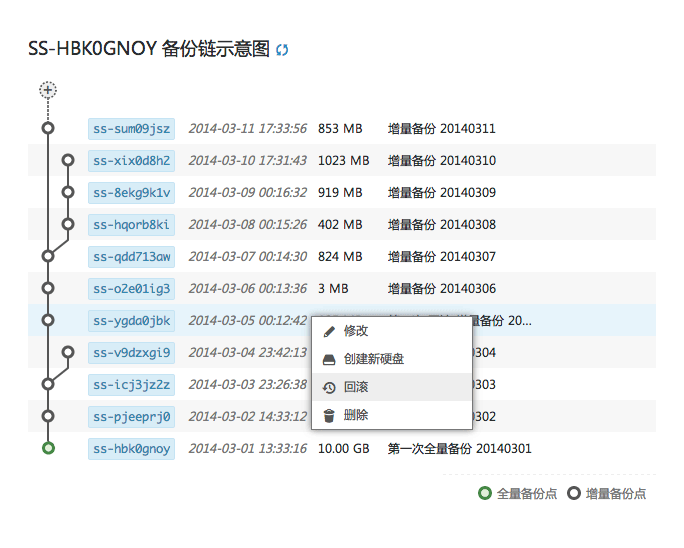
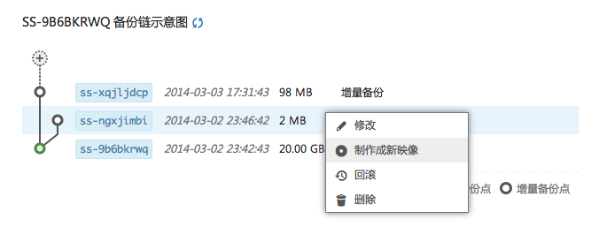
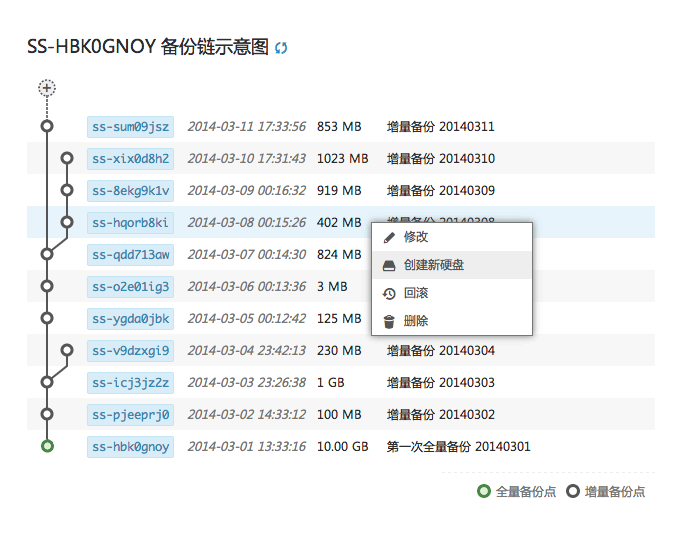

---
---

# 备份与恢复指南

备份 (Snapshot) 用于在块设备级别 (block device level) 上进行硬盘的备份与恢复， 可以同时对多张硬盘做备份（包括系统盘和数据盘），也可以对正在运行的主机做在线备份。 一张硬盘可以有多个备份链，每条备份链包括一个全量备份点以及多个增量备份点， 您可以随时从任意一个备份点恢复数据。

**备份与实时副本的区别**：

> 
> 
> 青云的硬盘（包括系统盘和数据盘）都是有多份 **实时副本** 的，即数据的写入只有在多个副本上都完成后才算成功，实时副本可以保证硬件设备出现问题时数据不丢失。
> 
> **备份** 是用于捕捉硬盘在某一个时刻的状态，未来可以随时恢复到这个状态。 在某些时候，例如误操作或者应用逻辑的 bug，可能会导致业务数据的丢失， 这种情况下实时副本无法恢复数据，因为硬件设备并没有问题。这时候，就需要通过备份，从历史备份点恢复数据。
> 
> 即，实时副本主要用于灾难恢复；而备份则是用于保存业务数据的里程碑  (milestone) 状态，以便在从业务到硬件的任何一个层面出问题时恢复数据。
> 
>

## 创建备份

你可以对一块或多块硬盘（包括系统盘和数据盘）创建备份，我们的备份功能有以下几点特性：

> 
> 
> **基本备份**：你可以对主机的系统盘进行备份，也可以对数据盘进行备份。
> 
> **在线备份**：你可以对正在运行的主机进行备份，也可以对正在使用的数据盘进行备份。备份操作不会影响或者中断你业务的运行。
> 
> **并行备份**：你可以同时对多块硬盘（包括系统盘和数据盘）进行备份，如果这些硬盘同属于一个主机，则在备份时会保证这些硬盘数据的一致性，即都是同一时刻的状态。
> 
> **全量与增量备份**：你可以对硬盘（包括系统盘和数据盘）进行全量或者增量备份。当进行全量备份时，会生成一条新的备份链，之后创建的备份默认都是增量备份。
> 
> 
> 
> 
> 
> 警告
> 
> 当你对正在运行的主机或者已经绑定的硬盘做在线备份时，需要注意以下几点：
> 
> *   备份只能捕获在备份任务开始时已经写入磁盘的数据，不包括当时位于缓存里的数据。
> *   为了保证数据的完整性，你需要在创建备份前暂停所有文件的写操作，直到备份进入”捕获完成”的状态。或者先停止主机或解绑硬盘，进行离线备份。
> 
> 
> 
>

## 删除备份

你可以删除整个备份链，也可以删除某一个备份点。

> 
> 
> 
> 
> 警告
> 
> 需要注意的是，同一条备份链上的备份点之间的数据有依赖关系。当删除备份链上的全量备份点时，会删除整条备份链。 如果删除增量备份点，所有直接或者间接依赖于这个备份点的后序节点都会被删除。
> 
> 
> 
> 

## 备份回滚

当用户因为误操作或者应用逻辑的 bug 而导致业务数据的丢失时，可以通过 “回滚” 操作恢复到某个备份点的状态。

> 

## 备份导出

**导出为映像**:

> 
> 
> 当备份点是基于主机系统盘创建时，通过这个备份点可以创建新的映像，基于该映像可以创建多台和备份点状态相同的主机。
> 
> > 
> 
> 

**导出为硬盘**:

> 
> 
> 当备份点是基于硬盘创建时，通过这个备份点可以创建新的硬盘，该新硬盘将拥有和备份点相同的数据。
> 
> > 
> 
>

## 计费模式

备份按照备份链的总容量进行收费，每个备份链的总容量等于该备份链中所有备份点容量的总和，容量总和不足1G时，按照1G计算。

> 
> 
> 
> 
> 注解
> 
> 由于增量备份保存了相对于上一个备份点的变化量，当备份链很长时，这些变化量的累加可能会造成备份链总容量大小过大， 产生较多的费用；所以我们建议定期创建新的备份链，并将旧的备份链删除。
> 
> 
> 
>

## 术语解释

> 
> 
> **全量备份点**： 对硬盘当前状态的全量拷贝
> 
> **增量备份点**： 对硬盘当前状态的增量拷贝，即只保存相对于上一个备份点的变化量
> 
> **备份链**： 备份链包括一个全量备份点和多个增量备份点。每次做全量备份都会产生一个新的备份链。
> 
>
