---
---

# 基础型硬盘

基础型硬盘提供均衡的价格与性能，单块硬盘容量最高 2TB， I/O 吞吐性能最高可达 100 MB/s ，IOPS 最高 2500，适用于数据不被经常访问、低 I/O 负载要求的应用，例如多媒体业务、大数据离线分析、数据仓库、日志处理等业务。

## 创建

### 第一步：创建基础型硬盘

点击 **存储** 中的 **硬盘** 进入如下界面。
 

点击 **创建** 跳出如下界面。
 
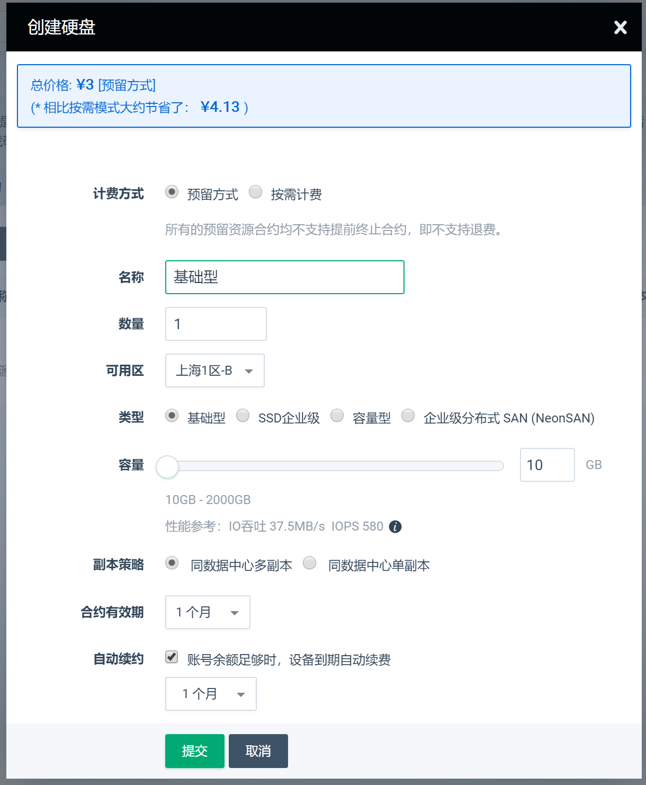

在名称框里输入创建的硬盘名称，在数量框里输入需要创建的硬盘数量，在类型中选择基础型，拖动滑动按钮选择容量大小，或者在右边的输入框中输入容量大小，副本策略可选择同数据中心多副本，或同数据中心单副本，点击 **提交** ，进入如下界面。

 

当状态显示为“可用”时，表示创建成功。

> 注解：
>
> IOPS 范围参考：500 – 2500
>
> 单盘 IOPS 计算公式： min{500 + 8 * 容量, 2500}
>
> IO 吞吐范围参考：36 MB/s - 100MB/s
>
> 单盘 IO 吞吐计算公式：min{36 + 0.15 * 容量, 100 } MBps

### 第二步：配置服务

鼠标右键点击硬盘条目，或勾选硬盘条目后鼠标左键点击更多操作，跳出如下界面。
 
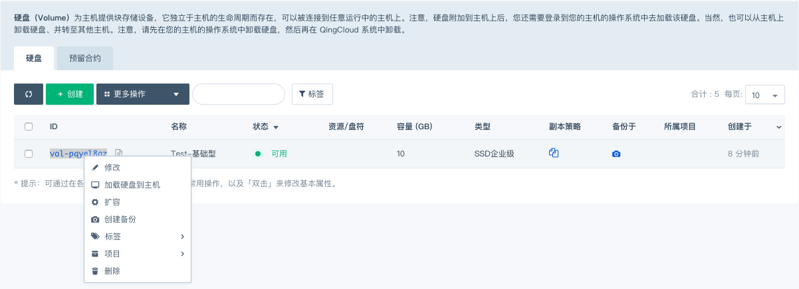	

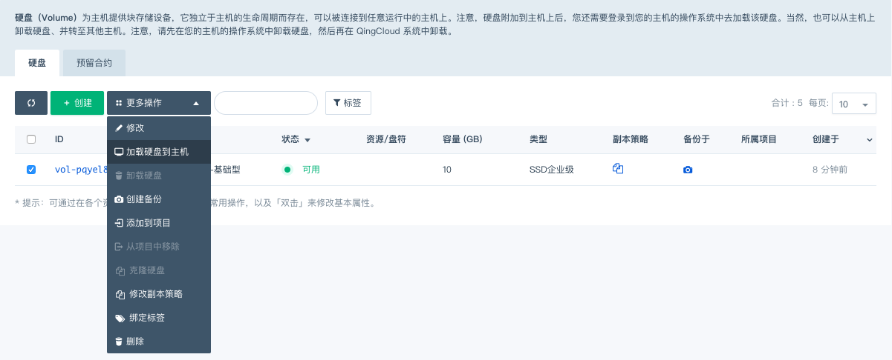

**加载基础型硬盘到主机**

点击 加载硬盘到主机，跳出如下界面。

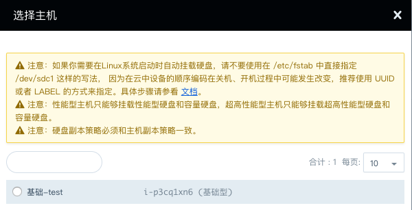

选择需要加载该基础型硬盘的主机，点击 **提交**，即可挂载到指定主机。

> 注解：基础型硬盘仅支持被挂载到基础型主机上，且一块基础型硬盘不可以同时挂载到多台主机

还可以从 **计算-主机** 页面，鼠标右键点击主机条目，来选择 **硬盘**，进行硬盘加载，界面如下
 
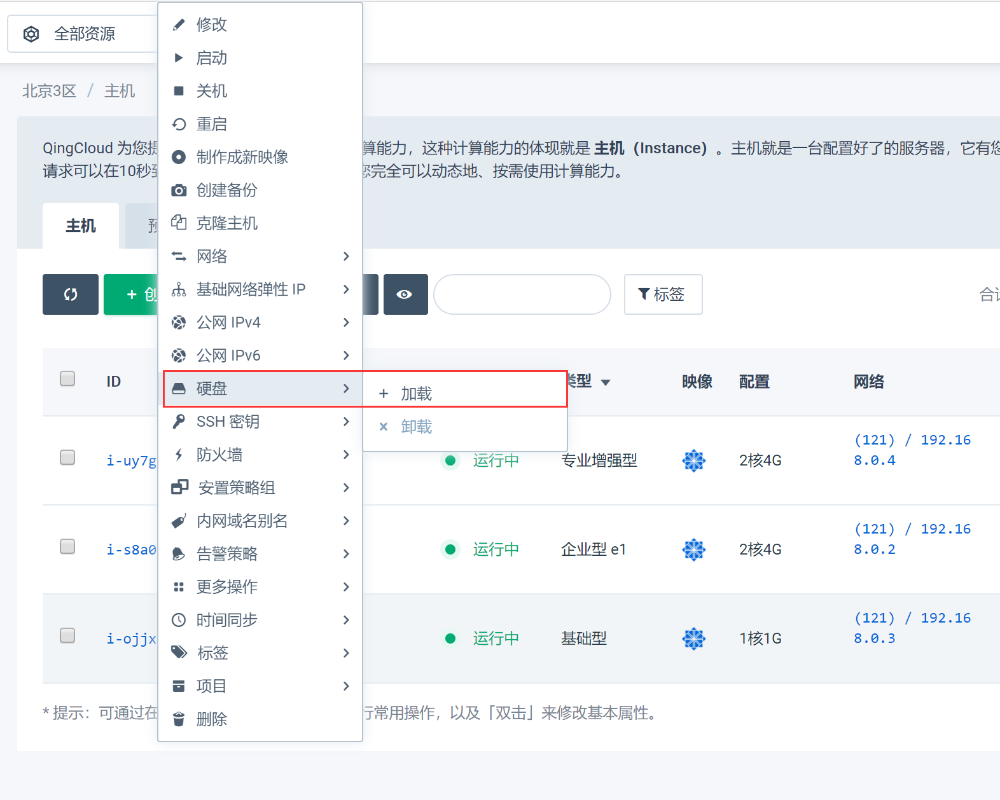

**修改基础型硬盘名称或属性**

点击 **修改**，跳出如下界面。
 
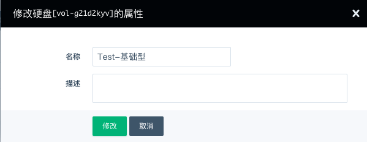

可以修改基础型硬盘的属性，包括名称和描述，然后点击 **修改**。

**克隆基础型硬盘**

点击 **克隆硬盘**，跳出如下界面。
 
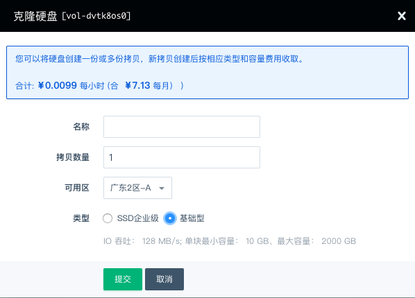

在名称框填入名称，写入拷贝数量，类型选择基础型或 SSD 企业型，点击 **提交**，进入如下界面。
 

	
当状态显示为“可用”时，表示克隆成功。

>  注解：仅基础型硬盘、SSD 企业级、企业级分布式 SAN (NeonSAN) 等类型的硬盘支持克隆，性能型及超高性能型硬盘不支持克隆。

**扩容**

点击 **扩容** ，跳出如下界面。

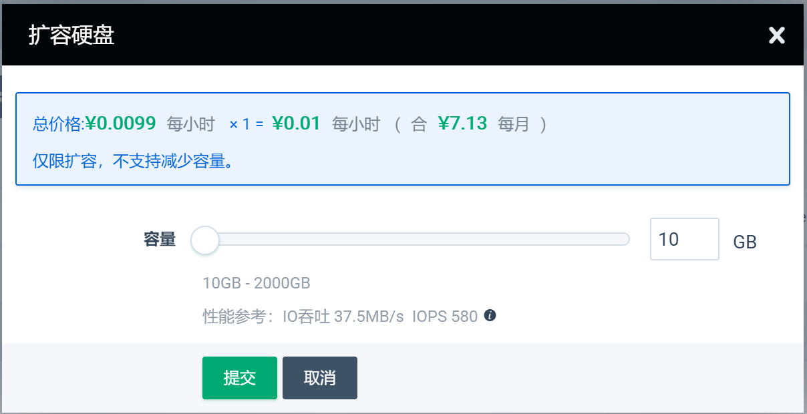
 
**备份**

点击 **备份**，跳出如下界面。

点击 **继续**，进入如下界面。
 
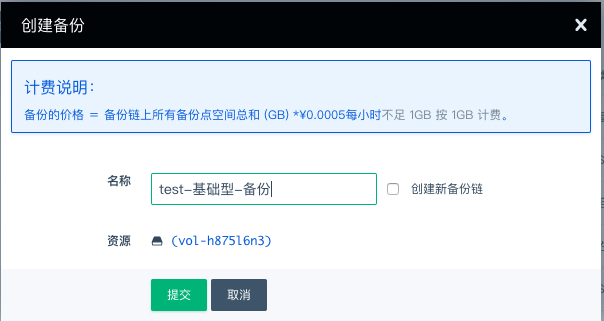

在名称框里填入名称，有需要的选择创建新备份链，点击 **提交**, 可以左键点击相应基础型硬盘条目，进入如下界面。

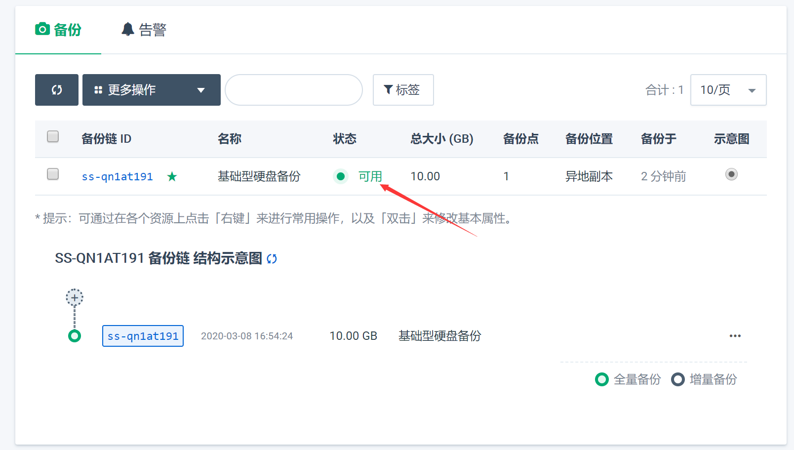

在备份列表内，可以看到状态显示为“可用”，表示备份已经创建成功。

**标签**

点击 **标签**，为已经创建的基础型硬盘绑定标签，跳出如下界面.
 
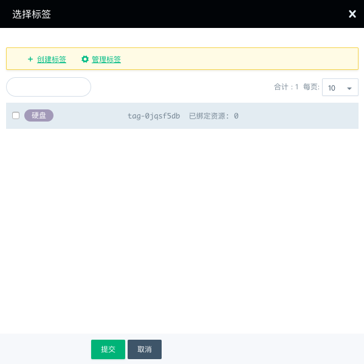

如果没有标签或已有标签不适用，可以选择 **创建标签**，或者进行标签管理。选择标签，点击 **提交**，进入如下界面。

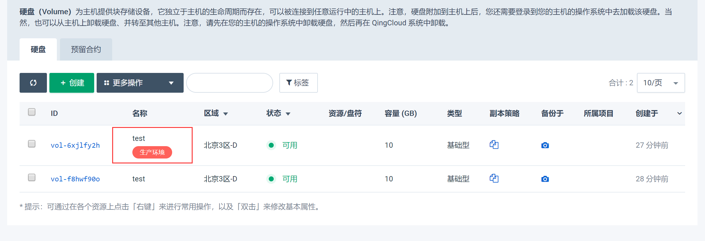

**添加到项目**

点击 **项目-加入**，跳出如下界面

选择需要添加到的项目，点击 **提交** 将硬盘添加到项目，回到硬盘列表可以查看硬盘所属的项目，如下图

## 备份配置

左键点击基础型硬盘条目，进入如下界面

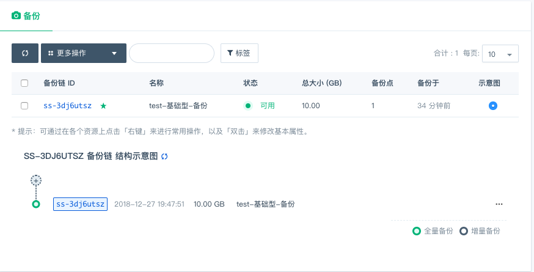

鼠标右键点击备份链 ID，跳出如下界面。
 
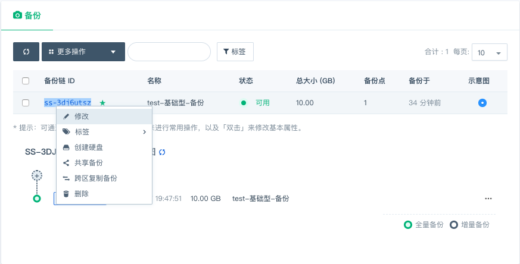

**修改备份名称或描述**

点击 **修改**，跳出如下界面。
 

在名称填入要修改名称，在描述框里输入新的描述，点击 **提交**。

**基于备份新建硬盘**

点击 **创建硬盘**，跳出如下界面。
 

在名称框里填入新硬盘的名称，选择副本策略，点解 **提交**，可以在硬盘首页看到如下界面。
 

当新建硬盘的状态显示为“可用”时，表示新硬盘已经创建成功。

**共享备份**

点击 **共享备份**，跳出如下界面。
 

可以选择共享给子账号还是共享给其他账号，选择要共享给的子账号或填写要给共享的其他用户 ID/ 注册邮箱地址，点击 **提交**。鼠标右键双击备份链接入备份属性修改界面，可以看到共享列表，里面有已经添加成功的共享账号列表。

**跨区复制备份**

点击 **跨区复制备份**，跳出如下界面。
 

选择要复制到区域，点击 **提交**。

## 备份属性修改

鼠标左键双击备份链条目，或者在备份链条目下面，可以看到备份链结构示意图，假如双击备份链条目，进入如下界面。
 

鼠标左键点击备份链右侧的 **···** ，可以选择对备份链的修改、创建硬盘、回滚和删除，如下图。
 

## 监控

在基础型硬盘挂载到主机时，可以点击硬盘题目，查看监控情况，界面如下。
 
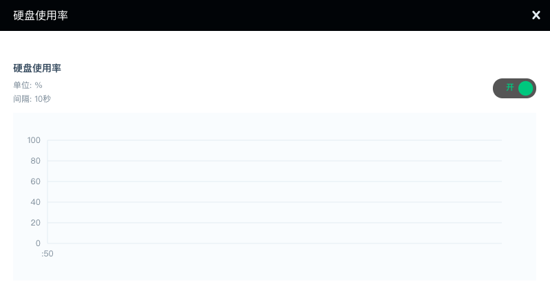

在硬盘 IOPS 和硬盘吞吐量打开时，可以看到硬盘 IOPS 和硬盘吞吐量数据展示。还可以点击硬盘使用率右侧的 **查看监控图** 来查看硬盘使用率。

