---
---

# 性能型硬盘

  性能型块存储设备，它独立于主机的生命周期而存在，可以被连接到任意运行中的主机上。 IO 吞吐 128 MB/s; 单块最小容量 10GB 、最大容量 2TB ，是性价比最高的存储类型。适用于对 IO 要求比较高的应用，例如数据库等在线业务。

## 创建

### 第一步：创建性能型硬盘

点击 **存储** 中的 **硬盘** 进入如下界面

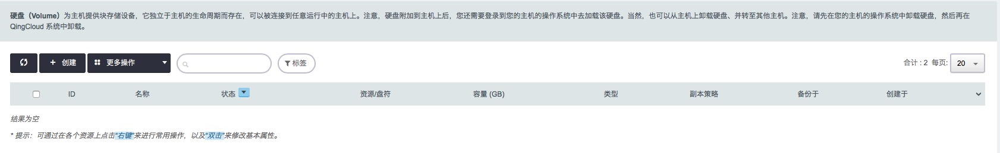

点击 **创建** 跳出如下界面

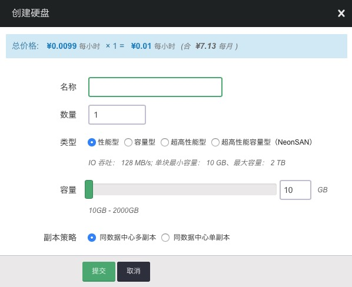

在名称框里输入创建的硬盘名称，在数量框里输入需要创建的硬盘数量，在类型中选择性能型，拖动滑动按钮选择容量大小，或者在右边的输入框中输入容量大小，副本策略可选择同数据中心多副本，或同数据中心单副本，点击 **提交** ，进入如下界面

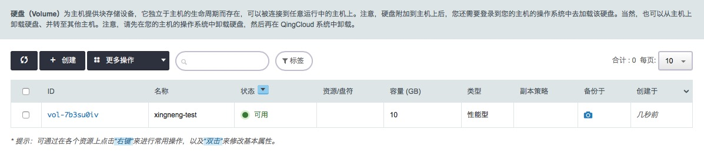

当状态显示为“可用”时，表示创建成功。

> 注解：IO 吞吐 128 MB/s; 单块最小容量 10 GB、最大容量 2 TB；容量可选最小粒度为 10 GB

### 第二步：配置服务

鼠标右键点击硬盘条目，或选中硬盘条目鼠标左键点击更多操作，跳出如下界面

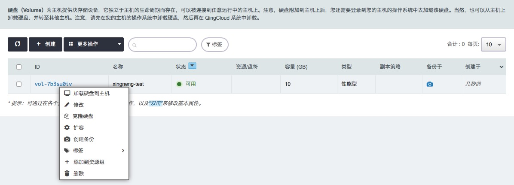

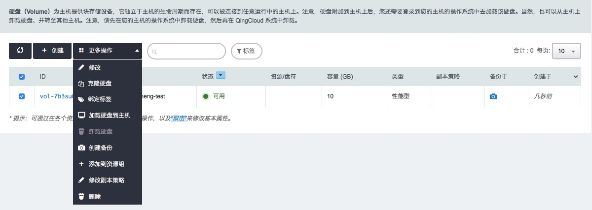

**加载性能型硬盘到主机**

点击 **加载硬盘到主机** ，跳出如下界面

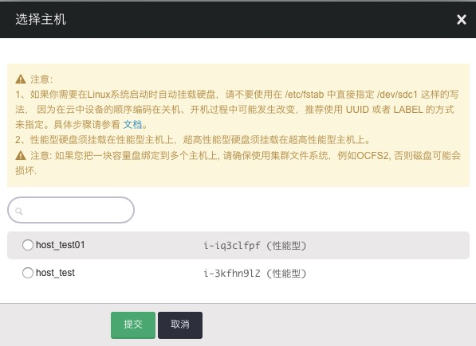

选择需要加载该性能型硬盘的主机，点击 **提交**，即可挂载到指定主机。

> 注解：性能型硬盘仅支持被挂载到基础型和性能型主机上，且一块性能型硬盘不可以同时挂载到多台主机

还可以从主机页面，鼠标右键点击主机条目，来选择 **硬盘**，进行硬盘加载，界面如下

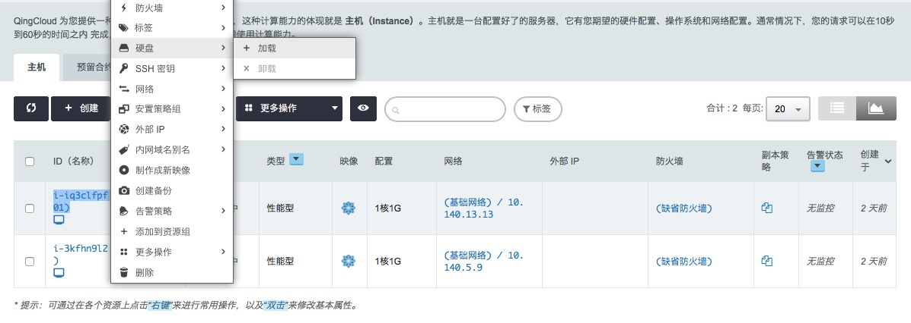

**修改性能型硬盘名称或属性**

点击 **修改**，跳出如下界面

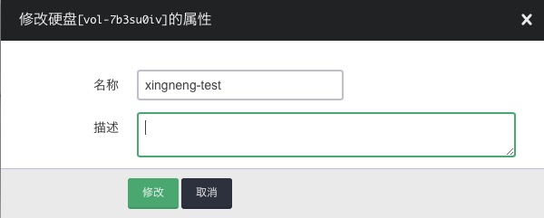

可以修改性能型硬盘的属性，包括名称和描述，然后点击 **修改** 。

**克隆性能型硬盘**

点击 **克隆硬盘** ，跳出如下界面

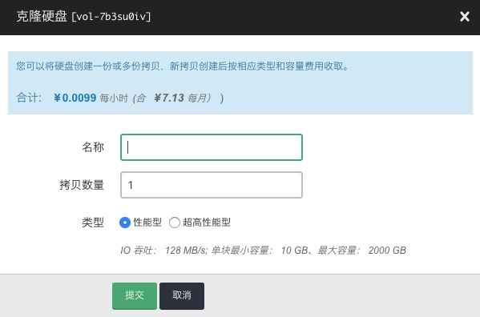

在名称框填入名称，写入拷贝数量，类型选择性能型或超高性能型，点击 **提交** ，进入如下界面

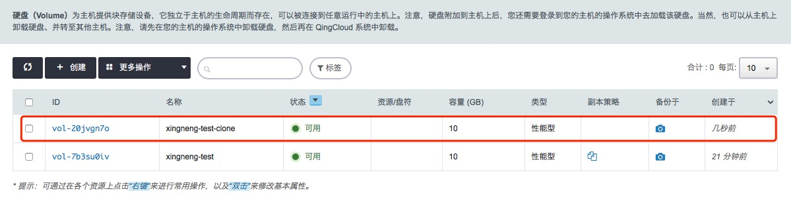

当状态显示为“可用”时，表示克隆成功。

**扩容**

点击 **扩容** ，跳出如下界面

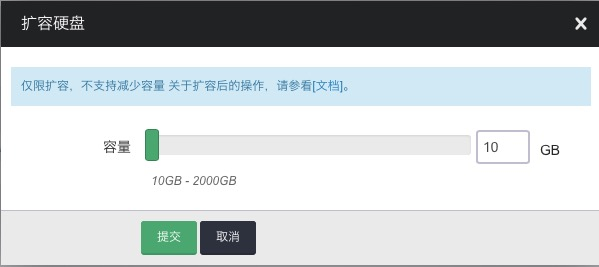

**备份**

点击 **备份** ，跳出如下界面

点击 **继续** ，进入如下界面

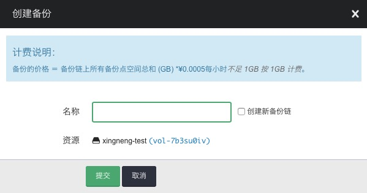

在名称框里填入名称，有需要的选择创建新备份链，点击 **提交** 。可以左键点击性能型硬盘条目，进入如下界面

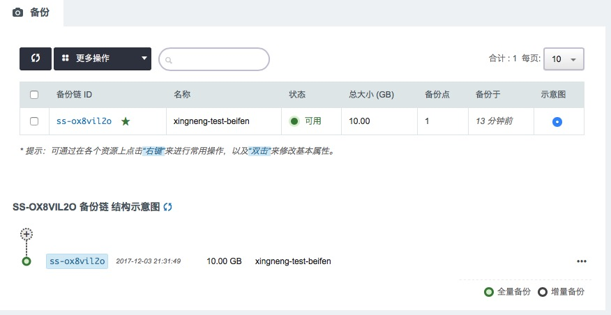

可以看到状态显示为“可用”，表示备份已经创建成功。

**标签**

点击 **标签** ，为已经创建的性能型硬盘绑定标签，跳出如下界面

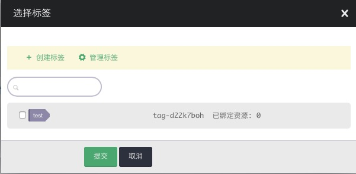

如果没有标签或已有标签不适用，可以选择 **创建标签** ，或者进行 **标签管理** 。选择标签，点击 **提交** ，进入如下界面

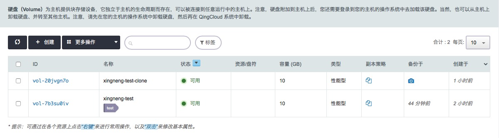

**添加到项目**

点击 **项目-加入**，跳出如下界面

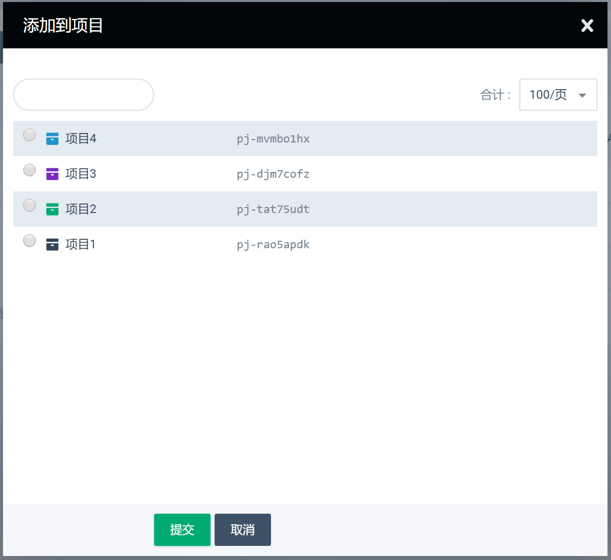

选择需要添加到的项目，点击 **提交** 将硬盘添加到项目，回到硬盘列表可以查看硬盘所属的项目，如下图

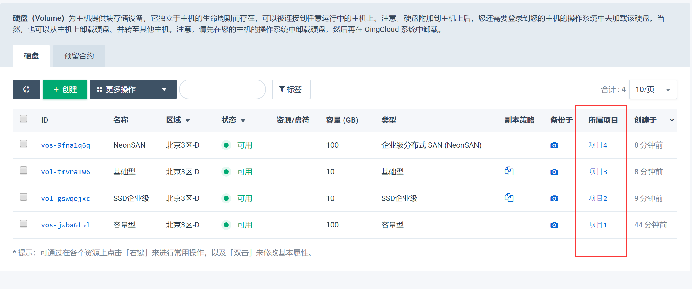

## 备份配置

左键点击性能型硬盘条目，进入如下界面

鼠标右键点击备份链ID，跳出如下界面

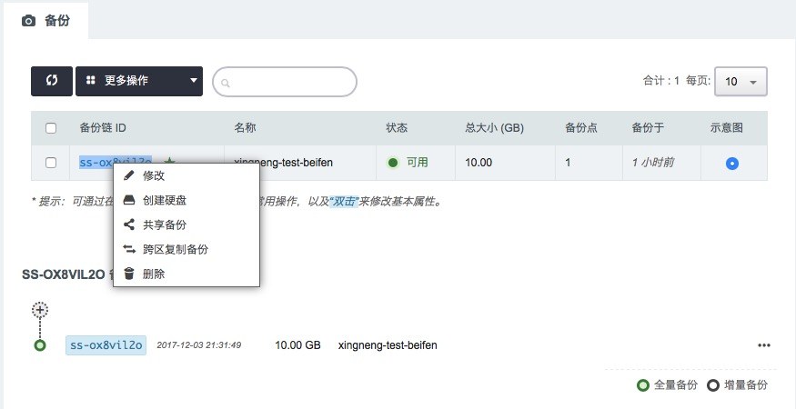

**修改备份名称或描述**

点击 **修改** ，跳出如下界面

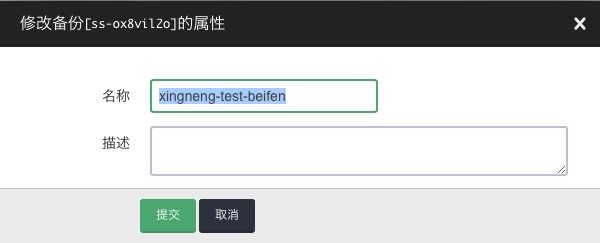

在名称填入要修改成的名称，在描述框里输入新的描述，点击 **提交** 。

**基于备份新建硬盘**

点击 **创建硬盘** ，跳出如下界面

在名称框里填入新硬盘的名称，选择副本策略，点解 **提交** ，可以硬盘首页看到

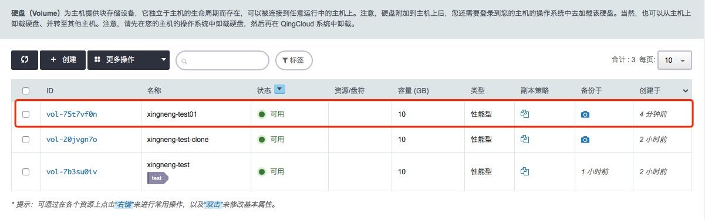

当新建硬盘的状态显示为“可用”时，表示新硬盘已经创建成功。

**共享备份**

点击 **共享备份** ，跳出如下界面

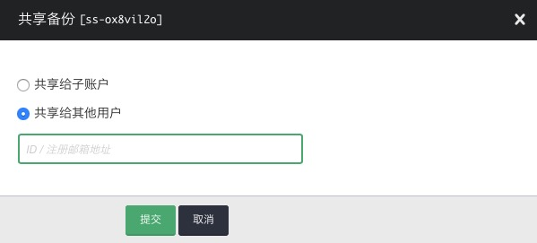

可以选择共享给子账号还是共享给其他账号，选择要共享给的子账号或填写要给共享的其他用户ID/注册邮箱地址，点击 **提交** 。鼠标右键双击备份链接入备份属性修改界面，可以看到共享列表，里面有已经添加成功的共享账号列表。

**跨区复制备份**

点击 **跨区复制备份** ，跳出如下界面

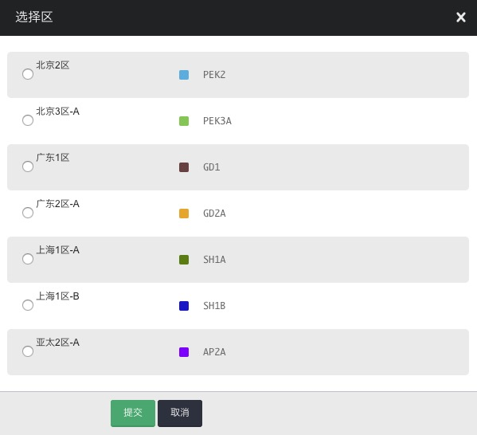

选择要复制到区域，点击 **提交** 。

## 备份属性修改

鼠标左键双击备份链条目，或者在备份链条目下面，可以看到备份链结构示意图，假如双击备份链条目，进入如下界面

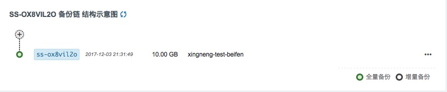

鼠标左键点击备份链右侧的 **...** ，可以选择对备份链的修改、创建硬盘、回滚和删除，如下图

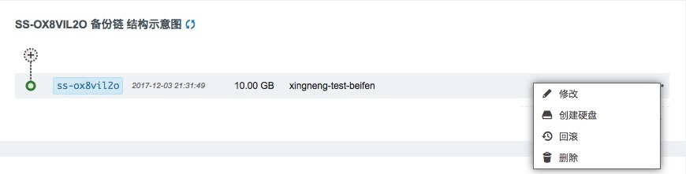

## 监控

在性能型硬盘挂载到主机时，可以点击硬盘题目，查看监控情况，界面如下

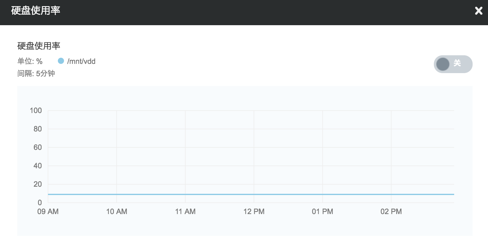

在硬盘 IOPS 和硬盘吞吐量打开时，可以看到硬盘 IOPS 和硬盘吞吐量数据展示。还可以点击硬盘使用率右侧的 **查看监控图** 来查看硬盘使用率。
