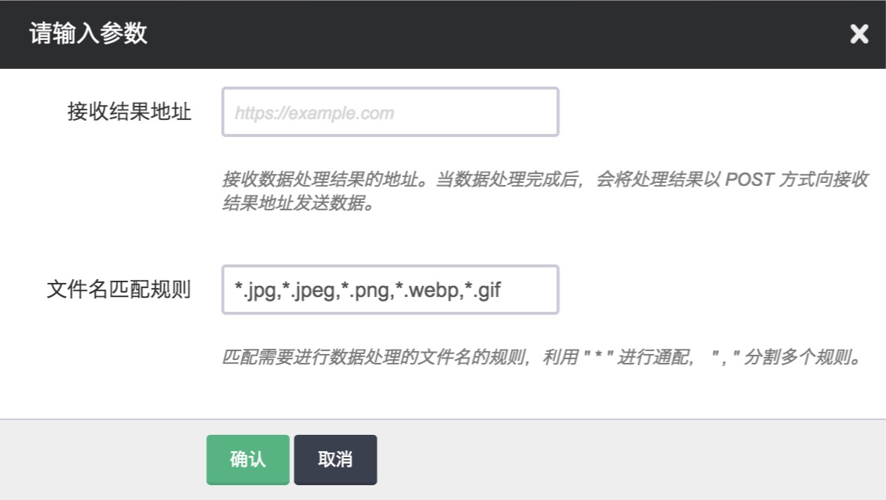
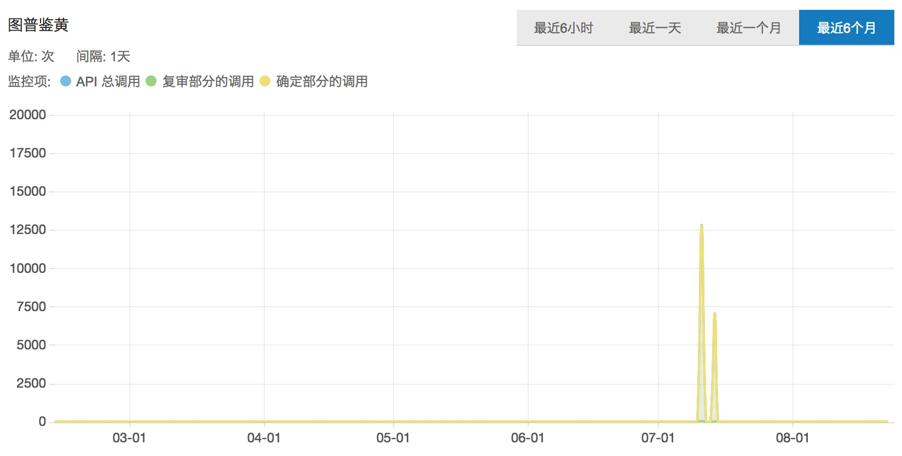
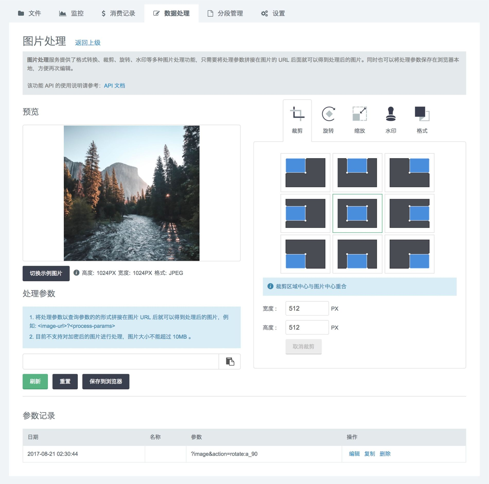
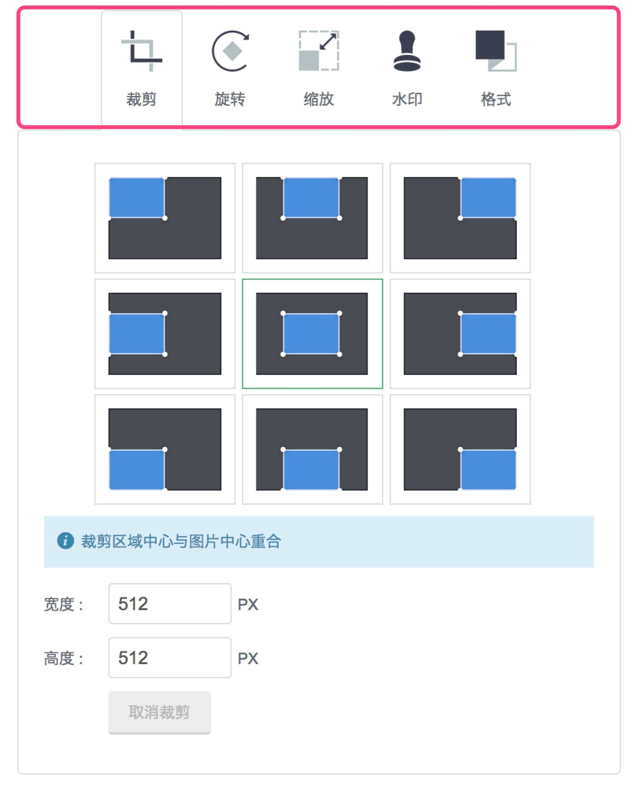

---
---
# 数据处理

数据处理可以对存储在 QingStor™ 对象存储上的数据进行处理。

## 图谱鉴黄

QingStor™ 对象存储通过无缝对接图谱科技的图像智能审核能力，为用户提供面向图像文件的高精度鉴黄服务，实现对违规内容的有效甄别管理，帮助用户大幅度提高业务运营效率及合规性。

图普鉴黄服务使用深度学习算法，帮助您识别存储在 QingStor™ 对象存储上的图片是否涉黄，并将识别结果划分为确定部分和复审部分，其中确定部分的准确率超过 99.5% ；复审部分不超过鉴别数据总量的 5 % 。

### 开启图谱鉴黄服务

开启图谱鉴黄服务只需点击“点击开启”按钮，并在弹出框中输入参数即可。

- 接收结果地址：当数据处理完成后，会将处理结果以 HTTP POST 方式向接收结果地址发送数据。
- 文件名匹配规则：匹配需要进行数据处理的文件名的规则，利用 glob patterns 进行匹配, " , " 分割多个规则。

其中 “接收结果地址” 必填，“文件名匹配规则” 具有缺省值。

### 查看详情

点击图谱鉴黄，进入详情页面。在这里可以根据需要看到结果说明，价格，监控，消费记录，配置五个选项，可以对图谱鉴黄服务进行精确管理。

### 监控

- API 总调用：在该时间段中图谱鉴黄 API 的总调用次数。
- 复审部分调用：鉴黄结果中需要人工复审的部分的 API 调用次数。
- 确定部分调用：鉴黄结果中不需要人工复审的部分的 API 调用次数。

可以查询最近一天、最近一个月、最近 6 个月的监控信息。用曲线图来展示时间区间内的变化值，并将监控点的具体数值呈现在表格中。

### 消费记录

通过选择查询时间段查看各个月份对应的消费记录。

通过改变时间段查询不同时间内的消费记录，结果用堆叠条形图表示，并将监控点的数据呈现在表格中。

## 图片处理

QingStor™ 对象存储图片处理提供了包括格式转换、旋转、添加水印在内的多种图片处理功能。用户可以根据需要在控制台配置处理参数，并将生成的处理参数代码拼接到图片 URL 后以获得经过处理的图片。

点击图片处理标题进入详情页面，图片处理详情界面分为四部分，分别是预览、操作面板、处理参数、参数记录（如果浏览器中存在参数记录）各个部分的功能是：

- 预览：显示经过当前操作处理后得到的示例图片以及该图片的基本信息，目前提供三张常用尺寸的示例图片，用户可根据需要切换不同的示例图片。
- 操作面板：目前提供五种基本图片处理操作，用户可对其进行搭配，图片处理将按照操作顺序生成处理参数代码。
- 处理参数：图片处理最终将生成一段处理参数代码，将该代码拼接到图片 URL 后以获得经过处理的图片。同时可以将处理参数保存在浏览器本地，方便再次编辑使用。
- 参数记录：显示最近保存的处理参数（最多 10 条）用户可根据需要对任意记录进行编辑、复制、删除操作。

> *当前暂不支持对加密图片进行处理，单张图片最大尺寸为 10MB。*

通过对操作面板中提供的功能进行配置。用户可对图片进行以下处理：

- 裁剪：指定裁剪区域尺寸和位置在图片中裁剪出不同尺寸的图片。
- 旋转：对图片进行旋转。
- 缩放：将图片缩放到指定尺寸，可选择是否保持原有比例进行缩放。
- 水印：增加文字或图片水印。
- 格式：将图片转换成指定格式。

