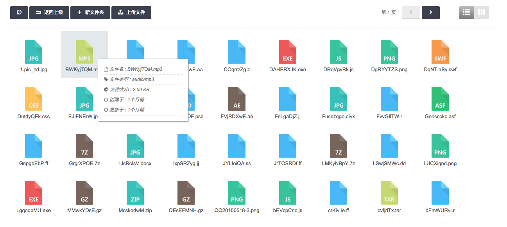
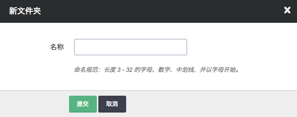
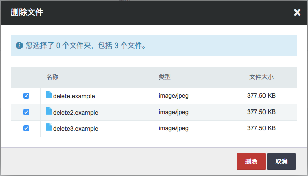

---
---

## 文件和文件夹

Bucket 的文件和文件夹按字母序混合排列，控制台提供文件的名称、类型、大小等信息，并按文件类型展示对应的图标。与 Bucket 列表页相同，这里可以选择列表视图或文件视图。

在文件标签页，可以查看、创建和删除文件夹，上传、下载、删除文件，也可以将公开读权限的 Bucket 内文件分享 url 供其他用户下载。

### 创建文件夹

文件夹是特殊的文件，它的名称也是 API 中 uri 的一部分，因此需要遵循 url 的 pathname 部分的命名规范。

### 删除文件夹

用户勾选需要删除的文件或文件夹，点击"更多操作"内的"删除"或右键菜单中的"删除"，在弹出列表中确认需要删除的文件或文件夹，点击"删除"即可。

